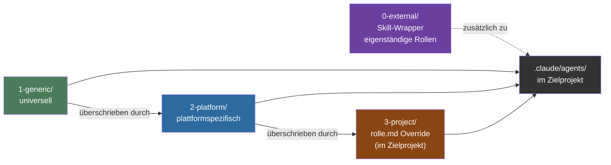
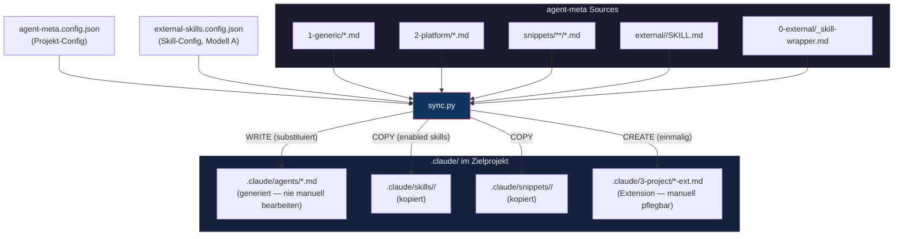
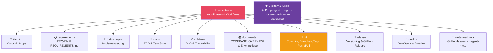
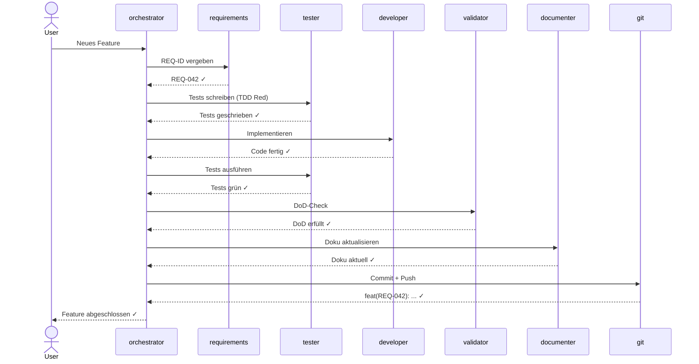
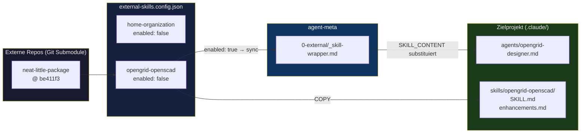
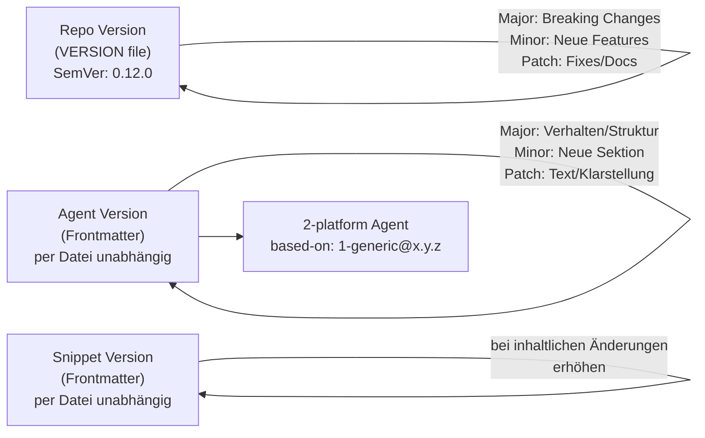

# agent-meta — Architecture Overview

> Version: **0.12.0** — last updated: 2026-04-04

---

## Repository Structure

```
agent-meta/
├── agents/
│   ├── 0-external/          ← Wrapper-Template für externe Skills
│   │   └── _skill-wrapper.md
│   ├── 1-generic/           ← Universelle Agent-Templates
│   │   ├── orchestrator.md
│   │   ├── ideation.md
│   │   ├── requirements.md
│   │   ├── developer.md
│   │   ├── tester.md
│   │   ├── validator.md
│   │   ├── documenter.md
│   │   ├── git.md
│   │   ├── release.md
│   │   ├── docker.md
│   │   └── meta-feedback.md
│   └── 2-platform/          ← Plattform-Overrides
│       ├── sharkord-release.md
│       └── sharkord-docker.md
├── snippets/                ← Versionierte Code-Snippets (per Agent + Sprache)
│   ├── tester/
│   │   ├── bun-typescript.md
│   │   └── pytest-python.md
│   └── developer/
│       ├── bun-typescript.md
│       └── pytest-python.md
├── external/                ← Git Submodule (externe Skill-Repos)
│   └── neat-little-package/ ← gepinnt @ be411f3
├── external-skills.config.json  ← Skill-Aktivierung (enabled: true/false)
├── agent-meta.config.example.json
├── scripts/
│   └── sync.py              ← Agent-Generator
└── howto/
    ├── instantiate-project.md
    └── upgrade-guide.md
```

---

## Layer Model — Override Priority



---

## Sync Flow — agent-meta → Zielprojekt



---

## Agent Roles & Responsibilities



---

## Development Workflow (Standard)



---

## External Skills Integration



---

## Versioning Strategy



---

## Update Instructions

Diese Datei wird bei jedem **Major Release** aktualisiert.
Bei Minor/Patch-Releases nur wenn sich die Architektur ändert.

Zu aktualisierende Bereiche:
- Version in der Überschrift
- `Repository Structure` (neue Dateien/Verzeichnisse)
- `Agent Roles` (neue Rollen)
- `External Skills Integration` (neue Skills/Submodule)
- `Versioning Strategy` (neue Versionsnummern)
