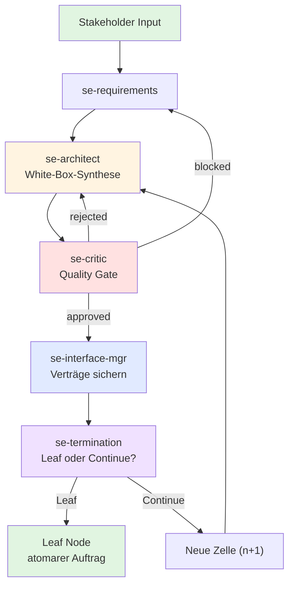

# agent-meta — Architecture Overview

> Version: **0.49.0** — last updated: 2026-05-23

---

## Diagrams

| # | Diagram | Description |
|---|---------|-------------|
| 1 | [Layer Model](docs/architecture/01-layer-model.md) | Override-Priorität der 4 Schichten (0-external → 3-project) + Rules/Hooks |
| 2 | [Sync Flow](docs/architecture/02-sync-flow.md) | Wie `sync.py` aus agent-meta-Sources das Zielprojekt befüllt |
| 3 | [Agent Roles](docs/architecture/03-agent-roles.md) | Alle Agenten-Rollen und Zuständigkeiten |
| 4 | [Development Workflow](docs/architecture/04-dev-workflow.md) | Standard Feature-Workflow als Sequence Diagram |
| 5 | [External Skills](docs/architecture/05-external-skills.md) | Submodule → Config → Wrapper → Zielprojekt |
| 6 | [Versioning Strategy](docs/architecture/06-versioning.md) | Repo-, Agent- und Snippet-Versionen |
| 7 | [SE-Agenten-Kaskade](docs/architecture/07-se-cascade.md) | Rekursive 6-stufige Black-Box → White-Box-Zerlegung |

---

## Repository Structure

```
agent-meta/
├── agents/
│   ├── 0-external/          ← Wrapper-Template für externe Skills
│   │   └── _skill-wrapper.md
│   ├── 1-generic/           ← Universelle Agent-Templates
│   │   ├── orchestrator.md
│   │   ├── ideation.md
│   │   ├── requirements.md
│   │   ├── developer.md
│   │   ├── tester.md
│   │   ├── validator.md
│   │   ├── documenter.md
│   │   ├── git.md
│   │   ├── release.md
│   │   ├── docker.md
│   │   ├── meta-feedback.md
│   │   ├── feature.md
│   │   ├── agent-meta-manager.md
│   │   ├── agent-meta-scout.md
│   │   ├── security-auditor.md
│   │   ├── se-orchestrator.md       ← SE: Koordiniert rekursive Kaskade
│   │   ├── se-requirements.md       ← SE: Stakeholder-Anforderungen
│   │   ├── se-architect.md          ← SE: Black-Box → White-Box
│   │   ├── se-critic.md             ← SE: Quality Gate Auditor
│   │   ├── se-interface-mgr.md      ← SE: Interface-Verträge
│   │   └── se-termination.md        ← SE: Leaf/Continue-Entscheidung
│   └── 2-platform/          ← Plattform-Overrides
│       ├── sharkord-release.md
│       └── sharkord-docker.md
├── hooks/                   ← Versionierte Hook-Scripts (3-Schichten-Modell)
│   ├── 0-external/          ← Hooks aus externen Skill-Repos
│   ├── 1-generic/           ← Universelle Hooks
│   │   └── dod-push-check.sh
│   └── 2-platform/          ← Plattform-spezifische Hooks
├── rules/                   ← Projekt-globale Regeln (auto-loaded in alle Agenten)
│   ├── 0-external/          ← Rules aus externen Skill-Repos
│   ├── 1-generic/           ← Universelle Regeln
│   │   └── issue-lifecycle.md
│   └── 2-platform/          ← Plattform-spezifische Regeln
├── snippets/                ← Versionierte Code-Snippets (per Agent + Sprache)
│   ├── tester/
│   │   ├── bun-typescript.md
│   │   └── pytest-python.md
│   └── developer/
│       ├── bun-typescript.md
│       └── pytest-python.md
├── external/                ← Git Submodule (externe Skill-Repos)
├── docs/
│   ├── architecture/        ← Architektur-Diagramme (Mermaid)
│   ├── CODEBASE_OVERVIEW.md ← Codegenaue Bestandsaufnahme aller src/ Dateien
│   └── conclusions/         ← Tägliche Session-Erkenntnisse
├── schemas/
│   └── se-decomposition.schema.json  ← JSON Schema für SE-Kaskaden-Outputs
├── templates/
│   └── SE-STRATEGY.template.md       ← Durable Anchor für SE-Projekte
├── agent-meta.schema.json   ← JSON Schema für agent-meta.config.yaml (Draft-07)
├── external-skills.config.yaml  ← Skill-Konfiguration (approved: true/false)
├── roles.config.yaml        ← Zentrale Rollen-Konfiguration (model, permissionMode)
├── scripts/
│   └── sync.py              ← Agent-Generator
└── howto/
    ├── first-steps.md
    ├── instantiate-project.md
    ├── upgrade-guide.md
    ├── agent-composition.md
    ├── external-skills.md
    ├── hooks.md
    ├── agent-isolation.md
    ├── rules.md
    ├── agent-memory.md
    ├── sync-concept.md
    ├── agent-meta.config.example.json
    ├── se-workflow.md              ← SE: Vollständiger rekursiver Workflow
    ├── se-blackbox-to-whitebox.md  ← SE: BB→WB-Übergang mit Beispiel
    ├── se-interface-management.md  ← SE: Interface-Propagation im Detail
    └── se-mcp-adapters.md          ← SE: Export-Adapter für Ticket-Systeme
```

---

## SE-Agenten-Kaskade — Architektur

Die SE-Agenten-Kaskade ist ein **fraktales, rekursives System** das Stakeholder-Anforderungen durch eine 6-stufige Black-Box → White-Box-Zerlegung in implementierbare Komponenten überführt.

### Prinzip: Die rekursive System-Zelle

Jede Ebene (L1 → L2 → L3) ist eine **Zelle** mit identischer Struktur:


```mermaid
graph TD
    START["Stakeholder Input"] --> REQ["se-requirements"]
    REQ --> ARCH["se-architect<br/>White-Box-Synthese"]
    ARCH --> CRIT["se-critic<br/>Quality Gate"]
    CRIT -->|approved| IFM["se-interface-mgr<br/>Verträge sichern"]
    CRIT -->|rejected| ARCH
    CRIT -->|blocked| REQ
    IFM --> TERM["se-termination<br/>Leaf oder Continue?"]
    TERM -->|Leaf| LEAF["Leaf Node<br/>atomarer Auftrag"]
    TERM -->|Continue| NEXT["Neue Zelle (n+1)"]
    NEXT --> ARCH

    style START fill:#e1f5e1
    style LEAF fill:#e1f5e1
    style ARCH fill:#fff4e1
    style CRIT fill:#ffe1e1
    style IFM fill:#e1eaff
    style TERM fill:#f0e1ff
```

### Die 6 Stufen

| Stufe | Agenten | Input | Output |
|-------|---------|-------|--------|
| **1. Stakeholder REQ** | `se-requirements` | Unstrukturierter Bedarf | Formale L1-Blackbox-REQs mit REQ-ID |
| **2. L1 Blackbox** | `se-requirements` | Stakeholder-REQs | L1 System Blackbox (externes Verhalten) |
| **3. L1 Whitebox** | `se-architect` → `se-critic` | L1 Blackbox | Abstrakte Sub-Systeme + interne Interfaces |
| **4. L2 Blackbox** | `se-architect` → `se-critic` → `se-interface-mgr` | L1 Whitebox | Konkrete Komponenten + Propagations-Map |
| **5. L2 Whitebox** | `se-architect` → `se-critic` → `se-interface-mgr` | L2 Blackbox | Detaillierte Komponenten-Architektur |
| **6. L3 Component** | `se-architect` → `se-critic` → `se-termination` | L2 Whitebox | Atomare Arbeitsaufträge oder weitere Zerlegung |

### Interface-Propagation

Der **Interface Manager** erzeugt eine **Propagations-Map** die sicherstellt, dass jede neue Zelle (n+1) alle relevanten Schnittstellen kennt:

```
Ebene n (White-Box)
  ├── COMP-A → inherited_external: ["WLAN"], new_internal_outgoing: ["IF-001"]
  ├── COMP-B → inherited_external: [], new_internal_incoming: ["IF-001"]
  └── COMP-C → inherited_external: ["Strom", "Wasser"], new_internal_incoming: ["IF-002"]

Ebene n+1 (neue Zelle für COMP-A)
  → Erhält: Black-Box-REQ für COMP-A + Propagations-Map-Zeile für COMP-A
  → Weiß: "Ich habe WLAN nach außen und spreche per IF-001 mit COMP-B"
```

### Korrekturschleifen

```
Architect → Critic
                ├── approved → Interface Manager → Termination
                ├── rejected → Architect (max. 3 Iterationen mit correction_hints)
                └── blocked → Parent-Zelle (Architektur auf Ebene n-1 revidieren)
```

### Schutzmechanismen

| Regel | Zweck |
|-------|-------|
| `max_depth` | Hartes Limit der Rekursionstiefe (Default: 5) |
| `max_total_cells` | Begrenzung der Gesamtzellen (Default: 20) |
| `max_critic_iterations` | Max. Korrekturschleifen pro Critic (Default: 3) |
| `max_parallel_cells` | Parallele Zellen pro Ebene (Default: 4) |
| Context Window Rule | Zelle n+1 erhält nur ~800 Tokens (kein Context Drift) |
| Circular Reference Check | Zyklische Parent-Ketten →强制 Leaf |

### Datenmodell

Alle SE-Agenten produzieren JSON-Output der durch `schemas/se-decomposition.schema.json` validiert wird. Das Schema definiert:
- **L1-L3 Struktur** (feature_id, stakeholder_requirement, l1_system, l2_subsystems, l3_components)
- **CQRS-Interfaces** (commands, events, queries)
- **Agent-spezifische Felder** (sub_components, internal_interfaces, propagation_map, critic_status, termination_decisions)

### Konfiguration

SE-Rollen sind in `config/role-defaults.yaml` als `workflow_tier: optional` definiert. Sie werden nur generiert wenn in `.meta-config/project.yaml` explizit aktiviert:

```yaml
roles:
  - se-orchestrator
  - se-requirements
  - se-architect
  - se-critic
  - se-interface-mgr
  - se-termination

variables:
  SE_MAX_DEPTH: 5
  SE_MAX_CELLS: 20
  SE_MAX_CRITIC_ITERATIONS: 3
  SE_MAX_PARALLEL_CELLS: 4
```

---

## Update Instructions

Bei jedem **Major Release** aktualisieren:
- Version + Datum in der Überschrift
- `Repository Structure` (neue Dateien/Verzeichnisse)
- Diagramme in `docs/architecture/` (neue Rollen, Skills, Schichten)
