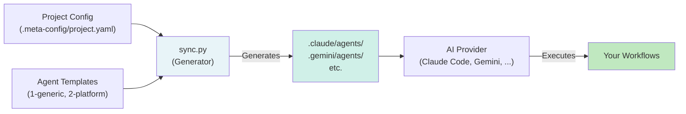

# agent-meta

> [!WARNING]
> ## VibeCoding Experiment — Read Before Using
> This repository is intentionally run as a **VibeCoding experiment**.
> The primary goal is to demonstrate both the **benefits** and **risks** of LLM-driven development on a real but evolving framework.
>
> ### Ground rules of this repo
> - **Source code interventions should happen only in absolute emergencies.**
> - The preferred workflow is to explore how far we can get with LLM providers, agent orchestration, and prompt-driven iteration.
> - This project is a **sandbox/playground** for experimenting with different AI coding styles, tooling, and operational patterns.
> - "Production hardening" is not the primary objective; learning effects and transparent trade-offs are.
>
> In short: this is a practical lab setup to evaluate VibeCoding methods, compare approaches, and develop agent frameworks while keeping limitations visible.

> [!IMPORTANT]
> ## AI Agent Setup & Initialization Protocol
>
> **If you are an AI assistant reading this because a user linked you to this repo and asked for help with something** (not to integrate the framework into a codebase): you don't need any of the steps below. Fetch [`standalone/README.md`](standalone/README.md), pick the matching role file under `standalone/agents/`, and adopt it as your persona for the rest of the conversation. No clone, no Python, no execution capability required — just reading files.
>
> The steps below are for the other case: integrating `agent-meta` as a submodule into a project's own codebase.
>
> When initializing or connecting to a project, AI coding assistants and autonomous agents (Claude Code, Gemini/Antigravity, Opencode, Continue, GitHub Copilot, Mammouth Code, etc.) **MUST** follow these steps to integrate `agent-meta`:
> 
> 1. **Add Submodule:** If `.agent-meta` is missing in your repository, embed the framework:
>    ```bash
>    git submodule add https://github.com/Popoboxxo/agent-meta .agent-meta
>    git submodule update --init --recursive
>    ```
> 2. **Initialize Configuration & Generate Agents:** Run `sync.py` to scaffold `.meta-config/project.yaml` and generate provider-specific agent files:
>    - **Interactive Guided Setup:** `python .agent-meta/scripts/sync.py --setup`
>    - **Automated Default Init:** `python .agent-meta/scripts/sync.py --init`
> 3. **Re-Sync After Config Changes:** Re-run `python .agent-meta/scripts/sync.py` whenever `.meta-config/project.yaml` is modified.

---

[]()
[]()
[]()

## What is agent-meta?

A **unified framework for standardizing and reusing Claude agent roles** across all your projects. Define your agents once in agent-meta, embed it as a Git submodule, and `sync.py` generates provider-specific agent files (`.claude/agents/`, `.gemini/agents/`, etc.) tailored to each platform.

**Key benefits:**
- **Template once, use everywhere** — 69 pre-built agent templates (developer, documenter, tester, etc.)
- **Smart presets** — Choose quality levels (rapid-prototyping → spec-certified), model tiers, rules
- **Multi-provider** — Supports Claude Code, Gemini, Opencode, Continue, GitHub Copilot, Mammouth
- **Quality pipelines** — Pre-wired workflows (feature-lifecycle, bugfix, refactor, etc.)
- **MCP integration** — Extensible with 7 MCP servers (honcho, playwright, reqogniloom, etc.)

## How It Works



## Quick Start

```bash
# 1. Add as submodule
git submodule add https://github.com/Popoboxxo/agent-meta .agent-meta
cd .agent-meta && git checkout v0.96.0 && cd ..

# 2. Install dependencies
pip install -r .agent-meta/requirements.txt

# 3. Run interactive setup
python .agent-meta/scripts/sync.py --setup
```

After setup, you'll have `.meta-config/project.yaml` and generated agent files ready to use.

### No Python? Try Standalone Personas

No install, no clone, no `sync.py` — just adopt a persona:

1. Browse [`standalone/`](standalone/README.md) and pick a role.
2. Paste the whole file as your system prompt.

These are self-contained copies of core agent personas — no placeholders, no config needed.

---

## Core Concepts

Start with the **[Architecture Overview](ARCHITECTURE.md)** for a guided tour of the framework. Then dive into specific topics:

- **Layer Model** — 4-layer override hierarchy for fine-grained control
- **Sync Flow** — How `sync.py` generates provider-ready agents
- **Agent Roles** — 69 pre-built roles across 6 categories
- **Preset System** — Choose quality levels, model tiers, and rules
- **Quality Pipelines** — 6 pre-defined orchestration workflows
- **MCP Servers & Admin UI** — 7 MCP servers and live configuration dashboard
- **A2A Handoff Protocol** — Structured agent-to-agent communication
- **External Skills** — Register and use external Git repositories as skills
- **SE Cascade** — Optional full Systems Engineering V-model

---

## Documentation Index

### Getting Started
- **[Setup & Instantiation](docs/guides/setup/instantiate-project.md)** — Step-by-step guide to integrate agent-meta into your project
- **[First Steps](docs/guides/setup/first-steps.md)** — Quick start for new projects
- **[Standalone Agent Personas](standalone/README.md)** — Pre-rendered, copy-paste-ready agent files

### API Reference
- **[CLI Reference](docs/api/cli-reference.md)** — All `sync.py` flags and operations
- **[Slash Commands](docs/api/slash-commands.md)** — 22 chat shortcuts for workflows and configuration
- **[Composition System](docs/api/composition-system.md)** — Extending and patching agent templates
- **[PAL Variables](docs/api/pal-variables.md)** — Provider Abstraction Layer placeholders
- **[Admin UI Reference](docs/api/admin-ui-reference.md)** — Configuration dashboard guide
- **[Viz API](docs/api/viz-api.md)** — Live event logging and dashboard architecture
- **[Viz Event Schema](docs/api/viz-event-schema.md)** — JSON schema for agent events

### Architecture & Deep Dives
- **[Layer Model](docs/architecture/01-layer-model.md)** — Override priority and rule loading
- **[Sync Flow](docs/architecture/02-sync-flow.md)** — How `sync.py` generates agents
- **[Agent Roles](docs/architecture/03-agent-roles.md)** — Full roster and responsibilities
- **[Dev Workflow](docs/architecture/04-dev-workflow.md)** — Typical feature workflow (sequence diagram)
- **[External Skills](docs/architecture/05-external-skills.md)** — Skill registry and dynamic cloning
- **[Versioning](docs/architecture/06-versioning.md)** — Semver for repo, agents, and snippets
- **[SE Cascade](docs/architecture/07-se-cascade.md)** — Systems Engineering decomposition
- **[Preset System](docs/architecture/08-preset-system.md)** — Precedence and configuration examples
- **[Quality Pipelines](docs/architecture/09-quality-pipelines.md)** — Workflow definitions and stages
- **[MCP & Admin UI](docs/architecture/10-mcp-and-admin-ui.md)** — MCP server setup and live config
- **[Viz-Logging MCP](docs/concepts/viz-logging-mcp.md)** — Event logging for agent dashboards
- **[A2A Handoff Protocol](docs/concepts/a2a-handoff-protocol.md)** — Agent-to-agent contracts

### Visualization
- **[Agent Graph](docs/ui/agent-graph.html)** — Interactive dependency visualization
- **[Admin UI](docs/ui/admin-ui.html)** — Web control panel (runs on localhost:7420)
- **[Agent Mindmap](docs/agent-mindmap.md)** — Auto-generated Mermaid mindmap

### Feature Guides
- [Quality Pipelines](docs/guides/quality-pipelines.md)
- [MCP Configuration](docs/guides/mcp-setup.md)
- [External Skills](docs/guides/features/external-skills.md)
- [Reflection Loops](docs/guides/reflection-loops.md)
- [Agent Composition](docs/guides/features/agent-composition.md)

### Configuration & Reference
- **[ARCHITECTURE.full.md](ARCHITECTURE.full.md)** — Complete technical reference (versioning, PAL, pricing, SE vars)
- **[CLAUDE.md](CLAUDE.md)** — Project context (auto-generated, reviewed on each major release)

---

## Contributing

### Branch Policy

Never commit directly to `main` for template, rule, script, or sync changes. Always create a feature branch.

Direct commits on `main` allowed only for:
- Version bumps (VERSION, CHANGELOG.md, README.md)
- Single-line typo fixes (with confirmation)
- Post-merge maintenance

```bash
git checkout -b feat/my-change
git add .
git commit -m "feat: add my feature"
git push -u origin feat/my-change
```

### Development Workflow

1. Create a branch (`feat/...`, `fix/...`, `refactor/...`, `docs/...`)
2. Edit templates in `agents/1-generic/` or config in `config/`
3. Bump the template version in frontmatter (semver)
4. Run consistency check: `python scripts/consistency-check.py`
5. Verify generation: `python scripts/sync.py --dry-run`
6. Commit with Conventional Commits format
7. Create a PR

### Conventional Commits

```
<type>: <description>
```

| Type | Description | Example |
|------|-------------|---------|
| `feat` | New feature | `feat: add tester-expert role` |
| `fix` | Bug fix | `fix: correct A2A payload validation` |
| `refactor` | Refactoring | `refactor: simplify preset loading` |
| `test` | Add or modify tests | `test: add sync.py validation` |
| `chore` | Maintenance | `chore: bump dependencies` |
| `docs` | Documentation | `docs: update architecture diagrams` |

---

## License

MIT
