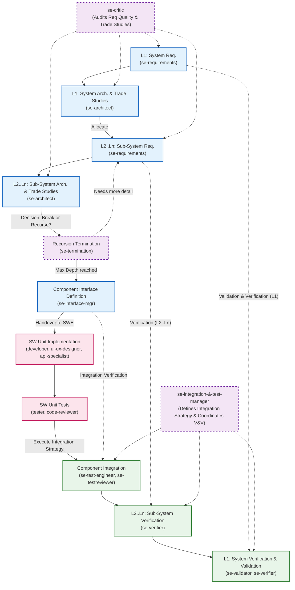

# Erweiterungskonzept: agent-meta Framework (Ultimate SE Edition)

Dieses Dokument spezifiziert das **ultimative Architektur- und Agenten-Modell** für das `agent-meta` Framework. Basierend auf Best Practices des INCOSE Systems Engineering Handbooks und der ISO/IEC 15288 etabliert dieses Konzept ein geschlossenes, fraktales V-Modell mit einer dynamischen Rekursionstiefe und einer vollständigen Verifikations- und Validierungs-Pipeline (V&V).

---

## 1. Das fraktale V-Modell (Dynamische Rekursion)

Im Zentrum der Architektur steht das Systems Engineering V-Modell. Es ist nicht auf 3 Ebenen limitiert, sondern nutzt eine dynamische Rekursion ($L_1$ bis $L_n$). Auf **jeder** Ebene iteriert das Systemdesign durch Requirements- und Architekturphasen, bis eine Abbruchbedingung erreicht ist und das reguläre Software Engineering (SWE) übernimmt.

---

## 2. Der Linke Flügel (Definition & System Design)

Die SE-Agenten auf der linken Seite des V-Modells treiben das Design fraktal nach unten.

### 2.1 `se-requirements` & `se-architect` (Das rekursive Duo)
- Auf **jeder** Ebene ($L_1$ bis $L_n$) arbeiten diese Agenten zusammen.
- **Trade Studies:** Der `se-architect` darf niemals die erstbeste Lösung akzeptieren. Er MUSS bei Architekturentscheidungen Trade-Off-Studien durchführen (z.B. Kosten, Performance, Komplexität gegeneinander abwägen) und Architecture Decision Records (ADRs) schreiben.

### 2.2 `se-critic` (Auditor & Requirements Assessor)
- **Fokus:** Qualitätssicherung auf der linken Seite. Liest keinen Code.
- **Aufgaben:** Prüft Trade-Off-Entscheidungen des Architekten. Validiert Requirements vor der Architekturphase (Prüfung auf Testbarkeit, EARS-Syntax, Atomarität).

### 2.3 `se-termination` (Recursion Controller)
- **Fokus:** Bestimmt, wann die Systems Engineering Phase stoppt.
- **Abbruchbedingung:** Stoppt die Rekursion, sobald die Granularität ausreicht, um deterministisch von einem regulären Software-Entwickler ohne weiteres Systemverständnis umgesetzt zu werden.

---

## 3. Die SWE-Brücke (Implementierungsebene)

An der tiefsten Stelle des V-Modells wird die Systemkomplexität ausgeblendet.

- **`developer`, `ui-ux-designer`, `api-specialist`:** Implementieren streng nach den Vorgaben der L_Comp Ebene.
- **`code-reviewer`:** Gatekeeper für Code-Gesundheit, Clean Code und Blast-Radius-Analysen (via Graph Tools).
- **`tester`:** Schreibt ausschließlich isolierte Unit-Tests für SW-Units (mit Mocks/Stubs), ohne Systemkontext.

---

## 4. Der Rechte Flügel (Verifikation & Validierung)

Die rechte Seite bringt die Komponenten wieder zusammen. Wir trennen strikt zwischen Validation ("Did we build the right system?") und Verification ("Did we build the system right?").

### 4.1 `se-integration-&-test-manager` (Master of V&V)
- **Fokus:** Orchestriert den gesamten rechten Flügel.
- **Aufgaben:** Bestimmt die *Integrationsstrategie* (z.B. Bottom-Up, Top-Down). Koordiniert, wann welcher Ebene-Test (L1, L2, L3) durchzuführen ist. Stellt sicher, dass das Traceability-Feedback funktioniert.

### 4.2 `se-test-engineer` & `se-testreviewer` (Test-Fabrik)
- **`se-test-engineer`:** Entwickelt MBSE-Testmodelle und entwirft Integrationstests (Zusammenspiel mehrerer SW-Units).
- **`se-testreviewer`:** Auditiert die Teststrategie. Prüft auf Edge-Cases, Boundary Value Analysis, Äquivalenzklassen-Fehler und Flakiness.

### 4.3 `se-verifier` (Multi-Level Verification)
- **Fokus:** Verifikation auf ALLEN Ebenen (L1 bis Ln).
- **Aufgabe:** Prüft, ob die fertig integrierten Systeme und Sub-Systeme exakt die Spezifikationen und Schnittstellen der Architektur der jeweiligen Ebene erfüllen.

### 4.4 `se-validator` (System Validation)
- **Fokus:** Validierung ausschließlich auf Systemebene (L1).
- **Aufgabe:** Ignoriert den Code. Simuliert End-to-End User Journeys und gleicht sie mit den originalen Stakeholder-Bedürfnissen aus Phase 1 ab. Blockiert Systeme, die technisch korrekt sind, aber den User-Need nicht erfüllen.

---

## 5. Querschnitts-Spezialisten

Diese Agenten operieren asynchron und unterstützen die Architektur:

- **`devops-engineer`:** Verantwortlich für CI/CD-Pipelines, Infrastructure as Code (Terraform), Kubernetes und Observability (Prometheus/Tracing).
- **`performance-optimizer`:** Datengetriebener Agent zur Identifikation und Auflösung von Big-O Bottlenecks durch Profiling-Daten, ohne funktionale Änderungen am System vorzunehmen.
- **`validator`:** Der rein formale Prozess-Wächter. Prüft ausschließlich Metadaten (DoD-Checkboxen, REQ-ID Präsenz, Commit-Konventionen) und bewertet keine Code-Qualität mehr.

---

## 6. Agent Framework Must-Haves (Kopplung an interne Konzepte)

Damit die Software Engineering-Agenten (`code-reviewer`, `devops-engineer`, `performance-optimizer`, `ui-ux-designer`, `api-specialist`) nahtlos und deterministisch im `agent-meta` Framework operieren, müssen sie tief in die internen Framework-Mechaniken eingekoppelt werden. 

### 6.1 Central Orchestrator Routing & Delegation
Keiner dieser Spezialagenten kommuniziert im Standardfall direkt mit dem menschlichen User. Der `orchestrator` ist der zentrale Router:
- **Input-Parsing:** Der Orchestrator erkennt den User-Intent und zerlegt ihn (z.B. UI-Task $\rightarrow$ `ui-ux-designer`, Infrastruktur-Task $\rightarrow$ `devops-engineer`).
- **Sequential Pipeline:** Der Orchestrator baut Delegationsketten: z.B. `se-interface-mgr` $\rightarrow$ `api-specialist` $\rightarrow$ `developer` $\rightarrow$ `code-reviewer` $\rightarrow$ `tester`.

### 6.2 Input & Output JSON (Contract-Driven Handover)
Um Konfabulation und Kontextverlust in der Kette zu verhindern, muss die Agenten-Kommunikation formell und maschinenlesbar sein:
- **Input Payload:** Wenn der Orchestrator einen Task an den `api-specialist` delegiert, übergibt er ein strukturiertes JSON-Objekt (beinhaltend: `taskId`, `contextFiles`, `targetGoal`).
- **Output Payload:** Der Agent antwortet nicht mit Fließtext ("Ich habe es gemacht"), sondern liefert ein standardisiertes JSON/Markdown-Protokoll zurück (beinhaltend: `modifiedFiles`, `unresolvedIssues`, `nextSteps`), das der Orchestrator wiederum als Input für den nachfolgenden Agenten (z.B. `developer`) nutzt.

### 6.3 Globale Rules & Hook-Architektur (`rules/`)
Jeder generierte Agent erbt automatisch die fundamentalen, globalen Framework-Regeln (wie `AGENTS.md` und `GEMINI.md`):
- **Branch-Guard:** Der `devops-engineer` oder `performance-optimizer` darf niemals direkt auf `main` committen. Die globalen Repo-Rules greifen.
- **Commit-Conventions:** Auch der `api-specialist` muss sich an Conventional Commits halten, wenn er OpenAPI-Schemas aktualisiert.

### 6.4 Definition of Done (DoD) Injections
Die Agenten müssen konditional auf die Checkboxen der DoD reagieren, die via Template-Engine injiziert werden (`{{#if DOD_REQ_TRACEABILITY}}`):
- Wenn die Traceability aktiv ist, darf der `ui-ux-designer` kein Mockup generieren, ohne es einer `REQ-ID` zuzuordnen.
- Der `code-reviewer` muss bei aktiver Traceability zwingend prüfen, ob die geänderten Code-Pfade auf eine gültige Anforderung referenzieren.

### 6.5 Formatter & Context Injection
Um generische Agenten (1-generic) an spezifische Projekte (3-project) anzupassen, müssen Kontext-Formatter zur Build-Zeit via `sync.py` hart in den System Prompt kompiliert werden:
- `{{PROJECT_CONTEXT}}`: Gibt dem `ui-ux-designer` die globale Design-Vision vor.
- `{{CODE_CONVENTIONS}}` & `{{CODE_LANGUAGE}}`: Werden in den `code-reviewer` und `performance-optimizer` injiziert, damit diese sprachspezifische Best-Practices (z.B. Python vs. TypeScript) anwenden.
- `{{EXTENSION_DIR}}`: Erlaubt projektspezifische Overrides (z.B. ein spezielles Linter-Regelwerk für den DevOps-Engineer) on-the-fly zu laden.

### 6.6 Sprachstile & Kommunikation (`language.md`)
Die globalen Sprachregeln des Frameworks gelten strikt für alle neuen Agenten. Die Output-Generierung muss dynamisch gesteuert werden:
- **Deutsch:** Für die Kommunikation mit dem User, interne Dokumente (wie Architekturspezifikationen vom `se-architect` oder UI-Specs vom `ui-ux-designer`).
- **Englisch:** Für Code, Kommentare, Commit-Messages (generiert vom `api-specialist` oder `devops-engineer`) und externe Dokumente (OpenAPI-Specs, GitHub Issues).

### 6.7 Role Defaults & Provider Configuration (`role-defaults.yaml`)
Nicht jeder Agent benötigt dieselbe kognitive Kapazität. Das Framework konfiguriert die Agenten ökonomisch:
- **Tier-1 (Reasoning/High-End):** Agenten wie `se-architect`, `se-validator` oder `code-reviewer` benötigen tiefgreifende logische Modelle (z.B. Claude 3.5 Sonnet / Gemini 1.5 Pro).
- **Tier-2 (Fast Execution):** Agenten wie `tester` oder `devops-engineer` können mit schnelleren, günstigeren Modellen arbeiten, da ihre Aufgaben (wie Linting oder Unit-Tests schreiben) stark deterministisch sind.

### 6.8 Lifecycle Hooks & Pending Tasks (`.opencode/pending-tasks.md`)
Die neuen SE-Agenten müssen an das Event-System des Repositories angebunden sein:
- Wenn der `release`-Agent einen Versions-Bump durchführt, greift der Lifecycle-Hook und triggert automatisch den `se-validator` für einen Post-Release-Sanity-Check.
- Diese "Pending Tasks" werden vom Orchestrator beim Start einer Session ausgelesen und asynchron an die entsprechenden Spezialagenten delegiert.

### 6.9 Skill Registration & External Tooling (`skills-registry.yaml`)
Die `1-generic` Agenten bringen nur ein Basis-Set an Tools mit. Für hochspezialisierte Aufgaben werden sie über die `0-external` Registry dynamisch mit Skills versorgt:
- Der `ui-ux-designer` erhält Zugriff auf einen externen `mermaid-renderer` oder `figma-reader` Skill.
- Der `api-specialist` kann an einen externen `postman-collection-generator` Skill gekoppelt werden.
- Diese Skills sind provider-agnostisch konfiguriert und werden zur Laufzeit durch den Orchestrator injected.

### 6.10 Provider-Agnostic Export & Der `export-manager`
Viele der neuen Agenten erzeugen komplexe konzeptionelle Outputs (ADRs vom `se-architect`, Test-Modelle vom `se-test-engineer`, UI-Specs vom `ui-ux-designer`). Per Default werden diese als Markdown-Dateien (`.md`) im Dateisystem abgelegt. Um das Framework enterprise-ready zu machen, entkoppeln wir die Generierung vom Speicherort:
- **Die Rolle `export-manager`:** Anstatt dass der `se-architect` direkt ein Markdown-File schreibt, übergibt er ein strukturiertes JSON-Objekt (den "ADR-Payload") an den `export-manager`.
- **Target-Agnostic Routing:** Der `export-manager` liest die Projekt-Config (`.meta-config/export.yaml`). Steht das Target auf `confluence`, nutzt der Manager einen Confluence-API-Skill. Steht es auf `jira-xray` (für Testpläne), pusht er dorthin. Steht es auf `markdown` (Default), rendert er ein `.md` File via lokaler Tools.
- **Vorteil für das Framework:** Die Fach-Agenten (`se-architect`, `api-specialist`) müssen sich nicht mit spezifischen APIs (Notion, Confluence, Figma) herumschlagen. Sie erzeugen rein semantischen Output. Das "Wie und Wo" wird vollständig an den `export-manager` ausgelagert.

---

## 7. Fazit

Mit diesem Architektur-Update ist `agent-meta` nicht nur ein Agenten-Framework, sondern eine vollständige Abstraktion des ISO/IEC 15288 Systems Engineering Prozesses. Die strenge Trennung von Requirements, Architektur, Code und V&V – gepaart mit fraktaler Rekursion und Closed-Loop Traceability – ermöglicht die fehlerfreie Entwicklung hochkomplexer Systeme.
