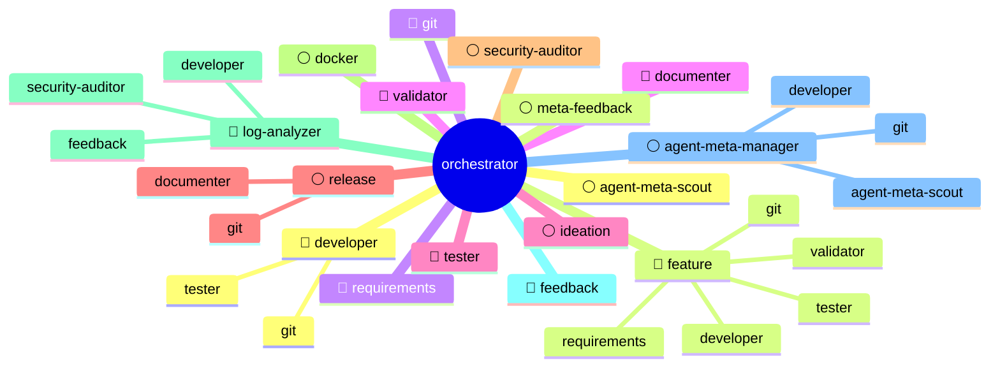

# Agenten-Übersicht

> Automatisch generiert von agent-meta. Nicht manuell bearbeiten.

## Legende

| Symbol | Bedeutung |
|--------|-----------|
| 🔴 | required — Kern-Workflow |
| 🔵 | recommended — Standard-Qualität |
| ⚪ | optional — Bei Bedarf |

## Agenten-Details

### agent-meta-manager
- **Tier:** optional
- **Beschreibung:** agent-meta verwalten: Upgrades, Sync, Feedback-Delegation, projektspezifische Agenten, External-Skill-Lifecycle und Erweiterungen anlegen.
- **Model:** gemini-3.1-pro-low
- **Delegiert an:** agent-meta-scout, developer, git

### agent-meta-scout
- **Tier:** optional
- **Beschreibung:** Scoutet das KI-Ökosystem auf neue Skills, Agenten-Patterns, Rules und Workflows. Bewertet Kandidaten und macht konkrete Erweiterungsvorschläge für agent-meta.
- **Model:** gemini-3.1-pro-low

### api-specialist
- **Tier:** optional
- **Beschreibung:** API-Design, OpenAPI-Spezifikationen, Contract-First Development. Erstellt und pflegt API-Vertraege.
- **Model:** gemini-3.1-pro-low

### bug-feature-analyzer
- **Tier:** recommended
- **Beschreibung:** Analysiert und klassifiziert eingehende Bug-Meldungen und Feature-Requests vor Ressourcen-Allokation. Unterscheidet: Echter Bug, User-Fehler, validierbares Feature, Out-of-Scope.
- **Model:** gemini-3.1-pro-low

### claude-expert
- **Tier:** optional
- **Beschreibung:** Absoluter Analyse-Experte für die Plattform Claude Code: Funktionsweise, Konfiguration (.claude), Best Practices (Formatter, Hooks, MCPs) zur optimalen Anpassung von agent-meta.
- **Model:** gemini-3.1-pro-high

### code-reviewer
- **Tier:** recommended
- **Beschreibung:** Gatekeeper für Code-Gesundheit: Clean Code, SOLID, Blast-Radius-Analysen und REQ-Traceability in Code-Pfaden.
- **Model:** gemini-3.1-pro-high

### continue-expert
- **Tier:** optional
- **Beschreibung:** Absoluter Analyse-Experte für die Plattform Continue: Funktionsweise, Konfiguration (.continue), Best Practices (Formatter, Hooks, MCPs) zur optimalen Anpassung von agent-meta.
- **Model:** gemini-3.1-pro-high

### copilot-expert
- **Tier:** optional
- **Beschreibung:** Absoluter Analyse-Experte für die Plattform GitHub Copilot: Funktionsweise, Konfiguration (.github/copilot), Best Practices (Formatter, Hooks, MCPs) zur optimalen Anpassung von agent-meta.
- **Model:** gemini-3.1-pro-high

### developer
- **Tier:** required
- **Beschreibung:** Developer-Agent für das agent-meta Meta-Repository. Erweitert den generischen Developer um Framework-Wissen: Schichten-Architektur, Platzhalter-Lifecycle, Python-Modulstruktur, Rollen-Anlegen-Prozess und Sync-Interface.
- **Model:** gemini-3.1-pro-high
- **Delegiert an:** tester, git

### devops-engineer
- **Tier:** optional
- **Beschreibung:** CI/CD-Pipelines, Infrastructure as Code, Container-Orchestrierung, Observability und Security-Best-Practices.
- **Model:** gemini-3.5-flash-high

### docker
- **Tier:** optional
- **Beschreibung:** Docker-Operationen: Compose-Stacks, Binary-Management, Test-Umgebungen und Diagnose — plattformunabhängig.
- **Model:** gemini-3.5-flash-high

### documenter
- **Tier:** recommended
- **Beschreibung:** Pflegt CODEBASE_OVERVIEW.md, ARCHITECTURE.md, README.md und Session-Erkenntnisse.
- **Model:** gemini-3.5-flash-high

### effort-estimator
- **Tier:** optional
- **Beschreibung:** Schätzt Aufwände für Entwicklungsaufgaben basierend auf Task-Typ und LLM-Fähigkeiten
- **Model:** gemini-3.5-flash-high

### export-manager
- **Tier:** optional
- **Beschreibung:** Liest .meta-config/export.yaml und routet strukturierte JSON-Payloads der Fach-Agenten zum konfigurierten Target (markdown, confluence, jira-xray, etc.).
- **Model:** gemini-3.5-flash-high

### feature
- **Tier:** recommended
- **Beschreibung:** Vollständiger Feature-Lifecycle: Branch → Requirements → TDD → Implementierung → Validierung → Commit → PR.
- **Model:** inherited
- **Delegiert an:** requirements, validator, developer, tester, git

### feedback
- **Tier:** required
- **Beschreibung:** Standardisiert Bug-Reports, Feature-Requests und Verbesserungsvorschläge für das eingesetzte Projekt — kategorisiert, aufbereitet und direkt als GitHub Issue eingereicht.
- **Model:** gemini-3.5-flash-high

### gemini-expert
- **Tier:** optional
- **Beschreibung:** Absoluter Analyse-Experte für die Plattform Gemini (Antigravity): Funktionsweise, Konfiguration (.gemini), Best Practices (Formatter, Hooks, MCPs) zur optimalen Anpassung von agent-meta.
- **Model:** gemini-3.1-pro-high

### git
- **Tier:** required
- **Beschreibung:** Git-Operationen: Commits, Branches, Merges, Tags, Push/Pull und Commit-Messages — plattformunabhängig (GitHub, GitLab, Gitea).
- **Model:** gemini-3.5-flash-high

### ideation
- **Tier:** optional
- **Beschreibung:** Ideenfindung, Visions-Schärfung und Konzept-Konkretisierung — stellt Fragen, denkt Ecken, übergibt reife Ideen an Requirements.
- **Model:** inherited

### log-analyzer
- **Tier:** required
- **Beschreibung:** Analysiert System- und Applikations-Logs: Frequency-Clustering, Severity-Klassifikation (RFC 5424), Root-Cause-Hypothesen und strukturierte Findings mit Delegations-Routing.
- **Model:** gemini-3.1-pro-low
- **Delegiert an:** feedback, developer, security-auditor

### meta-feedback
- **Tier:** optional
- **Beschreibung:** Verbesserungsvorschläge für agent-meta sammeln und als GitHub Issues einreichen.
- **Model:** gemini-3.5-flash-high

### opencode-expert
- **Tier:** optional
- **Beschreibung:** Absoluter Analyse-Experte für die Plattform Opencode: Funktionsweise, Konfiguration (.opencode), Best Practices (Formatter, Hooks, MCPs) zur optimalen Anpassung von agent-meta.
- **Model:** gemini-3.1-pro-high

### openscad-developer
- **Tier:** optional
- **Beschreibung:** Spezialisierter Developer für parametrische 3D-Modelle in OpenSCAD. Render-Inspect-Refine Loop via MCP, Druckbarkeits-Wissen, Toleranz-Management.
- **Model:** gemini-3.1-pro-low

### orchestrator
- **Tier:** required
- **Beschreibung:** Provider-agnostischer Task-Orchestrator: zerlegt, parallelisiert, delegiert.
- **Model:** gemini-3.1-pro-low
- **Delegiert an:** developer, feature, git, documenter, ideation, release, security-auditor, docker, log-analyzer, feedback, agent-meta-manager, agent-meta-scout, meta-feedback, requirements, validator, tester

### performance-optimizer
- **Tier:** optional
- **Beschreibung:** Datengetriebene Identifikation und Aufloesung von Big-O Bottlenecks durch Profiling-Daten, ohne funktionale Aenderungen.
- **Model:** gemini-3.1-pro-high

### provider-expert
- **Tier:** optional
- **Beschreibung:** Absoluter Analyse-Experte für einen AI-Provider: Funktionsweise, Konfiguration, Best Practices (Formatter, Hooks, MCPs) zur optimalen Anpassung von agent-meta.
- **Model:** inherited

### release
- **Tier:** optional
- **Beschreibung:** Versioning, Changelogs, Build-Prozesse und GitHub-Releases verwalten.
- **Model:** gemini-3.1-pro-low
- **Delegiert an:** git, documenter

### requirements
- **Tier:** recommended
- **Beschreibung:** Anforderungen aufnehmen, REQ-IDs vergeben, REQUIREMENTS.md pflegen und Traceability prüfen.
- **Model:** gemini-3.1-pro-low

### se-architect
- **Tier:** optional
- **Beschreibung:** Designs system architecture using generic laws, CQRS routing, and defines L1/L2 whiteboxes.
- **Model:** gemini-3.1-pro-high

### se-critic
- **Tier:** optional
- **Beschreibung:** Audits requirements and architecture against generic laws (orthogonality, testability, traceability).
- **Model:** gemini-3.1-pro-high

### se-integration-and-test-manager
- **Tier:** optional
- **Beschreibung:** V&V-Orchestrator: Koordiniert Integrationsstrategie, Test-Ebenen und Traceability-Feedback über L1-Ln.
- **Model:** gemini-3.1-pro-low

### se-interface-mgr
- **Tier:** optional
- **Beschreibung:** Manages generic signal flow and deterministic synchronization across systems.
- **Model:** gemini-3.1-pro-low

### se-orchestrator
- **Tier:** optional
- **Beschreibung:** Coordinates the 6-level recursive breakdown with zig-zag traceability and V&V.
- **Model:** gemini-3.1-pro-low

### se-requirements
- **Tier:** optional
- **Beschreibung:** Elicits stakeholder needs and uses a 6-level template for requirements engineering.
- **Model:** gemini-3.1-pro-low

### se-termination
- **Tier:** optional
- **Beschreibung:** Deterministic termination at L3 (Component Requirement).
- **Model:** gemini-3.5-flash-high

### se-test-engineer
- **Tier:** optional
- **Beschreibung:** Develops MBSE test models and designs integration tests (interaction of multiple SW units). Right wing of the V-model.
- **Model:** gemini-3.1-pro-low

### se-testreviewer
- **Tier:** optional
- **Beschreibung:** Audits the test strategy. Checks for edge cases, boundary value analysis, equivalence class errors, and flakiness.
- **Model:** gemini-3.1-pro-high

### se-validator
- **Tier:** optional
- **Beschreibung:** L1 System-Validierung: End-to-End User Journeys gegen Stakeholder-Bedürfnisse abgleichen. 'Did we build the right system?'
- **Model:** gemini-3.1-pro-high

### se-verifier
- **Tier:** optional
- **Beschreibung:** Multi-Level Verification L1-Ln. Validates that fully integrated systems/sub-systems exactly fulfill architectural specifications and interfaces.
- **Model:** gemini-3.1-pro-low

### security-auditor
- **Tier:** optional
- **Beschreibung:** Static security analysis: OWASP Top 10, secrets detection, dependency risks, supply-chain threats, and cryptographic weaknesses — read-only, no code execution.
- **Model:** gemini-3.1-pro-high

### tester
- **Tier:** recommended
- **Beschreibung:** Isolierte Unit-Tests mit Mocks/Stubs nach TDD-Workflow. Für Integrationstests → se-test-engineer.
- **Model:** gemini-3.1-pro-low

### ui-ux-designer
- **Tier:** optional
- **Beschreibung:** Erstellt UI-Spezifikationen, Mockups und Design-Systeme. Ordnet UI-Elemente REQ-IDs zu.
- **Model:** gemini-3.1-pro-low

### validator
- **Tier:** recommended
- **Beschreibung:** Formaler Prozess-Wächter: DoD-Checkboxen, REQ-ID-Präsenz, Commit-Konventionen. Bewertet KEINE Code-Qualität — dafür code-reviewer.
- **Model:** gemini-3.1-pro-low
