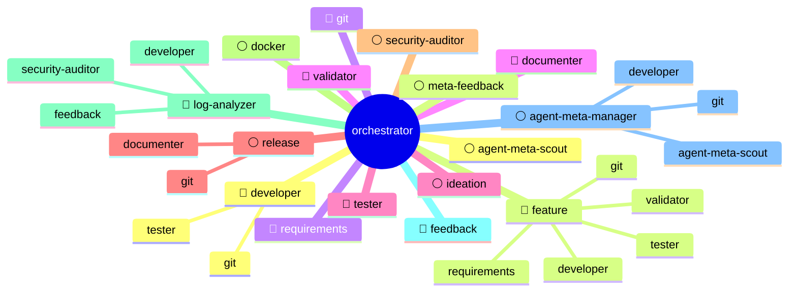

# Agenten-Übersicht

> Automatisch generiert von agent-meta. Nicht manuell bearbeiten.

## Legende

| Symbol | Bedeutung |
|--------|-----------|
| 🔴 | required — Kern-Workflow |
| 🔵 | recommended — Standard-Qualität |
| ⚪ | optional — Bei Bedarf |

## Agenten-Details

### agent-meta-manager
- **Tier:** optional
- **Beschreibung:** agent-meta verwalten: Upgrades, Sync, Feedback-Delegation, projektspezifische Agenten, External-Skill-Lifecycle und Erweiterungen anlegen.
- **Model:** Claude: claude-sonnet-4-6, Gemini: gemini-3.1-pro-low, Opencode: opencode-go/qwen3.6-plus
- **Delegiert an:** agent-meta-scout, developer, git

### agent-meta-scout
- **Tier:** optional
- **Beschreibung:** Scoutet das KI-Ökosystem auf neue Skills, Agenten-Patterns, Rules und Workflows. Bewertet Kandidaten und macht konkrete Erweiterungsvorschläge für agent-meta.
- **Model:** Claude: claude-sonnet-4-6, Gemini: gemini-3.1-pro-low, Opencode: opencode-go/qwen3.6-plus

### developer
- **Tier:** required
- **Beschreibung:** Developer-Agent für das agent-meta Meta-Repository. Erweitert den generischen Developer um Framework-Wissen: Schichten-Architektur, Platzhalter-Lifecycle, Python-Modulstruktur, Rollen-Anlegen-Prozess und Sync-Interface.
- **Model:** inherited
- **Delegiert an:** tester, git

### docker
- **Tier:** optional
- **Beschreibung:** Docker-Operationen: Compose-Stacks, Binary-Management, Test-Umgebungen und Diagnose — plattformunabhängig.
- **Model:** Claude: claude-haiku-4-5-20251001, Gemini: gemini-3.5-flash-high, Opencode: opencode-go/deepseek-v4-flash

### documenter
- **Tier:** recommended
- **Beschreibung:** Pflegt CODEBASE_OVERVIEW.md, ARCHITECTURE.md, README.md und Session-Erkenntnisse.
- **Model:** Claude: claude-sonnet-4-6, Gemini: gemini-3.1-pro-low, Opencode: opencode-go/qwen3.6-plus

### feature
- **Tier:** recommended
- **Beschreibung:** Vollständiger Feature-Lifecycle: Branch → Requirements → TDD → Implementierung → Validierung → Commit → PR.
- **Model:** inherited
- **Delegiert an:** requirements, validator, developer, tester, git

### feedback
- **Tier:** required
- **Beschreibung:** Standardisiert Bug-Reports, Feature-Requests und Verbesserungsvorschläge für das eingesetzte Projekt — kategorisiert, aufbereitet und direkt als GitHub Issue eingereicht.
- **Model:** Claude: claude-sonnet-4-6, Gemini: gemini-3.1-pro-low, Opencode: opencode-go/qwen3.6-plus

### git
- **Tier:** required
- **Beschreibung:** Git-Operationen: Commits, Branches, Merges, Tags, Push/Pull und Commit-Messages — plattformunabhängig (GitHub, GitLab, Gitea).
- **Model:** Claude: claude-haiku-4-5-20251001, Gemini: gemini-3.5-flash-high, Opencode: opencode-go/deepseek-v4-flash

### ideation
- **Tier:** optional
- **Beschreibung:** Ideenfindung, Visions-Schärfung und Konzept-Konkretisierung — stellt Fragen, denkt Ecken, übergibt reife Ideen an Requirements.
- **Model:** inherited

### log-analyzer
- **Tier:** required
- **Beschreibung:** Analysiert System- und Applikations-Logs: Frequency-Clustering, Severity-Klassifikation (RFC 5424), Root-Cause-Hypothesen und strukturierte Findings mit Delegations-Routing.
- **Model:** Claude: claude-sonnet-4-6, Gemini: gemini-3.1-pro-low, Opencode: opencode-go/qwen3.6-plus
- **Delegiert an:** feedback, developer, security-auditor

### meta-feedback
- **Tier:** optional
- **Beschreibung:** Verbesserungsvorschläge für agent-meta sammeln und als GitHub Issues einreichen.
- **Model:** Claude: claude-haiku-4-5-20251001, Gemini: gemini-3.5-flash-high, Opencode: opencode-go/deepseek-v4-flash

### openscad-developer
- **Tier:** optional
- **Beschreibung:** Spezialisierter Developer für parametrische 3D-Modelle in OpenSCAD. Render-Inspect-Refine Loop via MCP, Druckbarkeits-Wissen, Toleranz-Management.
- **Model:** Claude: claude-sonnet-4-6, Gemini: gemini-3.1-pro-low, Opencode: opencode-go/qwen3.6-plus

### orchestrator
- **Tier:** required
- **Beschreibung:** Provider-agnostischer Task-Orchestrator: zerlegt, parallelisiert, delegiert.
- **Model:** inherited
- **Delegiert an:** developer, feature, git, documenter, ideation, release, security-auditor, docker, log-analyzer, feedback, agent-meta-manager, agent-meta-scout, meta-feedback, requirements, validator, tester

### release
- **Tier:** optional
- **Beschreibung:** Versioning, Changelogs, Build-Prozesse und GitHub-Releases verwalten.
- **Model:** Claude: claude-sonnet-4-6, Gemini: gemini-3.1-pro-low, Opencode: opencode-go/qwen3.6-plus
- **Delegiert an:** git, documenter

### requirements
- **Tier:** recommended
- **Beschreibung:** Anforderungen aufnehmen, REQ-IDs vergeben, REQUIREMENTS.md pflegen und Traceability prüfen.
- **Model:** inherited

### se-architect
- **Tier:** optional
- **Beschreibung:** Designs system architecture using generic laws, CQRS routing, and defines L1/L2 whiteboxes.
- **Model:** Claude: claude-opus-4-7, Gemini: gemini-3.1-pro-high, Opencode: opencode-go/kimi-k2.5

### se-critic
- **Tier:** optional
- **Beschreibung:** Audits requirements and architecture against generic laws (orthogonality, testability, traceability).
- **Model:** Claude: claude-opus-4-7, Gemini: gemini-3.1-pro-high, Opencode: opencode-go/kimi-k2.5

### se-interface-mgr
- **Tier:** optional
- **Beschreibung:** Manages generic signal flow and deterministic synchronization across systems.
- **Model:** Claude: claude-sonnet-4-6, Gemini: gemini-3.1-pro-low, Opencode: opencode-go/qwen3.6-plus

### se-orchestrator
- **Tier:** optional
- **Beschreibung:** Coordinates the 6-level recursive breakdown.
- **Model:** Claude: claude-sonnet-4-6, Gemini: gemini-3.1-pro-low, Opencode: opencode-go/qwen3.6-plus

### se-requirements
- **Tier:** optional
- **Beschreibung:** Elicits stakeholder needs and uses a 6-level template for requirements engineering.
- **Model:** Claude: claude-sonnet-4-6, Gemini: gemini-3.1-pro-low, Opencode: opencode-go/qwen3.6-plus

### se-termination
- **Tier:** optional
- **Beschreibung:** Deterministic termination at L3 (Component Requirement).
- **Model:** Claude: claude-haiku-4-5-20251001, Gemini: gemini-3.5-flash-high, Opencode: opencode-go/deepseek-v4-flash

### security-auditor
- **Tier:** optional
- **Beschreibung:** Static security analysis: OWASP Top 10, secrets detection, dependency risks, supply-chain threats, and cryptographic weaknesses — read-only, no code execution.
- **Model:** Claude: claude-opus-4-7, Gemini: gemini-3.1-pro-high, Opencode: opencode-go/kimi-k2.5

### tester
- **Tier:** recommended
- **Beschreibung:** Unit-/Integration-/E2E-Tests nach TDD-Workflow schreiben, ausführen und Testabdeckung pro REQ-ID sicherstellen.
- **Model:** Claude: claude-sonnet-4-6, Gemini: gemini-3.1-pro-low, Opencode: opencode-go/qwen3.6-plus

### validator
- **Tier:** recommended
- **Beschreibung:** Code gegen Anforderungen prüfen, Traceability validieren, Definition of Done und Codequalität sicherstellen.
- **Model:** Claude: claude-sonnet-4-6, Gemini: gemini-3.1-pro-low, Opencode: opencode-go/qwen3.6-plus
