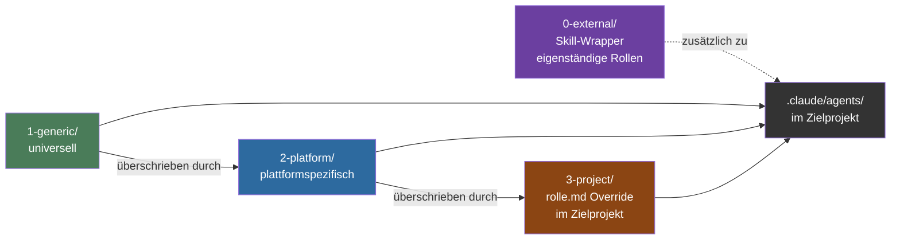

# Layer Model — Override Priority

> [← Back to Architecture Overview](../../ARCHITECTURE.md)

```mermaid
graph LR
    A["1-generic/\nuniversell"] -->|überschrieben durch| B["2-platform/\nplattformspezifisch"]
    B -->|überschrieben durch| C["3-project/\nrolle.md Override\nim Zielprojekt"]
    D["0-external/\nSkill-Wrapper\neigenständige Rollen"] -.->|zusätzlich zu| E[".claude/agents/\nim Zielprojekt"]
    A --> E
    B --> E
    C --> E

    style A fill:#4a7c59,color:#fff
    style B fill:#2d6a9f,color:#fff
    style C fill:#8b4513,color:#fff
    style D fill:#6b3fa0,color:#fff
    style E fill:#333,color:#fff
```
