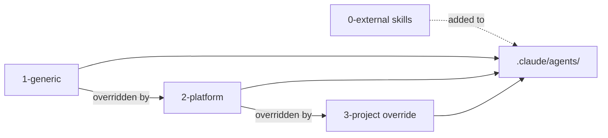
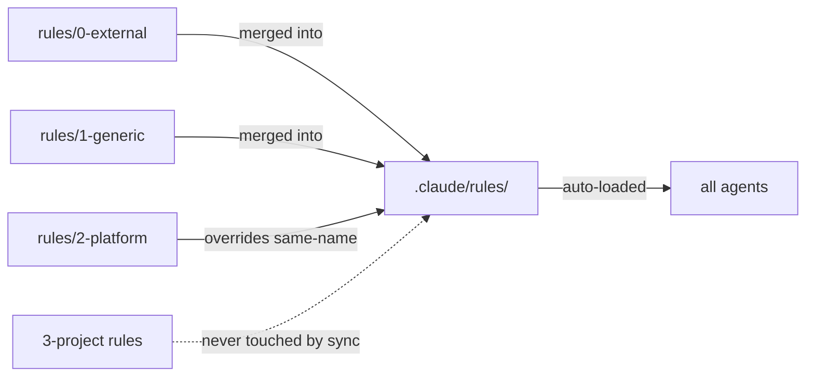
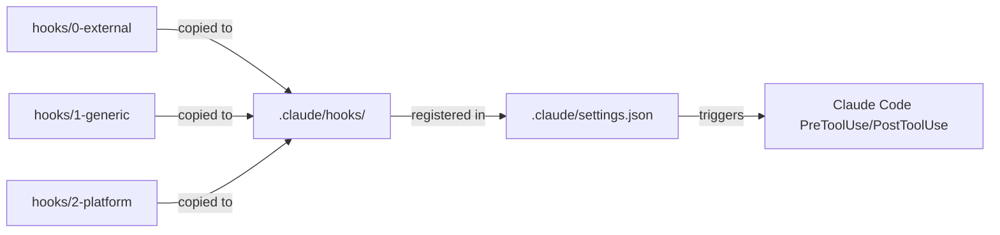

# Layer Model

> [Back to Architecture Overview](../../ARCHITECTURE.md)

## Agents — Override-Priorität



## Rules — Auto-loaded in alle Agenten



Rules werden von Claude Code automatisch in jeden Agenten-Kontext geladen — kein Read-Tool nötig.
Ideal für Cross-Cutting-Policies (Security, Coding-Konventionen, Issue-Lifecycle).

## Hooks — Opt-in Shell Scripts



Hooks werden **immer kopiert**, aber nur ausgeführt wenn `enabled: true` in `agent-meta.config.json`:
```json
"hooks": {
  "dod-push-check": { "enabled": true }
}
```
