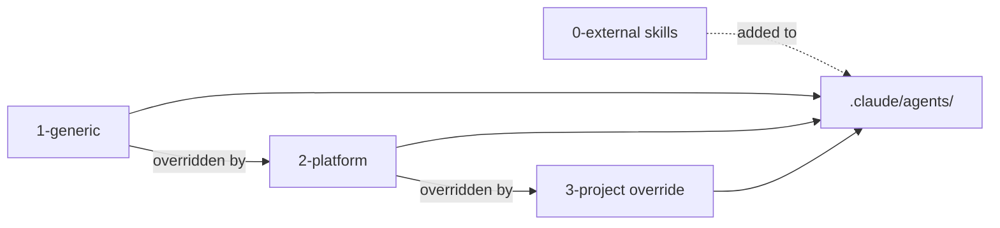

# Layer Model

> [Back to Architecture Overview](../../ARCHITECTURE.md)

```mermaid
graph LR
    A[1-generic] -->|overridden by| B[2-platform]
    B -->|overridden by| C[3-project override]
    D[0-external skills] -.->|added to| E[.claude/agents/]
    A --> E
    B --> E
    C --> E
```
