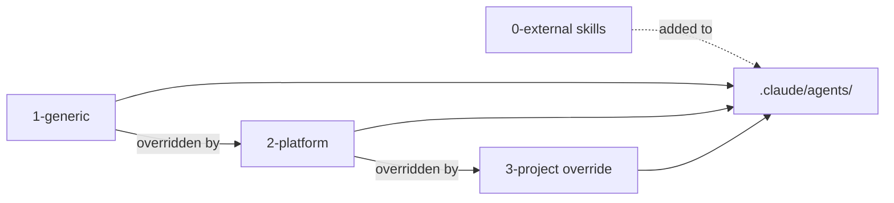

# Layer Model

> [Back to Architecture Overview](../../ARCHITECTURE.md) &nbsp;|&nbsp; [Open in Mermaid Live Editor](https://mermaid.live/edit#base64:eyJjb2RlIjogImdyYXBoIExSXG4gICAgQVsxLWdlbmVyaWNdIC0tPnxvdmVycmlkZGVuIGJ5fCBCWzItcGxhdGZvcm1dXG4gICAgQiAtLT58b3ZlcnJpZGRlbiBieXwgQ1szLXByb2plY3Qgb3ZlcnJpZGVdXG4gICAgRFswLWV4dGVybmFsIHNraWxsc10gLS4tPnxhZGRlZCB0b3wgRVsuY2xhdWRlL2FnZW50cy9dXG4gICAgQSAtLT4gRVxuICAgIEIgLS0-IEVcbiAgICBDIC0tPiBFIiwgIm1lcm1haWQiOiB7InRoZW1lIjogImRlZmF1bHQifX0)

