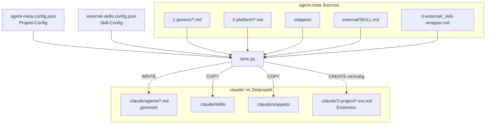

# Sync Flow — agent-meta → Zielprojekt

> [← Back to Architecture Overview](../../ARCHITECTURE.md)

```mermaid
flowchart TD
    CFG["agent-meta.config.json\nProjekt-Config"]
    ECFG["external-skills.config.json\nSkill-Config"]
    SYNC["sync.py"]

    subgraph SOURCES ["agent-meta Sources"]
        G1["1-generic/*.md"]
        G2["2-platform/*.md"]
        SN["snippets/"]
        EX["external/SKILL.md"]
        WR["0-external/_skill-wrapper.md"]
    end

    subgraph TARGET [".claude/ im Zielprojekt"]
        AG[".claude/agents/*.md\ngeneriert"]
        SK[".claude/skills/"]
        SNC[".claude/snippets/"]
        EXT[".claude/3-project/*-ext.md\nExtension"]
    end

    CFG --> SYNC
    ECFG --> SYNC
    G1 --> SYNC
    G2 --> SYNC
    SN --> SYNC
    EX --> SYNC
    WR --> SYNC

    SYNC -->|"WRITE"| AG
    SYNC -->|"COPY"| SNC
    SYNC -->|"COPY"| SK
    SYNC -->|"CREATE einmalig"| EXT
```
