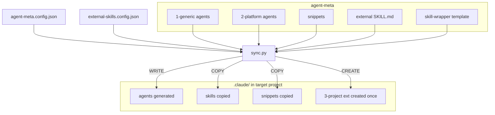

# Sync Flow

> [Back to Architecture Overview](../../ARCHITECTURE.md) &nbsp;|&nbsp; [Open in Mermaid Live Editor](https://mermaid.live/edit#base64:eyJjb2RlIjogImZsb3djaGFydCBURFxuICAgIENGR1thZ2VudC1tZXRhLmNvbmZpZy5qc29uXVxuICAgIEVDRkdbZXh0ZXJuYWwtc2tpbGxzLmNvbmZpZy5qc29uXVxuICAgIFNZTkNbc3luYy5weV1cbiAgICBzdWJncmFwaCBzb3VyY2VzIFthZ2VudC1tZXRhXVxuICAgICAgICBHMVsxLWdlbmVyaWMgYWdlbnRzXVxuICAgICAgICBHMlsyLXBsYXRmb3JtIGFnZW50c11cbiAgICAgICAgU05bc25pcHBldHNdXG4gICAgICAgIEVYW2V4dGVybmFsIFNLSUxMLm1kXVxuICAgICAgICBXUltza2lsbC13cmFwcGVyIHRlbXBsYXRlXVxuICAgIGVuZFxuICAgIHN1YmdyYXBoIHRhcmdldCBbLmNsYXVkZS8gaW4gdGFyZ2V0IHByb2plY3RdXG4gICAgICAgIEFHW2FnZW50cyBnZW5lcmF0ZWRdXG4gICAgICAgIFNLW3NraWxscyBjb3BpZWRdXG4gICAgICAgIFNOQ1tzbmlwcGV0cyBjb3BpZWRdXG4gICAgICAgIEVYVFszLXByb2plY3QgZXh0IGNyZWF0ZWQgb25jZV1cbiAgICBlbmRcbiAgICBDRkcgLS0-IFNZTkNcbiAgICBFQ0ZHIC0tPiBTWU5DXG4gICAgRzEgLS0-IFNZTkNcbiAgICBHMiAtLT4gU1lOQ1xuICAgIFNOIC0tPiBTWU5DXG4gICAgRVggLS0-IFNZTkNcbiAgICBXUiAtLT4gU1lOQ1xuICAgIFNZTkMgLS0-fFdSSVRFfCBBR1xuICAgIFNZTkMgLS0-fENPUFl8IFNOQ1xuICAgIFNZTkMgLS0-fENPUFl8IFNLXG4gICAgU1lOQyAtLT58Q1JFQVRFfCBFWFQiLCAibWVybWFpZCI6IHsidGhlbWUiOiAiZGVmYXVsdCJ9fQ)

