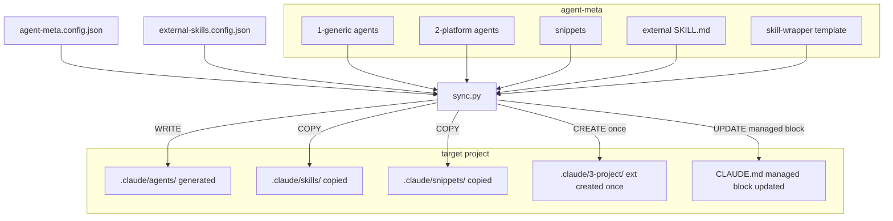

# Sync Flow

> [Back to Architecture Overview](../../ARCHITECTURE.md) &nbsp;|&nbsp; [Open in Mermaid Live Editor](https://mermaid.live/edit#base64:eyJjb2RlIjogImZsb3djaGFydCBURFxuICAgIENGR1thZ2VudC1tZXRhLmNvbmZpZy5qc29uXVxuICAgIEVDRkdbZXh0ZXJuYWwtc2tpbGxzLmNvbmZpZy5qc29uXVxuICAgIFNZTkNbc3luYy5weV1cbiAgICBzdWJncmFwaCBzb3VyY2VzIFthZ2VudC1tZXRhXVxuICAgICAgICBHMVsxLWdlbmVyaWMgYWdlbnRzXVxuICAgICAgICBHMlsyLXBsYXRmb3JtIGFnZW50c11cbiAgICAgICAgU05bc25pcHBldHNdXG4gICAgICAgIEVYW2V4dGVybmFsIFNLSUxMLm1kXVxuICAgICAgICBXUltza2lsbC13cmFwcGVyIHRlbXBsYXRlXVxuICAgIGVuZFxuICAgIHN1YmdyYXBoIHRhcmdldCBbdGFyZ2V0IHByb2plY3RdXG4gICAgICAgIEFHWy5jbGF1ZGUvYWdlbnRzLyBnZW5lcmF0ZWRdXG4gICAgICAgIFNLWy5jbGF1ZGUvc2tpbGxzLyBjb3BpZWRdXG4gICAgICAgIFNOQ1suY2xhdWRlL3NuaXBwZXRzLyBjb3BpZWRdXG4gICAgICAgIEVYVFsuY2xhdWRlLzMtcHJvamVjdC8gZXh0IGNyZWF0ZWQgb25jZV1cbiAgICAgICAgQ0xBW0NMQVVERS5tZCBtYW5hZ2VkIGJsb2NrIHVwZGF0ZWRdXG4gICAgZW5kXG4gICAgQ0ZHIC0tPiBTWU5DXG4gICAgRUNGRyAtLT4gU1lOQ1xuICAgIEcxIC0tPiBTWU5DXG4gICAgRzIgLS0-IFNZTkNcbiAgICBTTiAtLT4gU1lOQ1xuICAgIEVYIC0tPiBTWU5DXG4gICAgV1IgLS0-IFNZTkNcbiAgICBTWU5DIC0tPnxXUklURXwgQUdcbiAgICBTWU5DIC0tPnxDT1BZfCBTTkNcbiAgICBTWU5DIC0tPnxDT1BZfCBTS1xuICAgIFNZTkMgLS0-fENSRUFURSBvbmNlfCBFWFRcbiAgICBTWU5DIC0tPnxVUERBVEUgbWFuYWdlZCBibG9ja3wgQ0xBIiwgIm1lcm1haWQiOiB7InRoZW1lIjogImRlZmF1bHQifX0)



## CLAUDE.md managed block

Bei jedem normalen sync aktualisiert `sync.py` automatisch den managed block in `CLAUDE.md`
(nur wenn `ai-provider: Claude` in config):

```
<!-- agent-meta:managed-begin -->
<!-- This block is automatically updated by sync.py on every sync. -->

Generiert von agent-meta vX.Y.Z — YYYY-MM-DD

| Agent | Zuständigkeit |
|-------|--------------|
| orchestrator | ... |
| developer    | ... |
...
<!-- agent-meta:managed-end -->
```

- **Außerhalb des Blocks** — handgeschrieben, nie überschrieben
- **Innerhalb des Blocks** — vollständig generiert, manuelle Änderungen gehen verloren
- **Block fehlt** → `[WARN]` im sync.log mit Hinweis zum manuellen Einfügen
