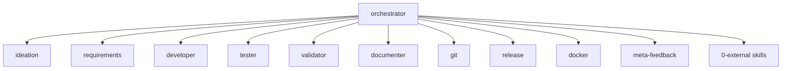

# Agent Roles

> [Back to Architecture Overview](../../ARCHITECTURE.md)

```mermaid
graph TD
    ORC[orchestrator]
    ORC --> IDE[ideation]
    ORC --> REQ[requirements]
    ORC --> DEV[developer]
    ORC --> TST[tester]
    ORC --> VAL[validator]
    ORC --> DOC[documenter]
    ORC --> GIT[git]
    ORC --> REL[release]
    ORC --> DOK[docker]
    ORC --> MFB[meta-feedback]
    ORC --> EXT[0-external skills]
```
