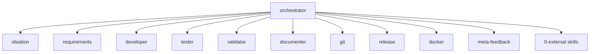

# Agent Roles

> [Back to Architecture Overview](../../ARCHITECTURE.md) &nbsp;|&nbsp; [Open in Mermaid Live Editor](https://mermaid.live/edit#base64:eyJjb2RlIjogImdyYXBoIFREXG4gICAgT1JDW29yY2hlc3RyYXRvcl1cbiAgICBPUkMgLS0-IElERVtpZGVhdGlvbl1cbiAgICBPUkMgLS0-IFJFUVtyZXF1aXJlbWVudHNdXG4gICAgT1JDIC0tPiBERVZbZGV2ZWxvcGVyXVxuICAgIE9SQyAtLT4gVFNUW3Rlc3Rlcl1cbiAgICBPUkMgLS0-IFZBTFt2YWxpZGF0b3JdXG4gICAgT1JDIC0tPiBET0NbZG9jdW1lbnRlcl1cbiAgICBPUkMgLS0-IEdJVFtnaXRdXG4gICAgT1JDIC0tPiBSRUxbcmVsZWFzZV1cbiAgICBPUkMgLS0-IERPS1tkb2NrZXJdXG4gICAgT1JDIC0tPiBNRkJbbWV0YS1mZWVkYmFja11cbiAgICBPUkMgLS0-IEVYVFswLWV4dGVybmFsIHNraWxsc10iLCAibWVybWFpZCI6IHsidGhlbWUiOiAiZGVmYXVsdCJ9fQ)

