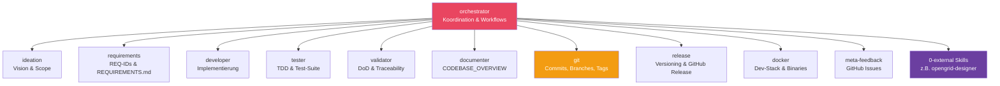

# Agent Roles & Responsibilities

> [← Back to Architecture Overview](../../ARCHITECTURE.md)

```mermaid
graph TD
    ORC["orchestrator\nKoordination & Workflows"]

    ORC --> IDE["ideation\nVision & Scope"]
    ORC --> REQ["requirements\nREQ-IDs & REQUIREMENTS.md"]
    ORC --> DEV["developer\nImplementierung"]
    ORC --> TST["tester\nTDD & Test-Suite"]
    ORC --> VAL["validator\nDoD & Traceability"]
    ORC --> DOC["documenter\nCODEBASE_OVERVIEW"]
    ORC --> GIT["git\nCommits, Branches, Tags"]
    ORC --> REL["release\nVersioning & GitHub Release"]
    ORC --> DOK["docker\nDev-Stack & Binaries"]
    ORC --> MFB["meta-feedback\nGitHub Issues"]
    ORC --> EXT["0-external Skills\nz.B. opengrid-designer"]

    style ORC fill:#e94560,color:#fff
    style GIT fill:#f39c12,color:#fff
    style EXT fill:#6b3fa0,color:#fff
```
