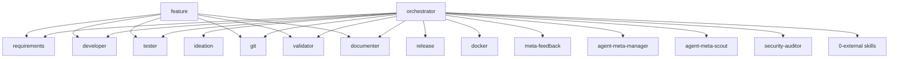

# Agent Roles

> [Back to Architecture Overview](../../ARCHITECTURE.md) &nbsp;|&nbsp; [Open in Mermaid Live Editor](https://mermaid.live/edit#base64:eyJjb2RlIjogImdyYXBoIFREXG4gICAgT1JDW29yY2hlc3RyYXRvcl1cbiAgICBGRUFbZmVhdHVyZV1cbiAgICBPUkMgLS0-IElERVtpZGVhdGlvbl1cbiAgICBPUkMgLS0-IFJFUVtyZXF1aXJlbWVudHNdXG4gICAgT1JDIC0tPiBERVZbZGV2ZWxvcGVyXVxuICAgIE9SQyAtLT4gVFNUW3Rlc3Rlcl1cbiAgICBPUkMgLS0-IFZBTFt2YWxpZGF0b3JdXG4gICAgT1JDIC0tPiBET0NbZG9jdW1lbnRlcl1cbiAgICBPUkMgLS0-IEdJVFtnaXRdXG4gICAgT1JDIC0tPiBSRUxbcmVsZWFzZV1cbiAgICBPUkMgLS0-IERPS1tkb2NrZXJdXG4gICAgT1JDIC0tPiBNRkJbbWV0YS1mZWVkYmFja11cbiAgICBPUkMgLS0-IEVYVFSWW2FnZW50LW1ldGEtbWFuYWdlcl1cbiAgICBPUkMgLS0-IEVYVFSWW2V4dGVybmFsIHNraWxsc11cbiAgICBGRUEgLS0-IEdJVFxuICAgIEZFQSAtLT4gUkVRXG4gICAgRkVBIC0tPiBUU1RcbiAgICBGRUEgLS0-IERFVlxuICAgIEZFQSAtLT4gVkFMXG4gICAgRkVBIC0tPiBET0NcbiAgICBGRUEgLS0-IEdJVCIsICJtZXJtYWlkIjogeyJ0aGVtZSI6ICJkZWZhdWx0In19)

## Rollen-Übersicht

| Agent | Zuständigkeit | Einstieg | Modell |
|-------|--------------|---------|--------|
| `orchestrator` | Einstiegspunkt — koordiniert alle anderen Agenten | Alle Entwicklungsaufgaben | *(voll)* |
| `feature` | Vollständiger Feature-Lifecycle via Sub-Agent-Delegation | "Ich will ein neues Feature bauen" | *(voll)* |
| `developer` | Feature-Implementierung und Bugfixes nach REQ-IDs | Implementierungsaufgaben | *(voll)* |
| `tester` | Tests schreiben und ausführen (TDD) | TDD Red/Green Phase | sonnet |
| `validator` | Code gegen REQs prüfen, DoD-Check | Vor Commit/PR | sonnet |
| `requirements` | Anforderungen aufnehmen, REQ-IDs vergeben | Neue Anforderungen | *(voll)* |
| `ideation` | Neue Ideen explorieren, Vision schärfen | Ideen-Phase | *(voll)* |
| `documenter` | Doku pflegen: CODEBASE_OVERVIEW, ARCHITECTURE, README | Nach Implementierung | sonnet |
| `git` | Commits, Branches, Tags, Push/Pull | Git-Operationen | haiku |
| `release` | Versioning, Changelog, Build-Artifact, GitHub Release | Release-Prozess | sonnet |
| `docker` | Docker-Stack bauen, starten, verwalten | Infrastruktur | haiku |
| `meta-feedback` | Verbesserungsvorschläge als GitHub Issues einreichen | Framework-Feedback | haiku |
| `agent-meta-manager` | agent-meta verwalten: Upgrade, Sync, Feedback, projekt-Agenten | Meta-Management | sonnet |
| `agent-meta-scout` | Claude-Ökosystem scouten: neue Skills, Rollen, Rules und Patterns | Ökosystem-Erkundung | sonnet |
| `security-auditor` | Sicherheitsanalyse: OWASP, Secrets, Dependency-Audit | Security-Reviews | sonnet |
| `0-external skills` | Domänenspezifische Agenten aus Drittrepos | Spezialwissen | variiert |

## feature vs. orchestrator

`feature` ist kein Ersatz für `orchestrator`, sondern ein **Shortcut**:

| | `orchestrator` | `feature` |
|--|----------------|-----------|
| Scope | Alle Entwicklungsaufgaben | Nur neues Feature |
| Delegation | Ad-hoc je nach Aufgabe | Fester 8-Schritt-Lifecycle |
| TDD erzwungen | Empfohlen, aber optional | Ja — fest eingebaut |
| Branch + PR | Optional | Immer |
