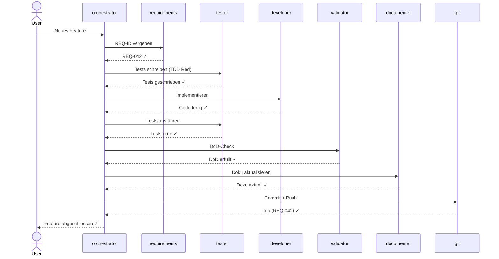

# Development Workflow (Standard Feature)

> [← Back to Architecture Overview](../../ARCHITECTURE.md)

```mermaid
sequenceDiagram
    actor User
    participant ORC as orchestrator
    participant REQ as requirements
    participant TST as tester
    participant DEV as developer
    participant VAL as validator
    participant DOC as documenter
    participant GIT as git

    User->>ORC: Neues Feature
    ORC->>REQ: REQ-ID vergeben
    REQ-->>ORC: REQ-042 ✓
    ORC->>TST: Tests schreiben (TDD Red)
    TST-->>ORC: Tests geschrieben ✓
    ORC->>DEV: Implementieren
    DEV-->>ORC: Code fertig ✓
    ORC->>TST: Tests ausführen
    TST-->>ORC: Tests grün ✓
    ORC->>VAL: DoD-Check
    VAL-->>ORC: DoD erfüllt ✓
    ORC->>DOC: Doku aktualisieren
    DOC-->>ORC: Doku aktuell ✓
    ORC->>GIT: Commit + Push
    GIT-->>ORC: feat(REQ-042) ✓
    ORC-->>User: Feature abgeschlossen ✓
```
