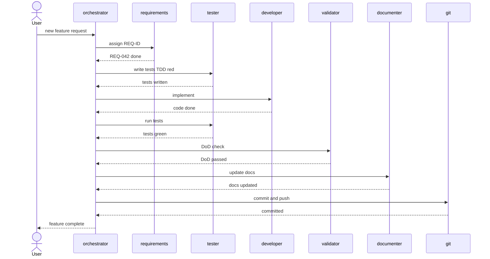

# Development Workflow

> [Back to Architecture Overview](../../ARCHITECTURE.md)

```mermaid
sequenceDiagram
    actor User
    participant ORC as orchestrator
    participant REQ as requirements
    participant TST as tester
    participant DEV as developer
    participant VAL as validator
    participant DOC as documenter
    participant GIT as git

    User->>ORC: new feature request
    ORC->>REQ: assign REQ-ID
    REQ-->>ORC: REQ-042 done
    ORC->>TST: write tests TDD red
    TST-->>ORC: tests written
    ORC->>DEV: implement
    DEV-->>ORC: code done
    ORC->>TST: run tests
    TST-->>ORC: tests green
    ORC->>VAL: DoD check
    VAL-->>ORC: DoD passed
    ORC->>DOC: update docs
    DOC-->>ORC: docs updated
    ORC->>GIT: commit and push
    GIT-->>ORC: committed
    ORC-->>User: feature complete
```
