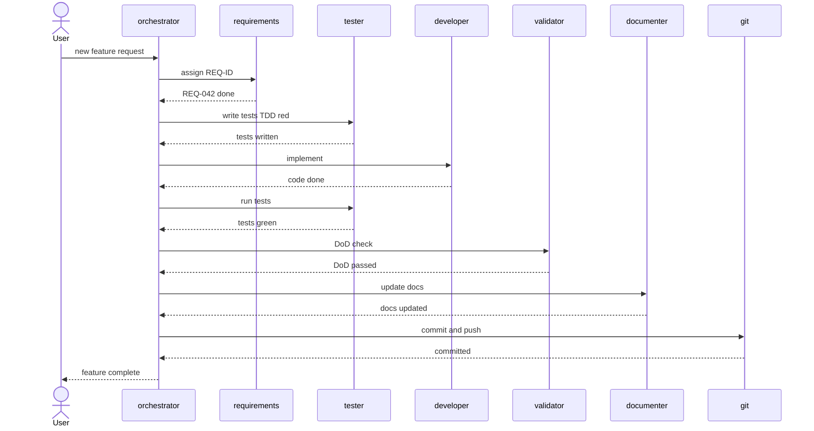

# Development Workflow

> [Back to Architecture Overview](../../ARCHITECTURE.md) &nbsp;|&nbsp; [Open in Mermaid Live Editor](https://mermaid.live/edit#base64:eyJjb2RlIjogInNlcXVlbmNlRGlhZ3JhbVxuICAgIGFjdG9yIFVzZXJcbiAgICBwYXJ0aWNpcGFudCBPUkMgYXMgb3JjaGVzdHJhdG9yXG4gICAgcGFydGljaXBhbnQgUkVRIGFzIHJlcXVpcmVtZW50c1xuICAgIHBhcnRpY2lwYW50IFRTVCBhcyB0ZXN0ZXJcbiAgICBwYXJ0aWNpcGFudCBERVYgYXMgZGV2ZWxvcGVyXG4gICAgcGFydGljaXBhbnQgVkFMIGFzIHZhbGlkYXRvclxuICAgIHBhcnRpY2lwYW50IERPQyBhcyBkb2N1bWVudGVyXG4gICAgcGFydGljaXBhbnQgR0lUIGFzIGdpdFxuICAgIFVzZXItPj5PUkM6IG5ldyBmZWF0dXJlIHJlcXVlc3RcbiAgICBPUkMtPj5SRVE6IGFzc2lnbiBSRVEtSURcbiAgICBSRVEtLT4-T1JDOiBSRVEtMDQyIGRvbmVcbiAgICBPUkMtPj5UU1Q6IHdyaXRlIHRlc3RzIFRERCByZWRcbiAgICBUU1QtLT4-T1JDOiB0ZXN0cyB3cml0dGVuXG4gICAgT1JDLT4-REVWOiBpbXBsZW1lbnRcbiAgICBERVYtLT4-T1JDOiBjb2RlIGRvbmVcbiAgICBPUkMtPj5UU1Q6IHJ1biB0ZXN0c1xuICAgIFRTVC0tPj5PUkM6IHRlc3RzIGdyZWVuXG4gICAgT1JDLT4-VkFMOiBEb0QgY2hlY2tcbiAgICBWQUwtLT4-T1JDOiBEb0QgcGFzc2VkXG4gICAgT1JDLT4-RE9DOiB1cGRhdGUgZG9jc1xuICAgIERPQy0tPj5PUkM6IGRvY3MgdXBkYXRlZFxuICAgIE9SQy0-PkdJVDogY29tbWl0IGFuZCBwdXNoXG4gICAgR0lULS0-Pk9SQzogY29tbWl0dGVkXG4gICAgT1JDLS0-PlVzZXI6IGZlYXR1cmUgY29tcGxldGUiLCAibWVybWFpZCI6IHsidGhlbWUiOiAiZGVmYXVsdCJ9fQ)

