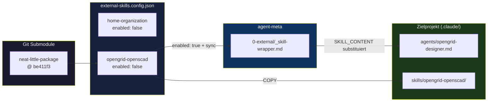

# External Skills Integration

> [← Back to Architecture Overview](../../ARCHITECTURE.md)

```mermaid
flowchart LR
    subgraph REPOS ["Git Submodule"]
        NLP["neat-little-package\n@ be411f3"]
    end

    subgraph CFG ["external-skills.config.json"]
        S1["home-organization\nenabled: false"]
        S2["opengrid-openscad\nenabled: false"]
    end

    subgraph META ["agent-meta"]
        WR["0-external/_skill-wrapper.md"]
    end

    subgraph TARGET ["Zielprojekt (.claude/)"]
        AG["agents/opengrid-designer.md"]
        SK["skills/opengrid-openscad/"]
    end

    NLP --> S2
    S2 -->|"enabled: true + sync"| WR
    WR -->|"SKILL_CONTENT substituiert"| AG
    S2 -->|"COPY"| SK

    style REPOS fill:#1a1a2e,color:#eee
    style CFG fill:#16213e,color:#eee
    style META fill:#0f3460,color:#fff
    style TARGET fill:#1a3a1a,color:#eee
```
