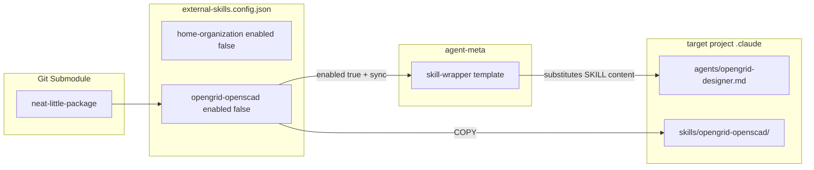

# External Skills Integration

> [Back to Architecture Overview](../../ARCHITECTURE.md) &nbsp;|&nbsp; [Open in Mermaid Live Editor](https://mermaid.live/edit#base64:eyJjb2RlIjogImZsb3djaGFydCBMUlxuICAgIHN1YmdyYXBoIHN1YiBbR2l0IFN1Ym1vZHVsZV1cbiAgICAgICAgTkxQW25lYXQtbGl0dGxlLXBhY2thZ2VdXG4gICAgZW5kXG4gICAgc3ViZ3JhcGggY2ZnIFtleHRlcm5hbC1za2lsbHMuY29uZmlnLmpzb25dXG4gICAgICAgIFMxW2hvbWUtb3JnYW5pemF0aW9uIGVuYWJsZWQgZmFsc2VdXG4gICAgICAgIFMyW29wZW5ncmlkLW9wZW5zY2FkIGVuYWJsZWQgZmFsc2VdXG4gICAgZW5kXG4gICAgc3ViZ3JhcGggbWV0YSBbYWdlbnQtbWV0YV1cbiAgICAgICAgV1Jbc2tpbGwtd3JhcHBlciB0ZW1wbGF0ZV1cbiAgICBlbmRcbiAgICBzdWJncmFwaCBvdXQgW3RhcmdldCBwcm9qZWN0IC5jbGF1ZGVdXG4gICAgICAgIEFHW2FnZW50cy9vcGVuZ3JpZC1kZXNpZ25lci5tZF1cbiAgICAgICAgU0tbc2tpbGxzL29wZW5ncmlkLW9wZW5zY2FkL11cbiAgICBlbmRcbiAgICBOTFAgLS0-IFMyXG4gICAgUzIgLS0-fGVuYWJsZWQgdHJ1ZSArIHN5bmN8IFdSXG4gICAgV1IgLS0-fHN1YnN0aXR1dGVzIFNLSUxMIGNvbnRlbnR8IEFHXG4gICAgUzIgLS0-fENPUFl8IFNLIiwgIm1lcm1haWQiOiB7InRoZW1lIjogImRlZmF1bHQifX0)

