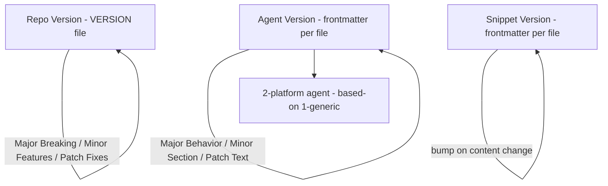

# Versioning Strategy

> [Back to Architecture Overview](../../ARCHITECTURE.md) &nbsp;|&nbsp; [Open in Mermaid Live Editor](https://mermaid.live/edit#base64:eyJjb2RlIjogImdyYXBoIFREXG4gICAgUlZbUmVwbyBWZXJzaW9uIC0gVkVSU0lPTiBmaWxlXVxuICAgIEFWW0FnZW50IFZlcnNpb24gLSBmcm9udG1hdHRlciBwZXIgZmlsZV1cbiAgICBTVltTbmlwcGV0IFZlcnNpb24gLSBmcm9udG1hdHRlciBwZXIgZmlsZV1cbiAgICBQTFsyLXBsYXRmb3JtIGFnZW50IC0gYmFzZWQtb24gMS1nZW5lcmljXVxuICAgIFJWIC0tPnxNYWpvciBCcmVha2luZyAvIE1pbm9yIEZlYXR1cmVzIC8gUGF0Y2ggRml4ZXN8IFJWXG4gICAgQVYgLS0-fE1ham9yIEJlaGF2aW9yIC8gTWlub3IgU2VjdGlvbiAvIFBhdGNoIFRleHR8IEFWXG4gICAgU1YgLS0-fGJ1bXAgb24gY29udGVudCBjaGFuZ2V8IFNWXG4gICAgQVYgLS0-IFBMIiwgIm1lcm1haWQiOiB7InRoZW1lIjogImRlZmF1bHQifX0)

