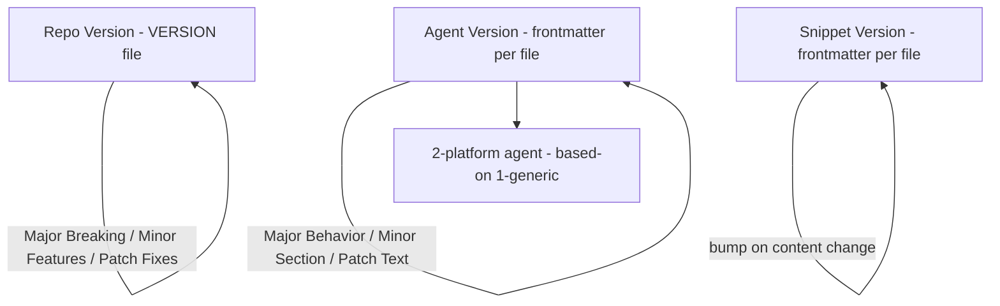

# Versioning Strategy

> [Back to Architecture Overview](../../ARCHITECTURE.md)

```mermaid
graph TD
    RV[Repo Version - VERSION file]
    AV[Agent Version - frontmatter per file]
    SV[Snippet Version - frontmatter per file]
    PL[2-platform agent - based-on 1-generic]

    RV -->|Major Breaking / Minor Features / Patch Fixes| RV
    AV -->|Major Behavior / Minor Section / Patch Text| AV
    SV -->|bump on content change| SV
    AV --> PL
```
