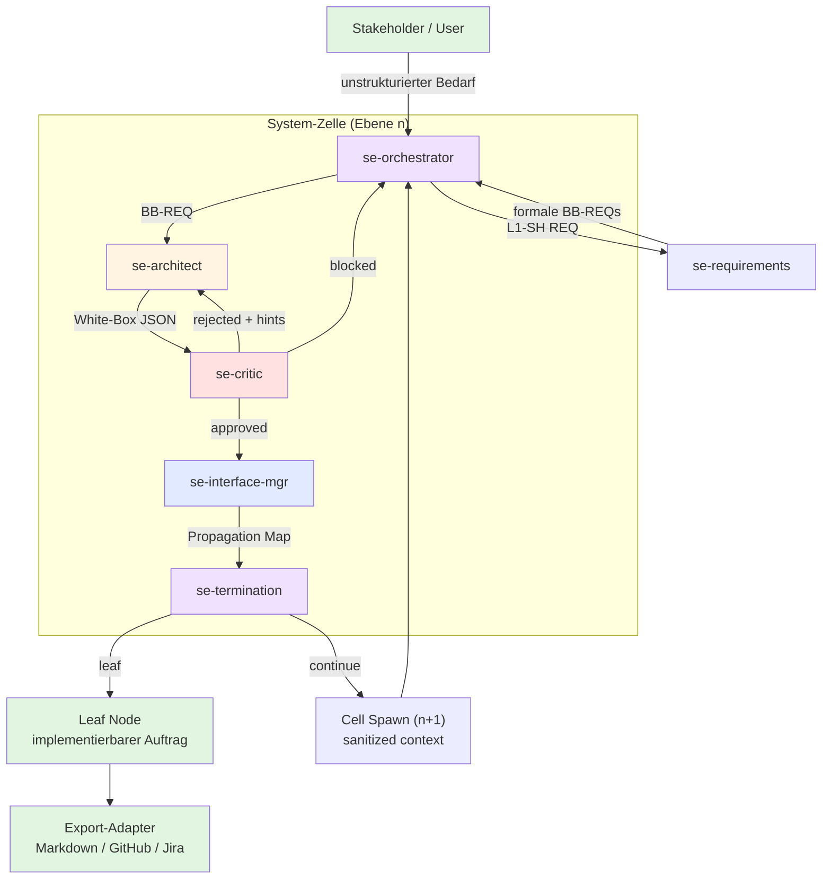
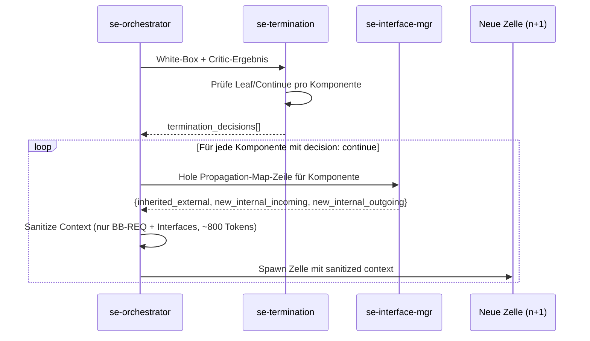
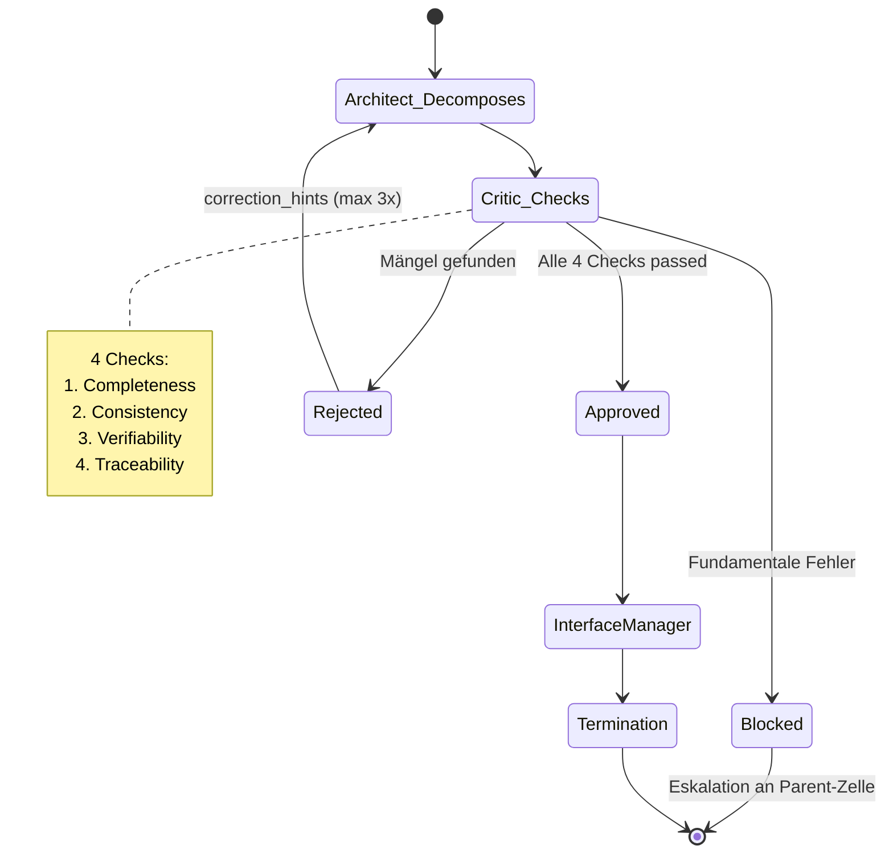

# SE-Agenten-Kaskade — Architektur-Detail

> [Back to Architecture Overview](../../ARCHITECTURE.md)

---

## Übersicht

Die SE-Agenten-Kaskade ist ein fraktales, rekursives Systems-Engineering-System das aus 6 spezialisierten Agenten besteht. Zusammen implementieren sie eine 6-stufige Black-Box → White-Box-Zerlegung nach INCOSE-Methodik.

---

## Gesamtsystem-Diagramm



---

## Agenten-Beziehungen

### Kommunikationsmatrix

| Von → Nach | Trigger | Daten |
|------------|---------|-------|
| `se-orchestrator` → `se-requirements` | Initialisierung | Stakeholder-Feature (unstrukturiert) |
| `se-orchestrator` → `se-architect` | L1/L2/L3 Phase | Parent BB-REQ + External Interfaces + Neighbor Contracts |
| `se-architect` → `se-critic` | Post-Decomposition | White-Box JSON (sub_components, internal_interfaces, rationale) |
| `se-critic` → `se-architect` | rejected | correction_hints[] |
| `se-critic` → `se-orchestrator` | blocked | Eskalation mit Fehlerbeschreibung |
| `se-critic` → `se-interface-mgr` | approved | White-Box JSON + Interface Registry |
| `se-interface-mgr` → `se-termination` | Validiert | White-Box + Propagation Map |
| `se-termination` → `se-orchestrator` | Alle Entscheidungen | termination_decisions[] + summary |
| `se-orchestrator` → neue Zelle (n+1) | decision: continue | BB-REQ + Propagation-Map-Zeile (sanitized) |

### Kontext-Grenzen

```
┌─────────────────────────────────────────────────────┐
│                   Zelle Ebene n                      │
│                                                      │
│  ┌────────────────────────────────────────────────┐  │
│  │  se-architect                                   │  │
│  │  Erhält:                                        │  │
│  │  - parent_requirement (einzelne BB-REQ)        │  │
│  │  - external_interfaces (vom Parent)            │  │
│  │  - system_domain                               │  │
│  │  - neighbor_contracts (vom IFM)                │  │
│  │  MAX ~2k Tokens                                 │  │
│  │                                                 │  │
│  │  DARF NICHT sehen:                              │  │
│  │  - Gesamte REQ-Hierarchie                       │  │
│  │  - Andere Zellen auf gleicher Ebene             │  │
│  │  - Parent White-Box Inhalt                      │  │
│  └────────────────────────────────────────────────┘  │
└─────────────────────────────────────────────────────┘
```

---

## Rekursionsmechanismus

### Zell-Spawn (n → n+1)



### Context Hygiene

| Element | Wird weitergegeben | Wird NICHT weitergegeben |
|---------|-------------------|-------------------------|
| Black-Box-REQ der Komponente | Ja | — |
| Propagation-Map-Zeile | Ja | — |
| Parent White-Box Inhalt | — | Ja (verhindert Context Drift) |
| Critic-Ergebnis der Parent-Zelle | — | Ja |
| Andere Komponenten der Parent-Zelle | — | Ja |
| Gesamte REQ-Hierarchie | — | Ja |

---

## Interface-Propagation im Detail

### Propagations-Map-Struktur

```json
{
  "COMP-001-01": {
    "inherited_external": ["230V AC power supply"],
    "new_internal_incoming": [],
    "new_internal_outgoing": ["IF-001-01"]
  },
  "COMP-001-02": {
    "inherited_external": [],
    "new_internal_incoming": [],
    "new_internal_outgoing": ["IF-001-01"]
  },
  "COMP-001-03": {
    "inherited_external": ["Cold water inlet", "Hot water outlet"],
    "new_internal_incoming": ["IF-001-02"],
    "new_internal_outgoing": []
  }
}
```

### Interface-Vererbungskette

```
Ebene 1 (System):
  Extern: [WLAN, 230V AC, Kaltwasser, Heißwasser]
  → ARCH ordnet zu: WLAN → Mainboard, 230V → Mainboard, Wasser → Behälter

Ebene 2 (Mainboard-Zelle):
  Inherited external: [WLAN, 230V AC]
  → ARCH zerlegt Mainboard in: CPU, WiFi-Chip, Power-Regler
  → IFM: WLAN → WiFi-Chip, 230V → Power-Regler

Ebene 3 (WiFi-Chip-Zelle):
  Inherited external: [WLAN]
  → ARCH: WiFi-Chip = Antenne + Baseband-Prozessor + Firmware
  → TERMINATION: Alle 3 = Leaf (COTS / atomar)
```

---

## Quality Gate — Critic-Korrekturschleife



---

## Parallelisierung

### Unabhängige Zellen auf gleicher Ebene

```
Ebene 2 (nach L1-Whitebox mit 3 Sub-Systemen):

  Zelle A (Heizelement-Steuerung)  ──┐
  Zelle B (Temperatur-Algorithmus)  ──┼─→ parallel (max_parallel_cells = 4)
  Zelle C (Wasserbehälter)          ──┘

  Jede Zelle erhält:
  - Ihre eigene BB-REQ
  - Ihre Zeile aus der Propagations-Map
  - KEIN Wissen von den anderen Zellen
```

### Synchronisationspunkt

Alle Zellen einer Ebene müssen abgeschlossen sein bevor:
1. Die Parent-Zelle als vollständig markiert wird
2. Die nächste Rekursionsebene gestartet werden kann
3. Der Export-Adapter getriggert wird

---

## Datenfluss durch das Schema

### `se-decomposition.schema.json` als gemeinsamer Vertrag

```
se-requirements   → requirements[] (req_id, statement, domain, priority, external_interfaces)
se-architect      → sub_components[], internal_interfaces[], architectural_rationale
se-critic         → critic_status {status, checks{completeness, consistency, verifiability, traceability}}
se-interface-mgr  → propagation_map {component_id: {inherited_external, new_internal_incoming/outgoing}}
se-termination    → termination_decisions[], termination_summary
```

Alle Felder sind optional außer den Top-Level Required Fields:
- `feature_id`, `stakeholder_requirement`, `l1_system`, `l2_subsystems`, `l3_components`, `cqrs_interfaces`

---

## Konfiguration und Variablen

### `.meta-config/project.yaml`

```yaml
roles:
  - se-orchestrator
  - se-requirements
  - se-architect
  - se-critic
  - se-interface-mgr
  - se-termination

variables:
  SE_MAX_DEPTH: 5              # Maximale Rekursionstiefe
  SE_MAX_CELLS: 20             # Maximale Gesamtzellen
  SE_MAX_CRITIC_ITERATIONS: 3  # Max. Critic-Korrekturschleifen
  SE_MAX_PARALLEL_CELLS: 4     # Parallele Zellen pro Ebene
```

### `config/role-defaults.yaml` (SE-Rollen)

| Rolle | Model | Memory | Tier |
|-------|-------|--------|------|
| `se-requirements` | balanced | project | optional |
| `se-architect` | powerful | project | optional |
| `se-critic` | powerful | — | optional |
| `se-interface-mgr` | balanced | project | optional |
| `se-termination` | fast | — | optional |
| `se-orchestrator` | balanced | — | optional |

---

## Export-Adapter (Zukunft)

Der SE-Workflow ist tool-agnostisch. Phase 1 exportiert nach Markdown. Geplante Adapter:

| Phase | Adapter | Ziel |
|-------|---------|------|
| 1 | Markdown (Default) | `docs/se/` |
| 2 | GitHub Issues | `gh issue create` |
| 3 | Jira MCP | Jira REST API |
| 3 | Linear MCP | Linear GraphQL API |
| 3 | ReqIF | `.reqif` Datei |

Siehe `howto/se-mcp-adapters.md` für Details.
