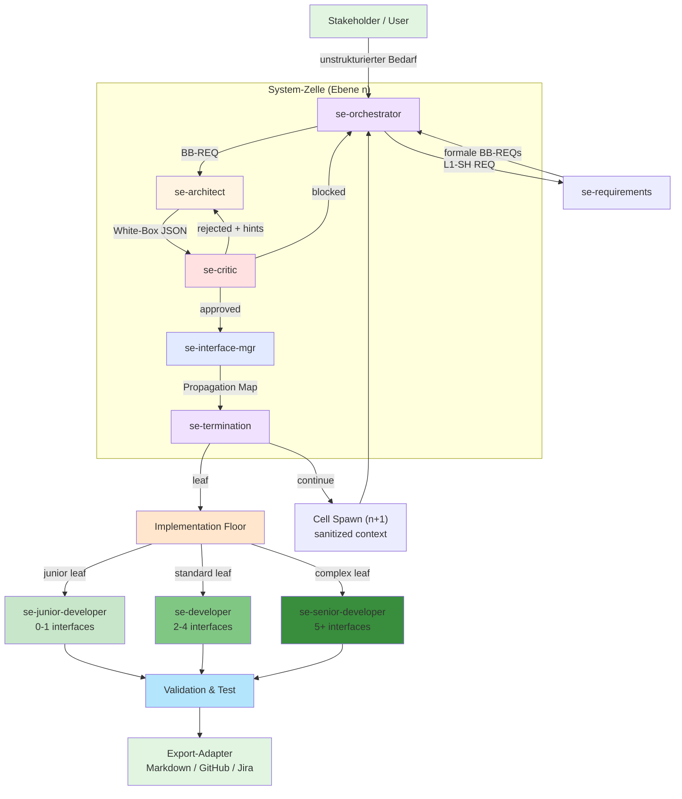
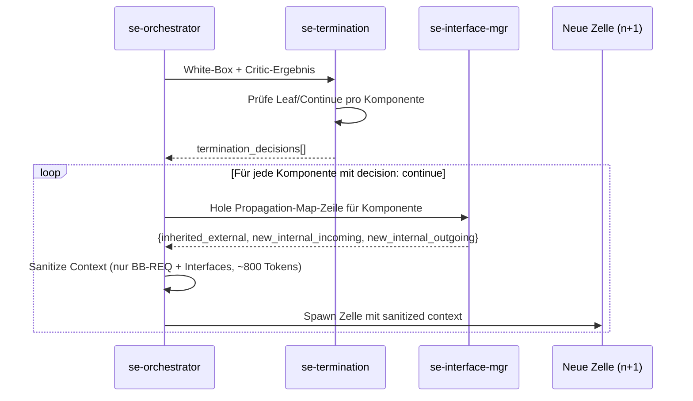
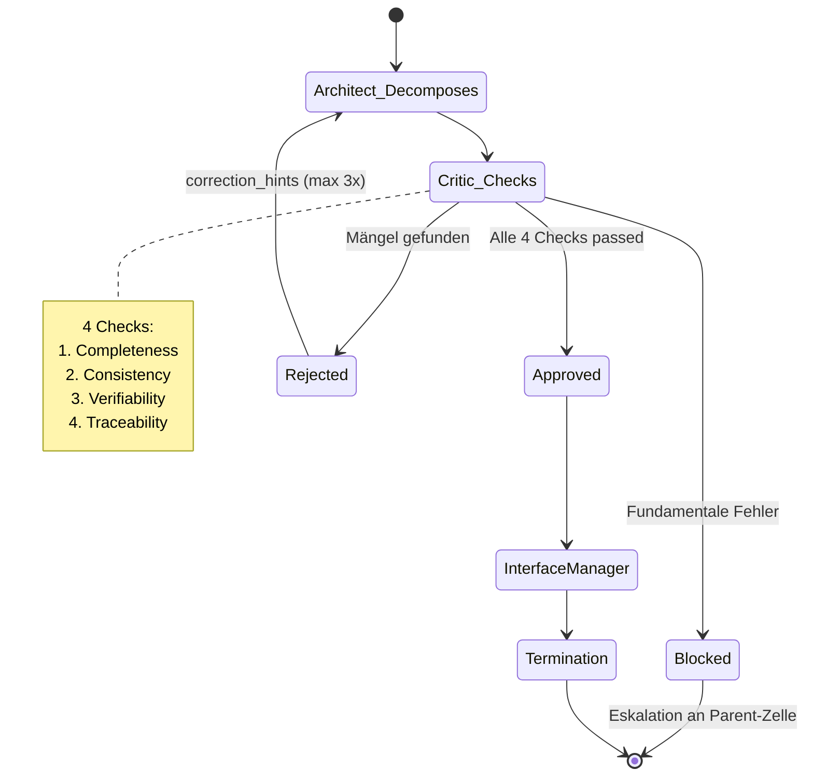
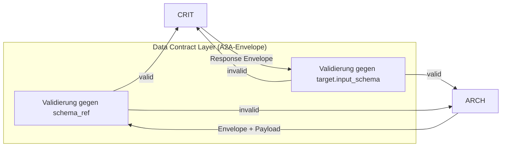

# SE-Agenten-Kaskade — Architektur-Detail

> [Back to Architecture Overview](../../ARCHITECTURE.md)

---

## Übersicht

Die SE-Agenten-Kaskade ist ein fraktales, rekursives Systems-Engineering-System mit drei Floors:
- **Decomposition Floor** — 5 aktive Agenten (`se-requirements`, `se-architect`, `se-critic`, `se-interface-mgr`, `se-termination`) implementieren die 6-stufige Black-Box → White-Box-Zerlegung nach INCOSE-Methodik.
- **Implementation Floor** — 3 SE-Developer-Tiers für Leaf-Node-Implementierung.
- **Validation Floor (V&V)** — 5 Agenten (`se-validator`, `se-verifier`, `se-test-engineer`, `se-testreviewer`, `se-integration-and-test-manager`) für die rechte V-Modell-Seite, im `se-cascade`-`validation`-Stage als `parallel_group` verdrahtet.

> **Hinweis (Deprecation):** Der frühere `se-orchestrator`-Agent ist deprecated. Die SE-Koordination läuft direkt über den Haupt-`orchestrator` im SE-Mode. Der Wrapper bleibt aus Backward-Compatibility-Gründen erhalten.

---

## Gesamtsystem-Diagramm — V-Modell mit Implementation-Boden



Das V-Modell zeigt den **horizontalen Übergang** bei Termination: Während die Decomposition (links) und Validation (rechts) abstrahieren, implementieren die 3 Developers am Boden konkrete Leaf Nodes. Sie bilden zusammen die **Implementation Floor** des V.

---

## Implementation-Phase — Die 3 Developer-Tiers

Nach Termination (`decision: leaf`) wird die Komponente an einen der **3 SE-Developer-Agenten** delegiert:

| Tier | Agent | Scope | Beispiele |
|------|-------|-------|----------|
| **Junior** | `se-junior-developer` | 0–1 Interfaces, atomare Einheiten | COTS-Wrapper, single-Interface-Validator, triviale Data-Converter |
| **Standard** | `se-developer` | 2–4 Interfaces, contained | Multi-Interface Services, Adapter (2–3 Protokolle), komplette Single-Module-Requirements |
| **Senior** | `se-senior-developer` | 5+ Interfaces, cross-cutting | Security-critical, Performance-bound, Boundary-Level, Pre-Analysis erforderlich |

**Dispatch-Regel (vom Termination-Agent):**
Basierend auf `interface_count` in `propagation_map`:
- `count == 0–1` → `se-junior-developer`
- `count == 2–4` → `se-developer`
- `count >= 5` → `se-senior-developer`

**Input pro Developer:** `task-spec-v1` mit SE Leaf-Node-Daten:
- `leaf_id`, `req_id`, `domain`, `description`, `acceptance_criteria`
- `interface_specs`: Vollständiger Interface-Katalog (vom `se-interface-mgr`)
- `propagation_map`: Welche Interfaces diese Komponente erbt/erstellt
- `context_boundary`: Modul-/Directory-Scope der Implementierung

**Output pro Developer:** `dev-result-v1` mit:
- `status`: `done | partial | escalate`
- `artifacts`: Implementierte Dateien
- `interfaces_implemented`: Welche Interfaces erfolgreich implementiert
- `test_coverage`: Test-Referenzen

---

## Interface-Kommunikationsregel (Orthogonalität)

Dies ist die **kritischste Regel** beim Übergang von Architektur zu Implementation. Sie verhindert direktes Chaos zwischen Komponenten auf der gleichen Ebene:

### Regel: Same-Level-Isolation

- **Elemente auf der GLEICHEN Decomposition-Ebene kommunizieren NICHT direkt miteinander.**
- **Alle Kommunikation läuft ÜBER das nächst höhere Element (Parent), das den Interface-Vertrag mediiert.**

### Beispiel (Ebene 2)

```
Ebene 1:
  Parent REQ-001 (Wassererhitzungssystem)
    → zerlegt in Ebene 2:

Ebene 2 (GLEICHE EBENE, dürfen NICHT direkt kommunizieren):
  - COMP-001-01: Heizelement-Steuerung (Hardware)
  - COMP-001-02: Temperatur-Regelungsalgorithmus (Software)
  - COMP-001-03: Wasserbehälter (Mechanik)

VERBOTEN: COMP-001-01 ruft direkt COMP-001-02 auf
ERLAUBT:  COMP-001-02 (SW) → interface IF-001-01 → COMP-001-01 (HW)
          (Interface wurde vom Parent / Interface Manager genehmigt)
```

### Implementierungs-Konsequenzen für Developer

Wenn ein `se-developer` eine Komponente implementiert:

1. **Lese nur deine `propagation_map`-Zeile:**
   ```json
   "COMP-001-02": {
     "inherited_external": [],
     "new_internal_incoming": [],
     "new_internal_outgoing": ["IF-001-01"]
   }
   ```

2. **Implementiere NUR die Interfaces in deiner Zeile:**
   - `inherited_external` → Pass through / implement inbound
   - `new_internal_outgoing` → Expose as code interface

3. **NICHT implementieren:**
   - Interfaces anderer Komponenten (auch wenn "logisch" wäre)
   - Direkte Calls zu Nachbar-Komponenten ohne registrierten Interface
   - Unregistrierte Interface-Änderungen

4. **Bei Bedarf anders:** Escalate zu `se-interface-mgr` / `se-architect`, kein Maverick-Change.

---

## Agenten-Beziehungen

### Kommunikationsmatrix

| Von → Nach | Trigger | Daten |
|------------|---------|-------|
| `se-orchestrator` → `se-requirements` | Initialisierung | Stakeholder-Feature (unstrukturiert) |
| `se-orchestrator` → `se-architect` | L1/L2/L3 Phase | Parent BB-REQ + External Interfaces + Neighbor Contracts |
| `se-architect` → `se-critic` | Post-Decomposition | White-Box JSON (sub_components, internal_interfaces, rationale) |
| `se-critic` → `se-architect` | rejected | correction_hints[] |
| `se-critic` → `se-orchestrator` | blocked | Eskalation mit Fehlerbeschreibung |
| `se-critic` → `se-interface-mgr` | approved | White-Box JSON + Interface Registry |
| `se-interface-mgr` → `se-termination` | Validiert | White-Box + Propagation Map |
| `se-termination` → `se-junior-developer` | decision: leaf (0–1 IF) | Leaf-Node + interface_specs + propagation_map |
| `se-termination` → `se-developer` | decision: leaf (2–4 IF) | Leaf-Node + interface_specs + propagation_map |
| `se-termination` → `se-senior-developer` | decision: leaf (5+ IF) | Leaf-Node + interface_specs + propagation_map |
| `se-junior/developer/senior-dev` → `se-interface-mgr` | Escalation | Interface change required / ambiguity |
| `se-termination` → `se-orchestrator` | Alle Entscheidungen | termination_decisions[] + summary |
| `se-orchestrator` → neue Zelle (n+1) | decision: continue | BB-REQ + Propagation-Map-Zeile (sanitized) |

### Kontext-Grenzen

```
┌─────────────────────────────────────────────────────┐
│                   Zelle Ebene n                      │
│                                                      │
│  ┌────────────────────────────────────────────────┐  │
│  │  se-architect                                   │  │
│  │  Erhält:                                        │  │
│  │  - parent_requirement (einzelne BB-REQ)        │  │
│  │  - external_interfaces (vom Parent)            │  │
│  │  - system_domain                               │  │
│  │  - neighbor_contracts (vom IFM)                │  │
│  │  MAX ~2k Tokens                                 │  │
│  │                                                 │  │
│  │  DARF NICHT sehen:                              │  │
│  │  - Gesamte REQ-Hierarchie                       │  │
│  │  - Andere Zellen auf gleicher Ebene             │  │
│  │  - Parent White-Box Inhalt                      │  │
│  └────────────────────────────────────────────────┘  │
└─────────────────────────────────────────────────────┘
```

---

## Rekursionsmechanismus

### Zell-Spawn (n → n+1)



### Context Hygiene

| Element | Wird weitergegeben | Wird NICHT weitergegeben |
|---------|-------------------|-------------------------|
| Black-Box-REQ der Komponente | Ja | — |
| Propagation-Map-Zeile | Ja | — |
| Parent White-Box Inhalt | — | Ja (verhindert Context Drift) |
| Critic-Ergebnis der Parent-Zelle | — | Ja |
| Andere Komponenten der Parent-Zelle | — | Ja |
| Gesamte REQ-Hierarchie | — | Ja |

---

## Interface-Propagation im Detail

### Propagations-Map-Struktur

```json
{
  "COMP-001-01": {
    "inherited_external": ["230V AC power supply"],
    "new_internal_incoming": [],
    "new_internal_outgoing": ["IF-001-01"]
  },
  "COMP-001-02": {
    "inherited_external": [],
    "new_internal_incoming": [],
    "new_internal_outgoing": ["IF-001-01"]
  },
  "COMP-001-03": {
    "inherited_external": ["Cold water inlet", "Hot water outlet"],
    "new_internal_incoming": ["IF-001-02"],
    "new_internal_outgoing": []
  }
}
```

### Interface-Vererbungskette

```
Ebene 1 (System):
  Extern: [WLAN, 230V AC, Kaltwasser, Heißwasser]
  → ARCH ordnet zu: WLAN → Mainboard, 230V → Mainboard, Wasser → Behälter

Ebene 2 (Mainboard-Zelle):
  Inherited external: [WLAN, 230V AC]
  → ARCH zerlegt Mainboard in: CPU, WiFi-Chip, Power-Regler
  → IFM: WLAN → WiFi-Chip, 230V → Power-Regler

Ebene 3 (WiFi-Chip-Zelle):
  Inherited external: [WLAN]
  → ARCH: WiFi-Chip = Antenne + Baseband-Prozessor + Firmware
  → TERMINATION: Alle 3 = Leaf (COTS / atomar)
```

---

## Quality Gate — Critic-Korrekturschleife



---

## Parallelisierung

### Unabhängige Zellen auf gleicher Ebene

```
Ebene 2 (nach L1-Whitebox mit 3 Sub-Systemen):

  Zelle A (Heizelement-Steuerung)  ──┐
  Zelle B (Temperatur-Algorithmus)  ──┼─→ parallel (max_parallel_cells = 4)
  Zelle C (Wasserbehälter)          ──┘

  Jede Zelle erhält:
  - Ihre eigene BB-REQ
  - Ihre Zeile aus der Propagations-Map
  - KEIN Wissen von den anderen Zellen
```

### Synchronisationspunkt

Alle Zellen einer Ebene müssen abgeschlossen sein bevor:
1. Die Parent-Zelle als vollständig markiert wird
2. Die nächste Rekursionsebene gestartet werden kann
3. Der Export-Adapter getriggert wird

---

## Datenfluss durch das Schema

### `se-decomposition.schema.json` als gemeinsamer Vertrag

```
se-requirements   → requirements[] (req_id, statement, domain, priority, external_interfaces)
se-architect      → sub_components[], internal_interfaces[], architectural_rationale
se-critic         → critic_status {status, checks{completeness, consistency, verifiability, traceability}}
se-interface-mgr  → propagation_map {component_id: {inherited_external, new_internal_incoming/outgoing}}
se-termination    → termination_decisions[], termination_summary
```

Alle Felder sind optional außer den Top-Level Required Fields:
- `feature_id`, `stakeholder_requirement`, `l1_system`, `l2_subsystems`, `l3_components`, `cqrs_interfaces`

---

## Konfiguration und Variablen

### `.meta-config/project.yaml`

```yaml
roles:
  - se-orchestrator
  - se-requirements
  - se-architect
  - se-critic
  - se-interface-mgr
  - se-termination

variables:
  SE_MAX_DEPTH: 5              # Maximale Rekursionstiefe
  SE_MAX_CELLS: 20             # Maximale Gesamtzellen (Cost-Guard)
  SE_MAX_CRITIC_ITERATIONS: 3  # Max. Critic-Korrekturschleifen
  SE_MAX_PARALLEL_CELLS: 4     # Parallele Zellen pro Ebene
  cost_limit_eur: 5.00         # Budget-Grenze (Cost-Guard, Enforcement in Phase 2)
```

### `config/role-defaults.yaml` (SE-Rollen)

| Rolle | Model | Memory | Tier | Scope |
|-------|-------|--------|------|-------|
| `se-requirements` | balanced | project | optional | Elicitation |
| `se-architect` | powerful | project | optional | Decomposition |
| `se-critic` | powerful | — | optional | Quality Gate |
| `se-interface-mgr` | balanced | project | optional | Registry |
| `se-termination` | fast | — | optional | Leaf Decision |
| `se-junior-developer` | balanced | — | optional | 0–1 Interface Leaf |
| `se-developer` | balanced | project | optional | 2–4 Interface Leaf |
| `se-senior-developer` | powerful | project | optional | 5+ Interface Leaf |
| `se-orchestrator` | balanced | — | optional (deprecated) | Wrapper — Funktionalität jetzt im Haupt-`orchestrator` (SE-Mode) |

---

---

## A2A-Handoff-Protokoll für die SE-Kaskade

> Referenz: `docs/concepts/a2a-handoff-protocol.md` (v2.0) | Schema: `schemas/a2a-handoff.schema.json` | Analyse: `docs/concepts/a2a-best-practice-analysis.md`

### A2A als EINZIGES Format

Die SE-Kaskade nutzt **ausschließlich** A2A-Envelopes für Agent-zu-Agent-Übergaben. Die existierenden SE-Schemas (`se-decomposition.schema.json`, `se-orchestrator.schema.json`) bleiben **unverändert** und werden als `payload` in den Envelope eingebettet.

**SE-Schemas laufen mit `compact_mode: false`** — die langen, lesbaren Feldnamen bleiben erhalten, da die SE-Kaskade strukturreiche Payloads mit vielen semantischen Feldnamen hat und ein Breaking Change der SE-Schemas nicht gerechtfertigt ist.

### viz-Debug als separates Konzept

Der viz-Handshake (`scripts/viz-logger.py`) trackt die **Ausführung** (Operational Layer), der A2A-Envelope trägt die **Datenverträge** (Data Contract Layer). A2A-Events werden **nur** bei `viz.debug: true` geloggt (default: `false` → Null-Token-Kosten im Produktivbetrieb).

Die lose Kopplung erfolgt ausschließlich über `trace_context.viz_task_id` im Envelope.

### Envelope-Beispiel: se-architect → se-critic

```json
{
  "protocol_version": "1.0.0",
  "handoff_id": "HOFF-20260607-025",
  "source_agent": "se-architect",
  "target_agent": "se-critic",
  "schema_ref": "schemas/se-decomposition.schema.json",
  "compact_mode": false,
  "payload": {
    "feature_id": "REQ-L1-SH-001",
    "stakeholder_requirement": "Das System soll 500ml Wasser in 120s auf 90°C erhitzen.",
    "sub_components": [
      {
        "id": "COMP-001-01",
        "name": "Heizelement-Steuerung",
        "domain": "hardware",
        "black_box_requirement": "Das Heizelement soll 500ml Wasser von 10°C auf 90°C in max. 120s erhitzen."
      }
    ],
    "internal_interfaces": [
      {
        "source_id": "COMP-001-02",
        "target_id": "COMP-001-01",
        "interface_type": "analog_signal",
        "data_payload": "PWM control signal 0-100%, 5V logic level"
      }
    ],
    "architectural_rationale": "Heizelement und Temperatursensor als separate Komponenten für Testbarkeit.",
    "decomposition_completeness": "Alle L1-Anforderungen durch Sub-Komponenten abgedeckt."
  },
  "trace_parent": "HOFF-20260607-024"
}
```

### Handoff-Routen in der SE-Kaskade

| Route | Contract | Payload-Schema | compact_mode |
|-------|----------|---------------|-------------|
| `se-orchestrator → se-requirements` | `se-req-input-v1` | `schemas/se-decomposition.schema.json` | `false` |
| `se-requirements → se-architect` | `se-req-output-v1` | `schemas/se-decomposition.schema.json` | `false` |
| `se-architect → se-critic` | `se-arch-output-v1` | `schemas/se-decomposition.schema.json` | `false` |
| `se-critic → se-architect` | `se-critic-reject-v1` | `schemas/se-decomposition.schema.json` | `false` |
| `se-critic → se-interface-mgr` | `se-critic-approve-v1` | `schemas/se-decomposition.schema.json` | `false` |
| `se-interface-mgr → se-termination` | `se-ifm-output-v1` | `schemas/se-decomposition.schema.json` | `false` |
| `se-termination → se-orchestrator` | `se-term-output-v1` | `schemas/se-decomposition.schema.json` | `false` |

**Alle 7 SE-Routen nutzen dasselbe Payload-Schema** (`se-decomposition.schema.json`) — die SE-Agenten füllen jeweils die für sie relevanten optionalen Felder (architect: `sub_components[]`, critic: `critic_status`, ifm: `propagation_map`, termination: `termination_decisions[]`).

### Supersession in der Critic-Korrekturschleife

Der Critic-Zyklus (architect → critic → architect → ...) nutzt Supersession mit vollständiger `history[]`:

```
HOFF-020: se-architect → se-critic  (v1, initial)
  → critic rejected: "missing traceability for COMP-001-03"

HOFF-021: se-architect → se-critic  (v2, supersedes: HOFF-020, history: [HOFF-020])
  → critic rejected: "interface type mismatch"

HOFF-022: se-architect → se-critic  (v3, supersedes: HOFF-021, history: [HOFF-020, HOFF-021])
  → critic approved ✓

HOFF-023: se-critic → se-interface-mgr
  (supersession: { version: 3, supersedes: "HOFF-022", history: ["HOFF-020","HOFF-021","HOFF-022"] })
```

Der `se-interface-mgr` erhält die vollständige Revisionshistorie via `history[]`-Array und kann jede Iteration nachvollziehen.

### Abbruchbedingung (MAX_CRITIC_ITERATIONS)

Wenn `MAX_CRITIC_ITERATIONS` (default: 3) erreicht ist → `critic_status.status: "blocked"` → Eskalation an `se-orchestrator` mit `supersession.history[]` + Begründung. Kein weiterer Handoff — der `se-orchestrator` entscheidet über Eskalation oder Abbruch.

### Validierungsgrenzen

Jeder Handoff wird **vor** dem Delegieren gegen das Ziel-Schema validiert. Fehlschläge brechen den Handoff ab:



**Regel:** Kein "lost in translation" — invalide Handoffs werden sofort abgewiesen, bevor der downstream-Agent startet.

### A2A + viz-Handshake — parallele Tracking-Ebenen

```
se-orchestrator → viz: delegate_out(target=se-architect, task_id=uuid-X)
                 → A2A: handoff_id=HOFF-X, viz_task_id=uuid-X (lose Kopplung)

se-architect    → viz: agent_start(caller=se-orchestrator, task_id=uuid-X)
                 → A2A: parst Envelope, validiert Payload
                 → A2A: handoff_delivered(handoff_id=HOFF-X)

se-architect    → viz: agent_end(status=success)
```

**Nur bei `viz.debug: true`** werden zusätzliche A2A-Events geloggt (`a2a_handoff_start`, `a2a_handoff_validated`, `a2a_handoff_delivered`, `a2a_handoff_failed`).

---

## Export-Adapter (Zukunft)

Der SE-Workflow ist tool-agnostisch. Phase 1 exportiert nach Markdown. Geplante Adapter:

| Phase | Adapter | Ziel |
|-------|---------|------|
| 1 | Markdown (Default) | `docs/se/` |
| 2 | GitHub Issues | `gh issue create` |
| 3 | Jira MCP | Jira REST API |
| 3 | Linear MCP | Linear GraphQL API |
| 3 | ReqIF | `.reqif` Datei |

Siehe `howto/se-mcp-adapters.md` für Details.
