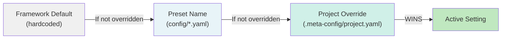

# Preset System

> [Back to Architecture Overview](../../ARCHITECTURE.md)

## Overview

The agent-meta framework includes **four independent preset + override systems** that follow a consistent precedence pattern. Each system allows projects to choose from curated presets, then optionally override specific settings.

**Core Pattern:**
```
Framework Default < Named Preset < Project-Specific Override
```

## Precedence Flowchart



## Four Preset Systems

| System | Config File | Presets | Example |
|--------|-------------|---------|---------|
| **DoD Presets** | `config/dod-presets.yaml` | full, standard, rapid-prototyping, spec-optional, spec-driven, spec-certified | Enables/disables REQ-traceability, tests, security audits, SE mode |
| **Tier Presets** | `config/tier-presets.yaml` | cheap, normal, advanced, expensive, expensive-as-hell | Maps agent roles to model tiers (claude-haiku vs claude-opus) |
| **Rules Presets** | `config/rules-presets.yaml` | lazy, strict, minimal, custom | Controls which rules are auto-loaded into agent contexts |
| **Conventions Presets** | `config/conventions-presets.yaml` | default, strict-python, gamedev, minimal | Enforces naming, commit style, code organization conventions |

## Setting a Preset

In `.meta-config/project.yaml`:

```yaml
# Choose a preset
dod-preset: rapid-prototyping
tier-preset: Normal
rules-preset: lazy
conventions-preset: default

# Override a specific setting (wins over preset)
dod:
  req-traceability: true          # This overrides the preset
  tests: false                     # This overrides the preset
```

Via CLI or Admin UI:
```bash
python scripts/sync.py --set-preset dod-preset=full
/set-preset dod-preset=full
```

## Use Case: Rapid Prototyping vs. Production

### Scenario 1: Rapid Prototyping
```yaml
dod-preset: rapid-prototyping
tier-preset: cheap
rules-preset: minimal
```
→ No REQ tracking, no tests, fast cheap models, minimal rules.

### Scenario 2: Production with Full Auditing
```yaml
dod-preset: spec-certified
tier-preset: expensive
rules-preset: strict
conventions-preset: strict-python
```
→ Full REQ traceability, mandatory tests, security audits, powerful models, strict code conventions.

### Scenario 3: Mid-Project Upgrade
```yaml
dod-preset: rapid-prototyping     # Start here
# ... later, as project matures ...
dod-preset: standard              # Upgrade preset
dod:
  req-traceability: true           # + selective override
```

## Implementing a New Preset

1. Add entry to the relevant `config/*-presets.yaml`:
   ```yaml
   my-preset:
     req-traceability: true
     tests: true
     security-audit: false
   ```

2. Reference in `.meta-config/project.yaml`:
   ```yaml
   dod-preset: my-preset
   ```

3. Run `sync.py` to propagate to all agents.

---

> [Back to Architecture Overview](../../ARCHITECTURE.md)
