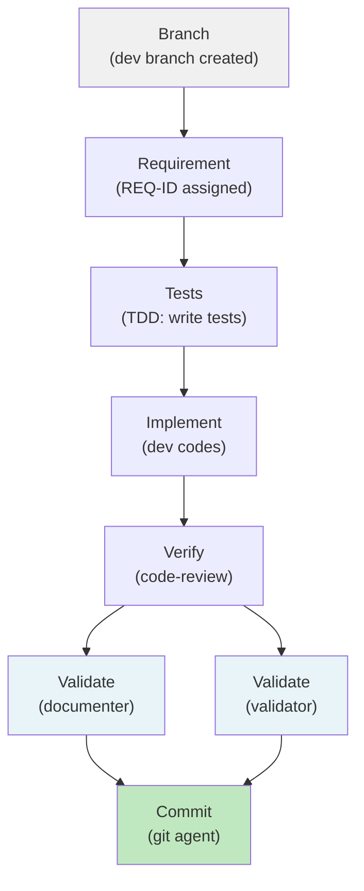

# Quality Pipelines

> [Back to Architecture Overview](../../ARCHITECTURE.md)

## Overview

Quality Pipelines define the orchestration flow for different types of work. Each pipeline specifies stages, agents, and gates to ensure consistent quality throughout the development lifecycle.

**Pipelines are pre-defined workflows** — the orchestrator routes each task into the matching pipeline based on intent keywords (detected in your request).

## Typical Feature Lifecycle

The `feature-lifecycle` pipeline is the most comprehensive:



## All Pipelines (7 total)

| Pipeline | Stages | Flow | Use Case |
|----------|--------|------|----------|
| **feature-lifecycle** | 7 stages | Branch → REQ → Tests → Implement → Verify → Validate (parallel) → Commit | Full feature with optional plan input, TDD, review, PR |
| **quick-fix** | 2 stages | Fix → Commit | Urgent hotfix, minimal review |
| **bugfix** | 4 stages | Triage → Fix → Review (2x) → Document | Bug with double code review + docs update |
| **concept-development** | 3 stages | Research → Concept-Loop (3x ideation/review) → Handoff | Idea refinement, vision sharpening |
| **refactor** | 4 stages | Analyze → Implement → Review (2x) → Commit | Large-scale refactor with senior review |
| **docs-update** | 2 stages | Update → Commit | Documentation-only changes |
| **se-cascade** | 11 stages | L0 stakeholder → L1-L3 requirements/architecture → Decompose → Implement → Validate | Full Systems Engineering V-model (optional) |

## Triggering a Pipeline

Pipelines are triggered automatically by **intent keywords** in your request:

```
"Implement feature X"        → feature-lifecycle
"Quick fix for bug Y"        → quick-fix
"Large refactor of module Z" → refactor
"Update README"              → docs-update
```

Or explicitly via slash command:
```
/pipeline feature-lifecycle "Your task description"
/pipeline bugfix "Bug report description"
```

## Reflection Pairs (Review Loops)

Within pipelines, **Reflection Pairs** enable iterative improvement:

| Pair | Generator | Critic | Max Iterations |
|------|-----------|--------|---|
| **dev-review-loop** | developer | code-reviewer | 3 |
| **se-requirements-loop** | se-requirements | se-critic | 3 |
| **se-architect-loop** | se-architect | se-critic | 3 |
| **se-test-loop** | se-test-engineer | se-testreviewer | 3 |
| **se-dev-review-loop** | se-developer | code-reviewer | 3 |

Each loop runs until either:
- Critic approves (accepts result)
- Max iterations reached (escalate or continue)
- User stops the loop

## DoD Gates

Each pipeline stage includes a **Definition of Done (DoD)** gate. What passes depends on the active DoD preset:

- **rapid-prototyping** → minimal checks (speed)
- **standard** → balanced checks
- **spec-certified** → comprehensive checks (security audit, coverage, etc.)

Configuration: `config/dod-presets.yaml` → override in `.meta-config/project.yaml`

---

> [Back to Architecture Overview](../../ARCHITECTURE.md)
