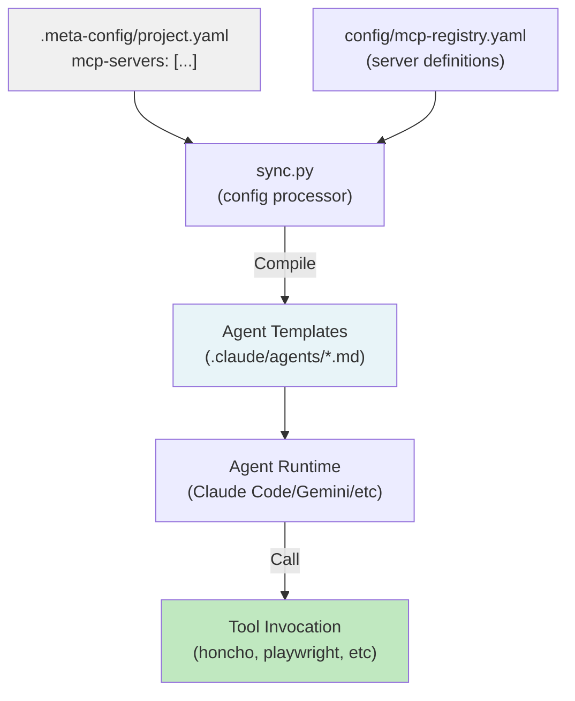
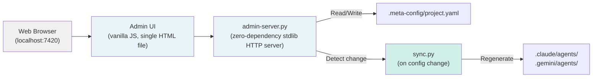

# MCP Servers & Admin UI

> [Back to Architecture Overview](../../ARCHITECTURE.md)

## Model Context Protocol (MCP) Servers

MCP servers extend agent capabilities by exposing external tools, APIs, and services. agent-meta supports **7 MCP servers** with automatic configuration and runtime safety.

### MCP Activation Flow



### Supported MCP Servers (7 total)

| Server | Transport | Tools | Status | Use Case |
|--------|-----------|-------|--------|----------|
| **home-assistant** | SSE | GetLiveContext, GetDateTime, todo_get_items | Read-only | Smart home automation, context injection |
| **honcho** | SSE | save_memory, recall_memory, forget_memory, list_memories | Persistent | Cross-session memory, user preferences |
| **playwright** | stdio | browser_start, browser_navigate, screenshot, filled_form, accessibility_audit | Full | E2E testing, visual validation, a11y checks |
| **reqogniloom** | SSE | create_requirement, get_requirements, link_requirement, audit | Full | Requirements management, traceability |
| **viz-logger** | stdio | log_viz_event | Write-only | Agent event logging for dashboard |
| **a2a-handoff** | stdio | validate_handoff, resolve_handoff | Validation | A2A protocol schema checks |
| **influxdb** | stdio | query_flux, write_point (write blocked) | Read-only | Time-series analytics, metrics |

### Enabling an MCP Server

In `.meta-config/project.yaml`:

```yaml
mcp-servers:
  - honcho              # Persistent memory
  - playwright          # E2E browser testing
  - reqogniloom         # Requirements platform
```

Or via slash command:
```
/add-mcp-server honcho
```

Then run:
```bash
python scripts/sync.py
```

This updates `.meta-config/project.yaml` and regenerates all agent files with the new MCP configuration.

---

## Admin UI

Web-based control panel for live project configuration and visualization.

**Start:**
```bash
python scripts/sync.py --admin
# or
/admin
```

Default URL: `http://localhost:7420`

### Key Features



### Admin UI Controls

| Control | Purpose | Effect |
|---------|---------|--------|
| **Orchestrator Mode Selector** | Switch between strict/advisory/main-chat | Writes to `.meta-config/project.yaml` → orchestrator.mode |
| **DoD Preset Selector** | Change quality gates | Writes dod-preset → affects all pipeline gates |
| **MCP Server Dashboard** | View active MCP servers, add/remove | Modifies mcp-servers list, triggers sync |
| **Agent Visualization** | Interactive agent dependency graph | Read-only, renders from role-defaults.yaml |
| **Tier Preset Selector** | Choose model tier (cheap/normal/advanced/expensive) | Changes tier-preset → affects model assignment |
| **Rules Preset Selector** | Control rule loading (lazy/strict/minimal) | Affects .claude/rules/ auto-load |

### Config Propagation

When you change a setting in Admin UI:

1. Value written to `.meta-config/project.yaml`
2. `sync-on-config-change.sh` hook detects change
3. `sync.py` re-runs automatically
4. All agent files regenerated with new config
5. UI refreshes to show new state

No manual sync required — changes are live.

### Viz Dashboard (Optional)

If `viz.mode: dynamic` or `viz.mode: full` in `.meta-config/project.yaml`, the Admin UI includes a **live dashboard** showing:

- Agent execution timeline
- Task flow visualization
- Event log (start/delegate/end)
- Performance metrics

Configuration: `config/generated/viz-events.jsonl`

---

> [Back to Architecture Overview](../../ARCHITECTURE.md)
