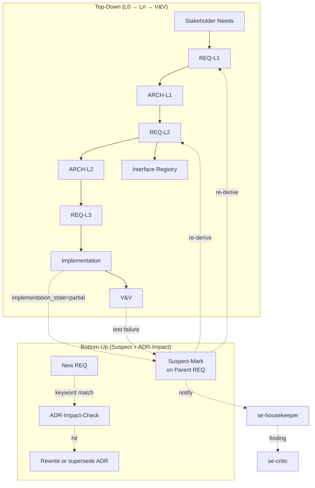
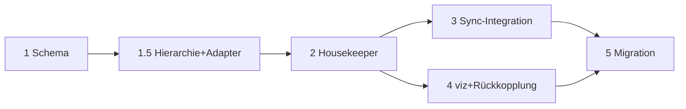

# Konzept: SE-Kaskaden-Standardisierung — Issue #339

> Status: **Konzept-Entwurf v1.2** | Datum: 2026-06-28
> Revision: 2026-06-28 (Review-Iteration 2: 2 Minor gefixt — final)
> Erweitert: [`se-agent-concept.md`](./se-agent-concept.md), [`se-pipeline-extension.md`](./se-pipeline-extension.md)
> Referenziert: [`docs/architecture/07-se-cascade.md`](../architecture/07-se-cascade.md), [`agents/1-generic/se-*.md`](../../agents/1-generic/)
> Issue: **#339** (6 Befunde: B1–B6)
> DoD-Preset: **spec-driven** (relevant für `se-required: recommended`)

---

## 1. Executive Summary

Das SE-Framework (14 Agenten, V-Modell, fraktale Decomposition) hat in der praktischen Nutzung sechs strukturelle Befunde gezeigt: fehlende ADR-Standards (B1), uneinheitliche REQ-Frontmatter (B2), ungetaxonomierte Strategie-Dokumente (B3), verletzte L2-Trennregel (B4), fehlender Review-Lifecycle (B5) und fehlende Bottom-Up-Rückkopplung (B6). Dieses Konzept standardisiert die SE-Dokumenten-Taxonomie, führt eine verbindliche YAML-Frontmatter-Sprache für REQ/ADR/Review ein, ergänzt einen neuen `se-housekeeper`-Agenten für kontinuierliche Compliance-Prüfung und schließt die Kaskade bidirektional. Zielgruppe: SE-Operatoren in Projekten mit `SE_ENABLED: true`. Auslieferung in 6 Phasen (Phase 1.5 neu für Verzeichnisstruktur + Adapter-Refactoring), Aufwand gesamt **L** (groß), Start **Phase 1** sofort nach Konzept-Approval.

---

## 2. Auslöser & Ist-Zustand

**Auslöser:** Issue #339 dokumentiert 6 Befunde aus realen SE-Projekten (`se-pipeline-extension.md` zeigt ähnliche Symptome: fehlende Persistenz, Rollenverstoß).

**Reifegrad heute:**

| Bereich | Status | Lücke |
|---------|--------|-------|
| 14 SE-Agenten | ✅ vorhanden | Aber: keine einheitliche Doku-Taxonomie |
| `SE_ENABLED`-Mechanismus | ✅ implementiert (`config.py:368`) | Conditional-Injection-Pattern etabliert |
| `{{#if SE_ENABLED}}`-Blöcke | ✅ aktiv | Aktuell nur in `orchestrator.md:128`, `se-orchestrator.md:4,7` |
| `strip_inactive_conditional_blocks()` | ✅ implementiert (`config.py:467+`) | Zero-Overhead bereits möglich |
| 5 SE-Schemas | ✅ vorhanden | Aber: keine `se-requirements.schema.json` für neues Frontmatter-Schema |
| A2A-Envelope | ✅ unterstützt Supersession, trace_context | Review-Iteration-Tokens fehlen |
| `docs/se/**`-Template | ❌ **fehlt komplett** | Framework generiert keine SE-Output-Struktur |
| `se-housekeeper` | ❌ **fehlt** | Keine Compliance-Prüfung |
| Bottom-Up-Rückkopplung | ❌ **fehlt** | Kaskade ist L0→V&V单向 |
| Admin-UI | ❌ **nicht im Repo** | Nur Konzept-Skizze in [`planned/admin-ui-concept.md`](./planned/admin-ui-concept.md) |

---

## 3. Soll-Zustand pro Befund

### B1 — ADR-Standard (HOCH)

**Ist:** ADRs werden ad-hoc unter `docs/se/ADR/` abgelegt, ohne einheitliche Struktur.
**Soll:** Verbindlicher MADR-Minimal-Standard mit YAML-Frontmatter und Lifecycle-Status.

**Umsetzung:**

- Verzeichnis: `docs/se/ADR/ADR-NNN_kurztitel.md` (NNN = 3-stellig, monoton steigend)
- Frontmatter-Felder: `status: proposed|review|accepted|deprecated|superseded`, `date`, `deciders: []`, `affected_reqs: []` (REQ-IDs), `superseded_by: ADR-NNN` (optional)
- Body-Felder (H2-Sektionen): `## Kontext`, `## Alternativen`, `## Entscheidung`, `## Konsequenzen`
- Lifecycle: `proposed` → Auto-Review-Trigger → `accepted` | `deprecated` | `superseded` (Referenz auf neue ADR)
- **Akzeptanzkriterium:** `se-housekeeper` meldet 0% nicht-konforme ADRs in einem Audit (gemessen über `docs/se/ADR/**/*.md`).

### B2 — REQ-Frontmatter-Schema (HOCH)

**Ist:** `Implementation State`, `Review Findings`, `Test Status`, `Remarks` als Freitext mit uneinheitlichen Werten.
**Soll:** Offizielles YAML-Frontmatter-Schema mit Enums.

**Umsetzung:**

```yaml
implementation_state: not_implemented | partially_implemented | implemented
test_status:          missing | partial | covered
review_state:         open | reviewed | approved
open_adrs:            []                # Liste von ADR-IDs, die diese REQ betreffen
last_reviewed:        2026-06-28        # ISO-8601
reviewer:             se-critic | se-housekeeper | <agent-name>
review_iteration:     0                 # monoton steigend
```

- **Akzeptanzkriterium:** `se-requirements.schema.json` validiert 100% der REQ-Frontmatter im Projekt; Freitext-Felder sind in `additionalProperties: false` blockiert.

### B3 — SE-Doku-Taxonomie (MITTEL)

**Ist:** Versionen im Dateinamen (`_v6`), keine einheitliche Struktur.
**Soll:** Verbindliche 8-Verzeichnis-Taxonomie + YAML-Frontmatter-Pflicht für alle SE-Dokumente + verschachtelte Hierarchie.

**Taxonomie** (siehe Sektion 7 — Verzeichnisstruktur (verschachtelt)):
- 8 flache/gemischte Verzeichnisse (`L0/`, `L1/`, `L2/`, `L3/`, `ADR/`, `VV/`, `reviews/`, `traceability/`)
- **Verschachtelt** unter `L1/`, `L2/`, `Components/`: System-/Component-Ordner mit Postfix-Konvention (`AuthServiceSystem`, `TokenValidatorComponent`)
- Frontmatter-Pflicht: `type: ADR|REQ|REVIEW|TRACE|STRATEGY|VV-DOC`, `scope: project|<subscope>`, `status`, `date`, `author_agent`
- Versionskontrolle via Git, **nie** via Dateinamen-Suffix — das **Verbot von `_v6`-Suffixen** im Dateinamen ist hart: `VV_Strategy_new_needs_v6.md` ist exakt die #339-Sünde (POC-Referenz in Sektion 15)
- **Postfix-Konvention:** System-Ordner IMMER auf `System` endend (z.B. `AuthServiceSystem`), Component-Ordner IMMER auf `Component` (z.B. `TokenValidatorComponent`). Ermöglicht eindeutige Zell-Identifikation ohne explizite Tag-Ebene.
- **Akzeptanzkriterium:** `se-housekeeper` Block 1 ("Dateinamen-Standard") prüft `^docs/se/(L0|L1|L2|L3|ADR|VV|reviews|traceability)/[A-Z]+-\d+_.+\.md$` — 0% Abweichung.

### B4 — L2-Trennregel (HOCH)

**Ist:** Architektur-Decomposition, Review-Befunde, Traceability-Matrizen inline in REQ-Dateien.
**Soll:** REQ-Dateien enthalten NUR Anforderungen. Alles andere in dedizierte Dateien.

**Umsetzung:**

- REQ-Datei: max. 1 H1 (Titel), 1 H2 "Beschreibung", N×H2 "Akzeptanzkriterien", YAML-Frontmatter.
- Architektur → `docs/se/L<n>/ARCH-L<n>_<subscope>.md` mit YAML-Frontmatter `type: ARCH`.
- Review-Befunde → `docs/se/reviews/REVIEW_<YYYY-MM-DD>_<scope>.md`.
- Traceability → `docs/se/traceability/TRACE_<scope>.md` mit `kind: derives|satisfies|verifies|implements`.

**Verzeichnis-basierte Trennung (siehe Sektion 7 — Verzeichnisstruktur):**

| Artefakt | Ablageort | Erlaubt in REQ-Datei? |
|----------|-----------|----------------------|
| Architecture | `L{N}_*_Architecture.md` innerhalb des Zellen-Ordners | ❌ — nie inline |
| Implementation | `implementation/`-Subfolder innerhalb der Zelle | ❌ |
| Review-Protokolle | `docs/se/reviews/` (flach) | ❌ |
| Traceability-Matrizen | `docs/se/traceability/` (flach) | ❌ |
| V&V-Dokumente | `docs/se/VV/` (flach) | ❌ |
| ADRs | `docs/se/ADR/ADR-NNN_kurztitel.md` | ❌ — nur `open_adrs`-Referenz im Frontmatter |

- **Akzeptanzkriterium:** `se-housekeeper` Block 2 ("L2-Trennregel") findet 0 REQ-Dateien mit Sections, die nicht "Beschreibung" oder "Akzeptanzkriterien" sind.

### B5 — Review-Lifecycle (MITTEL)

**Ist:** Reviews ohne Protokoll, ohne Iterationsnummer, ohne formalen Status.
**Soll:** 4-Phasen-Lifecycle mit Review-IDs und referenzierten Befunden.

**Lifecycle:**

```
Open ──► Review (Iteration N) ──► Response ──► Closed
            │                                  ▲
            └─► Iteration N+1 (Re-Review) ─────┘
```

- Review-IDs: `RVW-YYYY-MM-DD-NNN` (NNN = 3-stellig)
- `review_iteration` in REQ-Frontmatter (B2) wird mit jeder Iteration inkrementiert
- Befunde referenzieren REQ-IDs, sind NICHT inline in REQ-Dateien (siehe B4)
- **Akzeptanzkriterium:** Jede `review_state: reviewed` REQ hat genau eine korrespondierende Datei in `docs/se/reviews/`.

### B6 — Bottom-Up-Rückkopplung (MITTEL)

**Ist:** Kaskade läuft nur L0→L1→L2→V&V. Implementierungs-Befunde fließen nicht zurück.
**Soll:** Bidirektionale Kaskade mit Suspect-Mark und ADR-Impact-Prüfung.

**Rückkopplungs-Pfade:**



- **Suspect-Mark:** `se-critic` setzt `review_state: open` + `remarks: SUSPECT_PARENT: REQ-L1-007` auf alle REQs, die eine abhängige REQ betreffen.
- **ADR-Impact-Prüfung:** Beim Erstellen einer neuen REQ durchsucht `se-requirements` den Text nach ADR-Keywords (z.B. "database choice", "deployment topology") und listet betroffene ADRs in `open_adrs: []`.
- **Akzeptanzkriterium:** Mindestens 1 Beispielprojekt durchläuft beide Pfade ohne Verlust von Befunden (gemessen via `trace_context.viz_task_id`).

---

## 4. SE-Mode-Conditional Injection (Anforderung A)

**Prinzip:** ALLE SE-spezifischen Templates, Rules, Frontmatter-Blöcke und Agenten werden NUR dann in den generierten Output geschrieben, wenn `SE_ENABLED: true` in `project.yaml`. Bei `false` → **Zero-Overhead**.

**Technische Durchsetzung (4 Ebenen):**

| Ebene | Mechanismus | Datei | Status |
|-------|-------------|-------|--------|
| 1. Variablen-Resolution | `SE_ENABLED` wird in `config.py:368` gesetzt | `scripts/lib/config.py` | ✅ existiert |
| 2. Conditional-Blöcke | `{{#if SE_ENABLED}}…{{/if}}` in Templates | `agents/1-generic/*.md` | ⚠️ nur 2 Dateien nutzen es |
| 3. Block-Stripping | `strip_inactive_conditional_blocks()` entfernt inaktive Blöcke zur Build-Zeit | `scripts/lib/config.py:467+` | ✅ existiert |
| 4. Rollen-Whitelist | `delegation_table.py:75` filtert SE-Rollen aus `AGENT_DELEGATION_TABLE` wenn `SE_ENABLED=false` | `scripts/lib/delegation_table.py` | ✅ existiert |

**Erweiterung für dieses Konzept:**

- **Neue Whitelist-Konstante:** `SE_PLACEHOLDER_VARS = {"SE_ENABLED", "SE_BASE_DIR", "SE_MIN_DEPTH", …}` in `scripts/lib/placeholders.py:61` ergänzen (siehe dort).
- **Neue Templates in `{{#if SE_ENABLED}}…{{/if}}` einwickeln:** Alle neuen `agents/1-generic/se-housekeeper.md` (B-Sektion), alle SE-spezifischen Frontmatter-Schemata, alle `docs/se/**`-Pfade in `howto/`-Dateien.
- **Verifikation:** Automatischer Test in `tests/test_sync_conditional.py` (neu) prüft für `SE_ENABLED=false`: (a) keine `se-*-Agent` in `.opencode/agents/`, (b) keine `{{#if SE_ENABLED}}`-Marker im Output, (c) keine `docs/se/**`-Verweise in generierten Provider-Configs. Test-Aufbau: `pytest` + `tmp_path` ruft `sync.py --dry-run` zweimal auf (mit/ohne `SE_ENABLED`), vergleicht `.opencode/agents/` Byte-für-Byte und failt bei Differenz.

**Akzeptanzkriterium:** Sync mit `SE_ENABLED=false` produziert byte-identischen Output zur Variante **vor** diesem Konzept (gemessen via `git diff` auf `.opencode/`).

---

## 5. `se-housekeeper`-Agent (Anforderung B)

**Rolle:** Read-only Compliance-Prüfer für SE-Artefakte. Findet Verstöße, fixt **nicht** automatisch. Eskaliert an Critic/Reviewer.

**Frontmatter-Entwurf** (wird in Phase 2 in `agents/1-generic/se-housekeeper.md` angelegt):

```yaml
---
name: se-housekeeper
version: 1.0.0
description: "Read-only SE-Compliance-Pruefer: REQ-Frontmatter, L2-Trennregel, ADR-Verlinkung, Review-Protokoll, Dateinamen-Standard"
hint: "Verwende diesen Agenten fuer regelmaessige SE-Artefakt-Audits"
workflow_tier: optional
se_only: true
tools: [Read, Glob, Grep, Bash]
---
```

**5 Befund-Blöcke:**

| Block | Prüft | Quelle | Eskalation |
|-------|-------|--------|------------|
| **HK-1 Dateinamen-Standard** | Regex `^docs/se/(L0\|L1\|L2\|L3\|ADR\|VV\|reviews\|traceability)/[A-Z]+-\d+_.+\.md$` | `glob docs/se/**` | `se-requirements` (Umbenennung) |
| **HK-2 L2-Trennregel** | REQ-Dateien enthalten nur `Beschreibung` + `Akzeptanzkriterien` als H2 | `grep` H2-Header in `docs/se/**/REQ-*.md` | `se-critic` (Inhalt extrahieren) |
| **HK-3 ADR-Verlinkung** | Jede REQ mit architektur-relevanter Aussage hat ≥1 Eintrag in `open_adrs` | `grep "arch_impact: true"` vs. Frontmatter-Parse | `se-architect` (ADR erstellen) |
| **HK-4 Review-Protokoll** | Jede `review_state: reviewed` REQ hat korrespondierende Datei in `docs/se/reviews/RVW_*.md` | Cross-Reference | `se-critic` (Review nachholen) |
| **HK-5 Frontmatter-Schema** | YAML-Validierung gegen `se-requirements.schema.json` | `jsonschema` Validate | `se-requirements` (Frontmatter korrigieren) |

**Trigger:**

- **Manuell:** `se-housekeeper` direkt vom Orchestrator aufrufen (A2A-Handoff).
- **Automatisch:** Post-Implementation-Hook (jedes Mal wenn `se-developer` committed), Pre-Validation-Hook (vor `se-validator`).
- **Scheduled:** Optional via `.meta-config/project.yaml → lifecycle-triggers` (z.B. wöchentlich).

**Output-Format:** JSON-Liste von Befunden, A2A-kompatibel:

```json
{
  "housekeeper_run_id": "HK-2026-06-28-001",
  "scope": "docs/se/**",
  "findings": [
    {
      "block": "HK-1",
      "severity": "major",
      "file": "docs/se/L1/REQ-L1-007.md",
      "issue": "Filename missing scope prefix",
      "fix_proposal": "rename to REQ-L1-007_user-auth.md",
      "escalate_to": "se-requirements"
    }
  ]
}
```

**Akzeptanzkriterium:** `se-housekeeper` läuft in einem Test-Repo mit 5 absichtlich eingebauten Verstößen → gibt 5 Befunde aus, 0 Auto-Fixes.

---

## 6. Syncer-Integration (Anforderung C)

**Konkrete Änderungen an `scripts/lib/`:**

| Datei | Änderung | Phase |
|-------|----------|-------|
| `config.py:368` | Keine Änderung — `SE_ENABLED` bereits korrekt | — |
| `config.py:481` | `SE_ENABLED` ist bereits in `conditional_vars` — keine Änderung | — |
| `delegation_table.py:75` | `se-housekeeper` zur SE-Rollenliste hinzufügen (analog zu `se-critic`) | 2 |
| `placeholders.py:61` | `SE_HOUSEKEEPER_ENABLED` ergänzen (auto-derived: `"true" if "se-housekeeper" in config["roles"] else "false"`) | 2 |
| `agents.py` (in `lib/`) | Frontmatter-Injection für `se-housekeeper` analog zu `se-critic` | 2 |
| **Neu:** `frontmatter_validator.py` | Lädt `se-requirements.schema.json`, validiert REQ-Dateien | 3 |
| **Neu:** `housekeeper_runner.py` | CLI-Wrapper: `python scripts/se-housekeeper.py [--scope docs/se/]` | 3 |
| `sync.py` | Nach `sync()`-Lauf: optional `housekeeper_runner.py --scope docs/se/ --dry-run` triggern, Exit-Code 1 bei Major-Befunden | 3 |

**Neue Rollen-Einträge in `config/role-defaults.yaml`:**

```yaml
se-housekeeper:
  tier: senior
  workflow_tier: optional
  se_only: true
  default_model: sonnet
  tools: [read, glob, grep, bash]
  description: "Read-only SE-Compliance-Pruefer"
  a2a_contract:
    accepts: ["audit_request", "post_implementation_check"]
    emits: ["housekeeper_report"]
```

**Neue Platzhalter:**

| Variable | Quelle | Default |
|----------|--------|---------|
| `SE_HOUSEKEEPER_ENABLED` | auto-derived aus Rollenliste | `"false"` |
| `SE_DOCS_BASE_DIR` | `se_output.docs_base_dir` | `"docs/se"` |
| `SE_REVIEW_DIR` | `se_output.review_dir` | `"docs/se/reviews"` |

**Schema-Updates in `config/project-config.schema.json`:**

- `properties.systems-engineering.properties.enabled`: bleibt
- **Neu:** `properties.se_output.properties.docs_base_dir` (string, default `"docs/se"`)
- **Neu:** `properties.se_output.properties.review_dir` (string)
- **Neu:** `properties.systems-engineering.properties.housekeeper_enabled` (boolean, default `true` wenn `enabled=true`)

## 7. Verzeichnisstruktur (verschachtelt) — Anforderung F

**Ziel:** Ablösung des flachen `L0/`–`L2/`-Layouts (siehe Legacy-Anhang B.1) durch eine verschachtelte, Zellen-basierte Verzeichnisstruktur. Jede System-Zelle ist ein vollständiger SE-Stack mit eigener `.se-state.yaml`, eigenem `implementation/`-Subfolder und versionierten Iterations-Drafts.

**Inspiration:** Codeberg-POC `feat/se-implementation` (siehe Sektion 16 — POC-Referenz). Die Struktur wurde für #339 um reviews/, traceability/ und reports/ erweitert.

```
docs/se/
├── ADR/                                                      ← flach, ADR-NNN_Kurztitel.md
├── L0/                                                       ← flach (SN sind nicht hierarchisch)
│   ├── SN_Stakeholder_Needs.md
│   └── SN_Stakeholder_Needs_Backlog.md
├── L1/
│   └── {SystemName}System/                                   ← Postfix "System" Pflicht
│       ├── L1_{System}_Requirements.md
│       ├── L1_{System}_Architecture.md
│       ├── L1_clarifications_iter-N.md                       ← User-Klärungs-Iterationen
│       ├── L2_architectural_decomposition_iter-N.md          ← Decomposition-Iterationen
│       ├── L2_architectural_decomposition_critic-...md       ← Critic-Findings je Iteration
│       ├── .se-state.yaml                                    ← cell-local, NICHT global
│       └── L2/
│           └── {SubSystemName}System/                        ← rekursiv verschachtelt
│               ├── L2_{SubSystem}_Requirements.md
│               ├── L2_{SubSystem}_Architecture.md
│               ├── L3_clarifications_iter-N.md
│               ├── implementation/                           ← NICHT inline in REQs
│               │   ├── L2_{SubSystem}_Impl.md
│               │   └── L2_{SubSystem}_Validation.md
│               ├── .se-state.yaml
│               └── Components/                               ← L3
│                   └── {ComponentId}Component/               ← Postfix "Component"
│                       ├── L3_{Component}_Requirements.md
│                       ├── L3_{Component}_Architecture.md
│                       ├── implementation/
│                       └── .se-state.yaml
├── VV/                                                       ← flach
│   └── VV_Strategy.md                                        ← KEIN _v6 mehr
├── reviews/                                                  ← flach, neu in #339
│   └── REVIEW_YYYY-MM-DD_SCOPE.md
├── traceability/                                             ← flach, neu in #339
│   └── TRACEABILITY_SCOPE.md
└── reports/                                                  ← flach (Status, Audit, Validierung)
    ├── se-phase{N}-{stage}-{date}.md
    └── *_audit_{date}.md
```

**Begründung für Verschachtelung:**

| Argument | Detail |
|----------|--------|
| **Fraktale Decomposition** | Jede System-Zelle (L1-/L2-/Component-Ordner) ist ein vollständiger SE-Stack: Requirements, Architecture, Clarifications, Implementation, Cell-State. Kapselung ermöglicht parallele Bearbeitung ohne Konflikte. |
| **Cell-local `.se-state.yaml`** | Resume bei Recursion-Abbruch ohne globale Locks. Jede Zelle speichert ihren eigenen `current_level`, `last_completed_step`, `next_expected_step`. Beim Wiederaufsetzen wird nur die aktuelle Zelle geladen, nicht der gesamte Graph. |
| **Iteration-Pattern** | `*_iter-N.md` für Critic-Drafts, `*_critic-...md` für Critic-Reviews. Versionierte Kritik-Schleifen sind nachvollziehbar und auditierbar. |
| **Postfix-Konvention** | `System`/`Component`-Postfix ermöglicht eindeutige Identifikation von Zellen ohne explizite Tag-Ebene. Verzeichnisname = Rollentyp. |
| **Kein `_v6` mehr** | Dateinamen wie `VV_Strategy_new_needs_v6.md` (exakte #339-Sünde) sind durch versionslose, Git-versionierte Namen ersetzt. |

**Akzeptanzkriterium:** Ein `se-housekeeper`-Lauf auf einem migrierten Projekt prüft:
1. Alle L1/L2-Ordner enden auf `System`, alle Component-Ordner auf `Component`
2. Jede Zelle enthält genau eine `.se-state.yaml`
3. Keine Datei hat einen `_v\d+`-Suffix im Namen (ausgenommen `_iter-N`/`_critic-...`)
4. `implementation/`-Subfolder existiert nur innerhalb von Zellen, nie auf Root-Ebene

### 7.1 — Source of Truth: JSON-Graph (intern)

**Hierarchie der Wahrheitsquellen:**

```
1. JSON-Graph (intern) ──── Single Source of Truth
        │                        └── referenziert in .se-state.yaml
        │
        ├── 2. Markdown-Adapter ──── Fallback-Export (menschenlesbare Reviews)
        ├── 3. GitHub-Issues / Jira / ReqIF ──── Phase-2/3-Exports
        └── 4. Direct MD-Edit ──── Temporär, wird beim nächsten se-export überschrieben
```

**Konzept-Regel:** Konflikte zwischen JSON-Graph und MD-Dateien → JSON-Graph gewinnt. Der `se-housekeeper`-Agent MUSS bei Abweichungen einen Major-Befund melden.

**Verweise auf existierende Infrastruktur:**

| Komponente | Pfad | Rolle |
|------------|------|-------|
| CLI-Tool | `scripts/se-export.py` (170 Zeilen) | Liest JSON-Graph, ruft `adapter.export_graph()` auf |
| Abstrakter Adapter | `scripts/lib/se_export/base.py` (171 Zeilen) | `SEAdapter`-Interface mit `export_graph()`-Orchestrierung |
| Default-Adapter | `scripts/lib/se_export/markdown_adapter.py` (235 Zeilen) | Schreibt flache `docs/se/REQ-XXX.md` + `index.md` |
| Adapter-Doku | `howto/se-mcp-adapters.md` (250 Zeilen) | Dokumentiert "JSON-Graph → Adapter → Zielsystem" |
| Decomposition-Schema | `schemas/se-decomposition.schema.json` (339 Zeilen) | Hat `l1_system`, `l2_subsystems`, `l3_components`, `sub_components` |
| State-Schema | `schemas/se-state.schema.json` (88 Zeilen) | Derzeit GLOBAL — muss für cell-local erweitert werden |

**Frontmatter-Marker `source: graph-json`** (in JEDER exportierten Datei):

```yaml
---
source: graph-json
graph_export_timestamp: 2026-06-28T12:00:00Z
graph_export_run_id: SE-EXPORT-2026-06-28-001
req_id: REQ-L1-007
title: "Authentifizierte Benutzer-Sessions"
implementation_state: not_implemented
test_status: missing
review_state: open
open_adrs: [ADR-001, ADR-003]
review_iteration: 0
arch_impact: false
---
```

**Verhalten bei MD-Edit:** Der Adapter generiert eine `.md.unchanged-marker`-Datei mit Timestamp. Beim nächsten `se-export` werden veränderte MDs neu generiert (mit Warnung "Manual edits will be overwritten"). Ohne `--force`-Flag erstellt der Adapter ein Backup (`<file>.md.bak`).

### 7.2 — Markdown-Adapter-Refactoring

**IST-Zustand:** `markdown_adapter.py` (235 Zeilen) schreibt alle REQs flach nach `docs/se/REQ-XXX.md`. Die `export_graph()`-Methode iteriert `l1_system` → `l2_subsystems` → `l3_components` → `sub_components` ohne Hierarchie-Bewusstsein.

**SOLL-Erweiterungen für verschachtelte Verzeichnisstruktur:**

| Methode | Aktuell | Neu |
|---------|---------|-----|
| `create_requirement()` | Schreibt `docs/se/<req_id>.md` | Pfad-Aufbau aus `parent_id`-Hierarchie: rekursiv durch JSON-Graph |
| `write_index()` | Ein `index.md` im Root | Rekursiv: pro Zelle optional eigener `index.md` mit Mini-Mermaid; Root-`index.md` linked auf alle Zell-Indizes |
| `export_graph()` | Flache Iteration L1→L2→L3→Sub | Cell-Hierarchie verstehen: `sub_components` mit `parent_id` → Pfad-Aufbau |
| `link_requirements()` | Append an REQ-Datei | Cross-Zellen-Links (relativ zu `docs/se/`) |
| _Neu:_ `_get_cell_path()` | — | Rekursive Navigation durch JSON-Graph: aus `parent_id`-Kette den Ziel-Ordner ableiten |

**Pfad-Aufbau-Logik (rekursiv):**

```
req_id="REQ-L1-AuthServiceSystem-001", parent_id="REQ-L1-007"
  → erzeugt: docs/se/L1/AuthServiceSystem/L1_AuthService_Requirements.md
  → schreibt parent_id als "**Parent:**"-Link

L2-REQ mit parent_id=L1-System
  → docs/se/L1/{System}/L2/{SubSystem}System/L2_{SubSystem}_Requirements.md

parent_id: None (Top-Level)
  → docs/se/L{level}/<req_id>.md
```

**Frontmatter-Marker `source: graph-json`:** JEDE exportierte Datei erhält diesen Marker im YAML-Frontmatter (siehe 7.1).

**Backward-Compat:** Bei flachem Graph (alle `parent_id: null`) → flache Ablage wie bisher (`docs/se/REQ-XXX.md`). Automatische Erkennung durch Prüfung der `parent_id`-Hierarchie. Der flache Modus wird mit Phase 5 (Migration) abgeschaltet, danach Hard-Fail.

**Verhalten bei manuellen Edits:**

1. Adapter generiert `.md.unchanged-marker` mit Timestamp
2. Beim nächsten Export: Prüft ob MD neuer als Marker → wenn ja: Warnung + Backup `.md.bak`
3. Ohne `--force`: Export bricht ab, User muss Konflikt auflösen
4. Mit `--force`: Überschreibt MD (Backup bleibt erhalten)

**Schema-Erweiterung für `se-state.schema.json`:**

```json
{
  "cell_path": {
    "type": "string",
    "description": "Relativer Pfad zur Zelle, z.B. L1/AuthServiceSystem"
  },
  "cell_id": {
    "type": "string",
    "description": "Eindeutige Zellen-ID, z.B. L1-AuthServiceSystem"
  }
}
```

Diese Felder werden in `.se-state.yaml` PRO ZELLE gespeichert (cell-local), nicht im globalen State. Das bestehende `se-state.schema.json` wird um `cell_path` und `cell_id` als optional properties erweitert.

**Akzeptanzkriterium:** Ein `se-export --graph test-graph.json` auf einem verschachtelten Graphen erzeugt die korrekte Verzeichnisstruktur laut obenstehendem Baum. Ein flacher Graph (`parent_id: null` überall) erzeugt weiterhin die alte flache Struktur.

---

## 8. viz-Logger-Integration (Anforderung D)

**Aktueller Stand:** `viz-logger.py` unterstützt `trace_context.viz_task_id`, default off, aktivierbar via `viz.debug: true`. Siehe [`docs/viz-architecture.md`](../viz-architecture.md).

**4 neue SE-spezifische Event-Kategorien:**

| Event-Name | Wann emittiert | Payload-Felder |
|------------|----------------|----------------|
| `se.adr.created` | `se-architect` erstellt ADR | `adr_id`, `affected_reqs[]`, `status` |
| `se.review.iteration` | `se-critic` schließt Iteration ab | `req_id`, `iteration`, `findings_count` |
| `se.req.status_changed` | REQ-Frontmatter `implementation_state`/`test_status`/`review_state` ändert sich | `req_id`, `old_value`, `new_value` |
| `se.housekeeper.finding` | `se-housekeeper` meldet Befund | `block`, `severity`, `file` |

**Performance:** Events werden **async** in eine Ringbuffer-Datei geschrieben (`logs/viz-events.jsonl`), max. 10 MB, Rotation. Kein Sync-Overhead bei `viz.debug: false`.

**Toggle:** Zentral in `.meta-config/project.yaml`:

```yaml
viz:
  debug: true
  se_events:
    adr_created: true
    review_iteration: true
    req_status_changed: true
    housekeeper_finding: true
```

**Akzeptanzkriterium:** Für jede definierte Testkonfiguration (z.B. 10 REQ-Iterationen, 3 Housekeeper-Runs, 1 ADR, 1 Status-Wechsel) wird die exakte Event-Anzahl in `logs/viz-events.jsonl` geschrieben, ohne Sync-Verlangsamung >5%. Test-Konstanten sind in `tests/test_viz_se_events.py` definiert.

---

## 9. Admin-UI-Integration (Anforderung E)

**Bestand:** Keine Admin-UI im Repo. Konzept-Skizze in [`docs/concepts/planned/admin-ui-concept.md`](./planned/admin-ui-concept.md).

**Lücke:** SE-spezifische Konfiguration (`systems-engineering`, `se_output`, `se-required`) ist nicht in der geplanten UI vorgesehen.

**Empfehlung:** **Future-Work** — kein Bestandteil dieses Konzepts. Begründung:

1. Admin-UI ist eigenständiges Projekt mit eigener Roadmap.
2. SE-Konfiguration umfasst 11 Variablen (`SE_BASE_DIR`, `SE_MIN_DEPTH`, …) — überschaubar, manuelle YAML-Bearbeitung akzeptabel.
3. Priorität: Housekeeper-Linter (CI-Integration) liefert 80% des UI-Nutzens (Live-Validation, Inline-Fehler).

**Minimaler Hook für spätere UI-Integration:**

- Alle SE-Variablen in `config/role-defaults.yaml → se_variables:` sind bereits zentral dokumentiert.
- `se-requirements.schema.json` (Phase 3) liefert maschinenlesbare Metadaten für Formular-Generierung.

**Akzeptanzkriterium:** Dokumentation in `howto/se-workflow.md` verweist auf die manuelle Edit-Anleitung für SE-Variablen.

---

## 10. Schema-Erweiterungen

**Neue Felder im REQ-Frontmatter** (siehe B2 für Details):

| Feld | Typ | Enum / Werte | Pflicht? | Backward-Compat |
|------|-----|--------------|----------|-----------------|
| `implementation_state` | enum | `not_implemented` \| `partially_implemented` \| `implemented` | ja | Default: `not_implemented` |
| `test_status` | enum | `missing` \| `partial` \| `covered` | ja | Default: `missing` |
| `review_state` | enum | `open` \| `reviewed` \| `approved` | ja | Default: `open` |
| `open_adrs` | array of strings | `["ADR-001", …]` | nein | Default: `[]` |
| `last_reviewed` | date (ISO-8601) | `YYYY-MM-DD` | nein | Default: `null` |
| `reviewer` | string | Agent-Name | nein | Default: `null` |
| `review_iteration` | integer | ≥ 0 | nein | Default: `0` |
| `arch_impact` | boolean | `true` \| `false` | nein | Default: `false` |

**Neue Felder im ADR-Frontmatter** (siehe B1):

| Feld | Typ | Enum / Werte | Pflicht? |
|------|-----|--------------|----------|
| `status` | enum | `proposed` \| `review` \| `accepted` \| `deprecated` \| `superseded` | ja |
| `date` | date | ISO-8601 | ja |
| `deciders` | array of strings | `["se-architect", "user"]` | ja |
| `affected_reqs` | array of strings | `["REQ-L1-007"]` | nein |
| `superseded_by` | string | `ADR-NNN` | nur wenn `status: superseded` |

**Neue Felder im Review-Frontmatter:**

| Feld | Typ | Werte | Pflicht? |
|------|-----|-------|----------|
| `review_id` | string | `RVW-YYYY-MM-DD-NNN` | ja |
| `target_req` | string | `REQ-…` | ja |
| `iteration` | integer | ≥ 1 | ja |
| `status` | enum | `open` \| `response` \| `closed` | ja |
| `findings` | array | Major/Minor/Info | ja |

**Backward-Compat-Strategie (Variante a — Strict-Modus ab Phase 5):**

- `se-requirements.schema.json` setzt `additionalProperties: false` auf Root-Ebene. Keine Toleranz für unbekannte Felder.
- Migrations-Script (Phase 5, siehe Sektion 11) entfernt **alle** Legacy-Felder (`Implementation State`, `Test Status`, `Review Findings`, `Remarks`) und setzt **alle 8 neuen Felder** mit Defaults (siehe Tabelle oben).
- `se-housekeeper` Block 5 ("Frontmatter-Schema") läuft im **`severity: major`**-Modus: jeder Schema-Verstoß blockiert die Validierung (Exit-Code 1).
- **Begründung:** Zero-Overhead und saubere Validierung erfordern strikte Schemata. Toleranz würde zu dauerhaftem Legacy-Schutz-Wildwuchs führen.

**Migrationspfad:** siehe Sektion 11.

---

## 11. Migrations-Plan (Bestandsprojekte)

**Schritt-für-Schritt:**

1. **Dry-Run:** `python scripts/migrate-se-frontmatter.py --dry-run` listet alle REQ-Dateien mit fehlenden neuen Feldern, Ausgabe als JSON.
2. **Backup:** `cp -r docs/se docs/se.backup-$(date +%F)`.
3. **Migration:** `python scripts/migrate-se-frontmatter.py --apply` setzt Default-Werte und konvertiert Legacy-Felder:
   - `Implementation State: ☐` → `implementation_state: not_implemented`
   - `Test Status: partial` → `test_status: partial`
   - `Review Findings: open` → `review_state: open`
4. **Validierung:** `python scripts/sync.py --validate` + `python scripts/se-housekeeper.py --scope docs/se/ --dry-run`.
5. **Manuelle Korrektur:** Housekeeper-Befunde manuell fixen (Auto-Fix in Phase 5 als optional).
6. **Cleanup:** Nach 30 Tagen `rm -rf docs/se.backup-*`.

**Migrations-Script-Skizze** (`scripts/migrate-se-frontmatter.py`):

```python
#!/usr/bin/env python3
"""Migrate legacy REQ frontmatter to new schema (Issue #339)."""
import re, sys, yaml
from pathlib import Path

LEGACY_MAP = {
    "Implementation State": ("implementation_state", _normalize_implementation),
    "Test Status":          ("test_status", _normalize_test),
    "Review Findings":      ("review_state", _normalize_review),
    "Remarks":              (None, None),  # remove-only, no migration target
}

FIELD_DEFAULTS = {
    "implementation_state": "not_implemented",
    "test_status": "missing",
    "review_state": "open",
    "open_adrs": [],
    "last_reviewed": None,
    "reviewer": None,
    "review_iteration": 0,
}

def migrate_file(path: Path) -> bool:
    text = path.read_text(encoding="utf-8")
    m = re.match(r"^---\n(.*?)\n---\n", text, re.DOTALL)
    if not m: return False
    fm = yaml.safe_load(m.group(1)) or {}
    changed = False
    # Legacy-Felder mappen
    for old, (new, normalize) in LEGACY_MAP.items():
        if old in fm and new is not None and new not in fm:
            fm[new] = normalize(fm.pop(old))
            changed = True
    # Defaults für alle 8 neuen Felder setzen
    for field, default in FIELD_DEFAULTS.items():
        if field not in fm:
            fm[field] = default
            changed = True
    # Strict-Mode: alle Legacy-Felder entfernen (None-Targets: nur pop ohne Mapping)
    for old, (new, _) in LEGACY_MAP.items():
        if old in fm:
            fm.pop(old)
            changed = True
    if changed:
        path.write_text(f"---\n{yaml.dump(fm)}---{text[m.end():]}", encoding="utf-8")
    return changed
```

**Risiko:** Pflichtfelder ohne Default → `additionalProperties: false` bricht alte REQs. Mitigation: Migrations-Script (Sektion 11) setzt strikt alle 8 Felder, Housekeeper-Block 5 läuft im `severity: major`-Modus (siehe Sektion 10).

---

## 12. Phasen-Plan

| Phase | Ziel | Scope | Deliverables | Akzeptanzkriterium | Aufwand | Abhängigkeiten |
|-------|------|-------|--------------|---------------------|---------|----------------|
| **1. Schema-Definition** | Stabile Frontmatter-Schemata | `schemas/se-requirements.schema.json` (neu), `schemas/se-adr.schema.json` (neu), `schemas/se-review.schema.json` (neu) | 3 JSON-Schema-Dateien | `jsonschema`-Validierung gegen 10 Beispiel-REQs grün | **S** | — |
| **1.5 (NEU) Verzeichnisstruktur + Adapter-Refactoring** | `docs/se/`-Hierarchie-Spec, `markdown_adapter.py` Umbau | `se-state.schema.json` Erweiterung (cell_path, cell_id), `markdown_adapter.py` Refactoring (Pfad-Aufbau, Frontmatter-Marker, Backward-Compat) | Hierarchie-Spec (verankert in Sektion 7), geänderter Adapter, erweitertes Schema | `se-export` auf verschachteltem Graph erzeugt korrekte Baum-Struktur laut Sektion 7 | **M** | Phase 1 |
| **2. `se-housekeeper` Agent** | Compliance-Prüfer verfügbar | `agents/1-generic/se-housekeeper.md`, `config/role-defaults.yaml`-Eintrag, `placeholders.py`-Erweiterung | Agent-Template + 5 Befund-Blöcke als Stubs | Audit auf Test-Repo mit 5 Verstößen → 5 Befunde | **M** | Phase 1.5 |
| **3. Sync-Integration** | Conditional-Injection + Housekeeper-CLI | `delegation_table.py`, `frontmatter_validator.py` (neu), `housekeeper_runner.py` (neu) | Sync-Option `--validate-se`, Housekeeper-CLI | Sync mit `SE_ENABLED=false` produziert identischen Output | **M** | Phase 2 |
| **4. viz-Logger & Rückkopplung** | 4 Events + Suspect-Mark | `viz-logger.py` Erweiterung, `se-critic` Update für Suspect-Mark | Event-Code, Tests, 1 Beispielprojekt durchläuft Bottom-Up | Exakte Event-Anzahl pro Testkonfiguration (siehe Sektion 8) | **M** | Phase 2 |
| **5. Migration & Rollout** | Bestandsprojekte migrierbar | `migrate-se-frontmatter.py` (neu), `howto/se-workflow.md` Update, `howto/migrate-se-339.md` (neu) | Migrations-Script, Howto, 1 Pilotprojekt durchgelaufen | Pilotprojekt: 0 Breaking Changes, 100% Frontmatter-Valid | **L** | Phase 3 + Phase 4 |

**Gesamt-Aufwand:** **L** (groß, ~4–5 Wochen Vollzeit für 1 Entwickler + 1 Woche Review — Phase 1.5 ist +1 Woche).

**Reihenfolge-Begründung:** Schema → Hierarchie+Adapter → Agent → Sync/Events → Migration. Schema ist Fundament, Verzeichnisstruktur muss vor Agent kommen (Housekeeper prüft Zellen-Pfade), Migration kommt zuletzt (sonst Migrations-Script gegen instabile Schemas).

**Phasen-Diagramm:**



---

## 13. Risiken & Mitigationen

| Risiko | W. | I. | Mitigation |
|--------|----|----|------------|
| Breaking Change für Bestandsprojekte | hoch | hoch | Migrations-Script mit `--dry-run` (Phase 5), 30-Tage-Backup, Strict-Mode (alle Legacy-Felder entfernt + 8 Default-Felder gesetzt) |
| Housekeeper erzeugt False-Positives | mittel | mittel | Strikte Whitelist (B-Sektion Tabelle), Test-Repo mit 50 REQs als Regression-Basis |
| `{{#if SE_ENABLED}}` nicht konsequent genutzt → Leakage | mittel | mittel | Automatischer Test in `tests/test_sync_conditional.py` (Phase 3) |
| Suspect-Mark propagiert zu aggressiv (Kaskaden-Bombe) | niedrig | hoch | Max. 2 Iterationen, dann User-Approval erzwungen |
| Schema-Konflikt zwischen REQ- und ADR-Frontmatter | niedrig | mittel | Phase 1: Beide Schemata in einem Design-Review abstimmen |
| viz-Logger-Performance-Einbruch bei großen Repos | niedrig | mittel | Async-Logging + Ringbuffer (10 MB Cap) |
| Admin-UI-Lücke bleibt dauerhaft | hoch | niedrig | Dokumentation in Howto, explizit als Future-Work markiert |

---

## 14. Offene Fragen an User

1. **`se-required: true` erzwingen?** Soll der neue Standard nur für `se-required: recommended`/`true` verfügbar sein, oder auch für `false` (mit Hinweis "SE deaktiviert")? → **default: recommended + true**
2. **Default-Werte für `implementation_state`:** Soll `not_implemented` der sichere Default sein, oder lieber `partially_implemented` um Bestandsprojekte nicht "rot" zu markieren? → **Empfehlung: not_implemented** (ehrlich)
3. **Housekeeper Auto-Fix in Phase 5?** Striktes Befund-Modus (Anforderung B) oder optionaler `--fix`-Flag für triviale Korrekturen (z.B. Dateinamen-Rename)? → **default: kein Auto-Fix**
4. **Review-IDs persistent im Repo?** Soll `docs/se/reviews/` in Git committed werden, oder als generierter Output (`.gitignore`)? → **Empfehlung: committen** (Audit-Trail)
5. **Pilotprojekt für Phase 5:** Welches Bestandsprojekt zuerst migrieren? agent-meta selbst (Meta-Hund) oder ein externes Test-Repo? → **default: agent-meta selbst**
6. **`se-housekeeper` Tier:** `senior` (volle Befugnisse) oder `junior` (nur read-only)? → **default: senior mit read-only-Constraint im Frontmatter**
7. **Migrations-Script: Auto-Commit?** Soll `migrate-se-frontmatter.py --apply` direkt committen oder nur Working-Tree ändern? → **default: nur Working-Tree**, User committed manuell

8. **Postfix-Pflicht:** Soll die `System`/`Component`-Postfix-Konvention hart erzwungen werden (Housekeeper-Block 1: Verstoß = major finding) oder nur empfohlen? → **default: hart erzwungen**
9. **Cell-local `.se-state.yaml`:** Pro Zelle eine eigene Datei, oder ein zentrales `docs/se/.se-state-index.yaml` mit Referenzen auf Zellen-States? → **default: cell-local** (Resume ohne Index-Lookup)
10. **Frontmatter-Marker `source: graph-json`:** Soll der Adapter veränderte MD-Dateien ohne Marker warnungslos überschreiben, oder muss User `--force` setzen? → **default: warnen + Backup `.md.bak`**
11. **Backward-Compat-Modus:** Wann wird der flache Modus abgeschaltet? Mit Phase 5 (Migration), oder erst nach 6 Monaten Adoption-Phase? → **default: mit Phase 5, danach Hard-Fail bei flachem Graph**
12. **`sub_components` Recursion-Tiefe:** Aktuell in `se-decomposition.schema.json` ist nur eine Ebene `sub_components` modelliert. Soll das Schema erweitert werden auf beliebige Tiefe (`sub_components.sub_components...`), oder bleibt es bei expliziten Ebenen? → **default: Schema-Erweiterung auf rekursive `sub_components`**
13. **POC-Referenz als externe Datei?** Soll die POC-Referenz in einer neuen Datei `docs/concepts/poc-references/se-implementation.md` ausgelagert werden, oder inline im Konzept bleiben? → **default: inline, aber separate H2-Sektion für bessere Verlinkung**

## 15. POC-Referenz

**Referenz-Branch:** `feat/se-implementation` auf Codeberg (POC — nicht in diesem Repo verfügbar). Die Dateien dienen als Inspiration, nicht als 1:1-Vorlage.

### Inspizierte POC-Dateien

| Datei | Größe | Relevanz für #339 |
|-------|-------|-------------------|
| `docs/se/L1/Gesamtsystem/L1_Gesamtsystem_Requirements.md` | 1476 Zeilen | Zeigt REQ-Format mit Implementation State, Review Findings, Test Status, Remarks — exakt die #339 Befund-2-Sünden (daher REQ-Frontmatter-Standard nötig) |
| `docs/se/L1/Gesamtsystem/L2/ApplicationServiceSystem/L2_ApplicationServiceSystem_Requirements.md` | 1142 Zeilen | Zeigt L2-Struktur mit Postfix `System` |
| `docs/se/L1/Gesamtsystem/.se-state.yaml` | — | Cell-local state (Vorlage für cell-local `.se-state.yaml`) |
| `docs/se/ADR/ADR-001_Sandbox-Mechanismus.md` | 107 Zeilen | ADR-Format (MADR-konform, bestätigt B1-Ansatz) |
| `docs/se/VV/VV_Strategy_new_needs_v6.md` | — | Die `_v6`-Sünde — exakt wie in #339 Befund 3 beschrieben |

### Warum die POC-Struktur sinnvoll ist

| Eigenschaft | Begründung |
|-------------|------------|
| **Fraktale Decomposition** | Jede Zelle (System/Component-Ordner) ist ein vollständiger SE-Stack: Requirements, Architecture, Clarifications, Implementation, Cell-State. Parallele Bearbeitung ohne Konflikte. |
| **Cell-local `.se-state.yaml`** | Resume bei Recursion-Abbruch ohne globale Locks. Beim Wiederaufsetzen wird nur die aktuelle Zelle geladen, nicht der gesamte Graph. |
| **Iteration-Pattern** | `*_iter-N.md` für Critic-Drafts, `*_critic-...md` für Critic-Reviews. Versionierte Kritik-Schleifen sind auditierbar. |
| **Postfix-Konvention** | `System`/`Component`-Postfix ermöglicht eindeutige Identifikation ohne explizite Tag-Ebene. |
| **Kein `_v6` mehr** | Die POC zeigt: Dateinamen-Versionierung führt zu Chaos. Git ist der Versionierer. |

**POC-Pfad nicht in diesem Repo verfügbar — Referenz dient nur als Inspiration.** Die konkrete Umsetzung in agent-meta weicht ab: flache reviews/traceability/reports-Ordner, erweiterte `se-state.schema.json`, Frontmatter-Marker `source: graph-json`.

---

## Anhang A: YAML-Schemata

### A.1 — REQ-Frontmatter (verbindlich ab Phase 5)

```yaml
---
req_id: REQ-L1-007
title: "Authentifizierte Benutzer-Sessions"
type: REQ
scope: user-auth
level: L1
status: draft
implementation_state: not_implemented
test_status: missing
review_state: open
open_adrs: [ADR-001, ADR-003]
last_reviewed: null
reviewer: null
review_iteration: 0
arch_impact: false
created: 2026-06-28
author_agent: se-requirements
---
```

### A.2 — ADR-Frontmatter (MADR-konform)

```yaml
---
adr_id: ADR-001
title: "PostgreSQL als primäre Datenbank"
status: proposed
date: 2026-06-28
deciders: [se-architect, user]
affected_reqs: [REQ-L1-007, REQ-L1-012]
superseded_by: null
---

# PostgreSQL als primäre Datenbank

## Kontext
Multi-Tenant-SaaS, ACID-Pflicht, JSONB-Support gewünscht.

## Alternativen
- PostgreSQL (gewählt)
- MongoDB
- DynamoDB

## Entscheidung
PostgreSQL 16+ mit Row-Level-Security.

## Konsequenzen
- Positiv: ACID, JSONB, etabliert
- Negativ: Skalierung > 10 TB erfordert Sharding-Strategie
```

### A.3 — Review-Frontmatter

```yaml
---
review_id: RVW-2026-06-28-001
target_req: REQ-L1-007
iteration: 1
status: open
date: 2026-06-28
reviewer: se-critic
findings:
  - id: F-001
    severity: major
    category: "Akzeptanzkriterium unvollstaendig"
    description: "Gueltigkeitsdauer der Session nicht spezifiziert"
    suggested_fix: "REQ-L1-007: Gültigkeit 24h erwaehnen"
  - id: F-002
    severity: minor
    category: "Traceability fehlt"
    description: "Kein Link zu ADR-001"
    suggested_fix: "open_adrs: [ADR-001] ergaenzen"
---
```

---

## Anhang B: Verzeichnis-Layout (Soll — verschachtelt)

Die normative Beschreibung der Verzeichnisstruktur befindet sich in **Sektion 7 (Verzeichnisstruktur (verschachtelt))**. Anhang B dient nur als Kurzreferenz.

**Kurzfassung:** 8 flache/gemischte Verzeichnisse (`L0/`, `L1/`, `L2/`, `L3/`, `ADR/`, `VV/`, `reviews/`, `traceability/`, `reports/`) mit verschachtelten System-/Component-Ordnern unter `L1/`, `L2/` und `Components/`. Postfix-Konvention: System-Ordner enden auf `System`, Component-Ordner auf `Component`. Cell-local `.se-state.yaml` pro Zelle.

**Datei-Naming-Standard:** `<TYPE>-<ID>_<kurztitel>.md` (lowercase, snake_case, ASCII). Kein `_v\d+`-Suffix (außer `_iter-N`/`_critic-...` für Iterationen).

### B.1 — Legacy: Flaches Layout (vor #339 v2)

Das folgende flache Layout war der Stand vor der Einführung der verschachtelten Struktur in #339 v2. Es wird hier zu Dokumentationszwecken aufbewahrt:

```
docs/se/
├── L0/                              # Stakeholder Needs (SN-xxx)
│   └── SN-001_user-auth.md
├── L1/                              # L1 System Requirements + Architektur
│   ├── REQ-L1-007_user-auth.md
│   ├── REQ-L1-012_session-mgmt.md
│   └── ARCH-L1_topology.md
├── L2/                              # L2 Component Requirements + Architektur
│   ├── REQ-L2-003_jwt-validator.md
│   └── ARCH-L2_auth-service.md
├── L3/                              # L3 Implementation-Level
│   └── REQ-L3-001_token-refresh.md
├── ADR/                             # Architecture Decision Records
│   ├── ADR-001_postgresql.md
│   ├── ADR-002_jwt-vs-sessions.md
│   └── ADR-003_session-storage.md
├── VV/                              # Verification & Validation
│   ├── VV-L1-001_user-journey.md
│   └── VV-L2-001_auth-integration.md
├── reviews/                         # Review-Protokolle (RVW-…)
│   ├── RVW-2026-06-28-001_REQ-L1-007.md
│   └── RVW-2026-06-29-002_REQ-L1-007.md
└── traceability/                    # Bidirektionale Traceability-Matrizen
    ├── TRACE-L1-to-L2.md
    └── TRACE-REQ-to-ADR.md
```

Dieses Layout wird mit Phase 5 (Migration) abgelöst. Bestandsprojekte können parallel migrieren (siehe Sektion 11).

---

## Anhang C: Glossar

| Begriff | Definition |
|---------|------------|
| **ADR** | Architecture Decision Record. Dokumentiert eine architektonische Entscheidung mit Kontext, Alternativen, Konsequenzen. MADR-konform. |
| **Bottom-Up-Rückkopplung** | Kaskaden-Pfad, der Implementierungs-/Test-Befunde zurück an übergeordnete REQs propagiert (Suspect-Mark). |
| **`{{#if SE_ENABLED}}`** | Conditional-Block in Templates. Wird zur Build-Zeit entfernt, wenn `SE_ENABLED=false` in `project.yaml`. |
| **Cell-Local State** | `.se-state.yaml` pro Zelle (statt global). Ermöglicht Resume bei Recursion-Abbruch ohne globale Locks. Jede Zelle speichert `current_level`, `last_completed_step`, `next_expected_step`. |
| **Frontmatter** | YAML-Block am Dateianfang (zwischen `---`-Markern) mit Metadaten. |
| **HK-N** | HausKeeper-Befund-Block (HK-1 bis HK-5). |
| **L0/L1/L2/L3** | Hierarchie-Ebenen im V-Modell: Stakeholder → System → Component → Implementation. |
| **MADR** | Markdown Any Decision Record. Minimal-Standard für ADRs. |
| **REQ** | Requirement. Formale Anforderung mit ID, Akzeptanzkriterien, Frontmatter. |
| **RVW** | Review. Protokoll einer Critic-Iteration mit Findings. |
| **SE-Enabled** | Boolean-Flag in `project.yaml → systems-engineering.enabled`. Steuert Conditional-Injection. |
| **SE-Mode** | Betriebsmodus des Orchestrators für SE-Projekte. Wird via `{{#if SE_ENABLED}}` aktiviert. |
| **Source of Truth Hierarchy** | JSON-Graph (intern) als primäre Wahrheitsquelle → Markdown-Adapter (Fallback-Export) → GitHub/Jira/ReqIF (Phase 2/3) → Direct MD-Edit (temporär, wird überschrieben). Konflikte werden zu Gunsten des JSON-Graphen aufgelöst. |
| **Suspect-Mark** | Marker auf einer Parent-REQ, signalisiert "abhängige REQ hat Befund → Re-Derivation prüfen". |
| **V&V** | Verification & Validation. V-Modell-Stufen: rechts (Tests, Abnahme). |
| **Zero-Overhead** | Prinzip: bei `SE_ENABLED=false` darf kein SE-Byte im generierten Output landen. |
