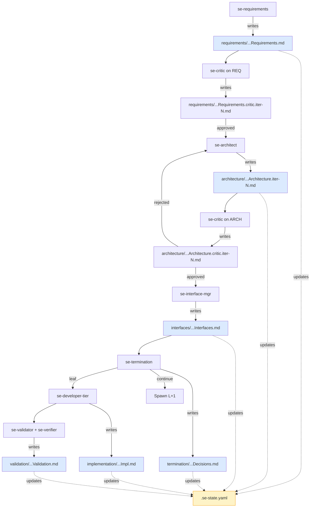
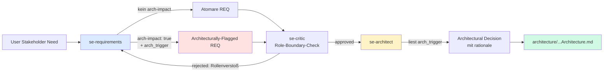
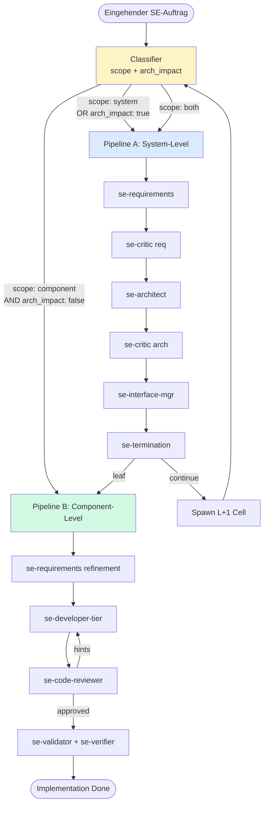

# Konzept: SE-Pipeline-Erweiterung — Teilresultat-Protokoll & Rollentrennung

> Status: **Konzept-Phase** | Datum: 2026-06-21
> Erweitert: [`se-agent-concept.md`](./se-agent-concept.md)
> Referenziert: [`agents/1-generic/se-requirements.md`](../../agents/1-generic/se-requirements.md)

---

## Executive Summary

Das bestehende SE-Framework (14 Agenten, V-Modell, fraktale Decomposition) hat in der praktischen Nutzung zwei strukturelle Schwachstellen offengelegt:

1. **Token-Loss-Risiko:** Lange SE-Kaskaden verlieren Zwischenergebnisse, wenn das Kontextfenster gesprengt wird. Es existiert kein persistenter Wiederaufnahme-Punkt.
2. **Rollenverstoß:** Der `se-requirements`-Agent triftet zu früh in Architekturentscheidungen ab (z.B. "wir brauchen einen Message-Broker") und verletzt damit ISO/IEC 15288 (Stakeholder Requirements vs. System Architecture).

Dieses Dokument beschreibt zwei orthogonale Lösungen plus eine optionale Pipeline-Differenzierung:

- **Lösung A — Teilresultat-Protokoll:** Jeder SE-Agent persistiert sein Ergebnis nach JEDEM Schritt in einer definierten Datei der `docs/se/<projektname>/`-Struktur. Wiederaufnahme-fähig.
- **Lösung B — Arch-Impact-Flag:** Requirements flaggt architekturrelevante Bedarfe ohne sie zu lösen. Architect entscheidet exklusiv über Topologie.
- **Lösung C (optional) — Pipeline-Trennung:** Pipeline A (System-Level) für Decomposition, Pipeline B (Component-Level) für Implementation. Klassifikation per `scope`.

---

## 1. Problemanalyse

### 1.1 Problem 1 — Token-Loss in der SE-Kaskade

**Status quo:** Agenten halten Zwischenergebnisse ausschließlich im LLM-Kontextfenster. Strukturierte JSON-Outputs werden von einem Agenten an den nächsten gereicht — ohne Persistenz dazwischen.

**Konkretes Szenario:**

```
Session 1:
  se-requirements   → liefert 12 REQ-L1-Anforderungen (~3k Token)
  se-architect      → decomposiert in 8 Sub-Komponenten (~4k Token)
  se-critic         → 2 Korrekturschleifen, Architect iteriert (~5k Token)
  se-interface-mgr  → 14 Interface-Contracts (~3k Token)
  ─────────────────── ~15k Token akkumuliert ───────────────────
  se-termination    → Context überschreitet Limit → Session terminiert.

Session 2 (User startet neu):
  Keine Wiederaufnahme möglich. Alle Zwischenergebnisse verloren.
  User muss Kaskade von vorne starten — Re-Elicitation, Re-Decomposition,
  Re-Critic-Iterationen. Kosten und Wallclock-Time verdoppeln sich.
```

**Wirkungstiefe:** Die fraktale Zelle multipliziert das Problem. Eine L3-Zelle, die L1- und L2-Kontext als implizite Annahmen benötigt, kann nicht rekonstruiert werden, wenn die L1/L2-Outputs nur im verlorenen Kontext lebten.

**Was fehlt:** Ein **Write-Through-Cache** auf Dateisystem-Ebene. Nach jedem Agenten-Schritt liegt sein strukturierter Output als Datei in `docs/se/<projektname>/`. Eine neue Session kann zu jedem beliebigen Schritt aufsetzen.

---

### 1.2 Problem 2 — Rollenverstoß im Requirements-Agenten

**Status quo:** `agents/1-generic/se-requirements.md` (v1.9.0) beschreibt eine 3-Phasen-Elicitation. In der Praxis trifft der Agent jedoch häufig **implizite Architekturentscheidungen**, weil die Formulierung "messbare Black-Box" verleitet, technische Lösungen zu konkretisieren.

**Beispiele für Rollenverstöße (aus realen Läufen):**

| Anwenderbedarf | Falsche REQ-Formulierung (Rollenverstoß) | Korrekte REQ-Formulierung |
|----------------|-------------------------------------------|---------------------------|
| "Nutzer sollen Bilder hochladen können" | "Das System soll Bilder per S3 Multipart Upload empfangen" | "Das System soll Bild-Uploads bis 50 MB akzeptieren" + `arch-impact: true` |
| "Asynchrone Verarbeitung" | "Das System soll RabbitMQ als Message-Broker nutzen" | "Das System soll Aufträge entkoppelt von der Annahme verarbeiten" + `arch-impact: true, arch_trigger: "decoupled async processing"` |
| "Hochverfügbarkeit" | "Das System soll als Kubernetes-Deployment mit 3 Replikas laufen" | "Das System soll bei Ausfall einer Instanz ohne Datenverlust weiterlaufen (RPO=0, RTO<30s)" + `arch-impact: true` |
| "Multi-User" | "Das System soll JWT-basierte Auth mit Refresh-Tokens nutzen" | "Das System soll authentifizierte Sessions mit konfigurierbarer Gültigkeit unterstützen" + `arch-impact: true` |

**Warum das ein Problem ist:**

1. **ISO/IEC 15288 verlangt Trennung:** Stakeholder Requirements (was) vs. System Requirements (Architektur, wie). Der Requirements-Agent ist L1-SH zuständig — nicht für Topologie.
2. **Architektur wird zu früh festgelegt:** Trade-offs (PostgreSQL vs. DynamoDB, REST vs. gRPC) gehören in den `se-architect`, der sie mit `architectural_rationale` dokumentiert.
3. **Re-Use verhindert:** Eine REQ "JWT mit Refresh-Tokens" ist nicht wiederverwendbar in einem System, das z.B. mTLS nutzt — der eigentliche Bedarf (authentifizierte Sessions) wäre es.
4. **Critic kann nicht eingreifen:** Der `se-critic` prüft Vollständigkeit/Konsistenz auf der Ebene auf der er aufgerufen wurde. Eine implizite Architekturentscheidung in der REQ überspringt den Architect-Schritt komplett.

**Was fehlt:** Ein expliziter **Arch-Impact-Flag** der signalisiert "diese Anforderung impliziert Architekturentscheidungen — Architect soll prüfen". Ohne dass der Requirements-Agent die Entscheidung selbst trifft.

---

## 2. Lösung A — Teilresultat-Protokoll

### 2.1 Prinzip

Jeder SE-Agent schreibt nach Abschluss seines Schrittes seinen vollständigen strukturierten Output in eine definierte Datei innerhalb der bestehenden `docs/se/<projektname>/`-Struktur.

**Vier Eigenschaften:**

1. **Atomar:** Datei wird nur geschrieben wenn der Agent `STATUS: done` meldet.
2. **Append-Only innerhalb eines Schritts:** Korrekturschleifen (Critic → Architect → Critic) erzeugen Iterations-Suffixe (`*.iter-1.md`, `*.iter-2.md`), die finale Iteration ist `*.final.md`.
3. **Wiederaufnahme-fähig:** Eine neue Session prüft die Verzeichnisstruktur, identifiziert den letzten abgeschlossenen Schritt und setzt dort auf.
4. **Schema-validiert:** Jede Datei trägt YAML-Frontmatter mit `step`, `agent`, `iteration`, `status`, `timestamp`, `schema_version`.

### 2.2 Tabelle — Wer schreibt was wann

| Schritt | Agent | Output-Datei (relativ zu `docs/se/<projektname>/`) | Schema | Trigger |
|---------|-------|----------------------------------------------------|--------|---------|
| 1 | `se-requirements` | `requirements/L{n}_{FolderName}_Requirements.md` | `se-requirements.schema.json` | Nach User-Approval (Phase 3) |
| 2 | `se-critic` (req-review) | `requirements/L{n}_{FolderName}_Requirements.critic.iter-{i}.md` | `se-critic.schema.json` | Nach jedem Critic-Lauf auf Requirements |
| 3 | `se-architect` | `architecture/L{n}_{FolderName}_Architecture.iter-{i}.md` | `se-decomposition.schema.json` | Nach Architect-Synthese |
| 4 | `se-critic` (arch-review) | `architecture/L{n}_{FolderName}_Architecture.critic.iter-{i}.md` | `se-critic.schema.json` | Nach jedem Critic-Lauf auf Architektur |
| 5 | `se-interface-mgr` | `interfaces/L{n}_{FolderName}_Interfaces.md` | `se-interfaces.schema.json` | Nach Interface-Registry-Update |
| 6 | `se-termination` | `termination/L{n}_{FolderName}_Decisions.md` | `se-termination.schema.json` | Nach Leaf/Continue-Entscheidung |
| 7 | `se-developer*` (junior/standard/senior) | `implementation/L{n}_{ComponentName}_Impl.md` | `se-developer-output.schema.json` | Nach Leaf-Implementation |
| 8 | `se-validator` / `se-verifier` | `validation/L{n}_{FolderName}_Validation.md` | `se-validation.schema.json` | Nach V&V-Lauf |
| 9 | `se-integration-and-test-manager` | `validation/L{n}_{FolderName}_TestPlan.md` | `se-testplan.schema.json` | Nach Test-Planung |

**Iterations-Suffix-Konvention:**
- `*.iter-1.md`, `*.iter-2.md`, … `*.iter-N.md` — alle Zwischenstände
- `*.final.md` — finale, vom Critic approved Version (Hardlink oder Copy auf letzte Iteration)
- Ohne Suffix (`*.md`) — Single-Shot-Schritte ohne Iteration (Requirements, Interfaces, Termination)

### 2.3 Verzeichnisstruktur (erweitert)

```
docs/se/<projektname>/
├── STRATEGY.md
├── .se-state.yaml                          # NEU: Wiederaufnahme-Pointer
│
├── L1/Gesamtsystem/
│   ├── requirements/
│   │   ├── L1_Gesamtsystem_Requirements.md
│   │   ├── L1_Gesamtsystem_Requirements.critic.iter-1.md
│   │   └── L1_Gesamtsystem_Requirements.critic.final.md
│   ├── architecture/
│   │   ├── L1_Gesamtsystem_Architecture.iter-1.md
│   │   ├── L1_Gesamtsystem_Architecture.critic.iter-1.md
│   │   ├── L1_Gesamtsystem_Architecture.iter-2.md
│   │   ├── L1_Gesamtsystem_Architecture.critic.iter-2.md
│   │   └── L1_Gesamtsystem_Architecture.final.md
│   ├── interfaces/
│   │   └── L1_Gesamtsystem_Interfaces.md
│   ├── termination/
│   │   └── L1_Gesamtsystem_Decisions.md
│   │
│   └── L2/AuthServiceSystem/               # rekursiv, gleiche Struktur
│       ├── requirements/
│       ├── architecture/
│       └── ...
│
└── diagrams/
    ├── architecture-overview.mmd
    └── interface-graph.mmd
```

### 2.4 Wiederaufnahme-Pointer (`.se-state.yaml`)

```yaml
project: <projektname>
last_updated: 2026-06-21T14:32:11Z
current_level: L2
current_node: AuthServiceSystem
last_completed_step:
  agent: se-architect
  iteration: 2
  status: approved
  output_file: L1/Gesamtsystem/L2/AuthServiceSystem/architecture/L2_AuthServiceSystem_Architecture.final.md
next_expected_step:
  agent: se-interface-mgr
  input_files:
    - L1/Gesamtsystem/L2/AuthServiceSystem/architecture/L2_AuthServiceSystem_Architecture.final.md
    - L1/Gesamtsystem/interfaces/L1_Gesamtsystem_Interfaces.md
pending_decisions: []
budget_consumed:
  cells: 7
  tokens: 42100
  estimated_eur: 1.85
```

### 2.5 Mermaid — Teilresultat-Fluss



### 2.6 Wiederaufnahme-Algorithmus

```
1. Lies .se-state.yaml
2. Verifiziere last_completed_step.output_file existiert
3. Lies dieses File und alle in next_expected_step.input_files
4. Starte next_expected_step.agent mit diesem Kontext
5. Schreibe Output gemäß Schritt-Tabelle
6. Aktualisiere .se-state.yaml atomar (write-to-tmp + rename)
```

**Nicht-Ziel:** Konkurrierende Schreiber. Wenn parallel zwei Zellen auf gleicher Ebene laufen, gilt: jede Zelle hat ihren eigenen Node-Ordner (`L2/AuthServiceSystem/`, `L2/PaymentServiceSystem/`) — kein Schreibkonflikt auf Datei-Ebene. Nur `.se-state.yaml` braucht File-Locking (POSIX `flock` oder atomic-rename).

---

## 3. Lösung B — Rollentrennung Requirements vs. Architect

### 3.1 Präzise Abgrenzung

**`se-requirements` DARF:**

| Aktivität | Beispiel |
|-----------|----------|
| Stakeholder-Bedarfe in messbare Black-Box-REQs überführen | "System soll 500ml Wasser in 120s auf 90°C erhitzen" |
| REQ-IDs vergeben (REQ-L{n}-{NNN}) | REQ-L1-001 |
| Domänen zuweisen | `system` \| `software` \| `hardware` \| `mechanics` |
| Externe Schnittstellen am Systemrand erfassen | "230V AC Eingang", "Heißwasser-Auslauf" |
| Akzeptanzkriterien definieren | "RPO=0, RTO<30s" |
| Priorisieren (mandatory / desired / optional) | |
| **Arch-Impact flaggen** (NEU) | `arch-impact: true, arch_trigger: "decoupled async processing"` |
| Konflikte erkennen und an User eskalieren | "REQ-L1-003 widerspricht REQ-L1-007" |

**`se-requirements` DARF NICHT:**

| Verbotene Aktivität | Gegenbeispiel |
|---------------------|---------------|
| Architektur-Pattern wählen | ❌ "Microservice-Architektur mit Event-Bus" |
| Technologien festlegen | ❌ "PostgreSQL als primärer Datenspeicher" |
| Systemgrenzen verschieben oder neue Subsysteme erfinden | ❌ "Wir brauchen einen Auth-Service als eigenes System" |
| Deployment-Topologien festlegen | ❌ "Kubernetes mit 3 Replikas" |
| Interne Schnittstellen designen | ❌ "REST-API zwischen UI und Backend" |
| Trade-offs zwischen Alternativen entscheiden | ❌ "REST statt gRPC, weil einfacher" |
| Protokolle wählen | ❌ "MQTT für IoT-Sensoren" |
| Datenmodelle entwerfen | ❌ "Users-Tabelle mit FK auf Sessions" |

### 3.2 Der `arch-impact`-Flag-Mechanismus

**Funktion:** Brücke zwischen Requirements und Architect ohne Rollenverletzung.

**Erweitertes JSON-Schema (`se-requirements` Output):**

```json
{
  "requirements": [
    {
      "req_id": "REQ-L1-001",
      "statement": "Das System soll Aufträge entkoppelt von der Annahme verarbeiten, sodass Annahme-Latenz < 100ms ist auch bei langlaufender Verarbeitung.",
      "domain": "system",
      "priority": "mandatory",
      "rationale": "Stakeholder-Need: schnelle UI-Response auch bei lastintensiven Backend-Tasks",
      "external_interfaces": [
        {"direction": "input", "type": "data", "description": "Auftragsannahme via HTTPS POST"}
      ],
      "arch_impact": true,
      "arch_trigger": "decoupled async processing — verarbeitung muss von annahme entkoppelt sein",
      "acceptance_criteria": [
        "Annahme-Antwort < 100ms p95",
        "Verarbeitung darf > 30s dauern ohne Annahme zu blockieren",
        "Bei Crash der Verarbeitung gehen keine angenommenen Aufträge verloren"
      ]
    }
  ]
}
```

**Semantik der neuen Felder:**

- `arch_impact: false` (Default) — Anforderung ist auf bestehender Architektur erfüllbar oder ist eine Verfeinerung einer Komponentenanforderung.
- `arch_impact: true` — Anforderung impliziert **eine architektonische Entscheidung**, die der `se-architect` exklusiv treffen muss.
- `arch_trigger: "<warum>"` — Kurze Begründung warum Architektur betroffen ist. **Nie eine Lösung**, immer ein Problem-Statement.
- `acceptance_criteria: [...]` — Messbare Kriterien, an denen der Architect die gewählte Lösung später validieren kann.

### 3.3 Beispiele — Korrekt vs. Falsch

#### Beispiel 1: Asynchrone Verarbeitung

**Falsch (Rollenverletzung):**
```json
{
  "req_id": "REQ-L1-005",
  "statement": "Das System soll RabbitMQ als Message-Broker verwenden um Aufträge zu queueen.",
  "domain": "software"
}
```

**Korrekt:**
```json
{
  "req_id": "REQ-L1-005",
  "statement": "Das System soll Auftragsannahme und Auftragsverarbeitung zeitlich entkoppeln, sodass Annahme-Latenz unabhängig von Verarbeitungsdauer ist.",
  "domain": "system",
  "arch_impact": true,
  "arch_trigger": "decoupled async processing required (annahme/verarbeitung)",
  "acceptance_criteria": [
    "Annahme < 100ms p95",
    "Keine Auftragsverluste bei Verarbeitungs-Crash",
    "Verarbeitung skalierbar unabhängig von Annahme"
  ]
}
```

→ `se-architect` entscheidet dann: Message Broker? Event-Stream? In-Memory Queue mit Persistenz? Mit `architectural_rationale` dokumentiert.

#### Beispiel 2: Hochverfügbarkeit

**Falsch:**
```json
{
  "req_id": "REQ-L1-012",
  "statement": "Das System soll als Kubernetes-Deployment mit 3 Replikas laufen.",
  "domain": "system"
}
```

**Korrekt:**
```json
{
  "req_id": "REQ-L1-012",
  "statement": "Das System soll bei Ausfall einer einzelnen Instanz ohne Datenverlust weiterlaufen.",
  "domain": "system",
  "arch_impact": true,
  "arch_trigger": "high availability with RPO=0, RTO<30s",
  "acceptance_criteria": [
    "RPO = 0 (kein Datenverlust)",
    "RTO < 30s (Wiederanlauf)",
    "Kein Single Point of Failure für kritische Pfade"
  ]
}
```

→ `se-architect` entscheidet: Active-Active? Active-Passive? Load-Balancer-Strategie?

#### Beispiel 3: Atomare REQ ohne Arch-Impact

**Korrekt (kein Flag nötig):**
```json
{
  "req_id": "REQ-L1-020",
  "statement": "Das System soll Passwörter mit mindestens 12 Zeichen verlangen.",
  "domain": "software",
  "arch_impact": false
}
```

→ Reine Verhaltensanforderung, keine architektonische Implikation. Wird im Validator/Verifier geprüft.

### 3.4 Workflow-Konsequenz

Der `se-critic` (bei `review_target: "requirements"`) erhält einen zusätzlichen Prüfschritt:

```
5. ROLE BOUNDARY CHECK:
   - Enthält die REQ Architektur-Begriffe (Microservice, Broker, Kubernetes, REST, gRPC, etc.)?
   - Enthält die REQ Technologie-Festlegungen (PostgreSQL, RabbitMQ, etc.)?
   - Sind interne Schnittstellen beschrieben (nur EXTERNE erlaubt)?

   → Wenn ja: status: "rejected", correction_hint:
     "REQ-L1-XXX verletzt Rollentrennung. Reformuliere als Verhaltensanforderung
      und setze arch_impact: true mit arch_trigger."
```

Der `se-architect` empfängt mit der Black-Box-Anforderung zusätzlich die Liste der `arch_impact: true`-Triggers und muss in seinem `architectural_rationale` explizit auf jeden eingehen.

### 3.5 Mermaid — Rollentrennung



---

## 4. (Optional) Lösung C — Zwei SE-Pipelines

> **Status:** Erweiternd. Nicht Pflicht-Bestandteil dieses Konzepts, aber strukturell wertvoll wenn die Trennung ohnehin geschärft wird.

### 4.1 Motivation

Die bestehende SE-Kaskade behandelt alle Aufträge gleich — von "neues Subsystem ableiten" bis "diese Funktion implementieren". Das ist verschwenderisch:

- Eine **System-Level**-Anforderung ("neues Auth-Subsystem nötig") braucht den vollen Decomposition-Stack (Architect → Critic → Interface-Mgr → Termination).
- Eine **Component-Level**-Anforderung ("diese Validierungs-Funktion verfeinern") braucht NUR Developer + Reviewer + Validator.

### 4.2 Pipeline A — System-Level

**Trigger:** REQ hat `scope: "system"` ODER `arch_impact: true`.

```
se-requirements  →  se-critic (req)  →  se-architect  →  se-critic (arch)
                                                              ↓
                  ←─────────────────  iter loop  ←─────────────
                                                              ↓
                                              se-interface-mgr → se-termination
                                                              ↓
                                              [leaf]      [continue]
                                                ↓             ↓
                                            Pipeline B    Spawn L+1
```

**Charakteristika:**
- Vollständiger Decomposition-Stack
- Schreibt: `requirements/`, `architecture/`, `interfaces/`, `termination/`
- Iterationen über Critic-Reflection
- Endpunkt: `se-termination` entscheidet Pipeline B (leaf) oder Rekursion (continue)

### 4.3 Pipeline B — Component-Level

**Trigger:** REQ hat `scope: "component"` ODER kommt von `se-termination` mit `decision: "leaf"`.

```
se-requirements (refinement-mode)  →  se-developer-tier  →  se-code-reviewer
                                                                  ↓
                                          ←──────  hints  ────────
                                                                  ↓
                                              se-validator + se-verifier
                                                                  ↓
                                              implementation/...Impl.md
                                              validation/...Validation.md
```

**Charakteristika:**
- KEIN `se-architect` (keine Architektur-Entscheidungen erlaubt)
- KEIN `se-interface-mgr` (Interfaces stehen aus Pipeline A bereits fest)
- KEIN `se-termination` (Endpunkt ist Code, nicht weitere Decomposition)
- Reflection-Loop: Developer ↔ Code-Reviewer
- Endpunkt: V&V-Floor (Validator/Verifier)
- Schreibt: `implementation/`, `validation/` (+ optional kleine Updates an `requirements/` für Refinement)

### 4.4 Klassifikations-Tabelle

| Auftragstyp | scope | arch_impact | Pipeline |
|-------------|-------|-------------|----------|
| Neues Subsystem ableiten | `system` | true | **A** |
| Top-Level-Anforderung formalisieren | `system` | false | **A** |
| Bestehende Komponente verfeinern (Black-Box stabil) | `component` | false | **B** |
| Leaf-Implementation nach `se-termination` | `component` | n/a | **B** |
| Anforderung mit architektonischer Auswirkung auf bestehende Komponente | `component` | true | **A** (eskaliert auf System-Level) |
| Cross-Cutting Concern (Auth, Logging) | `system` | true | **A** |
| Refactoring innerhalb einer Komponente | `component` | false | **B** |
| Beide Ebenen betroffen | `both` | true | **A**, dann **B** je Leaf |

### 4.5 Mermaid — Pipeline-Routing



### 4.6 Klassifizierungs-Verantwortung

Die Klassifikation `scope` (`system` / `component` / `both`) erfolgt durch den **Haupt-`orchestrator`** im SE-Mode beim Empfang der Aufgabe, basierend auf:

1. Explizitem User-Hint (`scope:` im Auftrag)
2. Vorhandensein eines übergeordneten `architecture/`-Outputs (existiert eine White-Box → eher Component)
3. `arch_impact`-Flag aus vorausgehendem Requirements-Lauf

**Default:** `scope: system` (sicherer Default — vollständige Kaskade).

---

## 5. Integrations-Hinweise

> **Nur Benennung** der betroffenen Artefakte — Implementierung erfolgt in nachgelagerten Tasks.

### 5.1 Agent-Templates (`agents/1-generic/`)

| Datei | Änderung |
|-------|----------|
| `se-requirements.md` | Neue Section "Architecture Boundary" mit `arch_impact`/`arch_trigger`-Mechanik. Output-Schema erweitern. Post-Step-Persistenz nach `requirements/...Requirements.md` ergänzen. |
| `se-architect.md` | Eingangs-Payload um `arch_trigger`-Liste erweitern. Verpflichtung in `architectural_rationale` auf jeden Trigger eingehen. Persistenz nach `architecture/...Architecture.iter-{i}.md`. |
| `se-critic.md` | Neuer Prüfschritt "Role Boundary Check" (Verbotsbegriffe-Liste). Persistenz nach `*.critic.iter-{i}.md`. |
| `se-interface-mgr.md` | Persistenz nach `interfaces/...Interfaces.md`. |
| `se-termination.md` | Persistenz nach `termination/...Decisions.md`. Bei `leaf` zusätzlich `scope: component` setzen für Downstream-Klassifikation. |
| `se-junior-developer.md`, `se-developer.md`, `se-senior-developer.md` | Persistenz nach `implementation/...Impl.md`. |
| `se-validator.md`, `se-verifier.md`, `se-integration-and-test-manager.md` | Persistenz nach `validation/...Validation.md` bzw. `...TestPlan.md`. |

### 5.2 Schemas (`schemas/`)

| Datei | Status |
|-------|--------|
| `se-requirements.schema.json` | **Erweitern** um `arch_impact` (bool), `arch_trigger` (string), `acceptance_criteria` (string[]), `scope` (enum: system/component/both). |
| `se-critic.schema.json` | **Erweitern** um `role_boundary_check`-Block analog `completeness`/`consistency`. |
| `se-state.schema.json` | **Neu** — Schema für `.se-state.yaml` (Wiederaufnahme-Pointer). |
| `se-decomposition.schema.json` | **Erweitern** — `architectural_rationale` verpflichtend pro `arch_trigger`. |

### 5.3 Howto-Dokumente (`howto/`)

| Datei | Status |
|-------|--------|
| `howto/se-workflow.md` | **Erweitern** um Teilresultat-Protokoll und Wiederaufnahme-Sektion. |
| `howto/se-pipeline-routing.md` | **Neu** (nur wenn Lösung C umgesetzt wird) — Klassifikation Pipeline A/B. |
| `howto/se-role-boundaries.md` | **Neu** — Requirements vs. Architect, Beispieltabelle, häufige Rollenverstöße. |
| `howto/se-resume-session.md` | **Neu** — Wie eine abgebrochene SE-Kaskade fortgesetzt wird. |

### 5.4 Pipelines / Cascade-Konfiguration

| Datei | Änderung |
|-------|----------|
| `config/se-cascade.yaml` (falls existent, sonst in `role-defaults.yaml`) | Pipeline A/B als getrennte `stages` definieren, Classifier-Step ergänzen. |
| `config/role-defaults.yaml` | `se_variables`-Block um `output_persistence: true` und `resume_pointer_path: .se-state.yaml` erweitern. |

### 5.5 Templates (`templates/`)

| Datei | Status |
|-------|--------|
| `templates/SE-STRATEGY.template.md` | Keine Änderung. |
| `templates/se-state.template.yaml` | **Neu** — Initiale `.se-state.yaml`. |

### 5.6 Tests (`tests/`)

| Datei | Status |
|-------|--------|
| `tests/test_se_persistence.py` | **Neu** — Round-Trip-Test: Agent schreibt Output, neuer Lauf liest und setzt fort. |
| `tests/test_se_role_boundary.py` | **Neu** — Fixtures mit Rollenverstößen, prüfen dass `se-critic` sie ablehnt. |
| `tests/test_se_pipeline_classifier.py` | **Neu** (nur Lösung C) — Klassifikation system/component/both. |

### 5.7 Sync-Logik (`scripts/lib/`)

Keine direkten Änderungen erwartet. Falls Pipeline-Routing als Stage-Konfiguration in `config/se-cascade.yaml` landet, könnte `scripts/lib/se_export/` einen Reader für `.se-state.yaml` brauchen — Implementation aber nachgelagert.

---

## 6. Risiken & Gegenmaßnahmen

| Risiko | Gegenmaßnahme |
|--------|---------------|
| Persistenz erzeugt Disk-Bloat in großen Projekten | Iterations-Files behalten, ältere `*.iter-N.md` mit `N < final-1` nach Approval optional in `.archive/` verschieben |
| `.se-state.yaml` korrumpiert bei Crash | Atomic-Write (`tmp` + `rename`), Schema-Validation beim Lesen, Fallback auf Verzeichnis-Inspektion |
| User editiert persistierte Files manuell zwischen Sessions | Frontmatter `schema_version` + `checksum`-Feld, bei Mismatch User warnen |
| Parallele Zellen schreiben in gleichen Pfad | Strikte Node-Ordner-Trennung pro Zelle (`L{n}/{NodeName}/`), nur `.se-state.yaml` braucht Locking |
| Requirements-Agent umgeht `arch_impact` durch geschicktes Formulieren | Verbotsbegriffe-Liste im `se-critic` Role-Boundary-Check, Re-Iteration erzwingen |
| Klassifikator routet falsch (Pipeline A statt B) | Default ist `system` (sicherer Default), User-Override durch expliziten `scope:`-Hint im Auftrag |
| Pipeline B startet ohne dass Pipeline A abgeschlossen ist | `.se-state.yaml` muss `architecture/`-Output referenzieren; Pipeline B prüft Vorhandensein und fail-fast bei Fehlen |

---

## 7. Abgrenzung zum bestehenden Konzept

Dieses Dokument **erweitert** [`se-agent-concept.md`](./se-agent-concept.md). Es ersetzt nichts.

| Aspekt | `se-agent-concept.md` | Diese Erweiterung |
|--------|------------------------|-------------------|
| V-Modell mit Decomposition/Implementation/V&V | bleibt | bleibt |
| 14 SE-Agenten | bleibt | bleibt — Templates erhalten Schritt-Persistenz |
| Output-Struktur `docs/se/<projektname>/` | bleibt | erweitert um `requirements/`, `architecture/`, `interfaces/`, `termination/`, `implementation/`, `validation/` Subordner pro Node |
| Fraktale Rekursion | bleibt | bleibt — `.se-state.yaml` macht sie wiederaufnahme-fähig |
| Cost-Limits (`SE_MAX_CELLS`, `cost_limit_eur`) | bleibt | bleibt — `.se-state.yaml` trackt `budget_consumed` über Sessions hinweg |
| Reflection-Loop Architect ↔ Critic | bleibt | bleibt — Iterationen jetzt mit `*.iter-N.md` persistiert |

---

## 8. Nächste Schritte

1. Konzept an `requirements`-Agenten übergeben → REQ-IDs für Persistenz und Rollentrennung vergeben
2. Schema-Erweiterungen (`se-requirements.schema.json`, `se-critic.schema.json`, neues `se-state.schema.json`) definieren
3. Template-Updates für `se-requirements`, `se-architect`, `se-critic` planen (Version-Bumps: minor wegen erweiterter Outputs)
4. `howto/se-role-boundaries.md` und `howto/se-resume-session.md` schreiben
5. Tests definieren (`test_se_persistence.py`, `test_se_role_boundary.py`)
6. Entscheidung Lösung C (Pipeline-Trennung): Implementieren oder als Optionalrest belassen?
