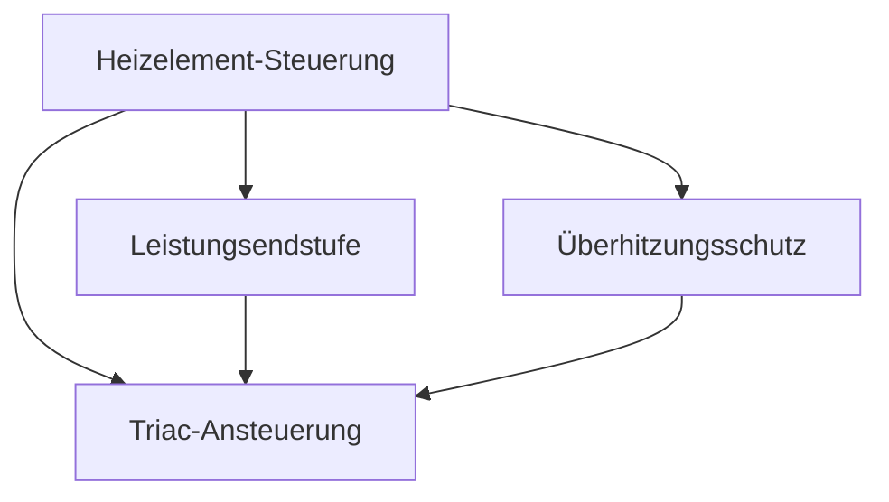

# Konzept: Systems Engineering Agenten-Kaskade

> Status: **Konzept-Phase** | Branch: `feat/se-agent-concept`
> Datum: 2026-05-20

---

## Implementierungsstatus (verifiziert 2026-06-20)

**Umgesetzt:**
- 14 SE-Agenten-Templates (`agents/1-generic/se-*.md`), in `config/role-defaults.yaml` registriert
  - Decomposition (Requirem., Architect, Critic, Interface-Mgr, Termination, Orchestrator): 6 Agenten
  - **Implementation Floor (neu, 2026-06-20):** 3 SE-Developer-Tiers (Junior, Standard, Senior)
- Schemas (`se-decomposition`, `se-orchestrator`), Templates (`SE-STRATEGY`, `SE-FEATURE`), Howtos
- **SE-Export-Adapter** (`scripts/lib/se_export/`): Markdown (Default) + GitHub-Issues (`gh`-CLI), Factory + CLI `scripts/se-export.py`, Tests `tests/test_se_export.py` (L4 erledigt)

**Implementierungs-Phasen:**
- **Phase 1 (MVP):** Decomposition + Implementation-Floor komplett. Manuelle Rekursion über Orchestrator.
- **Phase 2 (Automatisierung):** Auto-Rekursion, Parallele Zellen, Schema-Cache.
- **Phase 3 (MCP):** Jira-/Linear-/ReqIF-Adapter, Cost-Limits.

**Offen / bewusste Abweichung:**
- Auto-Rekursion: kein Self-Spawn durch Termination-Agent — Rekursion läuft über den `orchestrator` (Anti-Recursion-Guard). Design-Entscheidung, kein Bug.
- Jira-/Linear-/ReqIF-Adapter (Phase 3), Cost-Limits (`max_total_cells`, `cost_limit_eur`)

---

## Executive Summary

Dieses Konzept beschreibt einen **Systems-Engineering-Modus** für agent-meta: einen autonomen, rekursiven Agenten-Workflow für Model-Based Systems Engineering (MBSE). Das System zerlegt Anwenderbedarfe über **n dynamische Ebenen** mittels eines fraktalen Black-Box→White-Box→Black-Box-Übergangs, bis atomare, umsetzbare Arbeitsaufträge (Software, Hardware, Mechanik) vorliegen.

**Kerninnovation:** Statt starrer Ebenen eine **rekursive System-Zelle** — drei Agenten (Architect, Critic, Interface Manager) plus Termination- und Requirements-Agent arbeiten in jeder Ebene identisch. Die Zelle spawns bei Bedarf Instanzen von sich selbst für die nächsttiefere Ebene.

**Tool-Agnostik:** Default-Output in Markdown + Mermaid + Interface-Tabellen. Optional erweiterbar via MCP-Adapter (Jira, GitHub Issues, Linear, ReqIF).

**Externe Basis:** INCOSE MBSE, ISO/IEC 15288, AutoGen Reflection Pattern, CCPM Traceability-Chain, Harness Hierarchical Delegation.

---

## Das Grundprinzip: Die Rekursive System-Zelle mit V-Modell-Architektur

Anstatt zu versuchen, alles auf einmal zu lösen, folgt das System einem **V-Modell**:
- **Linke Seite des V:** Decomposition (Architekt, Critic, Interface Manager) — abstrahiert von unten nach oben
- **Boden des V:** **Implementation Floor** (3 SE-Developer-Tiers) — konkrete Arbeit an Leaf Nodes
- **Rechte Seite des V:** Validation (zukünftig) — Verifikation nach oben

Jede Ebene — egal wie tief — durchläuft exakt denselben Ablauf:

```
┌──────────────────────────────────────────────────────────────────────────┐
│                        SYSTEM-ZELLE (EBENE n)                            │
│                                                                          │
│  Input (Black-Box)                                                      │
│  "Das System muss X leisten"                                            │
│       │                                                                 │
│       ▼                                                                 │
│  ┌──────────────┐    ┌──────────────┐    ┌───────────────────┐        │
│  │  ARCHITECT   │───▶│   CRITIC     │───▶│ INTERFACE MANAGER │        │
│  │  Synthese    │    │  Quality Gate│    │  Verträge sichern │        │
│  └──────────────┘    └──────────────┘    └───────────────────┘        │
│       │                                         │                       │
│       └──────────────┬──────────────────────────┘                       │
│                      ▼                                                  │
│  Output (White-Box)                                                     │
│  Sub-Komponenten + Interface Contracts                                  │
│       │                                                                 │
│       ▼                                                                 │
│  ┌────────────────────────────────────────────────────────────┐        │
│  │              TERMINATION FLOOR                              │        │
│  │  Pro Sub-Komponente:                                        │        │
│  │  - Leaf Node? → dispatch zur IMPLEMENTATION FLOOR          │        │
│  │  - Continue? → Neue Zelle auf n+1 (Rekursion)             │        │
│  └────────────────────────────────────────────────────────────┘        │
│       │                                      │                         │
│       │ (leaf)                               │ (continue)              │
│       ▼                                      ▼                         │
│  ╔═════════════════════════════════╗   Spawn n+1                       │
│  ║   IMPLEMENTATION FLOOR (BODEN)  ║                                   │
│  ║  se-junior-developer (0–1 IF)   ║                                   │
│  ║  se-developer (2–4 IF)          ║                                   │
│  ║  se-senior-developer (5+ IF)    ║                                   │
│  ╚═════════════════════════════════╝                                   │
│       │                                                                 │
│       ▼                                                                 │
│  Validation + Test Coverage                                             │
└──────────────────────────────────────────────────────────────────────────┘

Übergang n→n+1: White-Box-Elemente der Ebene n werden zu
Black-Box-Anforderungen der Ebene n+1.
```

**Der fraktale Charakter:** Die Zelle auf Ebene n+1 arbeitet identisch — sie empfängt eine Black-Box, synthetisiert Architektur, lässt kritisieren, sichert Interfaces und entscheidet über Terminierung oder Implementation. Kein Unterschied zu Ebene n — nur die Granularität ändert sich.

---

## Die 5 Agenten-Rollen im Detail

### 1. Requirements Agent (`se-requirements`)

**Zuständigkeit:** Stakeholder-Elicitor — unstrukturierte Ideen in formale Systemanforderungen überführen.

**Input:** Freitext-Beschreibung, Dialog mit Anwender, bestehende Dokumente.

**System-Prompt-Kernlogik:**
```
Du bist ein Requirements Engineer nach ISO/IEC 15288.
Deine Aufgabe: Nimm unstrukturierte Nutzerbedarfe entgegen und formalisiere sie.

1. Stelle Rückfragen um Unklarheiten zu beseitigen (keine Annahmen treffen).
2. Formuliere jede Anforderung als messbare Black-Box: "Das System soll X unter Bedingung Y mit Qualität Z leisten."
3. Ordne jeder Anforderung eine ID (REQ-xxx) und eine Domäne zu (system, software, hardware, mechanics).
4. Definiere externe Schnittstellen (was kommt rein, was geht raus).
5. Gib eine Liste priorisierter, widerspruchsfreier Systemanforderungen zurück.
```

**Structured Output:**
```json
{
  "requirements": [
    {
      "req_id": "REQ-001",
      "statement": "Das System soll 500ml Wasser innerhalb von 120s auf 90°C erhitzen.",
      "domain": "system",
      "priority": "mandatory",
      "rationale": "Stakeholder-Need: Heißwasserbereitstellung",
      "external_interfaces": [
        {"direction": "input", "type": "physical", "description": "230V AC Stromversorgung"},
        {"direction": "input", "type": "physical", "description": "Kaltwasserzulauf"},
        {"direction": "output", "type": "physical", "description": "Heißwasserauslauf"}
      ]
    }
  ]
}
```

---

### 2. Architect Agent (`se-architect`) — Detailausarbeitung

**Zuständigkeit:** Das Herzstück der Zelle. Nimmt eine Black-Box-Anforderung und synthetisiert die interne White-Box-Architektur mittels **Functional Decomposition** nach INCOSE-Methodik.

**Input (Context-Payload — strikt begrenzt):**
- `parent_requirement`: Die Black-Box-Anforderung (nur diese eine, nicht der ganze Baum)
- `external_interfaces`: Von der übergeordneten Ebene diktierte Schnittstellen
- `system_domain`: In welcher Domäne bewegen wir uns? (system, software, hardware, mechanics)
- `neighbor_contracts`: Interface Contracts zu parallel bearbeiteten Nachbar-Komponenten (vom Interface Manager)

**Warum Context-Begrenzung kritisch ist:**
Der Agent auf Ebene 4 darf **nicht** den gesamten Chat-Verlauf von Ebene 1–3 sehen. Sonst tritt Context Drift ein: Der Agent halluziniert Annahmen aus höheren Ebenen oder verliert den Fokus auf seine spezifische Aufgabe. Nur die direkte Parent-Black-Box plus Schnittstellen der Nachbarn sind relevant.

**System-Prompt-Kernlogik:**
```
Du bist ein Systems Architect Agent in einem MBSE-Workflow.
Deine Aufgabe: Nimm eine Black-Box-Anforderung und zerlege sie in
eine logische oder physikalische White-Box-Architektur.

1. ANALYSIERE die Input-Anforderung auf funktionale, nicht-funktionale und
   Constraints-Aspekte.
2. DEFINIERE die minimal notwendigen Sub-Komponenten um die Anforderung
   vollständig zu erfüllen. Frage dich: "Was muss intern existieren, damit
   diese Black-Box ihr Verhalten zeigt?"
3. WEISE jeder Sub-Komponente eine Domäne zu:
   - software (Algorithmen, Steuerung, Datenverarbeitung)
   - hardware (Elektronik, Sensorik, Aktorik, Controller)
   - mechanics (Gehäuse, Struktur, Thermik, Fluidik)
   - system (bleibt übergreifend, wird später weiter zerlegt)
4. DEFINIERE die INTERNEN SCHNITTSTELLEN zwischen den neuen Sub-Komponenten.
   Für jede Schnittstelle: Wer spricht mit wem? Was wird übertragen?
   Welches Protokoll/Medium?
5. ORDNE externe Interfaces den korrekten Sub-Komponenten zu.
   (z.B. "WLAN" gehört zum Mainboard, nicht zum Gehäuse)
6. LEITE für jede Sub-Komponente eine neue Black-Box-Anforderung ab.
   Formuliere sie so, dass sie in der nächsten Ebene eigenständig bearbeitbar ist.
7. BEGRÜNDE deine Architekturentscheidung kurz (Trade-offs, Alternativen).
```

**Structured Output:**
```json
{
  "parent_req_id": "REQ-001",
  "sub_components": [
    {
      "id": "COMP-001-01",
      "name": "Heizelement-Steuerung",
      "domain": "hardware",
      "black_box_requirement": "Die Heizelement-Steuerung soll eine elektrische Heizleistung von 2000W über einen Temperatur-Regelkreis mit ±2°C Genauigkeit bereitstellen.",
      "assigned_external_interfaces": ["230V AC Stromversorgung"]
    },
    {
      "id": "COMP-001-02",
      "name": "Temperatur-Regelungsalgorithmus",
      "domain": "software",
      "black_box_requirement": "Der Regelungsalgorithmus soll einen PID-Regler mit Temperatur-Sollwert 90°C implementieren, der Stellgrößen für das Heizelement berechnet."
    },
    {
      "id": "COMP-001-03",
      "name": "Wasserbehälter",
      "domain": "mechanics",
      "black_box_requirement": "Der Wasserbehälter soll 500ml Volumen fassen, lebensmittelecht sein und thermisch auf 100°C ausgelegt sein."
    }
  ],
  "internal_interfaces": [
    {
      "source_id": "COMP-001-02",
      "target_id": "COMP-001-01",
      "interface_type": "analog_signal",
      "data_payload": "PWM-Stellsignal 0-100%, 5V Logikpegel"
    },
    {
      "source_id": "COMP-001-01",
      "target_id": "COMP-001-03",
      "interface_type": "thermal",
      "data_payload": "Wärmeübertragung 2000W max, Kontaktfläche min 50cm²"
    }
  ],
  "architectural_rationale": "Gewählt: PID-Regelung als Software (flexibel parametrierbar, keine Bauteiltoleranzen) + diskrete Leistungselektronik (Standardkomponenten). Alternative: Analoger Thermostat — verworfen wegen geringerer Regelgenauigkeit.",
  "decomposition_completeness": "Die drei Sub-Komponenten decken Funktionalität (Regelung SW), Aktorik (Heizung HW) und passives Element (Behälter MECH) vollständig ab. Externe Schnittstellen korrekt zugeordnet."
}
```

**Herausforderung: Interface Propagation.**
Wenn Ebene 1 sagt "Gesamtsystem muss per WLAN kommunizieren", dann ist das ein externes Interface. Der Architect auf Ebene 2 muss dieses Interface exakt der Sub-Komponente `Mainboard` zuordnen (nicht dem Gehäuse). Der Code muss beim Instanziieren der nächsten Zelle sicherstellen, dass jede Sub-Komponente die Liste der Interfaces mitbekommt, an denen sie beteiligt ist — sowohl die neu geschaffenen internen Interfaces als auch die durchgereichten externen.

---

### 3. Critic Agent (`se-critic`) — Detailausarbeitung

**Zuständigkeit:** Quality Gate nach jedem Architect-Durchlauf. Prüft die Arbeit des Architect auf Vollständigkeit, Konsistenz und Testbarkeit. Erzwingt bei Mängeln eine Korrekturschleife (→ Architect wiederholt).

**Pattern-Quelle:** Direkt adaptiert vom **AutoGen Reflection Pattern** [1] — ein Generator-Kritiker-Paar mit Iteration bis Approval. Der Critic ist kein "Besserwisser" sondern ein systematischer Prüfer gegen definierte Kriterien.

**Input:**
- Die originale Black-Box-Anforderung (Input des Architect)
- Der komplette Architect-Output (White-Box)
- Interface-Registry (vom Interface Manager, für Konsistenz-Checks)

**System-Prompt-Kernlogik:**
```
Du bist ein Quality Gate Agent in einem MBSE-Workflow.
Deine Aufgabe: Prüfe den Output des Architect Agent auf
strukturelle Integrität bevor die nächste Ebene bearbeitet wird.

Prüfe strikt folgende Kriterien:

1. VOLLSTÄNDIGKEIT (Completeness):
   - Decken die Sub-Komponenten in Summe die Parent-Anforderung ab?
   - Fehlt ein funktionaler Aspekt? Gibt es Lücken zwischen den Komponenten?
   - Wurden ALLE externen Interfaces einer Sub-Komponente zugeordnet?

2. KONSISTENZ (Consistency):
   - Gibt es Widersprüche zwischen Sub-Komponenten?
     (z.B. SW fordert 5V, HW-Komponente liefert aber 3.3V)
   - Sind die Interface-Typen kompatibel?
     (z.B. "I2C" als Interface-Typ aber "analog_signal" als Payload)
   - Sind die Domänen-Zuweisungen sinnvoll?
     (z.B. rein mechanische Funktion als "software" getaggt)

3. TESTBARKEIT (Verifiability):
   - Ist jede abgeleitete Black-Box-Anforderung messbar?
   - Gibt es Akzeptanzkriterien oder sind diese implizit ableitbar?
   - Kann man prüfen ob die Komponente ihre Anforderung erfüllt?

4. TRACEABILITY:
   - Hat jede Sub-Komponente eine ID und parent_req_id?
   - Sind alle Referenzen im internal_interfaces gültig?
     (source_id und target_id existieren in sub_components)

ENTSCHEIDUNG:
- Alle Checks bestanden → status: "approved"
- Mängel gefunden → status: "rejected", liste die Issues mit Korrekturhinweisen
- Kritische Mängel → status: "blocked", fordere grundlegende Neu-Architektur
```

**Structured Output:**
```json
{
  "status": "approved|rejected|blocked",
  "checks": {
    "completeness": {
      "passed": false,
      "issues": [
        "Keine Sub-Komponente für Überhitzungsschutz definiert — Sicherheitslücke in Parent-REQ 'sicheres Erhitzen' nicht abgedeckt."
      ]
    },
    "consistency": {
      "passed": true,
      "issues": []
    },
    "verifiability": {
      "passed": true,
      "issues": []
    },
    "traceability": {
      "passed": true,
      "issues": []
    }
  },
  "correction_hints": [
    "Füge Sub-Komponente 'Thermosicherung' (hardware) hinzu, die bei >95°C die Heizleistung trennt."
  ],
  "iteration": 1,
  "max_iterations": 3
}
```

**Korrekturschleife:**
Bei `rejected` geht der Output zurück an den Architect mit den `correction_hints`. Der Architect iteriert maximal `max_iterations`-mal. Bei `blocked` (grundlegende Fehler) wird die übergeordnete Zelle informiert — die Architekturentscheidung auf Ebene n-1 muss revidiert werden.

---

### 4. Interface Manager Agent (`se-interface-mgr`) — Detailausarbeitung

**Zuständigkeit:** Zentrale Registry für alle Interface Contracts. Verhindert Interface-Drift über Ebenen und parallele Zweige hinweg. Dies ist **die kritischste Rolle** für funktionierende Rekursion: Wenn Komponente A und B in tieferen Ebenen unabhängig voneinander bearbeitet werden, müssen beide wissen, wie sie miteinander kommunizieren.

**Warum ein eigener Agent (nicht nur eine Datenstruktur):**
Interface-Definitionen sind nicht statisch. Wenn Ebene 3 eine API-Schnittstelle zwischen `AuthService` und `DatabaseService` definiert, muss bei der Zerlegung von `AuthService` in Ebene 4 geprüft werden: Ist das Datenformat noch kompatibel? Muss die Schnittstelle verfeinert werden? Ein reiner Datenspeicher kann diese semantische Prüfung nicht leisten.

**Input:**
- Alle `internal_interfaces` aus dem aktuellen Architect-Output
- Die `external_interfaces` der Parent-Black-Box
- Bestehende Interface-Registry aus parallelen Zweigen

**System-Prompt-Kernlogik:**
```
Du bist ein Interface Manager in einem MBSE-Workflow.
Deine Aufgabe: Verwalte und validiere alle Schnittstellen-Verträge
zwischen Systemelementen über Ebenen und parallele Zweige hinweg.

1. REGISTRIERE jedes Interface aus dem Architect-Output:
   - Prüfe ob source_id und target_id gültig sind
   - Klassifiziere den Interface-Typ (API, I2C, SPI, UART, mechanical, thermal, data, ...)
   - Prüfe auf Lücken: Gibt es Komponenten ohne definierte Interfaces?

2. VALIDIERE gegen bestehende Verträge:
   - Kollidiert ein neues Interface mit einem existierenden?
   - Wurde ein Interface aus der Parent-Ebene korrekt vererbt/verfeinert?

3. ERKENNE PROPAGATIONSBEDARF:
   - Welche externen Interfaces der Parent-Box müssen an welche
     Sub-Komponenten weitergegeben werden?
   - Welche neuen Interfaces müssen an parallele Zellen gemeldet werden?

4. ERZEUGE INTERFACE-SPEC pro Komponente:
   Für jede Sub-Komponente: Liste aller Interfaces an denen sie
   beteiligt ist (sowohl eingehend als auch ausgehend).
   Dies wird der Input-Payload für die Zelle auf n+1.
```

**Structured Output:**
```json
{
  "interfaces_registered": 2,
  "interfaces": [
    {
      "interface_id": "IF-001-01",
      "source_id": "COMP-001-02",
      "source_name": "Temperatur-Regelungsalgorithmus",
      "target_id": "COMP-001-01",
      "target_name": "Heizelement-Steuerung",
      "type": "analog_signal",
      "payload": "PWM-Stellsignal 0-100%, 5V Logikpegel",
      "direction": "source_to_target",
      "level_defined": 1,
      "status": "active"
    }
  ],
  "propagation_map": {
    "COMP-001-01": {
      "inherited_external": ["230V AC Stromversorgung"],
      "new_internal_incoming": [],
      "new_internal_outgoing": ["IF-001-01"]
    },
    "COMP-001-02": {
      "inherited_external": [],
      "new_internal_incoming": [],
      "new_internal_outgoing": ["IF-001-01"]
    }
  },
  "issues": [],
  "registry_snapshot_checksum": "sha256:abc123..."
}
```

**Die Propagations-Map** ist der zentrale Mechanismus: Bevor eine neue Zelle für `COMP-001-01` gestartet wird, bekommt sie nicht nur ihre `black_box_requirement`, sondern auch alle Interfaces aus ihrer Zeile in der `propagation_map`. So weiß Ebene n+1, dass sie mit anderen Komponenten spricht und wie.

---

### 5. Termination Agent (`se-termination`)

**Zuständigkeit:** Entscheidet pro Sub-Komponente, ob die Zerlegung abgeschlossen ist oder eine neue Zelle auf n+1 gestartet wird.

**System-Prompt-Kernlogik:**
```
Du bist ein Termination Agent. Entscheide für jede Sub-Komponente:
SOFORT BEARBEITBAR (Leaf Node) oder WEITER ZERLEGEN (neue Zelle)?

LEAF-NODE-KRITERIEN (mindestens eines muss zutreffen):
- ATOMARE CODE-EINHEIT: Als einzelne Funktion/Klasse/Modul implementierbar
  ohne weitere architektonische Entscheidungen.
- STANDARD-BAUTEIL: Als COTS-Produkt (Commercial Off-The-Shelf) kaufbar.
- AUSGEREIZTE DOMÄNE: Keine sinnvolle weitere Zerlegung auf dieser Ebene möglich.
- EXPLIZITE GRENZE: Anforderung sagt "dies ist ein externes Zukaufteil".

WEITER-ZERLEGEN-KRITERIEN:
- Die Komponente hat mehrere unterscheidbare Teilaufgaben (>1 Verantwortlichkeit).
- Die Komponente überspannt mehrere Domänen.
- Die Komponente ist zu komplex für eine atomare Umsetzung.

ZUSÄTZLICHE SCHUTZREGELN:
- max_depth: Erzwinge Leaf Node wenn aktuelle Tiefe >= konfiguriertes Limit.
- max_iterations_global: Erzwinge Leaf Node wenn Gesamtzahl Zellen >= Limit.
- Zirkuläre Referenz: Erzwinge Leaf Node wenn parent_id-Kette einen Zyklus enthält.
```

**Structured Output:**
```json
{
  "decisions": [
    {
      "component_id": "COMP-001-01",
      "decision": "continue",
      "rationale": "Heizelement-Steuerung enthält mehrere Verantwortlichkeiten: Leistungsendstufe, Ansteuerlogik, Temperatursensor-Auswertung. Benötigt weitere Zerlegung in Hardware-Sub-Komponenten."
    },
    {
      "component_id": "COMP-001-02",
      "decision": "leaf",
      "rationale": "PID-Regelungsalgorithmus ist atomar als Python-Klasse implementierbar (ein Verantwortlichkeitsbereich). Standard-PID-Parameter können konfiguriert werden."
    },
    {
      "component_id": "COMP-001-03",
      "decision": "leaf",
      "rationale": "Wasserbehälter ist ein mechanisches Standard-Bauteil mit definierten Parametern (500ml, lebensmittelecht). Als COTS-Komponente beschaffbar."
    }
  ],
  "termination_summary": {
    "total": 3,
    "leaf_nodes": 2,
    "continue_nodes": 1,
    "current_depth": 1,
    "max_depth": 5
  }
}
```

---

### 6. Die 3 SE-Developer-Tiers (`se-junior-developer`, `se-developer`, `se-senior-developer`)

**Zuständigkeit:** Implementation der Leaf Nodes am Boden des V-Modells. Diese Agenten bilden das konkrete Gegenstück zum Architect — während der Architect abstrahiert, implementieren sie die abstrakten Entscheidungen als Code.

**Dispatch-Logik (vom Termination-Agent):**
Nach der Entscheidung `decision: leaf` wird jede Komponente basierend auf ihrer Interface-Komplexität (aus `propagation_map`) an einen der 3 Tiers delegiert:

| Tier | Trigger | Scope | Characteristika |
|------|---------|-------|---|
| **Junior** | `interface_count == 0–1` | Trivial leaf nodes | COTS-Wrapper, single-Interface-Validator, data converter. Kein architecturales Urteil erforderlich. **Escalation bei Scope-Wachstum.** |
| **Standard** | `interface_count == 2–4` | Normal complexity | Multi-Interface Services, Adapter (mehrere Protokolle), complete single-module requirements. Follows discipline, escalates bei Cross-Cutting-Concerns. |
| **Senior** | `interface_count >= 5` | High complexity | Security/Performance-Critical, Boundary-Level, Cross-Cutting. **Pre-Implementation Interface Analysis erforderlich** — keine Implementierung vor Validation. |

**Fraktales Prinzip der Developer-Tiers:**
Die 3 Tiers implementieren das gleiche **SE Interface Discipline**:
1. **Strict Context Boundary:** Implementiere AUSSCHLIESSLICH gegen deine Black-Box-Anforderung (description + acceptance_criteria). Kein Zugriff auf andere Komponenten direkt.
2. **Orthogonalität (Orthogonality):** Implementiere NUR die Interfaces aus deiner `propagation_map`-Zeile. Keine direkten Calls zu Nachbar-Komponenten ohne registrierten Interface-Contract.
3. **Interface Contract Fidelity:** Halte dich STRIKT an die `interface_specs`. Unilaterale Interface-Änderungen sind verboten — escalate stattdessen zu `se-interface-mgr`.
4. **Traceability:** Jedes Code-Artefakt referenziert seine `req_id` und `leaf_id` (in Kommentaren oder Docstrings).
5. **Domain Gate:** `domain: software` → implementieren. `domain: hardware | mechanics` → COTS-Spec oder Stub, kein Code.

**Mandatory Escalation (alle 3 Tiers):**
- Scope wächst über Tier hinaus (mehr Interfaces)
- Interface specs sind unklar, widersprüchlich oder unvollständig
- Implementation würde Context Boundary kreuzen
- Interface-Änderung ist nötig
- Cross-Cutting-Concern surfaced (auth, crypto, secrets, performance)

Escalation ist SUCCESS, nicht Fehler. Ein sauberes Escalate nach 5 Minuten ist besser als ein riskantes Out-of-Scope-Change.

**Output pro Developer:**
```
STATUS: done|partial|escalate
SUMMARY: <one-sentence summary>
FILES_CHANGED: <file list>
INTERFACES_IMPLEMENTED: <interface list>
TEST_COVERAGE: <test file references>
```

---

## Bewertung: Compound Engineering Plugin

**Frage:** Ist Compound Engineering (EveryInc/compound-engineering-plugin, 17k Stars, MIT) als External Skill sinnvoll?

### Was Compound Engineering bietet

37 Skills, 51 Agents. Der Kern-Loop: **Brainstorm → Plan → Work → Review → Compound** (Learnings dokumentieren). Zentrales Konzept: Jede Engineering-Einheit macht die nächste einfacher. Ein `STRATEGY.md` dient als durabler Anker für Projektziele.

### Relevanz für Systems Engineering

| Aspekt | Bewertung | Begründung |
|--------|-----------|------------|
| `STRATEGY.md` als Anker | **Hoch relevant** | Direkt übertragbar auf unsere SE-Root-Anforderung. Ein SE-Projekt braucht genau diesen "durable anchor". |
| `/ce-brainstorm` | **Mittel relevant** | Kann den Requirements-Agenten als Elicitor ergänzen. Aber SE-Elicitor braucht mehr Struktur (Domänen, Constraints). |
| `/ce-plan` | **Gering relevant** | Zu generisch — SE-Planung ist Architektur-Synthese, nicht Task-Planung. Unser Architect leistet mehr. |
| `/ce-work` | **Gering relevant** | Implementierungsfokus — SE endet vor der Implementierung. |
| `/ce-compound` (Learnings) | **Mittel relevant** | Lessons-Learned nach SE-Durchlauf dokumentieren — könnte den Documenter ergänzen. |
| `/ce-product-pulse` | **Gering relevant** | Read-side für empirische Daten — passt nicht zum SE-Paradigma. |

### Fazit: **Nicht als External Skill einbinden — aber Pattern extrahieren.**

**Begründung:**
1. Compound Engineering ist zu groß (37 Skills, 51 Agents) und zu implementierungs-zentriert. SE endet vor dem Code.
2. Die Abhängigkeit auf Bun/TypeScript passt nicht zu agent-meta (Python-basiert).
3. Der strategisch wertvolle Teil ist das **STRATEGY.md-Pattern** — das können wir direkt als Konzept übernehmen.

**Empfehlung:** Statt Compound Engineering einzubinden:
- STRATEGY.md als Template für SE-Projekte bereitstellen (`templates/SE-STRATEGY.template.md`)
- Optional `/ce-compound`-Pattern als `howto/se-lessons-learned.md` adaptieren für Post-Mortem nach SE-Durchlauf

---

## Maximale Rekursion & Performance

Das größte Risiko des fraktalen Ansatzes: **Kostenexplosion** und **Endlosschleifen**. Jede Zelle verbraucht 3–4 LLM-Calls (Architect, Critic, Interface Mgr, Terminator). Bei n=5 Ebenen und einer durchschnittlichen Verzweigung von 3 Sub-Komponenten pro Zelle sind das theoretisch bis zu 484 Zellen und ~1800 LLM-Calls. Das muss kontrolliert werden.

### Harte Schutzmechanismen (im Code)

```
Config-Parameter pro SE-Durchlauf:
├── max_depth: 5              (erzwingt Leaf ab dieser Tiefe)
├── max_total_cells: 20       (Gesamtanzahl Zellen bevor Forced-Termination)
├── max_critic_iterations: 3   (Korrekturschleifen pro Zelle)
├── max_parallel_cells: 4      (gleichzeitige Agenten-Threads)
└── cost_limit_eur: 5.00       (Budget-Grenze, schätzt Token-Kosten)
```

### Strategien für maximale Rekursion bei minimalen Kosten

**1. Fan-Out durch Fan-In ersetzen (wo sinnvoll).**
Statt jede Sub-Komponente sofort in eine eigene Zelle zu werfen, kann der Architect gebündelt zerlegen: mehrere verwandte Komponenten in einem Durchlauf. Reduziert Zellen-Anzahl um bis zu 40%.

**2. Sub-Komponenten-Bündelung.**
Der Architect kann markieren: "COMP-001-01 und COMP-001-02 sind stark gekoppelt — zusammen in nächste Zelle."
→ Interface Manager muss weniger propagieren, Critic prüft weniger Einzelteile.

**3. Caching auf Schema-Ebene.**
Viele Architekturentscheidungen wiederholen sich (z.B. "Mikrocontroller + Sensor + Aktor" ist ein Standard-Pattern für Embedded-Systeme). Ein Schema-Cache speichert erfolgreiche Decompositions und schlägt sie dem Architect als "known good patterns" vor.

**4. Lazy Evaluation — nur verfolgen was nötig ist.**
Nicht alle Äste müssen auf maximale Tiefe: Wenn ein Ast früh auf Leaf-Node terminiert (z.B. "Wasserbehälter ist COTS"), werden keine weiteren LLM-Calls für diesen Zweig verschwendet.

**5. Kontext-Hygiene (Context Window Management).**
Die Context-Payloads sind strikt begrenzt (nur Parent-Black-Box + Nachbar-Interfaces). Kein Agent sieht mehr als ~2k Token Kontext. Das hält die LLM-Calls schnell und günstig — und verhindert Context Drift/Halluzination.

**6. Parallele Zellen-Ausführung.**
Zellen auf gleicher Ebene, die unabhängige Sub-Komponenten bearbeiten, laufen parallel (bis `max_parallel_cells`). Reduziert Wall-Clock-Time um Faktor 3–4.

### Leistungsabschätzung

| Szenario | Ebenen | Zellen | LLM-Calls | Geschätzte Kosten | Zeit (parallel) |
|----------|--------|--------|-----------|-------------------|-----------------|
| Kleines Projekt | 2 | 4 | ~16 | ~0,50 € | ~30s |
| Mittleres Projekt | 3 | 8 | ~32 | ~1,00 € | ~45s |
| Großes Projekt | 4 | 15 | ~60 | ~2,00 € | ~60s |
| Maximal (mit Limits) | 5 | 20 | ~80 | ~3,00 € | ~90s |

---

## Tool-Agnostik: Default MD + MCP-Erweiterbar

### Default-Output (ohne externe Abhängigkeiten)

Jeder SE-Durchlauf produziert folgende Struktur:

```
docs/se/<projektname>/
├── STRATEGY.md                    # System-Ziel, Constraints, Stakeholder
├── requirements.md                # Alle Anforderungen, flache Liste mit IDs
├── architecture.md                # Architektur-Gesamtübersicht mit Mermaid
├── interface-registry.md          # Zentrale Interface-Tabelle
├── traceability-matrix.md         # Parent-Child-Matrix aller REQ-IDs
│
├── requirements/
│   ├── REQ-001.md                 # Top-Level: Black-Box + White-Box + Sub-IDs
│   ├── REQ-001-01.md              # Abgeleitet (rekursiv, gleiches Schema)
│   └── REQ-001-01-01.md           # Leaf Node: fertige Implementierungs-Aufgabe
│
└── diagrams/
    ├── architecture-overview.mmd  # Mermaid: Systemzerlegung über alle Ebenen
    ├── REQ-001-decomposition.mmd  # Mermaid: Detaillierte Zerlegung einer REQ
    └── interface-graph.mmd        # Mermaid: Interface-Graph aller Komponenten
```

**Markdown-Template für eine Anforderung:**
```markdown
# REQ-001-01: Heizelement-Steuerung

| Feld | Wert |
|------|------|
| **Parent** | REQ-001 (Wassererhitzungssystem) |
| **Ebene** | 2 |
| **Domäne** | hardware |
| **Status** | in_progress / leaf / decomposed |

## Black-Box-Anforderung
Die Heizelement-Steuerung soll eine elektrische Heizleistung von 2000W
über einen Temperatur-Regelkreis mit ±2°C Genauigkeit bereitstellen.

## Externe Schnittstellen
| Richtung | Typ | Beschreibung |
|----------|-----|-------------|
| Input | physical | 230V AC Stromversorgung |
| Input | analog_signal | PWM-Signal vom Regler |
| Output | thermal | Wärme an Wasserbehälter |

## Architektur (White-Box)


## Sub-Komponenten
| ID | Name | Domäne | Status |
|----|------|--------|--------|
| REQ-001-01-01 | Leistungsendstufe | hardware | leaf |
| REQ-001-01-02 | Triac-Ansteuerung | hardware | decomposed → REQ-001-01-02.md |
| REQ-001-01-03 | Überhitzungsschutz | hardware | leaf |
```

### MCP-Adapter (Erweiterung für Ticket-Systeme)

Der SE-Workflow operiert ausschließlich auf dem internen Datenmodell (JSON-Graph). Erst wenn der gesamte Baum ausentwickelt ist, triggert ein **Export-Service** die Adapter:

```
JSON-Graph (intern)
    │
    ├── MD-Adapter (default)      → docs/se/ (Markdown + Mermaid)
    ├── GitHub-Issues-Adapter     → gh issue create (Epics + Issues + Links)
    ├── Jira-Adapter (MCP)        → Jira REST API (Epic → Story → Sub-Task)
    ├── Linear-Adapter (MCP)      → Linear GraphQL API
    └── ReqIF-Adapter             → .reqif Datei (für Polarion, DOORS)
```

**MCP-Adapter-Konzept (generisch):**
- Ein MCP-Server stellt Tools bereit: `create_requirement`, `link_requirements`, `update_status`
- Der Adapter mappt den JSON-Graphen auf die jeweilige API
- Konfiguration in `.meta-config/project.yaml`: `se_export: { type: "github_issues", repo: "..." }`

---

## Integration in agent-meta Schichten-Architektur

```
agents/1-generic/
├── se-requirements.md              # Requirements Elicitor
├── se-architect.md                 # Architect Agent (Decomposition)
├── se-critic.md                    # Quality Gate
├── se-interface-mgr.md             # Interface Registry
├── se-termination.md               # Leaf/Continue Entscheider
├── se-orchestrator.md              # SE-Workflow-Koordinator
│
├── se-junior-developer.md          # Implementation: 0–1 Interface Leaf (NEU 2026-06-20)
├── se-developer.md                 # Implementation: 2–4 Interface Leaf (NEU 2026-06-20)
└── se-senior-developer.md          # Implementation: 5+ Interface Leaf (NEU 2026-06-20)

schemas/
└── se-decomposition.schema.json  # Structured Output Schema für Architect

templates/
└── SE-STRATEGY.template.md       # STRATEGY.md Template (adaptiert von Compound Eng.)

howto/
├── se-workflow.md                # Workflow-Doku + State-Graph
├── se-blackbox-to-whitebox.md    # Methodik der BB→WB Transition
├── se-interface-management.md    # Interface-Propagation detailliert
├── se-implementation-tiers.md    # SE-Developer-Tiers und Orthogonalität (NEU)
└── se-mcp-adapters.md            # MCP-Adapter-Entwicklung

config/
└── role-defaults.yaml            # +9 neue Rollen-Einträge (SE mit Developers)

docs/architecture/
├── 07-se-cascade.md              # SE-Kaskade Detail (incl. Implementation Floor)
└── ...

docs/concepts/
└── se-agent-concept.md           # Dieses Konzept (aktualisiert 2026-06-20)
```

---

## Empfohlener Scope

### Phase 1: MVP (VOLLSTÄNDIG 2026-06-20)

**Decomposition Floor (6 Agenten):**
- `se-requirements`, `se-architect`, `se-critic`, `se-interface-mgr`, `se-termination`, `se-orchestrator`

**Implementation Floor (3 Agenten — NEU):**
- `se-junior-developer`, `se-developer`, `se-senior-developer`

**Features:**
- 9 Agenten-Templates (`se-*`) als `1-generic` — manuell triggerbar via Orchestrator
- MD-basierte Outputs mit Mermaid-Diagrammen (Default-Adapter)
- Keine MCP-Abhängigkeiten, keine automatische Rekursion
- Manuelle Rekursion: Nutzer oder Orchestrator triggert Zellen
- V-Modell-Architektur: Decomposition (Links) → Implementation Floor (Boden) → V&V (Rechts, zukünftig)

### Phase 2: Automatisierung

- Automatische Rekursion via Termination-Agent (spawned Zellen)
- Parallele Zellen-Ausführung (Fan-out bis max_parallel_cells)
- Schema-Cache für wiederkehrende Decompositions
- GitHub-Issues-Adapter (basierend auf CCPM-Pattern)
- Developer-Tier Auto-Dispatch basierend auf Interface-Komplexität

### Phase 3: MCP-Integration

- MCP-Adapter für Jira, Linear
- ReqIF-Export für Enterprise-ALM-Tools
- `se-orchestrator.md` als vollwertiger Workflow-Koordinator
- Externe Skills: CCPM (Traceability), Harness (Team-Patterns)
- Validation Floor (V&V) als 9.+10.+11. Agenten-Tier

---

## Externe Quellen

### Patterns & Frameworks

| Quelle | URL | Relevanz | Genutzt für |
|--------|-----|----------|-------------|
| **AutoGen — Reflection Pattern** | https://microsoft.github.io/autogen/stable/user-guide/core-user-guide/design-patterns/reflection.html | Hoch | Architect ↔ Critic Korrekturschleife |
| **AutoGen — Group Chat / Nesting** | https://microsoft.github.io/autogen/stable/user-guide/core-user-guide/design-patterns/group-chat.html | Hoch | Rekursive Zellen-Nesting |
| **CCPM (automazeio/ccpm)** | https://github.com/automazeio/ccpm | Hoch | Traceability-Chain, Task Decomposition |
| **Harness (revfactory/harness)** | https://github.com/revfactory/harness | Hoch | 6 Team-Architektur-Patterns, Hierarchical Delegation |
| **AgentSys (agent-sh/agentsys)** | https://github.com/agent-sh/agentsys | Mittel | Drift-Detection, Audit-Pattern |
| **AB Method (ayoubben18/ab-method)** | https://github.com/ayoubben18/ab-method | Mittel | Domain-Driven Design, Ubiquitous Language |
| **Compound Engineering** | https://github.com/EveryInc/compound-engineering-plugin | Gering | Nur STRATEGY.md-Pattern adaptiert, nicht als Skill |
| **Agentic Workflow Patterns** | https://github.com/ThibautMelen/agentic-ai-systems | Gering | Mermaid-Diagramme, Pattern Decision-Tree |
| **Scientific Agent Skills** | https://github.com/K-Dense-AI/scientific-agent-skills | Gering | Engineering-Skills als Referenz |

### Normen & Methodiken

| Quelle | Relevanz |
|--------|----------|
| ISO/IEC 15288:2023 — 14 Technical Processes | Blaupause für Agenten-Mapping (Requirements → Architecture → Design → Verification) |
| INCOSE MBSE Vision 2020 / Challenge Teams | Fraktales System-of-Interest Paradigma, Black-Box/White-Box Methodik |
| Capella/ARCADIA — Ebenen-Modell | Operational→System→Logical→Physical Ebenen als Validierung unseres Modells |
| NASA MIAMI — MBSE Lessons Learned | Praktische Einführungshürden, Interface-Management-Komplexität |

---

## Risiken & Gegenmaßnahmen

| Risiko | Gegenmaßnahme |
|--------|---------------|
| Halluzination in tiefer Rekursion (Context Drift) | Striktes Context Window: nur Parent-Black-Box + Nachbar-Interfaces, max ~2k Token |
| Kosten-Explosion bei vielen Zellen | max_total_cells + cost_limit_eur als harte Limits |
| Interface-Drift über Ebenen | Interface Manager als zentrale Registry mit Propagations-Map |
| Endlosschleifen / zirkuläre Referenzen | Termination-Agent prüft parent_id-Kette auf Zyklen, max_depth-Grenze |
| Akzeptanz bei dokumentenzentrierten Engineers | Default MD-Output ist menschenlesbar und vertraut, keine Tool-Abhängigkeit |

---

## Nächste Schritte

1. Dieses Konzept an `requirements`-Agenten übergeben → formale REQ-IDs vergeben
2. `se-decomposition.schema.json` als Structured-Output-Schema definieren
3. 6 Agenten-Templates in `agents/1-generic/` erstellen (MVP Phase 1)
4. `SE-STRATEGY.template.md` erstellen (adaptiert von Compound Engineering)
5. `role-defaults.yaml` um SE-Rollen ergänzen
6. Howto-Dokumente schreiben (Workflow, BB→WB, Interface-Mgmt)
7. CCPM optional als External Skill evaluieren (für Phase 2 Traceability-Chain)
