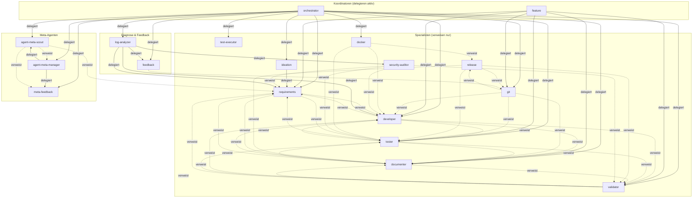

# Agent Delegation Map

Übersicht aller Agent-zu-Agent-Verweise im Framework.
Zeigt wer an wen delegiert (→) und wer an wen verweist (↗).

---

## Delegations-Matrix

| Agent | Delegiert an (→) | Verweist auf (↗) |
|-------|-------------------|-------------------|
| **orchestrator** | `ideation`, `requirements`, `developer`, `tester`, `validator`, `documenter`, `docker`, `git`, `agent-meta-scout`, `agent-meta-manager`, `meta-feedback`, `log-analyzer`, `feedback`, `test-executor` | — |
| **feature** | `git`, `requirements`, `tester`, `developer`, `validator`, `documenter` | — |
| **developer** | — | `requirements`, `tester`, `documenter`, `validator` |
| **tester** | — | `requirements`, `developer`, `documenter`, `validator` |
| **validator** | — | `developer`, `tester`, `requirements`, `documenter` |
| **documenter** | — | `developer`, `tester`, `requirements`, `validator` |
| **git** | — | `developer`, `tester`, `release`, `documenter` |
| **release** | — | `tester`, `validator`, `documenter`, `git` |
| **docker** | — | `developer`, `release`, `tester` |
| **ideation** | `requirements` | — |
| **agent-meta-manager** | `meta-feedback`, `agent-meta-scout` | — |
| **meta-feedback** | — | — |
| **agent-meta-scout** | — | `requirements`, `agent-meta-manager`, `meta-feedback` |
| **security-auditor** | — | `developer`, `tester`, `validator`, `requirements` |
| **requirements** | — | `developer`, `tester`, `documenter` |
| **log-analyzer** | `feedback`, `developer`, `security-auditor`, `requirements`, `orchestrator` | — |
| **feedback** | — | `git` (für verwandte git-Ops nach Issue-Erstellung) |
| **test-executor** | — | `developer` (failing code), `tester` (Test-Design) |

**Legende:**
- **Delegiert an (→):** Startet den Ziel-Agenten aktiv via Agent-Tool
- **Verweist auf (↗):** Empfiehlt dem User, an diesen Agenten zu wechseln (keine direkte Delegation)

---

## Delegations-Graph (Mermaid)



---

## Rollen-Kategorien

### Koordinatoren (haben Agent-Tool, delegieren aktiv)

| Rolle | Tools | Delegiert an |
|-------|-------|-------------|
| `orchestrator` | Agent, Bash, Read, Write, Edit, ... | 13 Rollen |
| `feature` | Agent, Bash, Read | 6 Rollen |
| `agent-meta-manager` | Agent, Bash, Read, Write, Edit, ... | 2 Rollen |
| `ideation` | Agent (nur für requirements-Übergabe) | 1 Rolle |
| `log-analyzer` | Agent, Bash, Read, Glob, Grep, ... | 4 Rollen |

### Spezialisten (kein Agent-Tool, verweisen nur)

| Rolle | Verweist auf |
|-------|-------------|
| `developer` | requirements, tester, documenter, validator |
| `tester` | requirements, developer, documenter, validator |
| `test-executor` | developer (failing code), tester (Test-Design) |
| `validator` | developer, tester, requirements, documenter |
| `documenter` | developer, tester, requirements, validator |
| `git` | developer, tester, release, documenter |
| `release` | tester, validator, documenter, git |
| `docker` | developer, release, tester |
| `security-auditor` | developer, tester, validator, requirements |
| `feedback` | git (für verwandte git-Ops nach Issue-Erstellung) |

### Endpunkte (keine aktive Delegation, nur Verweise)

| Rolle | Verweist auf |
|-------|-------------|
| `requirements` | developer, tester, documenter (implizit) |
| `agent-meta-scout` | requirements, agent-meta-manager, meta-feedback |
| `meta-feedback` | — (Terminal-Agent, keine Verweise) |

---

## Parallelisierbare Gruppen

Agenten die im gleichen Workflow-Schritt **keine Abhängigkeit** zueinander haben
und parallel laufen könnten:

| Workflow-Phase | Parallelisierbar | Bedingung |
|----------------|-----------------|-----------|
| Nach Implementierung | `validator` ∥ `documenter` | Beide lesen nur, kein Write-Konflikt |
| Nach Fix | `tester` ∥ `validator` | Nur wenn Tests + Validation unabhängig |
| CI/Fix-Verify-Loops | mehrere `test-executor`-Instanzen ∥ | Unabhängige Suites (z. B. Backend ∥ Frontend); 1 Suite pro Instanz — bewusst leichtgewichtig (nano-Tier, Read+Bash) |
| Nach Scout-Evaluation | `agent-meta-manager` ∥ `meta-feedback` | Verschiedene Aktionen |
| Feature-Lifecycle Ende | `documenter` ∥ `git` (branch) | Doku + Branch-Erstellung parallel |

**Nicht parallelisierbar:**
- `tester` → `developer` (TDD: Test muss vor Implementierung stehen)
- `developer` → `tester` (Code muss vor Test-Ausführung fertig sein)
- `validator` → `git` (Validierung muss vor Commit abgeschlossen sein)
- `requirements` → `tester` (REQ-ID muss vor Test-Schreiben existieren)

---

## Test-Design vs. Test-Execution (issue #517)

Test-Design und Test-Ausführung sind getrennte Rollen. Hintergrund: ein Vorfall mit drei
parallel gespawnten `tester`/`e2e-tester`-Instanzen auf einem 5,8-GB-RAM-Host erzeugte
Near-OOM-Bedingungen — Root Cause war die Kopplung von Test-Design (teures Modell-Tier,
Write-Tools, Analysetiefe) mit reiner Suite-Ausführung in derselben Rolle.

### Delegations-Guidance

| Situation | Richtige Rolle | Warum |
|-----------|---------------|-------|
| Neuer/geänderter Test, TDD-Planung, Coverage-Analyse, Test-Struktur | `tester` | Design-Phase: braucht Write/Edit/Glob/Grep-Tiefe und Analysetier |
| Browser-E2E-Design, visuelle Regression, a11y-Audit | `e2e-tester` | Browser-Design-Phase (MCP-Tools) |
| **Bestehende Suite ausführen** (Re-Run nach Fix, CI-Verify-Loop, parallele Suite-Verifizierung) | **`test-executor`** | Reine Execution: nano-Tier, Read+Bash, kein Schreiben |
| Fehlerhafte Produktions-Code-Stelle aus einem Run beheben | `developer` | Code-Änderung gehört nie zur Execution-Rolle |

**Faustregel:** Wer Tests *schreiben oder ändern* will → `tester`/`e2e-tester`.
Wer eine *fertige* Suite *laufen lassen* will → `test-executor`.

### Verhaltens-Details `test-executor`

- Führt nur die delegierte(n) Suite-Kommandos aus — keine Code-Generierung, keine
  Architektur-/Context-Modifikation, keine Deployment-Tools
- Reportet strukturiert: Pass/Fail/Skip-Counts, Exit-Codes, relevante Stdout-Auszüge,
  Log-Pfade (Output-Contract `STATUS/RESULT/ARTIFACTS` als Pflichtabschluss)
- **Sync-Turn-Contract (issue #506):** Hintergrundprozesse (z. B. Container-Runs) werden
  innerhalb des eigenen Turns aktiv abgewartet (`docker wait` / Polling mit Timeout) —
  der Turn endet niemals mit einem "waiting"-Platzhalter, es gibt keine Reaktivierung
  nach Turn-Ende
- Ressourcendisziplin: leichtgewichtig pro Instanz (günstigstes Tier, minimales Toolset);
  die Host-Kapazität für parallele Läufe bleibt in der Verantwortung des Aufrufers

---

## Häufigste Delegations-Pfade

```
User → orchestrator → requirements → tester → developer → tester → validator → documenter → git
       └────────────────────────── Workflow A: Neues Feature ───────────────────────────────────┘

User → orchestrator → requirements → tester → developer → tester → validator → git
       └────────────────────────── Workflow B: Bugfix ──────────────────────────┘

User → orchestrator → agent-meta-scout → agent-meta-manager → git
       └────────────────── Workflow N: Skill-Vorschlag ────────┘

User → orchestrator → ideation → requirements
       └────────── Workflow I: Neue Idee ──────┘

User → orchestrator → log-analyzer → feedback → gh issue create
       └──────────── Workflow O+P: Log-Analyse + Issue ──────────┘

User → /analyze-logs → log-analyzer
User → /feedback     → feedback → gh issue create
       └── Commands: direkte Einzel-Aktionen ──┘
```
