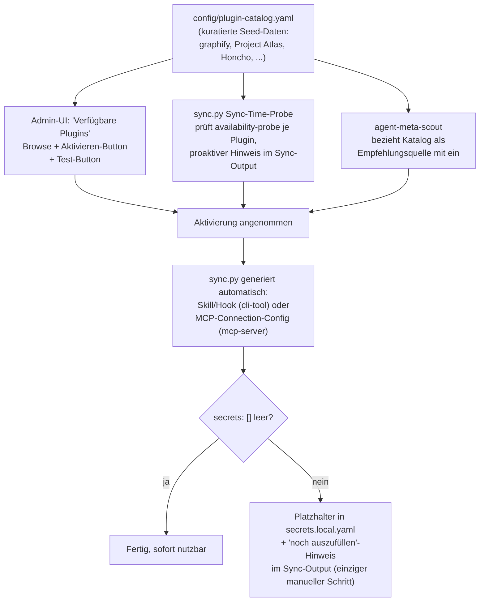

# Design: Vereinheitlichter Plugin-Katalog (External Tools + MCP Server)

## STATUS

**draft — wartet auf User-Review**, danach Übergabe an `writing-plans`-Skill für den Implementierungsplan.

## Problem

`agent-meta` hat aktuell zwei parallele, unverbundene Mechanismen, die dasselbe Grundproblem
("externes Werkzeug pro Projekt an-/abschaltbar machen, mit Injection in Agenten-Kontext")
zweimal lösen:

- **`config/external-tools-registry.yaml`** — CLI-Tools (aktuell 1 Eintrag: `graphify`). Injection
  via Skill (`.claude/skills/tool-graphify/`) + Hooks (`hooks/0-external/`).
- **`config/mcp-registry.yaml`** — MCP-Server (aktuell 6 Einträge: home-assistant, influxdb,
  viz-logger, a2a-handoff, honcho, reqogniloom, plus playwright). Injection via
  Connection-Config (`.mcp.json`) + Secrets-Template.

Ein drittes, extern anzubindendes System (**Project Atlas**, https://github.com/styler-ai/ProjectAtlas,
ein lokales MCP-basiertes Repo-Wissensgraph-Tool) passt architektonisch in die MCP-Welt, nicht
in die CLI-Tool-Welt — ein weiteres Signal, dass die Trennung beider Registries kein stabiles
Modell für "externe Werkzeuge" im Allgemeinen ist.

Zusätzlich fehlen zwei Fähigkeiten komplett: (a) eine Möglichkeit, verfügbare/empfohlene Plugins
proaktiv vorzuschlagen, und (b) eine Möglichkeit, ein installiertes Plugin aktiv zu testen
(nicht nur passiv auf Erreichbarkeit zu vertrauen).

## Ziel

Ein einziger Plugin-Katalog, der:
1. Graphify, MCP-Server (inkl. Honcho, ReqogniLoom) und künftig Project Atlas einheitlich modelliert.
2. Provider-agnostisch bleibt (Credo: kein `if provider == "Name"`, siehe `.claude/skills/provider-agnostic/SKILL.md`).
3. Eine Empfehlungs-Funktion trägt (Katalog → Admin-UI-Browse, Sync-Time-Probe, `agent-meta-scout`).
4. Nach Aktivierung so weit wie möglich automatisch verdrahtet, bis zur Secrets-Lücke.
5. Token-Kosten des Agent-Hint-Contents nicht erhöht (bestehenden compact/full-Split beibehalten
   und dabei eine vorbestehende Lücke schließt, siehe unten).
6. Eine manuelle Test-/Health-Check-Funktion bekommt (CLI + Admin-UI).

## Status-quo-Analyse

### Die 8 heute bekannten Fälle

| System | kind (neu) | origin-type | Aktivierung | Secrets | Submodule? |
|---|---|---|---|---|---|
| graphify | cli-tool | local-binary | `external-tools-registry.yaml` | 0 | Nein — lokale Binary |
| home-assistant | mcp-server | remote-saas | `mcp-registry.yaml` | 2 | Nein — SaaS/self-hosted |
| influxdb | mcp-server | local-process (`npx`) | `mcp-registry.yaml` | 4 | Nein |
| viz-logger | mcp-server | repo-owned-process | `mcp-registry.yaml` | 0 | Nein — Code im Repo |
| a2a-handoff | mcp-server | repo-owned-process | `mcp-registry.yaml` | 0 | Nein — Code im Repo |
| honcho | mcp-server | remote-saas | `mcp-registry.yaml` | 5 | Nein |
| reqogniloom | mcp-server | remote-saas | `mcp-registry.yaml` | 5 | Nein |
| playwright | mcp-server | local-process (`npx`) | `mcp-registry.yaml` | 0 | Nein |
| *Project Atlas (neu)* | mcp-server | local-process | *neu* | 0 (lokal, keine Auth) | Nein |

**Kein Submodule-Fall existiert im Repo überhaupt** — das Submodule-Schutzkonzept
(`rules/1-generic/submodule-protection.md`) betrifft ausschließlich Konsumenten-Projekte, die
`agent-meta` selbst als Submodul einbinden, nicht externe Tools innerhalb von agent-meta.

### Bestätigt: beide Registries sind bereits provider-agnostisch

Kein `if provider == "..."` in `scripts/lib/mcp.py`/`external_tools.py` für die Kern-Logik. Beide
nutzen generische Capability-Flags aus `config/ai-providers.yaml` (`skills_dir`, `hooks_dir`,
`rules_dir`).

### Gefundene, vorbestehende Lücke (nicht durch dieses Design verursacht, muss aber mit-gefixt werden)

Der Token-Spar-Mechanismus (compact/full-Split, Issue #540) entscheidet **global** per
Projekt-Flag (`COMPACT_MODE`, `scripts/lib/context.py:1079`), **nicht pro Provider-Fähigkeit**.
Provider ohne Lazy-Kanal (`has_rules: false` UND `has_skills: false`) — aktuell **ZCode** und
**KimiCode** aus dem gerade gemergten PR #662 — bekommen bei aktivem Compact-Modus **nur** die
komprimierte Pointer-Zeile, die volle Lazy-Datei (`mcp-<server>.md`) wird nie geschrieben
(`mcp.py:299`/`external_tools.py:367`, gated auf `pc.get("has_rules")`). Ergebnis: stiller
Informationsverlust für diese zwei Provider, kein Fallback im Code.

**Fix, der Teil dieses Designs wird:** die compact/full-Entscheidung wird zusätzlich zum globalen
Flag pro Provider auf `has_rules OR has_skills` geprüft — fehlt beides, erzwingt der Renderer
`compact=False` für diesen einen Provider (volle Einbettung statt Datenverlust), unabhängig vom
globalen `COMPACT_MODE`.

## Vereinheitlichtes Schema: `config/plugin-catalog.yaml`

Ersetzt `config/external-tools-registry.yaml` UND `config/mcp-registry.yaml` vollständig (harter
Schnitt, siehe Migration unten).

```yaml
version: 1.0.0
plugins:
  <id>:
    kind: mcp-server | cli-tool          # Diskriminator, bestimmt Rest-Schema
    description: "..."
    category: "..."
    enabled-by-default: false
    origin-type: local-binary | local-process | repo-owned-process | remote-saas
    availability-probe: command-v | npx-resolve | http-head | always | none
    provider-skip: []                    # z.B. Honcho + Opencode (natives Plugin)
    secrets: []                          # flache {{VAR}}-Liste, 0-5 Felder
    agent-hint: "..."                    # NUR im full/lazy-Kanal, nie compact

    # kind: mcp-server zusätzlich
    tools:
      allowed: [...]                     # INSTRUKTION, nie gedroppt (auch compact)
      blocked: [...]                     # dto. — Grundlage für mcp-guardrails.md
    connection:
      type: sse | stdio
      url: "..."            # sse
      headers: {...}        # sse
      command: "..."        # stdio
      args: [...]           # stdio
      env: {...}            # stdio

    # kind: cli-tool zusätzlich
    hooks: [...]
    permitted-injections: [{kind, name, description}]
    rule-content: "..."
```

`tools.allowed`/`tools.blocked` bleiben wie heute IMMER Teil des compact-Renderings (Sicherheits-
relevant, siehe `.claude/rules/mcp-guardrails.md`) — nur `agent-hint` wandert in den Lazy-Kanal.

### Initialer Katalog-Inhalt

Migration der 7 bestehenden Einträge 1:1 (Werte unverändert, nur ins neue Schema gehoben) plus
**ein neuer Eintrag: Project Atlas** (`kind: mcp-server`, `origin-type: local-process`,
`availability-probe: command-v` — genaue `connection.command`/`args` werden bei der tatsächlichen
Integration final verifiziert, da die öffentliche Doku die exakten MCP-Feldnamen nicht vollständig
auflistet; Platzhalter-Eintrag mit `enabled-by-default: false` bis verifiziert).

## Migration (harter Ersatz)

1. Neues Modul `scripts/lib/plugins.py` ersetzt `scripts/lib/mcp.py` + `scripts/lib/external_tools.py`
   (Logik bleibt weitgehend erhalten, nur der Registry-Zugriff und die `kind`-Verzweigung sind neu).
2. `.meta-config/project.yaml` bekommt einen neuen, einheitlichen `plugins:`-Aktivierungs-Block
   (ersetzt die bisherigen getrennten `external-skills:`- und MCP-Aktivierungs-Keys).
3. Ein einmaliges Migrations-Skript (`scripts/migrate-plugin-registry.py`, Wegwerf-Werkzeug) liest
   die alten Keys aus einer bestehenden `project.yaml` und schreibt den neuen `plugins:`-Block —
   für bestehende Consumer-Projekte, die schon `external-skills`/MCP-Aktivierung konfiguriert haben.
4. **Byte-Identitäts-Invariante** (analog zu #521s Migrations-Test): für alle 7 migrierten
   Bestandseinträge muss der generierte Output (Skill-Datei, `.mcp.json`, Rule-Content) vor und
   nach der Migration byte-identisch sein. Neuer Test `tests/test_plugin_catalog_migration_invariant.py`.
5. `config/external-tools-registry.yaml` + `config/mcp-registry.yaml` werden gelöscht, nicht als
   Deprecated-Stubs belassen (kein doppelter Pflegeaufwand).

## Empfehlungs-Flow (vier Schichten auf einem gemeinsamen Katalog)



- **Layer 1 — Katalog:** kuratierte Seed-Daten in `config/plugin-catalog.yaml`, initial 8 Einträge
  (7 migriert + Project Atlas).
- **Layer 2 — Admin-UI:** neue Sektion "Verfügbare Plugins", Liste aller Katalog-Einträge
  (unabhängig vom Aktivierungsstatus), Aktivieren/Deaktivieren-Toggle (bestehendes Muster,
  `docs/ui/admin-ui.html` MCP-Sektion als Vorbild) + neuer Test-Button (siehe unten).
- **Layer 3 — Sync-Time-Probe:** bei jedem `sync.py`-Lauf wird für jeden NICHT aktivierten
  Katalog-Eintrag `availability-probe` ausgeführt (günstig, keine Aktivierung); Treffer erzeugen
  eine `[HINWEIS]`-Zeile im Sync-Output ("graphify lokal gefunden, aber nicht aktiviert").
- **Layer 4 — `agent-meta-scout`:** bekommt Lesezugriff auf den Katalog, bezieht ihn als eine von
  mehreren Empfehlungsquellen mit ein (keine neue Discovery-Logik, nur ein zusätzlicher Blick in
  eine bereits vorhandene, kuratierte Liste).

## Wiring nach Annahme (voll automatisch bis zur Secrets-Lücke)

Sobald ein Plugin über einen der drei Trigger aktiviert wird: `sync.py` schreibt den
`plugins:`-Eintrag in `project.yaml`, generiert bei nächstem Lauf automatisch Skill/Hook
(`kind: cli-tool`) oder MCP-Connection-Config (`kind: mcp-server`). Fehlende Secrets werden als
`{{VAR}}`-Platzhalter markiert und im Sync-Output aufgelistet — der einzige verbleibende manuelle
Schritt ist das Ausfüllen echter Werte in `secrets.local.yaml`.

## Test-/Health-Check-Funktion (neu, existiert heute nicht)

Gemeinsame Logik in `scripts/lib/plugin_test.py`, pro `origin-type`:

| origin-type | Test-Strategie |
|---|---|
| `local-binary` | `command -v <bin>` + `<bin> --version` |
| `local-process` | Prozess kurz starten, MCP-`initialize`-Handshake, sofort beenden |
| `repo-owned-process` | wie lokal, Erfolg praktisch garantiert (Code im Repo) |
| `remote-saas` | HTTP-Request an `connection.url` mit Auth-Header aus Secrets; 2xx/401 = erreichbar, Connection-Refused = nicht erreichbar |

- **CLI:** `python3 scripts/sync.py --test-plugin <id>` — ruft `plugin_test.py` auf, druckt
  PASS/FAIL/UNKNOWN + Begründung.
- **Admin-UI:** neuer "Test"-Button pro Plugin-Zeile → `POST /api/plugins/<id>/test` (neuer
  Endpoint in `scripts/admin-server.py`) → ruft serverseitig dieselbe `plugin_test.py`-Funktion
  auf, liefert `{status, message, latency_ms}` als JSON zurück.
- **Kein Duplikat:** CLI und Admin-UI rufen exakt dieselbe Python-Funktion auf, kein
  eigenständiger Test-Code auf beiden Seiten.

## Provider-Agnostik-Fix (Teil dieses Designs, siehe Status-quo-Analyse)

`scripts/lib/plugins.py`'s compact/full-Entscheidung: `compact = COMPACT_MODE and (pc.get("has_rules") or pc.get("has_skills"))`
statt heute `compact = COMPACT_MODE` global. Neuer Regressionstest, der ZCode/KimiCode (oder
einen äquivalenten Provider ohne Lazy-Kanal) explizit gegen einen Provider MIT Lazy-Kanal
gegenprüft — analog zum bestehenden `tests/test_provider_hooks_config.py`-Stil.

## Testing-Strategie (Zusammenfassung)

- Migrations-Invarianz (byte-identisch für alle 7 Bestandseinträge, siehe oben).
- Neue Unit-Tests für `plugin_test.py` (gemockte Prozess-/HTTP-Aufrufe, kein echter Netzwerkzugriff
  in Tests — Muster wie `tests/test_orchestrator_guard_hook.py`/`tests/test_auto_github_release_hook.py`).
- Provider-Agnostik-Regressionstest für den compact/full-Fix (siehe oben).
- `sync.py --validate` muss weiterhin sauber bleiben, keine neuen Warnungen für die migrierten
  Einträge.

## Out of Scope (bewusst nicht Teil dieser Spec)

- Automatisches Ausfüllen von Secrets (API-Keys etc.) — bleibt manuell, aus Sicherheitsgründen.
- Dynamische Discovery unbekannter, nicht-kuratierter Plugins aus dem freien Internet — der Katalog
  bleibt kuratiert/manuell gepflegt, `agent-meta-scout` schlägt nur bereits katalogisierte Einträge vor.
- Exakte finale `connection`-Felder für Project Atlas (Command/Args) — werden bei der tatsächlichen
  Erst-Integration verifiziert (Platzhalter-Eintrag mit `enabled-by-default: false`), nicht Teil
  dieser Design-Entscheidung.
