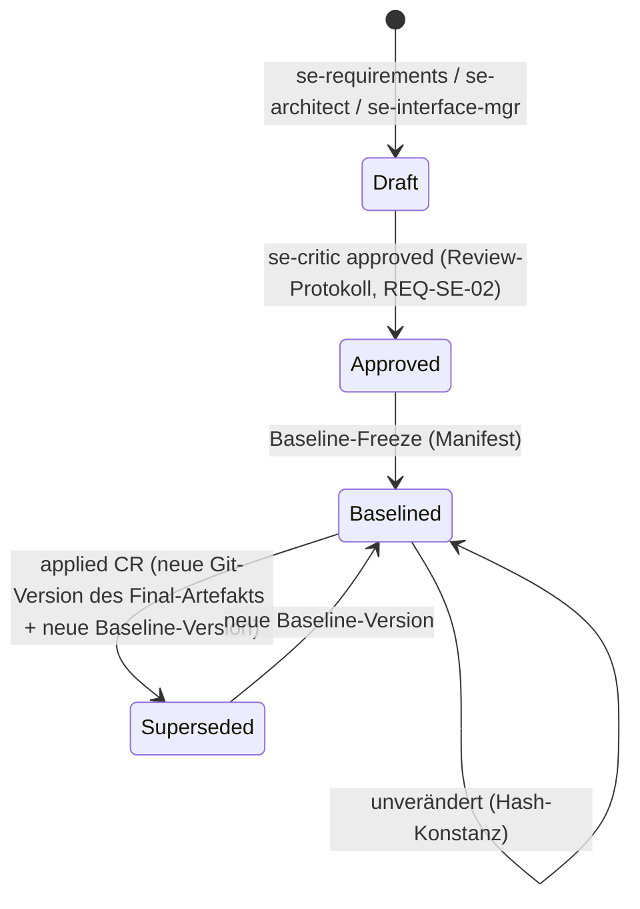
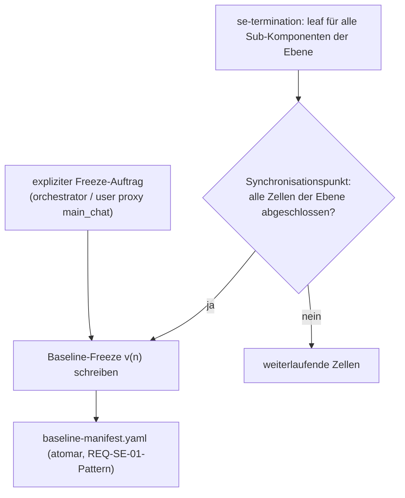
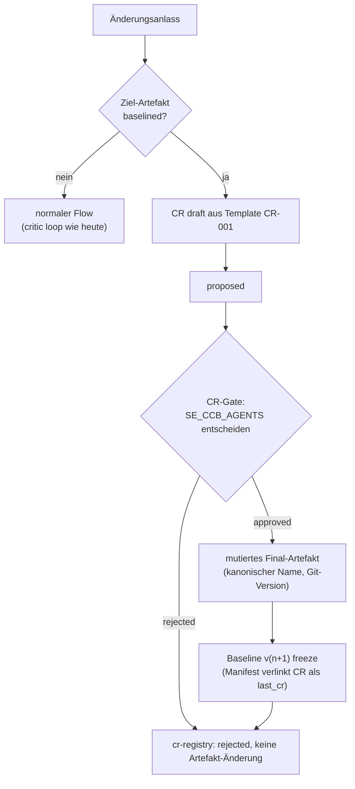

# SE Baseline & Change Control — Design (Issue #329)

> Issue: #329 — Baseline & Change-Control für die SE-Kaskade
> Relevante REQs: REQ-SE-01, REQ-SE-02, REQ-SE-03, REQ-SE-04, REQ-SE-05 (Persistenzbasis, `docs/REQUIREMENTS.md:41-45`)
> Status: **DESIGN-DOKUMENT** — implementierungsreif, aber die Umsetzung bleibt durch die
> Do-Not-Implement-Klausel des Issues gesperrt („Do NOT implement yet — concept placeholder;
> design document needed before implementation"). Dieses Dokument IST das geforderte Design-Dokument;
> die Implementierung startet erst nach expliziter Freigabe auf #329.

---

## 1. Ziel und Scope

Die SE-Kaskade produziert pro Ebene formale Artefakte (REQ-L{n}, ARCH-L{n}, Interface-Verträge,
Traceability-Matrix — siehe `docs/se-cascade/se-workflow.md:164-174`). Ohne Baseline sind diese
Artefakte mutable Textdateien: jeder spätere Lauf kann approved Ergebnisse still überschreiben, und
es gibt keine dokumentierte, konsistente Version des „agreeierten" Standes.

Dieses Design definiert:

1. **Baseline-Freeze** — unveränderliche Manifeste, die den critic-approved Stand von
   REQ-L{n}/ARCH-L{n}/Interface-Verträgen per Hash einfrieren.
2. **CR-Gate (Change Request)** — jede Änderung an einem baselineden Artefakt läuft durch ein
   explizites, getracktes Change-Verfahren mit Templates (CR-001 …).
3. **CR→Baseline-Traceability** — bidirektionale Verlinkung zwischen CR-Registry, Baseline-Manifesten
   und der Traceability-Matrix.
4. **Optionale Freeze-Config-Keys** — alles per `project.yaml` steuerbar, Default = heutiges Verhalten
   (byte-identisch).

Nicht im Scope: Runtime-Budget-Enforcement (#207, Runner-Sache), Metrik-Berechnung (#330, eigenes
Design), Export-Adapter (bleiben bei `docs/se-cascade/se-mcp-adapters.md`).

---

## 2. Begriffe und Zustandsmodelle

### 2.1 Artefakt-Lebenszyklus (Erweiterung des heutigen Flows)



**Persistenz-Basis (governing model):** die Artefakt-Taxonomie
(`rules/1-generic/se-cascade-artifact-taxonomy.md`, Issue #334, umgesetzt in
`agents/1-generic/se-architect.md`/`se-critic.md`). Kanonische Final-Namen **ohne Suffix**
(`L{N}_{FolderName}_{Requirements|Architecture}.md`); der Iterations-Zustand lebt im
A2A-Loop (Generator ⇄ Critic) und in den Review-Protokollen unter `reviews/`
(RVW-IDs, Lifecycle `se-cascade-review-lifecycle.md`), der Critic-Audit-Trail als
Endreport unter `reports/{FolderName}/`. Review-Intermediate (`*.iter-N.md`,
`*.critic.iter-N.md`, `*.critic.final.md`) neben Final-Artefakten sind verboten —
die REQ-SE-02-Suffix-Dateien im wörtlichen Sinn existieren nicht mehr.

Heute endet der Flow bei `Approved`. Der Freeze ist **rein additiv**: die Final-Artefakte
bleiben unter ihrem kanonischen Namen stehen, genau wie alle Outputs der Taxonomie (#334)
unverändert bleiben — der Freeze fügt nur ein Manifest hinzu, das die Final-Artefakte per
Hash pinnt. Versionierung über Git, nicht über Datei-Suffixe.

### 2.2 CR-Lebenszyklus

```
draft → proposed → approved ──→ applied ──→ incorporated (neue Baseline-Version)
                └→ rejected → archived (cr-registry-Eintrag, kein Artefakt-Edit)
```

Zustandsübergänge sind manuell/agent-getrieben (kein Daemon); `cr-registry.md` ist die single
source of truth für den CR-Stand, die CR-Datei trägt denselben Stand im Frontmatter.

---

## 3. Baseline-Artefakte und Verzeichnislayout

```
docs/se/<projektname>/                      (= {{SE_BASE_DIR}}, Layout nach Artefakt-Taxonomie #334)
├── STRATEGY.md
├── .se-state.yaml                          (unverändert, schemas/se-state.schema.json)
├── baseline/
│   ├── baseline-manifest.yaml              (aktuelle Baseline, höchste Version)
│   └── baseline-manifest.v1.yaml           (History: superseded, nicht gelöscht)
├── changes/
│   ├── CR-001-rename-auth-flow.md          (CR-<seq>-<slug>.md)
│   ├── CR-002-….md
│   └── cr-registry.md                      (CR-Registry, Tabellenformat §7)
├── L1/Gesamtsystem/
│   ├── L1_Gesamtsystem_Requirements.md     (kanonischer Name, ohne Suffix)
│   ├── L1_Gesamtsystem_Architecture.md     (kanonischer Name, ohne Suffix)
│   ├── interfaces/ … termination/ … validation/ …   (Zell-Subfolder, unverändert)
│   └── L2/AuthServiceSystem/ …             (rekursiv verschachtelt)
├── reviews/                                (Review-Protokolle mit RVW-IDs)
├── reports/                                (Critic-Endreports, Audit-Trail)
└── diagrams/
```

REQ/ARCH liegen Taxonomie-konform **flach in der Zelle** unter kanonischem Namen; die
Zell-Subfolder für Interfaces/Termination/Validation bleiben unverändert (nicht
Taxonomie-governed). Neu sind nur `baseline/` und `changes/`.

### 3.1 Freeze-Scope (was wird eingefroren)

Pro Freeze-Vorgang (Ebene L) landen im Manifest:

| Artefakt-Klasse | Quelle | Pfad-Muster |
|---|---|---|
| Requirements (Black-Box) | `se-requirements` final | Zelle: `L{n}_{Node}_Requirements.md` (kanonisch, ohne Suffix) |
| Architektur (White-Box) | `se-architect` final | Zelle: `L{n}_{Node}_Architecture.md` (kanonisch, ohne Suffix) |
| Interface-Verträge | `se-interface-mgr` (single-shot) | `L{n}/<Node>/interfaces/L{n}_<Node>_Interfaces.md` |
| Termination-Entscheidungen | `se-termination` (single-shot) | `L{n}/<Node>/termination/L{n}_<Node>_Decisions.md` |
| Traceability-Matrix | SE-Ende | `traceability-matrix.md` |

Pfad-Konvention: REQ/ARCH nach Artefakt-Taxonomie (`rules/1-generic/se-cascade-artifact-taxonomy.md`,
#334 — flach in der Zelle, kanonischer Name ohne Suffix); Interfaces/Termination/Validation nach
`docs/se-cascade/se-resume-session.md:36-46` (Zell-Subfolder). Single-Shot-Schritte ohne
Suffix (Requirements, Interfaces, Termination) werden mit ihrem unveränderten Dateinamen gepinnt.

### 3.2 Baseline-Manifest-Schema (Vorschlag `schemas/se-baseline.schema.json`)

```yaml
baseline_version: 2
created_at: "2026-09-06T10:00:00Z"
level: "L2"                      # Freeze-Vorgang ist ebenenweise
supersedes: 1                    # null bei v1
frozen:
  - artifact: "L2/AuthServiceSystem/L2_AuthServiceSystem_Requirements.md"
    artifact_class: requirements      # requirements|architecture|interfaces|termination|traceability
    sha256: "<hash über Dateiinhalt>"
    req_ids: ["REQ-L2-001", "REQ-L2-002"]
    approved_by: "se-critic"
    approved_at: "2026-09-06T09:40:00Z"
    last_cr: null                     # CR-ID, die dieses Artefakt zuletzt änderte
  - artifact: "L2/AuthServiceSystem/L2_AuthServiceSystem_Architecture.md"
    artifact_class: architecture
    sha256: "<…>"
    arch_elements: ["COMP-001-02"]
    last_cr: null
  - artifact: "L2/AuthServiceSystem/interfaces/L2_AuthServiceSystem_Interfaces.md"
    artifact_class: interfaces
    sha256: "<…>"
    interface_ids: ["IF-001-01"]
    last_cr: null
```

Design-Entscheidung — **Hash statt Kopie:** der Freeze dupliziert keine Inhalte; er pinnt
`sha256` über den Dateiinhalt. Gründe: (a) keine Doppelspeicherung, (b) die Artefakt-Taxonomie
(#334 — kanonische Final-Namen, keine Suffix-/Kopien-Versionen) bleibt unangetastet, (c) Mutation
wird beim Lesen erkennbar (Hash-Mismatch = Verstoß, fail-closed, §4.3).

---

## 4. Baseline-Freeze-Mechanik

### 4.1 Trigger



Der Synchronisationspunkt entspricht dem bestehenden Level-Barrier
(`docs/architecture/07-se-cascade.md:326-331`: alle Zellen einer Ebene müssen abgeschlossen sein,
bevor die Ebene als vollständig gilt). Der Freeze ist **kein** neuer Agent und **keine** neue
Pipeline-Stufe — er ist ein deterministischer Schritt des Koordinators (Haupt-`orchestrator` im
SE-Mode bzw. künftig der Runner aus #207), ausgelöst nach dem Level-Barrier oder explizit.

### 4.2 Freeze-Ablauf (deterministisch, kein LLM nötig)

1. Sammle alle Freeze-Scope-Dateien der Ebene (§3.1).
2. Verifiziere, dass jede Datei das kanonische Final-Artefakt ist (Taxonomie #334: kein
   `_iter-N`/`*.critic.*`-Intermediate daneben — `_iter-N` existiert nur für
   Klärungs-/Decomposition-Dokumente) und im Frontmatter `status: approved|done` trägt
   (REQ-SE-01-Felder).
3. Berechne `sha256` je Datei, schreibe `baseline-manifest.yaml` **atomar**
   (write-to-tmp + rename, identisches Muster wie `.se-state.yaml`, REQ-SE-01/04,
   `docs/se-cascade/se-resume-session.md:119-127`).
4. Bei existierender Vorgänger-Baseline: alte Manifest-Datei umbenennen auf
   `baseline-manifest.v<N>.yaml`, `supersedes` verketten.
5. Freeze-Eintrag in `.se-state.yaml` ergänzen (optionales Feld `baseline_version` — additive
   Schema-Erweiterung, kompatibel, da `se-state.schema.json` keine `additionalProperties: false`-
   Restriktion auf Top-Level hat).

### 4.3 Integritätsprüfung (fail-closed)

Jeder spätere Lesevorgang baselineder Artefakte (Resume-Algorithmus
`docs/se-cascade/se-resume-session.md:20-30`, Critic-Loop, V&V) vergleicht den aktuellen
Datei-Hash gegen den Manifest-Hash:

- Match → normal weiter.
- Mismatch → **Abbruch mit eindeutiger Meldung** („baselined artifact mutated: <path> —
  CR required"). Kein stiller Weiterlauf, kein Auto-Repair.

Grenze (convention boundary, Terminologie per AGENTS.md): der Hash-Check schützt gegen
**akzidentelle** Mutation während normaler Läufe; direkte Filesystem-Manipulation außerhalb des
Resume-/Pipeline-Pfads wird nicht verhindert (der Freeze ist kein Filesystem-Dämon).

### 4.4 Interaktion mit der Critic-Korrekturschleife

- Pre-Baseline: unverändert — `max_iterations: 3` (`se_variables` →
  `SE_MAX_CRITIC_ITERATIONS` in `config/role-defaults.yaml`), `blocked`
  → Eskalation an die Parent-Zelle (`docs/architecture/07-se-cascade.md:289-292`).
- Post-Baseline: **jede** Änderung läuft über CR (§5). Der Critic sieht an baselineden Artefakten
  ausschließlich CR-getriebene neue Git-Versionen des Final-Artefakts (kanonischer Name);
  sein `rejected`-Verdict löst innerhalb des CRs dieselbe Korrekturschleife aus (Iterationen
  zählen gegen das CR, nicht gegen die Zelle) und wird wie gehabt als Review-Protokoll unter
  `reviews/` (RVW-ID) protokolliert.

---

## 5. Change-Request-Flow (CR-Gate)

### 5.1 Anlässe (Quellen eines CRs)

| Quelle | Typischer Anlass | Verdrahtung |
|---|---|---|
| `stakeholder` | Bedarfsänderung am System | user proxy `main_chat` → orchestrator |
| `critic` | Approved-Stand erwies sich post-baseline als fehlerhaft | Critic-Verdict mit `source: critic` |
| `developer-escalation` | Interface-Änderungswunsch eines Developers | bestehender Eskalationspfad `se-{tier}-developer → se-interface-mgr` (`docs/architecture/07-se-cascade.md:171`) |
| `verifier` | Verifikations-Failure an baselinedem Artefakt | `se-verifier`-Ergebnis (Validation Floor) |
| `interface-manager` | Propagation-Map-Konflikt | `se-interface-mgr`-Escalation |

### 5.2 Gate-Position im Pipeline-Flow



**Implementierungs-Nahtstelle:** das Gate ist eine **conditional Stage** im `se-cascade`-Pipeline-Block,
exakt nach dem bestehenden Muster der Termination-Stage (`quality_pipelines.se-cascade` → Stage
`termination` in `config/role-defaults.yaml` — `mode: conditional`, `condition: {type: agent_decision}`). Vorschlag:

```yaml
- id: baseline-cr-gate
  agent: orchestrator
  allow_orchestrator: true
  mode: conditional
  condition:
    type: agent_decision          # entscheidet: Ziel-Artefakt baselined UND CR approved?
  task: 'CR-Gate: Bei Änderungen an baselineden Artefakten nur mit approved CR weiterfahren.'
```

**Wer entscheidet:** `SE_CCB_AGENTS` (Default `["orchestrator"]` — der Haupt-`orchestrator` im
SE-Mode; Bestätigungsinstanz mit User-Autorität bleibt der `main_chat` als User-Proxy). Kein
neuer Agent, kein neues Gremium — der „CCB" ist eine Rollenliste im Gate, keine Organisation.

### 5.3 Applied-CR-Ablauf

1. Neuer Stand der betroffenen Artefakte unter **unverändertem kanonischen Namen** (keine neue
   Datei, keine Suffix-Version — Taxonomie #334). Die alte Version bleibt über die Git-History und
   über die Baseline-History-Manifeste (deren `sha256` den alten Stand identifiziert) auffindbar —
   Versionierung über Git + Manifest-Version.
2. Neues Freeze v(n+1) mit `supersedes: n`; jede betroffene Manifest-Zeile trägt `last_cr: CR-<seq>`.
3. CR-Datei-Frontmatter → `status: incorporated`, `baseline_target: v(n+1)`.
4. Traceability-Matrix wird im selben Zuge aktualisiert (§7).

---

## 6. CR-Template (CR-001 …)

Dateiname: `changes/CR-<seq>-<slug>.md`, Sequenz dreistellig null-gepaddet (`CR-001`, `CR-002`, …).
Vorlage (wird als `docs/templates/SE_CHANGE_REQUEST.md` ausgeliefert):

```markdown
---
cr_id: CR-001
status: draft                 # draft|proposed|approved|rejected|applied|incorporated
created_at: "<ISO-8601>"
source: stakeholder           # stakeholder|critic|developer-escalation|verifier|interface-manager
baseline_version: 1
baseline_target: null         # v(n+1) nach incorporation
affected:
  requirements: []            # REQ-L{n}-IDs
  architecture: []            # ARCH-Element-IDs (COMP-…)
  interfaces: []              # IF-IDs aus der Interface-Registry
decision:
  approver: null              # Agent oder main_chat (User)
  decided_at: null
  rationale: ""
---

# CR-001: <Kurztitel>

## 1. Anlass
<Wer hat was warum angestoßen — Quelle + Original-Verweis (Issue/Kommentar/Session).>

## 2. Betroffene baselinede Artefakte
<Exakte Pfade + aktuelle Baseline-Version; jede Zeile entspricht einer `frozen:`-Zeile im Manifest.>

## 3. Änderungsbeschreibung
<Was genau ändert sich — Statement-Diff auf REQ-Ebene, WB-Änderung auf ARCH-Ebene, Signatur-Änderung auf IF-Ebene.>

## 4. Impact-Analyse
<Propagation: welche REQ-L{n} erben die Änderung? Welche `new_internal_*`-Interface-Zeilen der
Propagation-Map (docs/architecture/07-se-cascade.md:240-258) verschieben sich? Same-Level-Isolation
gewahrt (07-se-cascade.md:107-111)? Welche Leaf-Nodes/Developer-Tiers sind neu betroffen?>

## 5. Verification-Plan
<Welche Critic-Checks (Completeness/Consistency/Verifiability/Traceability, 07-se-cascade.md:298-304)
und welche V&V-Stufen (se-validator/se-verifier, `quality_pipelines.se-cascade` → Stage
`validation` in `config/role-defaults.yaml`) laufen nach der Änderung?>

## 6. Entscheidung
- [ ] approved — approver: ___, date: ___
- [ ] rejected — rationale: ___
```

Pflichtregeln: (a) ein CR ohne `affected`-Eintrag ist invalid (Schema-Validation gegen
`schemas/se-cr.schema.json`, analog `se-state.schema.json`); (b) ein CR ändert **niemals** ein
Artefakt, solange `status != approved` (das ist die eigentliche Gate-Wirkung, durchsetzbar im
Runner/Coordinator-Code, nicht durch Vertrauen in Prompts).

---

## 7. CR→Baseline-Traceability

### 7.1 `changes/cr-registry.md` (Tabellenformat)

```markdown
# CR-Registry — <Projekt>

| CR | Status | Baseline von → nach | affected (REQ/ARCH/IF) | Decision | Datum |
|----|--------|--------------------|------------------------|----------|-------|
| CR-001 | incorporated | v1 → v2 | REQ-L2-003 · COMP-001-02 · IF-001-01 | approved (main_chat) | 2026-09-06 |
| CR-002 | rejected | v1 (keine Änderung) | IF-001-02 | rejected (orchestrator) | 2026-09-06 |
```

### 7.2 Traceability-Matrix-Erweiterung

`traceability-matrix.md` (bestehendes Artefakt, `docs/se-cascade/se-workflow.md:172`) erhält zwei
additive Spalten:

| … bestehende Spalten … | Baseline | Letzter CR |
|---|---|---|
| … | v2 | CR-001 |

### 7.3 Rückverfolgung (bidirektional)

- **Vorwärts:** CR-Datei → `affected` → Manifest-Zeilen (über Pfade) → Traceability-Matrix-Zeilen.
- **Rückwärts:** Matrix-Zeile → `Baseline`/`Letzter CR`-Spalten → Manifest (`frozen[].last_cr`)
  → CR-Datei (Anlass, Decision, Verification-Plan).
- Konsistenz-Regel: zu jeder Zeit gilt „CR-Registry ⟷ Manifeste ⟷ Matrix sind äquivalent";
  Verstoß = Konsistenz-Check-Fund (Implementierung: statischer Konsistenz-Check im
  `scripts/consistency-check.py`-Muster — Fail-closed-Finding, convention boundary).

---

## 8. Konfiguration — optionale Freeze-Keys

Alle Keys sind **optional mit aktivitäts-neutralem Default**. Ablageort: `se_variables`-Block in
`config/role-defaults.yaml` (Defaults) mit Override über `variables` in
`.meta-config/project.yaml`.

```yaml
# se_variables (config/role-defaults.yaml) — Neuvorschläge:
SE_BASELINE_ENABLED: false      # false = exakt heutiges Verhalten (kein Freeze, kein Gate)
SE_BASELINE_LEVELS: ["L1", "L2"]  # welche Ebenen gefreezt werden
SE_BASELINE_DIR: baseline       # relativer Pfad unter docs/se/<projektname>/
SE_CHANGE_DIR: changes          # relativer Pfad für CR-Dateien + cr-registry.md
SE_CR_ID_PREFIX: "CR"           # ID-Präfix, Sequenz dreistellig
SE_CCB_AGENTS: ["orchestrator"] # entscheidungsberechtigte Rollen am CR-Gate
```

- `SE_BASELINE_ENABLED: false` (Default): Pipeline-Output **byte-identisch** zum heutigen Stand —
  keine neuen Dateien, keine neuen Stages, keine neuen Warnungen. Das ist die Bedingung für die
  sichere Auslieferung hinter der Do-Not-Implement-Klausel.
- Neue Platzhalter müssen in `scripts/lib/consistency/placeholders.py` registriert werden
  (Liste der SE-Variablen dort: Zeilen 86–87) — Implementierungshinweis, kein Verhalten vor Freigabe.
- Neues Schema-File: `schemas/se-baseline.schema.json` (Manifest, Struktur §3.2) und
  `schemas/se-cr.schema.json` (CR-Frontmatter, §6) — Muster: `schemas/se-state.schema.json`.
- Interaktion mit dem Pipeline-Override: `.meta-config/project.yaml` →
  `quality-pipelines.overrides.se-cascade.enabled: false` (bewusste Deaktivierung per #652,
  `docs/architecture/07-se-cascade.md:7-10`) überschreibt weiterhin ALLES — die Baseline-Funktion
  erbt denselben Schalter (kein Freeze in deaktivierter Pipeline).

---

## 9. Interaktion mit requirements-/release-Agenten

| Agent | Interaktion | Regel |
|---|---|---|
| `se-requirements` | REQ-Änderungen an baselineden REQ-L{n} | Nur via CR; kein Maverick-Edit (gleiche Disziplin wie die Same-Level-Isolation). REQ-SE-10…13 (Role-Boundary, `docs/REQUIREMENTS.md:51-54`) bleiben unberührt. |
| `requirements` (generisch, Owner von `docs/REQUIREMENTS.md`) | Trennung Projekt-REQ ↔ Framework-REQ | REQ-SE-* (Framework) bleiben in `docs/REQUIREMENTS.md`; REQ-L{n} (Projekt) bleiben in `docs/se/<projektname>/`. Der Baseline-Mechanismus ändert an dieser Trennung nichts. Projekte, die beide Ebenen fahren, verlinken externe REQ-IDs in den CR-`affected`-Listen. |
| `se-interface-mgr` | Interface-Verträge als Freeze-Objekt | Vertragsänderung = CR-Quelle `interface-manager`/`developer-escalation`; Registry bleibt Quelle der Propagation-Map-Zeilen. |
| `se-{tier}-developer` | Änderungswunsch an Baseline | Eskalationspfad → CR (kein direkter Edit); Implementierung läuft erst nach `incorporated` gegen den neuen Stand. |
| `se-verifier` / `se-validator` | Failures an Baseline | Verification-Failure = CR-Quelle `verifier` (kein stiller Re-Run an mutiertem Stand — Hash-Check §4.3 verhindert das ohnehin). |
| `release` (generisch) | Baseline-Versionen als Release-Einheiten | Baseline v(n) = Release-Kandidat für SE-Artefakte; Release-Notes können `cr-registry.md` inkludieren; „applied ohne neue Baseline" = kein Release. Export-Adapter (Markdown default, `docs/se-cascade/se-mcp-adapters.md:14-21`) exportieren den baselineden Stand, nicht Working-State. |
| `orchestrator` (SE-Mode) | Freeze-Trigger + CR-Gate-Rolle | `SE_CCB_AGENTS`-Mitglied; führt §4.2-Freeze und §5.2-Gate aus bzw. delegiert sie an den künftigen Runner (#207). |

---

## 10. Implementierungs-Akzeptanzkriterien (für die spätere Freigabe)

- [ ] Freeze ist reines Manifest-Write (atomar, write-to-tmp + rename) und ändert **keine** bestehende Datei.
- [ ] `SE_BASELINE_ENABLED: false` → Sync-/Pipeline-Output byte-identisch zum Stand ohne Feature.
- [ ] Hash-Mismatch beim Lesen baselineder Artefakte → fail-closed Abbruch mit eindeutiger Meldung.
- [ ] CR-Gate blockiert Änderungen an baselineden Artefakten ohne `approved`-CR (positiv- und negativ-getestet).
- [ ] CR-Sequenz `CR-001…` kollisionsfrei (Registry-seitige Sequenzvergabe).
- [ ] `cr-registry.md` ⟷ Manifeste ⟷ Traceability-Matrix konsistent (statischer Konsistenz-Check grün;
      absichtlicher Drift erzeugt ERROR-Finding).
- [ ] Manifeste validieren gegen `schemas/se-baseline.schema.json`, CRs gegen `schemas/se-cr.schema.json`
      (pytest, Fixture-Pattern analog `tests/test_se_persistence.py`).
- [ ] Resume über Baseline hinweg: `.se-state.yaml` + Manifest → Session setzt korrekt fort (Roundtrip-Test).
- [ ] Neue SE-Variablen in `placeholders.py` registriert; `sync.py --validate` grün.

## 11. Grenzen

- **Convention boundary, keine Security boundary:** Hash-Check und Gate blockieren akzidentelle
  Mutation in normalen Läufen; direkte Filesystem-Manipulation umgeht sie (Terminologie per AGENTS.md).
- Der Freeze-Versionierung fehlt ein kryptografischer Beweis (kein Signature-Schema) — bewusst, da
  die Bedrohung Modell-/Prozess-Fehler ist, kein Angreifer.
- Budget-Abbruch gehört zu #207 (Runner) und ist hier bewusst nicht dupliziert.
