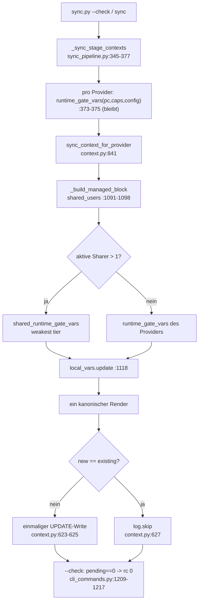
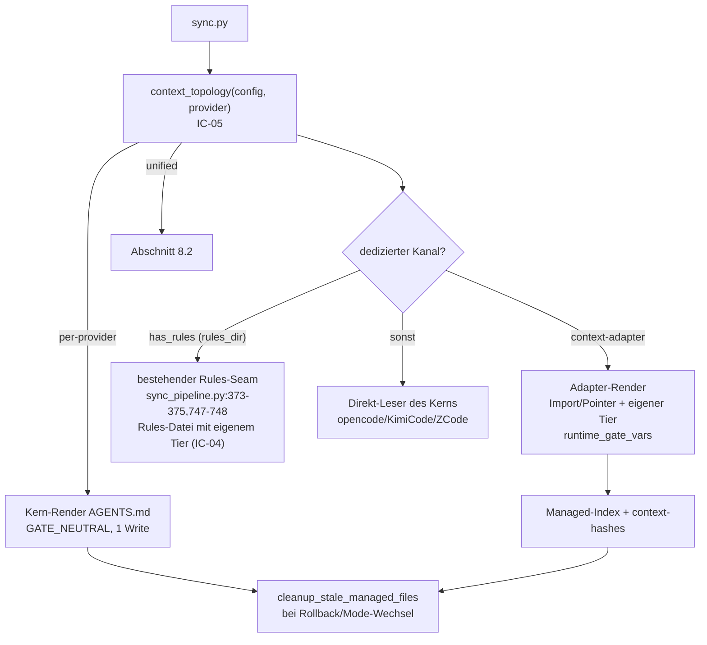

# Context-File Modes (unified / per-provider) — Design

> Status: **Entwurf** — dieses Dokument ist Spec-Input. Den Approval-Marker
> `Status: APPROVED` setzt `concept-reviewer`, nicht dieses Dokument.
> Trace-Anker (wird von der Spec unverändert übernommen):
> `spec-id: SPEC-CONTEXT-FILE-MODES-2026-09-13`.
>
> Dieses Dokument ist ein **Systemdesign** (Architectural: öffentliche
> Config-Contracts + Schema + mehrere Subsystemgrenzen). Es enthält
> Komponentenzerlegung, Schnittstellen-Contracts, Trade-off-Entscheidungen und
> Datenflüsse — **keine Spec** und **keinen Implementierungscode** (nur exakte
> Signaturen). Es ist der vorgelagerte Stage-Input der Pipeline
> `quality_pipelines.concept-driven-dev` (Stage `specify`).

### Verifikations-Legende

- **VERIFIED** — direkt im Repo gelesen (Datei:Zeile unten angegeben).
- **VERIFIED-RESEARCH** — vom Auftrag vorgegebene, bereits verifizierte
  Provider-Fakten (nicht erneut recherchiert).
- **HYPOTHESIS** — nicht verifiziert; muss vor dem Scharfschalten per
  Real-Repo-Test geprüft werden. Jede HYPOTHESIS ist im Text markiert.

### Revision

| Datum | Autor | Änderung |
|---|---|---|
| 2026-09-14 | concept-architect | Erstfassung. Zwei Modi (`unified` default / `per-provider`), Weakest-Tier-Regel für geteilte Kontextdateien, Fix des AGENTS.md-Doppelschreib-Defekts (Phase 0), Adapter-Topologie (Phase 1/2). |
| 2026-09-14 | concept-architect | **Revision 2 (User-Korrektur, autoritativ).** (1) **Gemini und Antigravity sind EIN Provider** (`config/ai-providers.yaml:89-162`); das bisherige „Gemini-Dual-Leser"-Konstrukt (altes OQ-3, A6) war falsch und ist entfernt. (2) OQ-3 durch eine **Re-Derivation des dedizierten Tier-Kanals** ersetzt (Rules-Kanal vs. `context.fileName` vs. geteilter `AGENTS.md` + Hook) — Empfehlung Rules-Kanal (`DECISION-7`, §5.1.1). (3) Provider-Matrix gegen `config/ai-providers.yaml` re-verifiziert, Gemini/Antigravity-Zeile zusammengeführt. (4) **FINDING F-RULESLOC:** `rules_dir: .gemini/rules` (`config/ai-providers.yaml:95`) weicht von der dokumentierten Antigravity-Workspace-Rules-Lokation `.agents/rules` ab; nur dokumentiert, **keine Config-Änderung**. |
| 2026-09-14 | concept-specifier | **Revision 3 (Naming-Korrektur, autoritative User-Entscheidung).** Der Topologie-Schalter heißt `context_file.topology` (Enum `unified` \| `per-provider`, Default `unified`) und liegt **innerhalb des bestehenden `context_file`-Blocks** (`config/project-config.schema.json:885-915`), als Sibling des Dichte-`mode` (`full\|compact`, #540) — **nicht** als neues Top-Level-`context`-Objekt. Begründung: `context_file.mode` bedeutet bereits Dichte; die Topologie-Achse darf den Namen `mode` nicht wiederverwenden. Alle Vorkommen von `context.mode`/`context_mode` sind ersetzt; Resolver/Consistency umbenannt (`providers.py::context_topology`, `consistency/context_topology.py::check_context_topology_consistency`); Provider-Override verschachtelt als `context_file.provider-overrides.<Provider>.topology` (Muster `orchestrator.provider-overrides`). Präzedenz unverändert deterministisch: Provider-Override > Projekt > Default. OQ-1 damit gelöst. Status bleibt `Entwurf`. |

---

## 1. Problem

### 1.1 Der Doppelschreib-Defekt (Phase-0-Blocker)

`AGENTS.md` ist die geteilte Kontextdatei von Opencode (`runtime_gate: permission`,
`config/provider-capabilities.yaml:75`) und Gemini/Antigravity (`runtime_gate: hook`,
`:94`). Beide sind im Projekt aktiv (`.meta-config/project.yaml:6-9` → `Claude`,
`Opencode`, `Gemini`; `Claude` rendert `CLAUDE.md`, nicht `AGENTS.md`).

> **Scope-Korrektur (Revision 2, autoritativ):** „Gemini" und „Antigravity" sind
> in diesem Repo **derselbe Provider** — der eine Registry-Eintrag `Gemini`
> (`config/ai-providers.yaml:89-162`) *ist* der Antigravity-Agent-Runtime. Es gibt
> **keinen** zweiten Leser und **kein** „Dual-Leser"-Problem. Alle Aussagen in
> diesem Dokument über „Gemini/Antigravity" meinen genau diesen einen Provider.
> Diese Korrektur betrifft nur den `per-provider`-Kanal (§5) und die
> Provider-Matrix (§5.1); der Phase-0-`unified`-Fix (§4) und sein Defekt sind
> davon **nicht** betroffen (sie beruhen auf der Zwei-Sharer-Kollision
> Opencode ∩ Gemini, die auch bei einem einzigen Gemini-Provider identisch ist).

Pro Sync-Lauf wird `AGENTS.md` **zweimal** geschrieben:

1. `sync_pipeline._sync_stage_contexts` (`scripts/lib/sync_pipeline.py:345-377`)
   iteriert über alle Provider. Pro Provider wird
   `provider_variables.update(runtime_gate_vars(pc, caps, config))` injiziert
   (`:373-375`) und `sync_context_for_provider(...)` aufgerufen (`:376`).
2. Für **jeden** `AGENTS.md`-Sharer routet der Dispatch in
   `context.sync_context_for_provider` (`scripts/lib/context.py:841-847`) über
   `_shares_context_with_embedded_rules` (`:791-815`) in die
   „Opencode-Strategie" `_sync_opencode_context` (`:553-656`) — Gemini und
   Opencode tragen beide `context-embedded-rules`
   (`config/ai-providers.yaml:113,182`).
3. `_sync_opencode_context` rendert den Managed Block mit den **provider-eigenen**
   `GATE_*`-Variablen und schreibt ihn (`context.py:606-625`).

Weil der Tier pro Provider verschieden ist, sind die zwei Renders verschieden und
die Datei konvergiert nie (Reihenfolge `Opencode` vor `Gemini`):

| Writer (Reihenfolge im Lauf) | Tier | Gerenderter Gate-Block | Länge (instrumentiert) |
|---|---|---|---|
| erster Sharer (Opencode) | `permission` | `GATE_ENFORCED=false`, kein unbedingter Satz | 25874 |
| zweiter Sharer (Gemini) | `hook` | `{{#if GATE_ENFORCED}}` → `# CRITICAL GATE` | 26010 |

Der zweite Write überschreibt den ersten. Auf der Platte steht danach die
Variante des **letzten** Writers (`hook`, 26010); die `--check`-Auswertung
rendert beim nächsten Lauf aber wieder mit der Variablen des **ersten** Sharers
(`permission`, 25874) und vergleicht gegen die Platte — deshalb meldet
`sync.py --check` dauerhaft Drift:

- `sync.py --check` schaltet auf dry-run (`scripts/sync.py:99`,
  `_normalize_check_dry_run`) und wertet in
  `scripts/lib/cli_commands.py:1209-1217` `len(log.actions) > 0` als
  „out of sync" → `sys.exit(1)`.
- Der erste Sharer erzeugt bei jedem Lauf einen `UPDATE`-Action-Eintrag
  (`context.py:623`) für `AGENTS.md`, weil sein Render (25874) nicht dem
  Last-Writer-Stand (26010) entspricht, obwohl sich die Config nicht geändert hat.

Disk-Beleg im Selbst-Repo: `AGENTS.md:208` enthält `# CRITICAL GATE` (der
`hook`-Render des letzten Sharers), während ein frischer `--check` mit dem
`permission`-Render des ersten Sharers (25874) beginnt und deshalb Drift sieht.

Der Defekt ist **nicht** die geteilte Datei an sich — der bestehende
Konvergenz-Vertrag (`_build_managed_block`, dokumentiert in `context.py:791-815`
und formalisiert in `tests/test_agents_md_shared_context_convergence.py:49-115`)
verlangt bereits byte-identische Renders. Der Defekt ist, dass
`runtime_gate_vars` **außerhalb** von `_build_managed_block` pro Provider
injiziert wird und damit eine shared-block-invariante Größe provider-abhängig
macht.

### 1.2 Der strukturelle Konflikt dahinter

Die Runtime-Gate-Spezifikation
(`docs/specs/2026-09-13-opencode-runtime-gate-design.md`, F-05) verlangt, dass
die `hook`-Ausgabe byte-identisch zum bisherigen Wortlaut bleibt. Eine einzige
geteilte Datei kann aber nur einen Gate-Wortlaut tragen. Sobald zwei Sharer
verschiedene Tiers haben, ist „byte-identisch für beide" **unmöglich**:

- Eine Datei, ein Render → der geteilte Block muss auf den schwächsten Sharer
  abgeschwächt werden.
- Volle Tier-Ehrlichkeit pro Provider → echte Kanaltrennung, was Provider
  erfordert, die zusätzlich zur Kerndatei einen **eigenen nativen Kanal** lesen:
  eine Adapter-Datei (z. B. `CLAUDE.md`) oder einen provider-eigenen Rules-Kanal
  (`has_rules: true`, `rules_dir`, z. B. Gemini/Antigravity, §5.1.1).

Dieses Design löst beides: `unified` (default) stellt Determinismus her, indem
der geteilte Render den **schwächsten** Sharer abbildet; `per-provider` stellt die
Tier-Ehrlichkeit datengetrieben über echte Dateitrennung wieder her.

---

## 2. Ziel / Nicht-Ziele

**Ziel**

1. Zwei umschaltbare Modi, default = heutiges Layout, konfigurierbar über
   `context_file.topology` (Enum `unified` | `per-provider`).
2. `unified`: **ein** deterministischer Render pro geteilter Kontextdatei, Tier =
   schwächster Sharer; `sync.py --check` konvergiert auf rc 0.
3. `per-provider`: kanonischer Kern in `AGENTS.md` + **provider-native
   dedizierte Kanäle**, die den Kern referenzieren/importieren und **ihren
   eigenen** Gate-Tier tragen — entweder eine Adapter-Datei (Import/Pointer) oder
   ein provider-eigener Rules-Kanal (`has_rules`/`rules_dir`, §5.1.1).
4. Provider-Agnostik: ausschließlich Config-Keys/Capability-Flags, niemals
   `if provider == "…"`.

**Nicht-Ziele**

- Kein zweiter Mechanismus, der auf Self-Identification-Bloecken („if you are
  X") beruht. Forschung (NeurIPS 2024 SAD-Benchmark) zeigt, dass
  Self-Identification-Instruktionsselektion unzuverlässig ist; `per-provider`
  löst das Problem ausschließlich über **echte Kanal-/Dateitrennung**.
- Keine Security Boundary. Alle Guards bleiben **Convention boundary**
  (Terminologie: `.claude/rules/branch-guard.md#guard-terminologie-convention-boundary-vs-security-boundary`).
- Kein Umbau des Runtime-Gate-Kernresolvers `provider_runtime_gate_tier`
  (`scripts/lib/providers.py:357-386`) und kein Fork von `hooks.py` /
  `orchestrator-guard.sh`.
- Kein Zwangs-Merge von `opencode.json` (#747).
- Keine Änderung der Tier-Vokabel um einen vierten „neutral"-Tier-Wert, der die
  Semantik von `RUNTIME_GATE_TIERS` (`runtime_gate.py:35`) verwässert (siehe
  §5.3, `GATE_NEUTRAL` ist ein Render-State, kein Runtime-Tier).
- Keine Implementierung, keine Spec, kein Plan; keine REQ-ID-Vergabe.

**Backward Compatibility (explizit):** Der Default `context_file.topology: unified`
verlangt **keine** neue Config und ändert das **Layout** nicht (keine zusätzlichen
Dateien). Für jeden Provider, dessen `context_file` **nicht** mit einem Sharer
eines anderen Tiers geteilt wird, ist der Render byte-identisch zu heute
(insbesondere die `hook`-Provider-Ausgabe, F-05). Byte-identisch **nicht** bleibt
zwangsläufig die eine geteilte `AGENTS.md`-Gruppe mit gemischten Tiers: dort wird
der Render bewusst auf den schwächsten Sharer vereinheitlicht — das ist die
einzige, dokumentierte Inhaltsänderung und zugleich der Fix des `--check`-rc1.
Es ist **keine Format-, Schema- oder Layout-Änderung** und **kein Breaking
Change** im Sinne der Commit-Konventionen.

---

## 3. Modell: `context_file.topology`

### 3.1 Enum und Semantik

| Wert | Semantik | Artefakte pro Provider-Gruppe |
|---|---|---|
| `unified` (default) | Ein geteilter Kontextfile pro Provider-Gruppe; effektiver Tier = **schwächster Sharer**; genau ein deterministischer Render. | bestehende Dateien, unverändert |
| `per-provider` | Kanonischer Kern (`context_file.core_file`, default `AGENTS.md`) + provider-native **dedizierte Tier-Kanäle** (Adapter-Datei oder eigener Rules-Kanal), die den Kern referenzieren und **ihren eigenen** Tier tragen. | Kern + 0..n Adapter-/Rules-Kanäle |

### 3.2 Präzedenz (deterministisch, fail-safe)

```
Provider-Override  >  Projekt  >  Default
context_file.provider-overrides.<Provider>.topology
        > context_file.topology
        > "unified"
```

Gleiches Muster wie die bereits etablierte Orchestrator-Auflösung
`variables._resolve_orch_mode(orch_config, provider_override)`
(`scripts/lib/variables.py:50-85`): Provider-Override schlägt Projekt, Projekt
schlägt Default. Ungültige/fehlende Werte fallen **immer** auf `unified` zurück
(safe-side: keine neuen Dateien, kein neues Verhalten ohne explizites Opt-in).

### 3.3 Namens-Alternativen (bewertet)

| Kandidat | Bewertung | Entscheidung |
|---|---|---|
| `context_file.topology` | **Sibling-Key im bestehenden `context_file`-Block** (`project-config.schema.json:885-915`), direkt neben dem Dichte-`mode` (`full|compact`, #540). Semantisch präzise (Topologie vs. Dichte) und kollisionsfrei, weil der bestehende `mode`-Name nicht wiederverwendet wird. | **gewählt** (autoritative User-Entscheidung) |
| `context.mode` (Top-Level) | Vorgängervorschlag: kurz, aber eigener Top-Level-Namespace und zweiter `mode`-Key mit fachfremder Enum-Domäne → Verwechslung mit `context_file.mode` (Dichte). Genau die Kollision, die OQ-1 aufwirft. | **verworfen** (löst OQ-1 nicht) |
| `context_file.mode` (erweitern) | Würde die bestehende Dichte-Enum (`full|compact`) um fachfremde Werte erweitern. | verworfen (breaking für den Dichte-Contract) |
| `context.layout` | Semantisch präziser (Layout vs. Dichte), kollisionsfrei — aber außerhalb des etablierten `context_file`-Blocks. | verworfen (Namens-/Namespace-Inkonsistenz) |
| `context.rendering` | Beschreibt nur den Render, nicht die Dateitopologie. | verworfen (zu eng) |

Unterstützende Keys im (erweiterten) `context_file`-Block:

- `context_file.topology` — Enum `unified|per-provider`, default `unified`.
- `context_file.core_file` — Pfad des kanonischen Kerns, default `AGENTS.md`.
- `context_file.provider-overrides.<Provider>.topology` — Provider-Override.

---

## 4. `unified` — Design (Phase 0, sofort implementierbar)

### 4.1 Weakest-Tier-Regel

**Sharer-Definition (normativ):** Ein Sharer einer Kontextdatei ist ein
**aktiver** Provider (`resolve_providers(config, provider_config)`,
`providers.py:175`), dessen `context_file` genau diese physische Datei ist und
der sie in diesem Lauf rendert. Nicht aktive, nur konfigurierte Provider
(Beispiel: `agent-meta` aktiviert nur Claude/Opencode/Gemini,
`.meta-config/project.yaml:6-9`, während `config/ai-providers.yaml` zusätzlich
Codex/ZCode/KimiCode auf `AGENTS.md` zeigt) zählen **nicht** — sie lesen die
Datei in diesem Projekt nicht.

> Abgrenzung zum bestehenden Verhalten: Die *Pfad-Union* in
> `_build_managed_block` (`context.py:1091-1098`) läuft weiterhin über alle
> **konfigurierten** gleichnamigen `context_file`-Provider (bestehender Contract
> für geteilte Path-Felder). Nur die **Tier-Berechnung** ist auf die aktive
> Sharer-Menge beschränkt. Für `agent-meta` ergibt das Tier `permission`
> (Opencode) und nicht `advisory` (inaktives KimiCode/ZCode).

Der effektive Tier einer geteilten Kontextdatei ist das **Minimum** über alle
aktiven Sharer. Kanonische Stärke-Ordnung (schwach → stark):

```
advisory  <  permission  <  plugin  <  hook
```

Die Ordnung leitet sich aus der bestehenden Vokabel `RUNTIME_GATE_TIERS`
(`scripts/lib/runtime_gate.py:35`, strong→weak) ab; die Weakest-Auflösung lebt
im selben Leaf-Modul, damit es genau eine Wahrheitsquelle für die Ordnung gibt.

Begründung: Eine gemeinsame Datei ist genau **so stark wie ihre schwächste
Leser-Garantie**. Ein `advisory`-Leser darf keinen Runtime-erzwungenen Satz
lesen; ein `permission`-Leser keinen `hook`-Satz. Das ist die einzige
überprüfbare, deterministische Regel.

### 4.2 Schnittstellen-Contracts

**IC-01 — `scripts/lib/runtime_gate.py` (additiv)**

```python
RUNTIME_GATE_TIERS: Tuple[str, ...] = ("hook", "plugin", "permission", "advisory")  # bestehend, :35
RUNTIME_GATE_TIER_RANK: Mapping[str, int] = {
    "advisory": 0, "permission": 1, "plugin": 2, "hook": 3,
}  # neu, schwach -> stark

def weakest_runtime_gate_tier(tiers: Iterable[str]) -> str:
    """Minimum nach RUNTIME_GATE_TIER_RANK.

    Leeres Iterable oder unbekannte Tier -> "advisory" (fail-safe, schwächster
    angenommener Tier). Wirft nie.
    """
```

**IC-02 — `scripts/lib/providers.py` (Bundle-Builder herausgezogen + Shared-Resolver)**

```python
def _runtime_gate_bundle(tier: str, config: Optional[dict]) -> dict:
    """Baut das GATE_*-Bundle für einen bereits aufgelösten Tier.

    Exakt die heutigen Werte aus runtime_gate_vars (:417-423):
    ENFORCEMENT_TIER, GATE_ENFORCED, GATE_PARTIAL, GATE_ADVISORY,
    RUNTIME_GATE_PLUGIN_MODE.
    """

def runtime_gate_vars(pc, capabilities, config) -> dict:
    """UNVERÄNDERTER öffentlicher Contract (:389-423).

    Delegiert an _runtime_gate_bundle(provider_runtime_gate_tier(pc, capabilities), config).
    """

def shared_runtime_gate_vars(
    shared_users: list[str],
    provider_config: dict,
    capabilities_config: Optional[dict],
    config: Optional[dict],
) -> dict:
    """GATE_*-Bundle der geteilten Kontextdatei.

    tier = weakest_runtime_gate_tier(
        provider_runtime_gate_tier(provider_config[u], (capabilities_config or {}).get(u))
        for u in shared_users
    )
    Rückgabe: _runtime_gate_bundle(tier, config).

    - shared_users: die AKTIVEN Sharer der Datei (§4.1). Der Aufrufer filtert
      mit resolve_providers; diese Funktion filtert nicht selbst.
    - capabilities_config: Mapping Provider -> Eintrag aus
      config/provider-capabilities.yaml (Aufrufer: load_provider_capabilities).
    - Fail-safe: unbekannte/fehlende Provider-Einträge zählen als "advisory".
    - Wirft nie.
    """
```

**IC-03 — `scripts/lib/context.py::_build_managed_block` (Shared-Override)**

`_build_managed_block` (`:1066`) berechnet `shared_users` bereits selbst
(`:1091-1098`, alle konfigurierten gleichnamigen `context_file`-Provider). Nach
`local_vars = dict(variables)` (`:1118`) und **vor** der Regel-Substitution
(`:1235`) gilt:

```python
if provider_config:
    from .providers import (
        load_provider_capabilities,
        resolve_providers,
        shared_runtime_gate_vars,
    )
    active = set(resolve_providers(config, provider_config))       # aktive Sharer
    active_shared_users = [p for p in shared_users if p in active]
    if len(active_shared_users) > 1:
        capabilities_config = load_provider_capabilities(agent_meta_root)
        local_vars.update(shared_runtime_gate_vars(
            active_shared_users, provider_config, capabilities_config, config,
        ))
```

Damit sind die `GATE_*`-Werte im geteilten Block (und in den eingebetteten
Regeln `use-orchestrator.md` / `a2a-delegation-gates.md`) unabhängig davon,
welcher aktive Sharer gerade rendert. `.providers` wird in
`_build_managed_block` bereits importiert (`:1171`, dort
`resolve_providers`); der zusätzliche Import ist lokal und zyklusfrei.

Hinweis zur Determinismus-Definition: Ändert sich die **aktive**
Sharer-Menge (Provider an-/abgeschaltet), ändert sich der Weakest-Tier legitim;
der nächste Lauf erzeugt dann genau einen UPDATE und konvergiert danach wieder.
Innerhalb einer festen aktiven Menge ist der Render stabil.

**IC-04 — `scripts/lib/sync_pipeline.py` (Phase 0 unverändert)**

Die per-Provider-Injektion `runtime_gate_vars` (`:373-375`) bleibt bestehen: sie
versorgt per-Provider-Artefakte (Rules-Dateien für `has_rules`-Provider) mit der
**eigenen** Tier. Für die geteilte Kontextdatei überschreibt IC-03 sie. Keine
Änderung an `_sync_stage_contexts`/`_sync_stage_per_provider` in Phase 0.

### 4.3 Ein einziger deterministischer Render

Normative Invariante (Phase 0):

> Für jede physische `context_file` existiert pro Lauf genau **ein** kanonischer
> Render. Nach dem ersten Write müssen alle weiteren Sharer-Aufrufe
> `new_content == existing` beobachten und `log.skip` emittieren
> (`context.py:626-627`) — kein `UPDATE`, kein zweiter Write.

Durch IC-03 ist der Render per Konstruktion byte-identisch für alle Sharer. Der
erste Sharer schreibt, jeder weitere ist ein No-op-Skip. Es wird genau **einmal**
geschrieben; der Doppel-Write ist eliminiert.

Mögliche Zusatz-Optimierung (nicht normativ, optional): ein lauf-scoped
`set[str]` bereits gerenderter `context_file`-Pfade, um redundantes Re-Rendern zu
vermeiden. Sie ist nicht nötig für die Korrektheit und wird in Phase 0 **nicht**
eingeführt, um den Pipeline-Contract minimal zu halten.

### 4.4 Warum `--check` rc 0 wird

1. `sync.py --check` → `_normalize_check_dry_run` (`sync.py:99`) → dry-run.
2. `_sync_stage_contexts` rendert `AGENTS.md` für Sharer A und B mit IC-03.
3. A: `new_content != existing` (die Platte trägt noch den alten
   Last-Writer-Stand 26010) → im dry-run **ein** `UPDATE`-Action; im realen Sync
   genau **ein** Write. B: `new_content == existing` (25874 == 25874) →
   `log.skip` (`context.py:627`), kein zweiter Write.
4. `_run_common_tail` (`cli_commands.py:1209-1217`): Nach dem ersten realen Sync
   ist `pending == 0` → `sys.exit(0)`.

Nach dem ersten realen Sync (der den neuen kanonischen Stand schreibt) meldet
auch jeder Folge-`--check` `pending == 0`. Der bisher dauerhafte, unfixbare
rc1 ist damit beseitigt. Der formale Nachweis ist ein Test, der pro Sharer
**mit** den jeweiligen `GATE_*`-Vars rendert und byte-identische Blöcke
verlangt (siehe §10).

### 4.5 Abgrenzung: welche Provider der Override trifft

Der Override greift ausschließlich in `_build_managed_block`, also im Pfad
`context-embedded-rules` (Opencode/Gemini) bzw.
`_shares_context_with_embedded_rules` (Codex/ZCode/KimiCode, die mit einem
embedded-rules-Provider dieselbe Datei teilen; `config/ai-providers.yaml:400,454,506`).
`context-managed-block`-Provider ohne Regel-Einbettung (Copilot/Mammouth,
`provider-capabilities.yaml:141,170`) tragen keine `GATE_*`-Conditionals in ihren
Dateien und sind nicht betroffen.

Für `agent-meta` selbst ist die aktive `AGENTS.md`-Sharer-Menge `{Opencode,
Gemini}` (Claude rendert `CLAUDE.md`); der effektive Tier ist damit
`weakest(permission, hook) = permission`. Die konfigurierten, aber inaktiven
Codex/ZCode/KimiCode verändern den Render **nicht** (§4.1).

---

## 5. `per-provider` — Design (Phase 1/2)

### 5.1 Topologie

```
AGENTS.md                    <- kanonischer KERN (provider-neutral, genau 1 Render)
  ├─ Projektkontext, Struktur, Konventionen, Routing, Managed Block (Agent-Hints)
  ├─ Regel-Inhalte (embedded) OHNE provider-spezifische Gate-Behauptung
  └─ neutrale Gate-Direktive (kein Runtime-Tier-Satz)

Dedizierte Tier-Kanäle (nur kanal-fähige Provider):
  Claude        CLAUDE.md                          -> @AGENTS.md               + Tier hook      (Adapter, eigener Managed Block)
  Gemini        rules_dir (.gemini/rules)          -> Always-On-Regel          + Tier hook      (Rules-Kanal, §5.1.1; HYPOTHESIS Lokation, F-RULESLOC)
  Codex         ggf. AGENTS.override.md            -> fallback/override        + Tier advisory  (HYPOTHESIS, §5.4)
  Copilot       .github/copilot/COPILOT.md         -> pointer                  + Tier advisory
  Continue      .continue/rules/project-context.md -> pointer                  + Tier advisory
  Mammouth      MAMMOUTH.md                        -> pointer                  + Tier advisory
```

Provider, die den Kern **direkt** lesen (kein Adapter möglich):

| Provider | Grund (VERIFIED-RESEARCH / `config/ai-providers.yaml`) |
|---|---|
| opencode | liest in V2 **nur** `AGENTS.md`; das `instructions`-Array wird in V2 nicht aufgelöst (`:167`) |
| KimiCode | nur Projekt-`AGENTS.md` (pro Subdir), keine globale Datei (`:506`) |
| ZCode | Projekt-`AGENTS.md` (`:454`) |

Dedizierter Tier-Kanal, Referenz-/Import-Semantik und Tier (re-verifiziert gegen `config/ai-providers.yaml`):

| Provider | Dedizierter Kanal | Referenz-/Import-Semantik | Tier | Status |
|---|---|---|---|---|
| Claude | `CLAUDE.md` (`context_file`, `:5`; `has_dedicated_context_file: true`, `:7`) | `@AGENTS.md`-Import (Claude Code) oder Symlink | `hook` (`provider-capabilities.yaml:56`) | VERIFIED-RESEARCH (`@`-Import) |
| Gemini/Antigravity | `rules_dir` = `.gemini/rules` (`:94-95`, `has_rules: true`), als Always-On-Regel | provider-eigener Rules-Kanal; `@file`-Referenzen relativ zur Rule-Datei | `hook` (`:94`) | HYPOTHESIS — §5.1.1 / FINDING F-RULESLOC |
| Codex | ggf. `AGENTS.override.md` (`context_file: AGENTS.md`, `:400`; `rules_dir: rules`, `:403`) | `project_doc_fallback_filenames` in `~/.codex/config.toml`; max 1 Datei/Dir, nested merge root→cwd, 32 KiB-Cap | `advisory` (`:203`) | HYPOTHESIS (Präzedenz Override vs. `AGENTS.md`) |
| Copilot | `.github/copilot/COPILOT.md` (`context_file`, `:293`) bzw. Repo-weit `.github/copilot-instructions.md` | „nearest wins"; Pointer-Zeile | `advisory` (`:141`) | HYPOTHESIS (Pfad-Abgleich, OQ-5) |
| Continue | `.continue/rules/project-context.md` (`context_file`, `:231`; `rules_dir: .continue/rules`, `:234`) | Pointer-Zeile auf `AGENTS.md` (Import-Semantik unverifiziert) | `advisory` (`:119`) | HYPOTHESIS |
| Mammouth | `MAMMOUTH.md` (`:340`) | Pointer-Zeile auf `AGENTS.md` (Semantik unverifiziert) | `advisory` (`:170`) | HYPOTHESIS |

> **Hinweis zur Tier-Vokabel (Mammouth/Codex):** `config/ai-providers.yaml` setzt
> für Mammouth (`:344-345`) und Codex (`:404-405`) zwar `has_hooks: true` +
> `hooks_dir`, aber **kein** `hook_protocol`. `provider_runtime_gate_tier` wertet
> das als `advisory` (`provider-capabilities.yaml:170,203`); `has_hooks` ist dort
> nur eine Pfad-Kollisions-Bremse, keine Enforcement-Aussage. Gemini/Antigravity
> trägt dagegen `hook_protocol: antigravity-hooks-json` (`:97`) und ist deshalb
> echter `hook`-Tier — der Unterschied ist ausschlaggebend für §5.1.1.

#### 5.1.1 Dedizierter Tier-Kanal für Gemini/Antigravity (Re-Derivation, ersetzt „Dual-Leser"-OQ-3)

**Autoritative Fakten.** Gemini und Antigravity sind **ein** Provider
(`config/ai-providers.yaml:89-162`). Der Eintrag trägt: `context_file: AGENTS.md`
(`:92`), `has_rules: true` (`:94`), `rules_dir: .gemini/rules` (`:95`),
`has_hooks: true` (`:96`), `hook_protocol: antigravity-hooks-json` (`:97`),
`hooks_dir: .agents/hooks` (`:98`), `hooks_config_file: .agents/hooks.json`
(`:99`), `settings_file: .gemini/settings.json` (`:117`); Capabilities `rules`,
`context-embedded-rules`, `hooks` (`:107-113`); `runtime_gate: hook`
(`provider-capabilities.yaml:94`). Antigravity-Doku (VERIFIED-RESEARCH):
Workspace-Rules in `.agents/rules` (rückwärtskompatibel `.agent/rules`), globale
Rules `~/.gemini/GEMINI.md`; Aktivierung Always-On/Glob/Model/Manual; `@file`-
Referenzen relativ zur Rule-Datei; die Runtime lädt zusätzlich `.agents/AGENTS.md`
als System-Instruktionen.

**Entscheidender Hebel (User-Korrektur):** Weil dieser Provider `has_hooks` **mit
verifiziertem `hook_protocol`** hat, wird der Gate zur Laufzeit **nativ
erzwungen** (`runtime_gate: hook`). Der Prompt-Text ist damit **Dokumentation**,
nicht die Garantie. Das ändert die Ehrlichkeits-Kalkulation: ein unterclaimender
Text ist kein Ehrlichkeitsproblem, weil die Durchsetzung nicht am Text hängt.

**Repo-Belege:** `.gemini/rules/` existiert und enthält die generierten Regeln
inkl. `use-orchestrator.md` mit `# CRITICAL GATE`
(`.gemini/rules/use-orchestrator.md:1`). `.agents/` enthält **nur** `hooks.json` +
`hooks/` — **kein** `rules/`. `.gemini/settings.json` hat **keinen**
`context.fileName`-Key. Der bestehende per-Provider-Seam
(`sync_pipeline.py:373-375`, `:747-748`, IC-04) injiziert die provider-eigene Tier
bereits in die Rules-Dateien von `has_rules`-Providern — Gemini/Antigravity trägt
`hook` damit **heute schon** in diesem Kanal.

**Kandidaten-Bewertung (nicht blind gewählt):**

| # | Kandidat | Vorteile | Nachteile / Risiken | Bewertung |
|---|---|---|---|---|
| (a) | eigener `rules_dir`-Kanal (`.gemini/rules`) als Always-On-Regel | Provider-nativ und **bereits vorhanden**; Tier wird vom bestehenden Seam schon injiziert; kein neues File-Topologie-Element; rein `has_rules`/`rules_dir`-getrieben; `@file` relativ zur Rule-Datei | **F-RULESLOC**: `.gemini/rules` weicht von der dokumentierten Antigravity-Lokation `.agents/rules` ab; Always-On-Aktivierungsmetadaten im Render nicht sichtbar (**HYPOTHESIS**) | **EMPFOHLEN — Phase 1**, gated auf F-RULESLOC-Verifikation |
| (b) | `context.fileName`-konfigurierte dedizierte Kontextdatei (`GEMINI.md`) | echte Kontext-Trennung; explizites Opt-in | benötigt Settings-Write in `.gemini/settings.json` (heute **kein** `context.fileName`); zweite Kontextfläche neben den `.agents/AGENTS.md`-System-Instruktionen → Widerspruchs-/Reihenfolgerisiko; neues File + Lifecycle | **Phase-2-Option**, nicht Phase 1 |
| (c) | geteilter `AGENTS.md`, Tier nur per Hook erzwungen (Text = Doku) | kein neues Artefakt; Hook-Enforcement ist vom Text unabhängig; bewusst konservativ | Prompt-Text benennt den Tier nicht; bei ungeprüftem Hook-Read wäre die Garantie textlos | **Fallback** für Phase 1, falls F-RULESLOC nicht verifizierbar |

**Empfehlung (DECISION-7, §9.1): Kanal (a), Phase 1.** Begründung: (a) nutzt
einen bereits existierenden, provider-nativen und bereits tier-injizierten Kanal;
es entsteht kein neues Artefakt und keine Settings-Mutation. Da der Provider
Hooks hat, ist (a) kein Ehrlichkeits-, sondern ein Präzisionsgewinn: der Text
benennt denselben Tier, den der Hook ohnehin erzwingt. (c) bleibt als
risikoarmer Phase-1-Fallback gültig (der Text ist dann bewusst Dokumentation),
(b) wird auf Phase 2 verschoben, weil es eine zweite Kontextfläche eröffnet und
die `.agents/AGENTS.md`-System-Instruktionen nicht ersetzt.

**FINDING F-RULESLOC (dokumentiert, KEINE Config-Änderung in diesem Design):**

| Punkt | Beleg | Befund |
|---|---|---|
| Repo-Config nennt `.gemini/rules` | `config/ai-providers.yaml:95` (`rules_dir: .gemini/rules`) | weicht von der Doku-Lokation ab |
| Repo-Config nutzt `.agents/` für Hooks | `config/ai-providers.yaml:98-99` (`hooks_dir: .agents/hooks`, `hooks_config_file: .agents/hooks.json`) | entspricht der Antigravity-Konvention |
| Antigravity-Doku: Workspace-Rules | `.agents/rules` (rückwärtskompatibel `.agent/rules`) | Ziel-Lokation der Doku |
| Repo-Beleg | `.gemini/rules/` existiert (39 Einträge, generiert); `.agents/rules/` existiert **nicht** (`.agents/` = `hooks.json` + `hooks/`) | generierte Rules und Doku-Lokation divergieren |

**Bewertung:** **HYPOTHESIS** — `rules_dir: .gemini/rules` ist möglicherweise
stale. Falls die Antigravity-Runtime nur `.agents/rules` lädt, wird der
`.gemini/rules`-Kanal zur Laufzeit nicht gelesen; Kandidat (a) wäre dann
wirkungslos und der Gate-Text läge in einer nicht geladenen Datei.
**Empfehlung:** vor Scharfschaltung von (a) real-repo verifizieren (Liest
Antigravity `.gemini/rules` oder `.agents/rules`? Mit welcher Aktivierung?); bei
Abweichung `rules_dir` separat auf `.agents/rules` korrigieren (**nicht** Teil
dieses Designs) oder auf Kandidat (c) ausweichen.

### 5.2 Kern-Inhalt und Tier-Neutralität

Der Kern trägt **keine** provider-spezifische Gate-Behauptung, weil er von
mehreren Providern direkt gelesen wird. Die Gate-Direktive selbst bleibt im Kern
(niemals abschwächen bis „keine Instruktion"), aber der Runtime-Garantiesatz
wird neutralisiert: der Kern rendert eine `GATE_NEUTRAL`-Variante der Regel
(`rules/1-generic/use-orchestrator.md`), der **dedizierte Tier-Kanal** trägt den
konkreten `{{ENFORCEMENT_TIER}}`-Satz — beim Adapter (Claude) dessen Managed
Block, bei Gemini/Antigravity die provider-eigene Rules-Datei (§5.1.1).

- `GATE_NEUTRAL` ist ein **Render-State**, kein Tier
  (`RUNTIME_GATE_TIERS` bleibt `hook|plugin|permission|advisory`).
- Der neutrale Kern sagt die Direktive (`MAIN CHAT darf nicht selbst editieren.
  ALLES -> orchestrator.`) ohne Runtime-Zusage; der Tier-Hinweis
  (`a2a-delegation-gates.md:50-56`) verweist im Kern auf „mehrere Provider,
  siehe dedizierter Tier-Kanal".
- Direkt-Leser ohne dedizierten Kanal (opencode/KimiCode/ZCode) erhalten damit
  eine ehrliche, konservative (advisory-nahe) Aussage. opencode bleibt beim
  `permission`-Runtime-Enforcement (unverändert, `opencode.json`), die Prompt-
  Aussage überclaimt aber nicht.
- **Gemini/Antigravity** liest den Kern zwar direkt (`context_file: AGENTS.md`,
  `:92`), trägt seinen `hook`-Tier aber im eigenen Rules-Kanal (§5.1.1). Der
  neutrale Kern und die `hook`-Rules-Datei widersprechen sich nicht: der Kern
  sagt die Direktive, die Rules-Datei benennt den Runtime-Tier.
- **Kein Dual-Leser:** Der frühere Hinweis auf zwei getrennte Lesepfade
  (`GEMINI.md`-Adapter vs. Antigravity-`.agents/AGENTS.md`) ist mit Revision 2
  entfernt; es gibt genau einen Provider und genau einen dedizierten Kanal.

Alternativ verworfen: Kern = Weakest-Tier. Dann wäre der Kern identisch zum
`unified`-Render und der dedizierte Kanal bräuchte keinen eigenen Tier —
widerspricht der Auftragsanforderung „per-adapter gate tier".

### 5.3 Adapter-Contract (Datei:Symbol)

**IC-05 — `scripts/lib/providers.py::context_topology`**

```python
def context_topology(config: Optional[dict], provider: str) -> str:
    """Auflösung context_file.topology nach §3.2 (Topologie, nicht Dichte).

    precedence: context_file.provider-overrides.<provider>.topology
                > context_file.topology
                > "unified"
    Fail-safe "unified" bei unbekanntem/ungültigem Wert. Wirft nie.
    """
```

**IC-06 — `config/project-config.schema.json` (bestehender `context_file`-Block erweitert)**

Kein neues Top-Level-Objekt `context`: der Topologie-Schalter ist ein **Sibling**
des Dichte-`mode` im bestehenden `context_file`-Block (`:885-915`).
`additionalProperties: false` (`:915`) bleibt; ergänzt werden `topology`,
`core_file` und `provider-overrides`:

```json
"context_file": {
  "type": "object",
  "properties": {
    "mode": {
      "type": "string",
      "enum": ["full", "compact"],
      "default": "full",
      "description": "bestehende Dichte (#540) — UNVERAENDERT"
    },
    "topology": {
      "type": "string",
      "enum": ["unified", "per-provider"],
      "default": "unified",
      "description": "Kontext-Topologie (eine geteilte Datei vs. Kern + Adapter). Sibling des Dichte-mode — NICHT dieselbe Achse."
    },
    "core_file": { "type": "string", "default": "AGENTS.md" },
    "provider-overrides": {
      "type": "object",
      "additionalProperties": {
        "type": "object",
        "additionalProperties": false,
        "properties": { "topology": { "type": "string", "enum": ["unified", "per-provider"] } }
      }
    }
  },
  "additionalProperties": false
}
```

- **Provider-Override-Form:** verschachtelt
  `context_file.provider-overrides.<Provider>.topology`, konsistent zum etablierten
  Muster `orchestrator.provider-overrides.<Provider>.mode`
  (`project-config.schema.json:2182-2201`, `variables.py:50-85`).
- **Präzedenz:** `context_file.provider-overrides.<Provider>.topology` >
  `context_file.topology` > `"unified"`.
- Der Dichte-/Size-Guard-Teil von `context_file` (`max_lines`,
  `oversize_acknowledged`, `auto_generate`, #540) bleibt inhaltlich unverändert.

**IC-07 — `config/ai-providers.yaml` (neue, optionale Provider-Keys)**

```yaml
<Provider>:
  context_adapter: true|false            # Provider kann eine eigene Adapter-Datei lesen
  context_adapter_file: "<rel-Pfad>"     # z. B. "CLAUDE.md"; Claude: bestehendes CLAUDE.md
  context_adapter_import: "@{core}"      # provider-native Import-Syntax; "" = Pointer-Zeile
  context_adapter_import_supported: true|false
```

- `context_adapter` darf auch als Capability `context-adapter` geführt werden
  (Muster `context-embedded-rules`, `context-managed-block`).
- `context_adapter_file` ist die **native** Datei des Providers; sie darf in
  `unified` ungenutzt bleiben.
- Fehlende Keys ⇒ Provider ist Direkt-Leser des Kerns (opencode/KimiCode/ZCode
  benötigen **keine** Keys).
- **Rules-Kanal als gleichwertiger dedizierter Kanal (Revision 2):** Ein Provider
  mit `has_rules: true` und `rules_dir` trägt seinen Tier bereits über die
  bestehende per-Provider-Rules-Injektion (IC-04, `sync_pipeline.py:373-375`,
  `:747-748`) und braucht dafür **keinen** neuen Key. Gemini/Antigravity nutzt
  diesen Kanal (§5.1.1); `context_adapter*` bleibt für Provider mit einer echten
  Kontextdatei (Claude) reserviert. Damit ist die Kanalwahl rein capability-/
  key-getrieben (`context-adapter` > `has_rules`/`rules_dir` > Direkt-Leser).
- `context_file.core_file` default `AGENTS.md`; Provider mit
  `has_dedicated_context_file` (Claude, `:7`) behalten ihre Datei als Adapter.

**IC-08 — `scripts/lib/providers.py::resolve_context_filename` (Interaktion)**

Der bestehende Fallback `CLAUDE.md -> AGENTS.md` bei fehlendem
`has_dedicated_context_file` (`:254-289`) bleibt. Zusatzregel (rein key-getrieben):
Wenn im Modus `per-provider` `context_adapter: true` gesetzt ist, liefert
`resolve_context_filename` die `context_adapter_file` statt des Kerns. Keine
Provider-Namen.

**IC-09 — `scripts/lib/context.py` (Adapter-Writer, Phase 2)**

```python
def sync_context_adapters_for_provider(
    agent_meta_root, project_root, config, variables, log, dry_run,
    provider, provider_config,
) -> None:
    """Schreibt/aktualisiert genau eine Adapter-Datei für einen
    adapter-fähigen Provider im Modus per-provider.

    Inhalt:
      - Provider-native Import-Zeile auf context_file.core_file (falls unterstützt)
        bzw. Pointer-Zeile.
      - Managed Block mit runtime_gate_vars(pc, caps, config) dieses Providers.
    Managed via rule_index (bootstrap_previously_managed / cleanup_stale_managed_files /
    write_managed_index) unter dem Adapter-Index (IC-10). Idempotent: unveränderter
    Inhalt => log.skip, kein Write.
    """

def sync_context_for_provider(...) -> None:
    """Dispatch erweitert: context_topology(config, provider) == "per-provider"
    -> Kern-Render Pfad + ggf. sync_context_adapters_for_provider(); sonst
    heutiger Pfad (unverändert)."""
```

**Kanal-Dispatch (Revision 2):** `sync_context_adapters_for_provider` ist nur für
Provider mit `context-adapter`-Capability/Key zuständig. Für Provider mit
`has_rules: true` und `rules_dir` (Gemini/Antigravity, §5.1.1) wird **keine**
Adapter-Datei geschrieben; der dedizierte Tier-Kanal ist die bestehende
Rules-Datei, die der unveränderte Seam `sync_pipeline.py:373-375`/`:747-748`
bereits mit der provider-eigenen Tier rendert (IC-04). Die Wahl ist damit rein
key-/capability-getrieben, ohne Provider-Namen:

```
context-adapter  -> Adapter-Datei (IC-09)
sonst has_rules  -> Rules-Kanal (IC-04, kein neuer Code)
sonst            -> Direkt-Leser des Kerns
```

### 5.4 Drift / Managed-Index / Idempotenz

- **Adapter-Managed-Index:** ein eigener Index
  (`.agent-meta-context-adapters-managed` o. ä.) über die bestehenden
  `rule_index`-Helfer (`bootstrap_previously_managed` `:45`,
  `cleanup_stale_managed_files` `:110`, `write_managed_index` `:180`). Damit
  werden Adapter beim Moduswechsel/Rollback sauber entfernt (kein Waisen-File).
- **context-hashes:** jeder Adapter erhält — wie jede andere Context-Datei —
  einen Hash-Eintrag über `_record_static_hash`/`_save_context_hashes`
  (`context.py:80-86,68-77`), sodass der Static-Teil-Drift erkannt wird.
- **Idempotenz:** Adapter-Render ist deterministisch (Kern-Pfad + eigener Tier);
  zweiter Aufruf ohne Config-Änderung ⇒ `log.skip`, kein `--check`-Action.
- **Drift-Check:** `check_context_file_size` (`consistency/context_size.py:44-127`)
  betrachtet bereits alle `context_file`-Pfade; Adapter-Pfade werden über
  IC-07 in `provider_config[p].context_adapter_file` gefunden und mitgelistet
  (Erweiterung um Adapter-Pfade, sonst unverändert). 32-KiB-Cap (Codex) bleibt
  HYPOTHESIS-Prüfpunkt.

### 5.5 Migration und Rollback

**`unified` → `per-provider`** (Opt-in):

1. User setzt `context_file.topology: per-provider`.
2. Sync rendert den Kern (`AGENTS.md`) einmalig neutral (ein Write).
3. Sync legt für jeden adapter-fähigen, aktiven Provider die Adapter-Datei an
   (INIT) und trägt sie in den Adapter-Index ein.
4. Nicht-adapter-fähige Provider bleiben Direkt-Leser des Kerns; Provider mit
   `has_rules`/`rules_dir` (Gemini/Antigravity) tragen ihren Tier unverändert im
   bestehenden Rules-Kanal (§5.1.1), ohne dass eine Datei angelegt wird.
5. `--check`: nach dem ersten Lauf `pending == 0`.

**`per-provider` → `unified`** (Rollback):

1. User setzt `context_file.topology: unified` (bzw. entfernt den Key).
2. Sync rendert `AGENTS.md` wieder als geteilten Weakest-Tier-Block.
3. `cleanup_stale_managed_files` löscht alle nicht mehr erwarteten Adapter-Dateien
   (der Index ist die Autorisierung); `cleanup_stale_managed_files` schützt
   Fremd-/User-Dateien.
4. `context_file`-Pfade der nicht-adapter-fähigen Provider bleiben unberührt.

Rollback ist idempotent und ohne manuelle Dateilöschung möglich; der einzige
irreversible Schritt (Adapter-Löschung) ist durch den Index authorisiert.

---

## 6. Provider-agnostische Capabilities / Config-Keys

| Key/Flag | Ort | Zweck | Interaktion |
|---|---|---|---|
| `context_file.topology` | `project.yaml` | Topologie-Enum, default `unified` (Sibling von `context_file.mode` = Dichte) | IC-05 |
| `context_file.core_file` | `project.yaml` | Kanonischer Kern (default `AGENTS.md`) | IC-09 |
| `context_file.provider-overrides.<P>.topology` | `project.yaml` | Provider-Override (höchste Präzedenz) | IC-05 |
| `context_adapter` / Capability `context-adapter` | `ai-providers.yaml` | Provider kann eigene Adapter-Datei lesen | IC-07/IC-08 |
| `context_adapter_file` | `ai-providers.yaml` | Nativer Adapter-Pfad | IC-08; ersetzt `context_file` im per-provider-Modus |
| `context_adapter_import` / `context_adapter_import_supported` | `ai-providers.yaml` | Import-Syntax (`@AGENTS.md`) vs. Pointer-Zeile | IC-09 |
| `context_file` | `ai-providers.yaml` (bestehend) | Native Kontextdatei; in `unified` die geteilte Datei | unverändert |
| `has_dedicated_context_file` | `ai-providers.yaml` (bestehend) | Claude-Fallback-Logik | `resolve_context_filename` IC-08, unverändert für Claude |

**Zwang:** Kein `if provider == "…"` im Python-Code. Ein neuer Provider wird
allein über `ai-providers.yaml`/`provider-capabilities.yaml` adapter-fähig. Die
Weakest-Tier-Auflösung (IC-02) und der Adapter-Dispatch (IC-09) lesen
ausschließlich diese Keys/Flags.

---

## 7. Schema / Validator / Consistency / Admin-UI

Alle vier Layer folgen dem etablierten Repo-Muster.

### 7.1 Schema

`config/project-config.schema.json`: der bestehende `context_file`-Block wird um
`topology`/`core_file`/`provider-overrides` erweitert (IC-06, `:885-915`);
`additionalProperties: false` verhindert Tippfehler.
`fill_defaults` in `scripts/lib/config.py:886` schreibt fehlende Defaults; die
Absenz-Semantik bleibt gewahrt (fehlendes `context_file.topology` ⇒ `unified`,
kein neuer Pflicht-Key).

### 7.2 Validator (Consistency)

**IC-10 — neu `scripts/lib/consistency/context_topology.py`**

```python
def check_context_topology_consistency(
    root: Path,
    config: Optional[dict] = None,
    provider_config: Optional[dict] = None,
) -> list[Finding]:
    """Findings (Severity.WARNING/INFO) für die Context-File-Topologie:

    - context_file.topology ist ein gültiger Enum-Wert (sonst WARNING).
    - per-provider: jeder adapter-fähige aktive Provider hat
      context_adapter_file; keine zwei Provider zeigen auf dieselbe
      Adapter-Datei (Kollision => WARNING).
    - per-provider: die Adapter-Datei enthält eine Referenz auf
      context_file.core_file (bzw. den Pointer) (WARNING).
    - unified: keine verwaisten Adapter-Dateien ohne Managed-Index-Eintrag
      (WARNING; verweist auf Rollback).
    """
```

Registrierung in `scripts/consistency-check.py` direkt neben
`check_context_file_size(root)` (`:202`) und Import neben
`from lib.consistency.context_size import check_context_file_size` (`:43`).
Finding-Muster/Severity wie `context_size.py:114-127` (`Finding`, `Severity`,
`check=`-ID).

`sync.py --validate` (bzw. `consistency-check.py`) ist damit die
Convention-boundary-Durchsetzung der Modus-Konsistenz.

### 7.3 Admin-UI / Server

- **Server-Allowlist:** `PROJECT_WRITABLE_SECTIONS` (`admin-server.py:230-249`)
  muss `"context_file"` enthalten — der Topologie-Schalter liegt im bestehenden
  `context_file`-Abschnitt, es wird **kein neuer Abschnitt** ergänzt. Fehlt der
  Eintrag, lehnt `_assert_project_sections_writable` (`:4792-4806`) jeden Write
  mit HTTP 400 ab. Dies ist der einzige Server-Code-Change (kein neuer Endpoint:
  `_write_project_section` `:4827-4844` ist generisch).
- **UI:** In `viewProject` den bestehenden `contextFile`-Block
  (`docs/ui/admin-ui.html:6170-6180`) um Defaults erweitern
  (`topology: unified`, `core_file: AGENTS.md`) statt ein neues Top-Level-Objekt
  `context` zu bauen. Dropdown-Feld für `topology` (Muster: `dropdownField`, z. B.
  `:6202`) innerhalb des `contextFile`-Objekts; Help-Text erklärt den Unterschied
  zum Dichte-`context_file.mode`.
- `check_ui_help_mappings` (`consistency-check.py:197`) prüft UI-Help-Mappings;
  der neue Key braucht einen Help-Eintrag nach bestehendem Muster (sonst
  WARNING).

---

## 8. Komponenten und Datenfluss

### 8.1 Komponentenkarte

| # | Komponente | Verantwortung | Artefakt |
|---|---|---|---|
| K1 | Topologie-Resolver | Löst `context_file.topology` mit Präzedenz auf, fail-safe `unified` | `providers.py::context_topology` (IC-05) |
| K2 | Tier-Vokabel | Kanonische Tier-Ordnung + Weakest-Auflösung | `runtime_gate.py::weakest_runtime_gate_tier` (IC-01) |
| K3 | Shared-Tier-Resolver | Weakest-Tier-Bundle über alle Sharer | `providers.py::shared_runtime_gate_vars` (IC-02) |
| K4 | Shared-Render | Ein deterministischer Managed-Block pro `context_file` | `context.py::_build_managed_block` (IC-03) |
| K5 | Kern-Render (per-provider) | Neutraler kanonischer Kern | `context.py` per-provider-Pfad (IC-09) |
| K6 | Adapter-Render | Adapter-Datei mit Referenz + eigenem Tier | `context.py::sync_context_adapters_for_provider` (IC-09) |
| K7 | Managed-Index | Lifecycle/Cleanup der Adapter | `rule_index.py` (IC-09/§5.4) |
| K8 | Consistency | Topologie-Konsistenz + Größe | `consistency/context_topology.py` (IC-10), `context_size.py` |
| K9 | Admin-UI | Modus anzeigen/speichern | `admin-ui.html`, `admin-server.py:230` |

### 8.2 Datenfluss `unified` (Phase 0)



### 8.3 Datenfluss `per-provider` (Phase 1/2)



---

## 9. Trade-off-Entscheidungen und Annahmen

### 9.1 DECISION-Tabelle

```
DECISION-1
context:  Ein gemeinsamer Kontextfile kann nur einen Gate-Wortlaut tragen,
          zwei Sharer haben verschiedene Tiers.
choice:   Weakest-Tier-Regel (advisory < permission < plugin < hook), ein
          deterministischer Render.
alternatives:
  - Last-Writer-Wins (heute): permanent unfixbarer --check-rc1, nicht
    deterministisch ueber Sharer-Mengen. VERWORFEN.
  - Pro-Provider-Bloecke in einer Datei ("if you are X"): Self-Identification-
    Selektion unzuverlaessig (NeurIPS 2024 SAD). VERWORFEN.
  - Stärkster-Tier: overclaimt gegenueber schwaecheren Lesern. VERWORFEN.
consequences:
  leicht: Determinismus, --check rc0, ehrliche Untergrenze.
  schwer: hook-Provider verliert auf der geteilten Datei seinen starken
          Wortlaut (F-05) — in unified bewusst; per-provider stellt ihn wieder her.

DECISION-2
context:  Wie wird die Topologie konfiguriert?
choice:   context_file.topology (enum unified|per-provider), default unified;
          Overrides provider-spezifisch
          (context_file.provider-overrides.<P>.topology).
alternatives:
  - context_file.mode erweitern: breaking fuer Dichte-Enum (full/compact). VERWORFEN.
  - context.mode (Top-Level): loest die Kollision mit context_file.mode nicht. VERWORFEN.
  - context.layout: kollisionsfrei, aber ausserhalb des context_file-Blocks. VERWORFEN.
consequences:
  leicht: kein neuer Top-Level-Namespace; Schalter sitzt neben der Dichte-Achse,
          klar dokumentierbar.
  schwer: Doku/UI-Label muessen Topologie vs. Dichte (context_file.mode) trennen.

DECISION-3
context:  Wie wird per-provider-Tier-Ehrlichkeit erreicht?
choice:   Echte Dateitrennung: kanonischer Kern + provider-native Adapter.
alternatives:
  - Conditional-Bloecke in einer Datei: siehe DECISION-1. VERWORFEN.
  - Nur Runtime-Enforcement ohne Prompt-Anpassung: Datei bliebe gemischt. VERWORFEN.
consequences:
  leicht: jeder Provider bekommt seinen ehrlichen Tier; keine Heuristik.
  schwer: Adapter-Lifecycle (Anlegen/Cleanup/Drift), provider-spezifische
          Import-Semantik (mehrere HYPOTHESIS).

DECISION-4
context:  Was traegt der kanonische Kern?
choice:   neutrale Gate-Direktive (GATE_NEUTRAL) ohne Runtime-Zusage.
alternatives:
  - Weakest-Tier im Kern: dann waere unified == per-provider-Kern. VERWORFEN
    (widerspricht "per-adapter tier").
  - Stärkster-Tier im Kern: overclaimt fuer Direkt-Leser. VERWORFEN.
consequences:
  leicht: keine widerspruechlichen Gate-Saetze (Kern + Adapter).
  schwer: zusaetzlicher Template-Render-State GATE_NEUTRAL (Regel-Template,
          conditional_vars, placeholders-Builtin-Liste).

DECISION-5
context:  Wo lebt die Weakest-Aufloesung?
choice:   Leaf-Modul runtime_gate.py (Ordnung) + providers.py (Bundle/Resolver).
alternatives:
  - In context.py inline: verstreut Tier-Logik, zwei Wahrheitsquellen. VERWORFEN.
  - In sync_pipeline.py: kein Zugriff auf shared_users des Builders. VERWORFEN.
consequences:
  leicht: eine Ordnungsquelle, testbar ohne Sync.
  schwer: providers.py gewinnt zwei kleine Funktionen (kein neuer Fan-out).

DECISION-6
context:  Doppel-Write-Eliminierung mechanisch oder invariant?
choice:   Invariante (byte-identischer Render => zweiter Aufruf ist skip).
alternatives:
  - Pipeline-Memo (set gerenderter Pfade): redundant bei korrekter Invariante,
    aendert Log-Reihenfolge/Contract. VORERST VERWORFEN (optional spaeter).
consequences:
  leicht: minimaler Eingriff, bestehender Konvergenz-Vertrag wird nur erfuellt.
  schwer: es bleibt ein zweiter (No-op-)Aufruf pro Sharer — kein Write.

DECISION-7
context:  Welchen dedizierten Kanal nutzt Gemini/Antigravity in per-provider fuer
          seinen gate tier? (Revision 2: Gemini == Antigravity, EIN Provider;
          das fruehere Dual-Leser-Modell war falsch.)
choice:   (a) der provider-eigene rules_dir-Kanal (.gemini/rules) als
          Always-On-Regel, gespeist vom bestehenden per-Provider-Rules-Seam
          (sync_pipeline.py:373-375,747-748). Phase 1, gated auf FINDING
          F-RULESLOC (Verifikation der rules_dir-Lokation).
alternatives:
  - (b) context.fileName-dedizierte Kontextdatei (GEMINI.md): benoetigt
    Settings-Write (heute kein context.fileName) + zweite Kontextflaeche neben
    den .agents/AGENTS.md-System-Instruktionen -> Widerspruchs-/Reihenfolge-
    risiko, neues File + Lifecycle. -> PHASE 2.
  - (c) geteilter AGENTS.md, Tier nur per Hook erzwingen (Text = Dokumentation):
    tragfaehig/risikoarm (Hook ist vom Text unabhaengig), nutzt aber den
    vorhandenen Rules-Kanal nicht. -> Phase-1-FALLBACK bei negativem F-RULESLOC.
  - Dual-Read-Modell (GEMINI.md-Adapter + Antigravity-.agents/AGENTS.md):
    falsch, Gemini und Antigravity sind ein Provider. VERWORFEN.
consequences:
  leicht: kein neues Artefakt, keine Settings-Mutation, Tier-Honesty ueber einen
          bereits existierenden, bereits tier-injizierten Kanal; Kanalwahl rein
          key-/capability-getrieben (context-adapter > has_rules > Direkt-Leser).
  schwer: Kanalwirksamkeit haengt an der unverifizierten rules_dir-Lokation
          (F-RULESLOC); ohne real-repo-Nachweis greift Fallback (c).
```

### 9.2 Annahmen

- **A1 (VERIFIED):** Der Doppelschreib-Defekt entsteht durch per-Provider
  `runtime_gate_vars` außerhalb von `_build_managed_block`
  (`sync_pipeline.py:373-375` vs. `context.py:1091-1118`) — nicht durch einen
  Format-/Template-Fehler.
- **A2 (VERIFIED):** `--check` wertet jede `log.action` als Drift
  (`cli_commands.py:1209-1217`).
- **A3 (VERIFIED-REPO):** `AGENTS.md` ist die einzige universelle Datei;
  opencode liest in V2 nur sie (`ai-providers.yaml:167`); Claude liest als
  dedizierte Datei `CLAUDE.md` (`:5`); Codex fallback/override mit 32-KiB-Cap
  (`:400`); Copilot konfiguriert `.github/copilot/COPILOT.md` (`:293`);
  KimiCode/ZCode Projekt-`AGENTS.md` (`:506`/`:454`). **Gemini und Antigravity
  sind EIN Provider** (`:89-162`): `context_file: AGENTS.md` (`:92`) plus eigener
  Rules-Kanal `rules_dir: .gemini/rules` (`:95`) — kein zweiter Leser, kein
  `AGENTS.md`-System-Instruktions-Dualpfad.
- **A4 (VERIFIED):** Alle AGENTS.md-Sharer des Repos laufen über
  `_sync_opencode_context` (embedded-rules bzw. shares-with-embedded-rules).
- **A5 (HYPOTHESIS):** Adapter-Dateien werden von den jeweiligen Providern
  tatsächlich zusätzlich zum Kern geladen (Import/Pointer-Semantik), ohne den
  Kern zu duplizieren oder zu überschreiben.
- **A6 (HYPOTHESIS, ersetzt Dual-Leser-Annahme):** Die generierten Rules-Dateien
  unter `.gemini/rules` werden von der Antigravity-Runtime als Always-On-Regeln
  geladen und aktiviert. **Nicht** verifiziert ist, ob die Runtime `.gemini/rules`
  oder die dokumentierte Lokation `.agents/rules` liest (FINDING F-RULESLOC,
  §5.1.1) und ob die Render-Ausgabe die nötigen Aktivierungs-Metadaten trägt.
- **A7 (HYPOTHESIS):** Die Provider-Ausgaben sind stabil genug, dass ein
  Adapter-/Kanal-Render deterministisch und idempotent ist.

### 9.3 Explizit HYPOTHESIS (nicht in Phase 0/1 scharf schalten)

- Codex Override/Fallback-Präzedenz (`AGENTS.override.md` vs. `AGENTS.md`).
- Copilot-Pfad `.github/copilot-instructions.md` vs. konfigurierter
  `ai-providers.yaml:293`-Pfad.
- Continue-/Mammouth-Import-Semantik (Pointer-Zeile ausreichend?).
- **Rules-Kanal für Gemini/Antigravity (F-RULESLOC):** Lokation `.gemini/rules`
  vs. dokumentierte `.agents/rules` und die Always-On-Aktivierung des
  generierten Rules-Renders (§5.1.1). Ohne Verifikation ist der Kandidat (c)
  der Phase-1-Fallback.
- 32-KiB-Cap-Auswirkung auf Adapter + Kern bei Codex.

> **Risiko-Liste (R, Revision 2).** Die bestehende R-Liste aus
> `docs/specs/2026-09-13-context-file-modes-design.md` (Abschnitt „Offene Fragen
> + Risiken") bleibt unverändert gültig. Revision 2 ergänzt:
>
> | ID | Risiko | Wirkung | Mitigation |
> |---|---|---|---|
> | **R-RULESLOC** | `.gemini/rules` ist nicht die von Antigravity gelesene Lokation | Gate-Text für Gemini/Antigravity läge in einer zur Laufzeit nicht geladenen Datei; Kanal (a) wirkungslos | F-RULESLOC real-repo verifizieren; sonst Fallback (c) (Hook erzwingt, Text = Doku) oder separater `rules_dir`-Fix |
> | **R-CHANNEL** | Rules-Render trägt keine Always-On-Aktivierungsmetadaten | Regel wird nie aktiviert, obwohl die Datei existiert | Verifikation mit demselben Real-Repo-Test; Metadaten-Render als Phase-1-Aufgabe |
> | **R-DUAL (aufgelöst)** | — | — | Früheres Dual-Leser-Risiko existierte nur aufgrund falscher Provider-Annahme; mit Revision 2 **geschlossen** |

---

## 10. Phasen

### Phase 0 — `unified`-Fix (sofort implementierbar, rc1-Blocker)

> **Von Revision 2 unberührt.** Phase 0 behandelt die Zwei-Sharer-Kollision
> `weakest(Opencode=permission, Gemini=hook) = permission` in der geteilten
> `AGENTS.md`. Ob Gemini und Antigravity ein oder zwei Leser sind, ändert weder
> die Sharer-Menge `{Opencode, Gemini}` noch die Weakest-Rechnung; die
> Kanal-/Rules-Lokations-Frage (F-RULESLOC) betrifft ausschließlich `per-provider`
> (§5.1.1). Phase 0 bleibt damit unverändert umsetzbar und blockiert nicht.

**Berührt:**

- `scripts/lib/runtime_gate.py` (**neu additiv**): `RUNTIME_GATE_TIER_RANK`,
  `weakest_runtime_gate_tier` (IC-01).
- `scripts/lib/providers.py` (**neu additiv/refactor**):
  `_runtime_gate_bundle` (interner Refactor; `runtime_gate_vars`-Contract
  unverändert), `shared_runtime_gate_vars` (IC-02).
- `scripts/lib/context.py`: Shared-Override in `_build_managed_block` (IC-03).
- `tests/`: neuer Test „shared block byte-identisch **mit** per-Provider-GATE-Vars"
  (erweitert das Muster `tests/test_agents_md_shared_context_convergence.py`,
  der bisher ohne GATE-Vars rendert und den Defekt deshalb nicht fängt).

**Nicht berührt:** `sync_pipeline.py`, `provider_runtime_gate_tier`,
`isolation.py`, `consistency/orchestrator_strict.py`, Rules-Templates, Schema,
UI.

**Ergebnis:** `sync.py --check` rc 0; genau ein `AGENTS.md`-Write pro Lauf.

### Phase 1 — `per-provider`-Grundgerüst

**Berührt:**

- `config/project-config.schema.json` (erweiterter `context_file`-Block, IC-06).
- `scripts/lib/config.py` (`fill_defaults`, Default `unified`).
- `scripts/lib/providers.py` (`context_topology`, IC-05; `resolve_context_filename`
  Adapter-Regel, IC-08).
- `config/ai-providers.yaml` (Adapter-Keys für **Claude**, IC-07). Gemini/Antigravity
  benötigt **keine** neuen Keys: sein dedizierter Tier-Kanal ist der bestehende
  Rules-Kanal (`has_rules`/`rules_dir`, §5.1.1) — vorausgesetzt der F-RULESLOC-
  Real-Repo-Test bestätigt die Lokation; sonst greift der Phase-1-Fallback (c).
- `rules/1-generic/use-orchestrator.md` (GATE_NEUTRAL-Render-State),
  `scripts/lib/variables.py` (`conditional_vars`, `:235`),
  `scripts/lib/consistency/placeholders.py` (`_BUILTIN_VARS`, `:84-85`).
- `scripts/lib/context.py` (Kern-/Adapter-Render, IC-09; `sync_context_for_provider`
  Dispatch-Erweiterung).
- `tests/` (Mode-Resolver-Präzedenz, Adapter-Render, Idempotenz, Rollback;
  F-RULESLOC-Real-Repo-Test für den Rules-Kanal).

**Ergebnis:** `per-provider` funktioniert für Claude (Adapter) und — nach
bestandenem F-RULESLOC-Test — für Gemini/Antigravity (Rules-Kanal); alle anderen
bleiben Direkt-Leser des Kerns.

### Phase 2 — Remaining-Provider + Admin-UI + Consistency

**Berührt:**

- `config/ai-providers.yaml` (Adapter-Keys für Codex/Copilot/Continue/Mammouth,
  hinter Flags; HYPOTHESIS-Verifikation).
- **Optional (Kandidat (b), §5.1.1):** Gemini/Antigravity `context.fileName`
  (dedizierte Kontextdatei via `.gemini/settings.json`) — nur falls eine echte
  Kontext-Trennung nötig wird; nicht nötig für den Tier-Träger (Rules-Kanal).
- `scripts/lib/consistency/context_topology.py` (IC-10) + Registrierung in
  `scripts/consistency-check.py:43,202`.
- `scripts/lib/consistency/context_size.py` (Adapter-Pfade mitzählen).
- `scripts/admin-server.py` (`PROJECT_WRITABLE_SECTIONS` muss `"context_file"`
  enthalten, `:230-249`).
- `docs/ui/admin-ui.html` (`viewProject` `contextFile`-Abschnitt erweitert,
  `:6170-6481`).
- `tests/scenarios/` (neues Szenario nach Registry-Muster,
  `tests/scenarios/registry.md`).

**Ergebnis:** Modus vollständig konfigurierbar/validierbar; Adapter für alle
adapter-fähigen Provider (sofern HYPOTHESIS verifiziert).

---

## 11. Auswirkung auf den bereits implementierten Runtime-Gate-Phase-0-Code

Der Runtime-Gate (SPEC-OPENCODE-RUNTIME-GATE-2026-09-13, Phase 0) ist
implementiert. Auswirkung dieses Designs:

| Symbol/Datei | Status | Begründung |
|---|---|---|
| `providers.py::provider_runtime_gate_tier` (`:357-386`) | **unberührt** | Resolver bleibt einzige Tier-Wahrheit; Weakest-Regel nutzt ihn nur. |
| `providers.py::runtime_gate_vars` (`:389-423`) | **Contract unverändert**, intern delegierend | `_runtime_gate_bundle` herausgezogen; Ausgabe byte-identisch. Tests `test_runtime_gate_config.py`, `test_runtime_gate_wiring.py` bleiben gültig. |
| `providers.py::provider_hooks_supported`/`provider_runtime_gate_supported` | **unberührt** | — |
| `runtime_gate.py::RUNTIME_GATE_TIERS` (`:35`) | **unberührt**, additiv ergänzt | Rank + Weakest-Funktion daneben. |
| `context.py::_build_managed_block` | **geändert (Verhalten für geteilte Dateien)** | Kern des Phase-0-Fixes. |
| `context.py::_sync_opencode_context`, `_sync_managed_block_context`, `sync_context_for_provider` | in Phase 0 **unberührt**; Phase 1/2 Dispatch-Erweiterung | — |
| `sync_pipeline.py` Seams (`:373-375`, `:747-748`) | **unberührt** (Phase 0) | Per-Provider-Injektion beliefert weiter per-Provider-Artefakte; Shared-Render überschreibt in `_build_managed_block`. |
| `isolation.py` (`_sync_opencode_runtime_gate`) | **unberührt** | Runtime-Enforcement (opencode.json) bleibt exakt. |
| `consistency/orchestrator_strict.py` | **unberührt** | liest weiter `provider_runtime_gate_tier`. |
| `rules/1-generic/use-orchestrator.md`, `a2a-delegation-gates.md` | Phase 0 **unberührt**; Phase 1 additiv `GATE_NEUTRAL` | — |

**Committed behaviour, das sich ändern muss (explizit):**

1. Der Gate-Wortlaut in der **geteilten** `AGENTS.md`-Gruppe wird vom
   Last-Writer-Tier auf das Weakest-Tier gesenkt. Bei aktivem opencode
   (`permission`) liest Gemini/Antigravity in `AGENTS.md` künftig die
   `permission`-/partielle Variante statt `# CRITICAL GATE` (`hook`). Das ist
   beabsichtigt: eine Datei kann nicht zwei ehrliche Garantien tragen. Die
   `hook`-Ehrlichkeit für Claude (`CLAUDE.md`, dedicated) bleibt unberührt.
   **Für Gemini/Antigravity ist der Prompt-Text ohnehin Dokumentation:** der
   Provider hat `hook_protocol: antigravity-hooks-json` (`ai-providers.yaml:97`)
   und `runtime_gate: hook` (`provider-capabilities.yaml:94`), d. h. der Gate
   wird zur Laufzeit nativ erzwungen, unabhängig vom geteilten Text. Zusätzlich
   trägt `.gemini/rules/use-orchestrator.md` bereits `# CRITICAL GATE`
   (`.gemini/rules/use-orchestrator.md:1`); Phase 1 formalisiert diesen
   Rules-Kanal als dedizierten Tier-Träger (§5.1.1), gated auf F-RULESLOC.
   *Hinweis:* Da der Rules-Kanal auch in `unified` unverändert gerendert wird
   (IC-04), geht der `hook`-Wortlaut für Gemini/Antigravity selbst in Phase 0
   **nicht verloren** — vorausgesetzt, die Runtime liest `.gemini/rules`
   (F-RULESLOC, HYPOTHESIS).
2. `sync.py --check` wechselt von rc 1 auf rc 0 — das Ziel.
3. `tests/test_runtime_gate_rendering.py` (F-05, byte-identischer Hook-Wortlaut)
   bleibt gültig, weil er das **Regel-Template** rendert, nicht die geteilte
   Datei.
4. Der bestehende `test_agents_md_shared_context_convergence.py` bleibt gültig,
   fängt den Defekt aber nicht (er rendert ohne `GATE_*`-Vars). Phase 0 ergänzt
   einen Test, der pro Sharer die echten `GATE_*`-Vars injiziert.

Kein Commit des Runtime-Gate-Changes muss zurückgenommen werden; die
Weakest-Regel ist eine additive Invariante über dessen bereits committeten
`GATE_*`-Vokabular.

---

## 12. Offene Fragen

1. **Kollision `context.mode` vs. `context_file.mode` — GELÖST (Revision 3).**
   Der Topologie-Schalter heißt `context_file.topology` (Enum
   `unified|per-provider`, Default `unified`) und liegt als **Sibling** direkt
   neben dem Dichte-`mode` (`full|compact`, #540) im bestehenden
   `context_file`-Block (`project-config.schema.json:885-915`) — **nicht** als
   neues Top-Level-`context`-Objekt. Begründung: `context_file.mode` bedeutet
   bereits Dichte; die Topologie-Achse darf den Namen `mode` nicht wiederverwenden.
   Der Provider-Override ist verschachtelt
   (`context_file.provider-overrides.<P>.topology`, Muster
   `orchestrator.provider-overrides`). Kein offener Punkt, kein Approval-Flag.
2. **Kern-Inhalt in `per-provider`** — neutral (GATE_NEUTRAL) vs.
   Weakest-Tier. *Empfehlung:* neutral (§5.2, DECISION-4).
3. **Dedizierter Tier-Kanal für Gemini/Antigravity (ersetzt Dual-Leser-OQ-3).**
   Gemini und Antigravity sind **ein** Provider (§5.1.1); das frühere
   Dual-Leser-Modell war falsch. *Empfehlung (DECISION-7, Phase 1):* Kandidat
   (a), der provider-eigene Rules-Kanal (`rules_dir`, Always-On-Regel), gespeist
   vom bestehenden per-Provider-Seam (`sync_pipeline.py:373-375`, `:747-748`) —
   kein neues Artefakt, keine Settings-Mutation; da der Provider Hooks hat
   (`hook_protocol: antigravity-hooks-json`, `:97`) ist der Text Dokumentation
   und die Runtime-Garantie vom Text unabhängig. *Offen (FINDING F-RULESLOC):*
   liest die Antigravity-Runtime `.gemini/rules` (`ai-providers.yaml:95`) oder
   die dokumentierte Lokation `.agents/rules`? Trägt der Render die
   Always-On-Aktivierung? → Real-Repo-Test vor Scharfschaltung; bei negativem
   Test Phase-1-Fallback (c) (geteilter `AGENTS.md` + Hook-Enforcement).
   Kandidat (b) (`context.fileName` in `.gemini/settings.json`) ist
   Phase-2-Option, nicht Phase 1.
4. **Codex Adapter-Mechanik** — `AGENTS.override.md` vs.
   `project_doc_fallback_filenames`. *Empfehlung:* Phase 1 Codex als
   Direkt-Leser lassen; Adapter erst nach HYPOTHESIS-Verifikation.
5. **Copilot-Pfad** — `ai-providers.yaml:293` (`.github/copilot/COPILOT.md`)
   vs. `.github/copilot-instructions.md`. *Empfehlung:* bestehenden Config-Pfad
   beibehalten, Adapter als Pointer, Pfad verifizieren.
6. **Continue/Mammouth Import-Semantik** — reicht eine Pointer-Zeile?
   *Empfehlung:* ja (HYPOTHESIS), bis verifiziert; andernfalls Kern-Inhalt
   duplizieren (mit Größen-/Drift-Risiko).
7. **Adapter und Size-Guard** — zählen Adapter separat gegen `max_lines`?
   *Empfehlung:* ja, `check_context_file_size` um Adapter-Pfade erweitern.
8. **Adapter-Managed-Index-Name** — eigener Index vs. gemeinsamer Index.
   *Empfehlung:* eigener Index (`.agent-meta-context-adapters-managed`).
9. **opencode-Prompt-Underclaim** — opencode hat `permission`-Enforcement,
   liest im Kern aber die neutrale Aussage. *Empfehlung:* akzeptieren
   (konservativ/ehrlich; Runtime-Enforcement unverändert).
10. **Moduswechsel-Erkennung** — wie merkt der Sync, dass Adapter an-/abgebaut
    werden müssen? *Empfehlung:* Modus-Resolver pro Lauf; Auf-/Abbau über
    Managed-Index (`cleanup_stale_managed_files`), kein separates Migrations-CLI.
11. **Provider-Deaktivierung** — Adapter eines deaktivierten Providers entfernen?
    *Empfehlung:* ja, über die bestehende `_sync_stage_legacy_cleanup`-Logik
    (`sync_pipeline.py:433-468`) plus Adapter-Index.
12. **`provider-overrides`-Form** — flaches `mode`-Feld vs. verschachteltes
    Objekt. *Empfehlung:* geschachtelt (`{mode: …}`), analog
    `orchestrator.provider-overrides` (`variables.py:50-85`).

---

## Trace-Anker

`spec-id: SPEC-CONTEXT-FILE-MODES-2026-09-13`

Dieser Anker wird von `concept-specifier` unverändert in die Spec übernommen;
Spec und Plan referenzieren denselben Wert.
