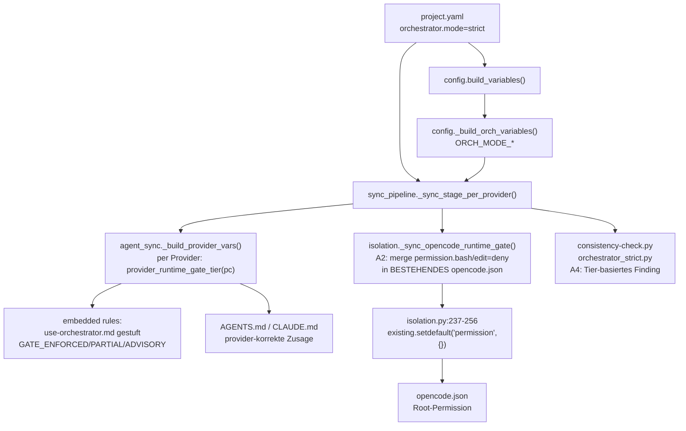
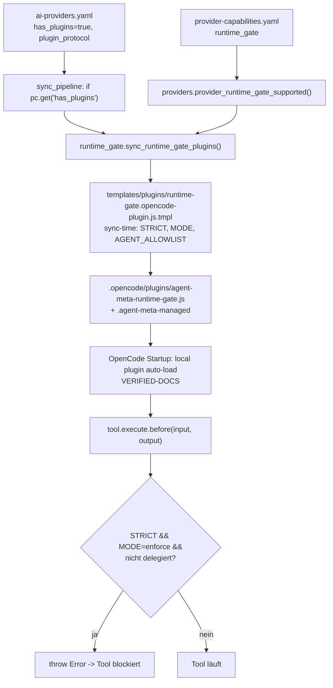

# OpenCode Runtime Gate für den CRITICAL GATE — Design

> Status: **Entwurf** — dieses Dokument ist Spec-Input. Den Approval-Marker
> `Status: APPROVED` setzt `concept-reviewer`, nicht dieses Dokument.
> Trace-Anker (wird von der Spec unverändert übernommen):
> `spec-id: SPEC-OPENCODE-RUNTIME-GATE-2026-09-13`

Dieses Dokument ist ein **Systemdesign** (Architectural, XL). Es enthält
Komponentenzerlegung, Schnittstellen-Contracts, Trade-off-Entscheidungen und
Datenflüsse — **keinen Implementierungscode** und **keine Spec**. Das Systemdesign
ist der vorgelagerte Stage-Input der Pipeline `quality_pipelines.concept-driven-dev`
(Stage `specify`).

### Revision

| Datum | Autor | Änderung |
|---|---|---|
| 2026-09-13 | concept-architect | Erstfassung. Phasing Phase 0 (A2+A3+A4) / Phase 1 (A1 hinter Capability-Flag) übernommen; neue Seam-Entscheidung D2 (neues Modul `runtime_gate.py` statt Extension von `hooks.py`); #747 wird über den bereits existierenden Merge-Pfad in `isolation.py` umgangen. |
| 2026-09-13 | concept-specifier (Review-Finding F-11) | Revisions-Hinweis: Dieses Design ist an fünf Punkten stale; normativ ist ab jetzt die Spec `2026-09-13-opencode-runtime-gate-design.md`, Abschnitt „Revision — incorporated review findings" (D-C1 … D-C5): D-C1 zwei-Registry-Signatur `provider_runtime_gate_tier(pc, capabilities=None)` (nicht die Ein-Argument-Form in IC-03), D-C2 Sibling-Key `orchestrator.require-runtime-gate` (nicht `orchestrator.strict.require_runtime_gate`), D-C3 A2-Dispatch im Per-Provider-Stage statt in `sync_provider_isolation`, D-C4 Mappings-Merge mit namespaced State-Ownership, D-C5 Szenario `62-opencode-runtime-gate` statt `60`. |

### Verifikations-Legende

- **VERIFIED** — direkt im Repo gelesen (Datei:Zeile unten angegeben).
- **VERIFIED-DOCS** — in der offiziellen OpenCode-Dokumentation gelesen
  (`https://opencode.ai/docs/plugins/`, 2026-09-13).
- **HYPOTHESIS** — nicht verifiziert; muss vor dem Scharfschalten per
  P6-Real-Repo-Test geprüft werden. Jede HYPOTHESIS ist im Text markiert.

---

## 1. Problem

In einem **OpenCode**-Projekt mit `orchestrator.mode: strict` wird der
CRITICAL GATE („MAIN CHAT darf nicht selbst editieren. ALLES → `orchestrator`.") 
aus `rules/1-generic/use-orchestrator.md:1-4` **ausschließlich durch
Prompt-Adhärenz** getragen. Das einzige Runtime-Enforcement — der
PreToolUse-Hook `hooks/1-generic/orchestrator-guard.sh` — erreicht OpenCode
strukturell nie, weil OpenCode in der Capability-Matrix als hook-los geführt
wird. Folge (Issue #794): Der Main Chat editierte in einem `strict`-Projekt
Dateien, committete, pushte, taggte und erstellte Releases direkt, ohne an
`orchestrator` bzw. `git` zu delegieren. Der beobachtete Fehler ist **keine
Regression dieses Pfades** (`v1.1.0 → v1.2.0-beta.2` unverändert), sondern die
Interaktion einer **vorbestehenden Provider-Lücke** mit gewachsener
Kontextlast (+32 % Rules, +37 % AGENTS.md-Render) und selbst-abschwächender
Formulierung. Das Design schließt die Lücke — gestuft, ohne eine
unverifizierte Provider-API als gegeben zu behandeln.

---

## 2. Was heute erzwungen wird — und was nicht

### 2.1 Erzwungen (Runtime)

| Mechanismus | Provider | Quelle (Datei:Zeile) |
|---|---|---|
| PreToolUse-Hook `orchestrator-guard.sh` (Write/Edit/Bash-Blockade im Strict-Mode, Git-Mutations-Gate) | Claude, Gemini/Antigravity | `hooks/1-generic/orchestrator-guard.sh:1-7`; Mirror nur wenn `provider_hooks_supported()` |
| Hook-Mirroring-Freigabe | — | `scripts/lib/providers.py:308-317` + `SUPPORTED_HOOK_PROTOCOLS` `:305` = `{claude-code-json, antigravity-hooks-json}` |
| Hook-Sync-Aufruf | — | `scripts/lib/sync_pipeline.py:733-746`, `scripts/lib/hooks.py:430-435`, `scripts/lib/cli_commands.py:241-248` |
| Agent-weite Tool-Permissions (OpenCode, **pro Agent**) | OpenCode | `scripts/lib/provider_transform.py:467-515` (`_map_claude_tools_to_opencode_permissions`), angewandt `:583-591`; Deny-Quelle `config/provider-tools.yaml:56-59` (`opencode_deny_critical: [Bash, Write, Edit]`) |
| Provider-Isolation (Read/Edit-Deny auf Fremd-Provider-Verzeichnisse) | OpenCode | `scripts/lib/isolation.py:237-256` (`_sync_opencode_isolation`), Dispatch `:389-394` |
| Consistency-Warnung, dass Strict ohne Hook ein No-Op ist | alle | `scripts/lib/consistency/orchestrator_strict.py:50-81`, Check-ID `orchestrator-strict.no-hook-support`, **Severity WARNING** |

### 2.2 Nicht erzwungen (die Lücke)

| Aussage | Beleg | Bewertung |
|---|---|---|
| OpenCode erhält **keinen** `orchestrator-guard` | `config/provider-capabilities.yaml:59` (`hooks: false`), `config/ai-providers.yaml:167` (`has_hooks: false`) | VERIFIED |
| Kein HPK-Protokoll für OpenCode | `providers.py:305`, kein `hook_protocol` im Opencode-Block (`ai-providers.yaml:160-224`) | VERIFIED |
| Der CRITICAL GATE ist auf OpenCode 100 % Prompt | `rules/1-generic/use-orchestrator.md:1-4` unter `{{#if ORCH_MODE_STRICT}}`; eingebettet via `context-embedded-rules` (`ai-providers.yaml:179`) | VERIFIED |
| Main-Chat-Writes/`bash` werden von der **Root-Permission** in `opencode.json` **nicht** gedeckt | `isolation.py:237-256` merged nur Fremd-Provider-Globs; `templates/configs/OPENCODE.settings-template.json` enthält nur `subagent_depth` | VERIFIED |
| Per-Agent-Permissions blockieren den **Main Chat nicht** (Default-Agent hat keine Agent-Frontmatter) | `.opencode/agents/*.md` Permission-Blöcke aus `provider_transform.py:583-591`; Main Chat ist kein generierter Agent | VERIFIED |
| `permission.task` gatet nur den **Spawn**, nicht die Ausführung; `ask` ist session-scoped | Issue #765 | VERIFIED (Repo-Kontext) |
| `tool.execute.before` feuert **für Subagent-Sessions** | nicht dokumentiert | **HYPOTHESIS** |
| Root-Permission wird in Subagent-Child-Sessions via `deriveSubagentSessionPermission` propagiert | nicht verifiziert | **HYPOTHESIS** |
| Neuer Root-Key erreicht ein **existierendes** `opencode.json` | `scripts/lib/context.py:838-880` (`_init_provider_settings_json` rendert nur wenn Datei fehlt, `:852-855`, kein Merge) → Blocker **#747** | VERIFIED |

### 2.3 Was die Regel heute verspricht

`rules/1-generic/use-orchestrator.md:1-4` rendert im Strict-Mode einen
**unbedingten** Gate-Satz. Auf OpenCode ist dieser Satz eine
Adhärenz-Behauptung, keine Runtime-Zusage. Das Design macht das Versprechen
**ehrlich und gestuft** (A3), statt es zu wiederholen.

---

## 3. Ziel / Nicht-Ziele

**Ziel**

1. Der CRITICAL GATE wird auf OpenCode so weit wie möglich **nativ** erzwungen
   (Permission-Layer, Phase 0) bzw. per Runtime-Plugin (Phase 1, verifiziert).
2. Die Regel- und Doku-Ausgabe behauptet **nur** die Garantie, die der aktive
   Provider tatsächlich trägt (gestufte Ausgabe).
3. Provider-Agnostik bleibt erhalten: Unterschiede ausschließlich über
   Config-Keys/Capability-Flags, nie über `if provider == "..."`.

**Nicht-Ziele**

- Keine Security Boundary. Der Gate bleibt eine **Convention boundary**
  (Terminologie: `.claude/rules/branch-guard.md#guard-terminologie-convention-boundary-vs-security-boundary`).
- Kein Umbau von `hooks.py` oder `orchestrator-guard.sh` (deren Contracts sind
  verifiziert; sie werden nicht geforkt).
- Keine neue Rolle, keine Änderung an `role-defaults.yaml`, keine SE-Kaskade.
- Keine Generalisierung auf alle Provider in diesem Change; der Seam wird
  generisch gebaut, A2 nur für OpenCode implementiert.
- Keine Implementierung, keine Spec, kein Plan.
- Kein Zwangs-Merge von `opencode.json` (das würde #747 aufreißen).

---

## 4. Komponentenzerlegung

### 4.1 Subsysteme und Verantwortlichkeiten

| # | Subsystem | Verantwortung | Artefakt/Datei |
|---|---|---|---|
| C1 | **Capability-Registry** | Deklariert pro Provider die stärkste **verifizierte** Gate-Tier (`runtime_gate`). Menschliche Wahrheit; von Consistency/Tests gehalten. | `config/provider-capabilities.yaml` |
| C2 | **Provider-Config-Registry** | Deklariert Pfad/Format der Gate-Artefakte: `has_plugins`, `plugin_dir`, `plugin_ext`, `plugin_protocol`; Plus `hooks_dir`/`hook_protocol` (Bestand). | `config/ai-providers.yaml` |
| C3 | **Capability-Resolver** | Übersetzt C1/C2 in Tier + Boolean (`provider_runtime_gate_tier`, `provider_runtime_gate_supported`, `all_providers_runtime_gate_supported`). Einzige Wahrheitsquelle für Tier-Fragen. | `scripts/lib/providers.py` |
| C4 | **Sync-Generierung (Plugin)** | Erzeugt das provider-native Gate-Artefakt aus Template + sync-time Substitution; managed index; idempotent. Nur wenn `has_plugins`. | **neu** `scripts/lib/runtime_gate.py`, Template `templates/plugins/runtime-gate.<protocol>.tmpl` |
| C5 | **Permission-Transform** | Pro-Agent-Permissions (Bestand, unverändert). | `scripts/lib/provider_transform.py:467-591` |
| C6 | **Isolation / Root-Permission** | Merged Root-Permission-Globs in bestehendes `opencode.json`; hier wird die Main-Chat-Deny-Schicht (A2) verankert. | `scripts/lib/isolation.py:237-256` + neuer Helper `_sync_opencode_runtime_gate` |
| C7 | **Rules/Context-Rendering** | Rendert den Gate-Satz gestuft nach `ENFORCEMENT_TIER`; kein Provider-Literal. | `rules/1-generic/use-orchestrator.md`, `rules/1-generic/a2a-delegation-gates.md`, `scripts/lib/agent_sync.py:423-472` (`_build_provider_vars`) |
| C8 | **Consistency** | Meldet Tier-Mismatch (strict + `advisory`) konfigurierbar; Fail-Mode. | `scripts/lib/consistency/orchestrator_strict.py:50-81`, `scripts/consistency-check.py:266-267` |
| C9 | **Drift-Tracking** | Erkennt veraltete/orphaned generierte Plugin-Dateien. | `scripts/lib/generated_file_drift.py:117-140` |
| C10 | **Admin-UI (optional)** | Read-only-Anzeige der effektiven Tier (Audit). Nicht kritisch für Phase 0. | `scripts/lib/config_audit.py` |

### 4.2 Der neue Seam — Empfehlung

**Empfehlung: neues, provider-agnostisches Modul `scripts/lib/runtime_gate.py`.**

Begründung gegen die drei Alternativen:

- **Gegen `scripts/lib/plugins.py` (existiert bereits!):** Diese Datei ist die
  Fassade des **Plugin-Katalogs** (`config/plugin-catalog.yaml`, MCP-/CLI-Tools,
  `registry_query.py`). Ein gleichnamiges neues Gate-Modul wäre eine
  Namenskollision. Der Gate-Generator heißt deshalb bewusst nicht `plugins.py`.
- **Gegen „`hooks.py` erweitern":** `hooks.py` implementiert einen **verifizierten
  PreToolUse-JSON-Contract** für zwei Protokolle (`claude-code-json`,
  `antigravity-hooks-json`) inkl. `settings.json`-Registrierung, Lifecycle und
  fail-closed-Wrapper. Ein JS-Plugin hat ein **anderes Artefakt, anderes
  Protokoll, anderen Lifecycle**. Es in `hooks.py` zu hängen würde den
  `has_hooks`-Contract verwässern und dem P6-unverifizierten Plugin erlauben,
  still unter dem „hooks"-Garantie-Schirm zu reiten. Der `hooks.py`-Aufruf bleibt
  unangetastet.
- **Gegen „`provider_transform.py` erweitern":** Das ist eine
  **Frontmatter-Transformation** pro Agent, kein Artefakt-Deployment. Anderer
  Stage (`agents/` vs. `.opencode/plugins/`), andere Ownership.
- **Gegen „direkt in `sync_pipeline.py`":** Der Stage-Orchestrator soll nur
  dispatchen; die Datei ist bereits 981 Zeilen groß. Ein eigenes Modul folgt dem
  `hook_plugins.py`-Muster.

Der Seam ist provider-agnostisch: `runtime_gate.py` kennt **keinen** Provider-Namen.
Es liest `plugin_dir`/`plugin_ext`/`plugin_protocol` aus C2 und mappt
`plugin_protocol` → Template (Config-Key, kein `elif provider`).

---

## 5. Interface Contracts (Design-Ebene)

Neue/changed Symbole als `Datei:Symbol`. Neue Module: `from __future__ import
annotations`, stdlib only (Python-3.9-kompatibel, kein PEP-604 in neuen Modulen).

### IC-01 — `config/provider-capabilities.yaml` (Capability, C1)

Neuer Top-Level-Key pro Provider-Block:

```yaml
runtime_gate: hook | plugin | permission | advisory
```

- `hook` — verifizierter PreToolUse-Hook-Contract (Claude, Gemini/Antigravity).
- `plugin` — verifiziertes provider-natives Plugin (OpenCode, **erst nach P6**).
- `permission` — provider-natives Permission-Layer blockt Main-Chat-Writes
  (OpenCode, Phase 0/A2), ohne Delegations-Provenienz.
- `advisory` — prompt-only (Default, fail-safe für alle übrigen Provider).

Pflicht: Jeder registrierte Provider trägt **explizit** einen Wert (analog zur
`commands:`-Pflicht, `provider-capabilities.yaml:25-33`). Fehlend = `advisory`.

### IC-02 — `config/ai-providers.yaml` (Provider-Config, C2)

OpenCode-Block (`:160-224`) erhält (Werte erst nach Verifikation scharf):

```yaml
has_plugins: true                 # Generierungsschalter (Phase 1)
plugin_dir: .opencode/plugins
plugin_ext: .js
plugin_protocol: opencode-plugin-js
runtime_gate-mechanism: opencode-plugin   # human label, spiegelt isolation-mechanism
```

Kein `hook_protocol` für OpenCode (bleibt hook-los). `has_plugins` und
`plugin_protocol` sind die Maschinen-Wahrheit; `runtime_gate-mechanism` ist das
menschenlesbare Label (Symmetrie zu `isolation-mechanism: opencode-permissions`,
`:192`).

### IC-03 — `scripts/lib/providers.py` (Resolver, C3)

```python
SUPPORTED_PLUGIN_PROTOCOLS: set[str] = {"opencode-plugin-js"}

def provider_runtime_gate_supported(pc: dict) -> bool:
    """True nur bei has_plugins=true UND verifiziertem plugin_protocol.
    Analog zu provider_hooks_supported() (providers.py:308-317)."""

def provider_runtime_gate_tier(pc: dict) -> str:
    """'hook' | 'plugin' | 'permission' | 'advisory'.
    Ordnung: provider_hooks_supported(pc) -> 'hook';
    provider_runtime_gate_supported(pc) -> 'plugin';
    pc.get('runtime_gate') == 'permission' -> 'permission';
    sonst 'advisory'."""

def all_providers_runtime_gate_supported(active: list, provider_config: dict) -> bool:
    """True nur wenn active non-empty UND jeder aktive Provider Tier
    'hook' oder 'plugin' erreicht. Für projektweite Zusagen."""
```

Fehlerpfade: `pc=None` → `provider_runtime_gate_tier(None) == "advisory"` (nie
Claude-Fallback); kein `sys.exit`.

### IC-04 — `scripts/lib/agent_sync.py::_build_provider_vars` (Rendering, C7)

Ergänzt das per-Provider-Bundle (`:444-464`) um:

```python
'tier': provider_runtime_gate_tier(pc),
'ENFORCEMENT_TIER': tier,          # hook|plugin|permission|advisory
'GATE_ENFORCED':   'true' if tier in ('hook', 'plugin') else 'false',
'GATE_PARTIAL':    'true' if tier == 'permission' else 'false',
'GATE_ADVISORY':   'true' if tier == 'advisory' else 'false',
'RUNTIME_GATE_PLUGIN_MODE': 'observe' | 'enforce',   # Phase 1, sync-time gebacken
```

Damit rendert jedes Provider-Kontextfile (z. B. `AGENTS.md` für OpenCode,
`CLAUDE.md` für Claude) **seine eigene** Tier-Wahrheit. Die Verteilung nutzt den
existierenden Seam `sync_embedded_rule_files(... variables=provider_variables)`
(`sync_pipeline.py:690-692`).

### IC-05 — `scripts/lib/variables.py::strip_inactive_conditional_blocks`

Die neuen Conditional-Variablen (`GATE_ENFORCED`, `GATE_PARTIAL`,
`GATE_ADVISORY`) werden in das `conditional_vars`-Set (`:231-237`) aufgenommen,
sonst würden inaktive Gate-Blöcke nicht entfernt.

### IC-06 — `scripts/lib/consistency/placeholders.py`

`_BUILTIN_VARS` (Kommentarbereich „Feature flags", `:75-90`) um
`ENFORCEMENT_TIER`, `GATE_ENFORCED`, `GATE_PARTIAL`, `GATE_ADVISORY`,
`RUNTIME_GATE_PLUGIN_MODE` ergänzen — sonst „missing variable"-Warnungen beim
Sync.

### IC-07 — `rules/1-generic/use-orchestrator.md` (Rendering, C7)

Der Strict-Block (`:1-4`) wird **gestuft**, ohne Provider-Namen:

```markdown
{{#if GATE_ENFORCED}}
# CRITICAL GATE (runtime-erzwungen)
MAIN CHAT darf nicht selbst editieren. ALLES -> `orchestrator`. Runtime-Gate aktiv.
{{/if}}
{{#if GATE_PARTIAL}}
# CRITICAL GATE (runtime-teilweise erzwungen)
MAIN CHAT darf nicht selbst editieren. ALLES -> `orchestrator`.
Provider-native Permission blockt Main-Chat-Writes; Delegations-Provenienz ist
NICHT erzwungen (Prompt + Permission-Layer).
{{/if}}
{{#if GATE_ADVISORY}}
# CRITICAL GATE (advisory)
MAIN CHAT soll nicht selbst editieren. ALLES -> `orchestrator`.
ACHTUNG: Auf diesem Provider ist der Gate rein prompt-basiert, ohne Runtime-Gate.
{{/if}}
```

`a2a-delegation-gates.md` erhält analog einen gestuften Hinweis auf
`{{ENFORCEMENT_TIER}}`.

### IC-08 — `scripts/lib/runtime_gate.py` (neu, C4)

```python
PLUGIN_TEMPLATE_BY_PROTOCOL: dict[str, str] = {
    "opencode-plugin-js": "templates/plugins/runtime-gate.opencode-plugin.js.tmpl",
}

def runtime_gate_plugin_relpath(pc: dict) -> str | None:
    """plugin_dir/<stem> + plugin_ext, oder None wenn has_plugins fehlt."""

def sync_runtime_gate_plugins(
    agent_meta_root: Path, project_root: Path, config: dict, log: SyncLog,
    dry_run: bool, provider: str = ..., provider_config: dict | None = None,
) -> None:
    """Deployt das Gate-Artefakt nur bei provider_runtime_gate_supported(pc).
    Gleiches 'always-copy, .agent-meta-managed, project-owned nie anfassen'-
    Muster wie hook_plugins.py::sync_release_gates (:28-98)."""
```

Fehlerpfade: unbekanntes `plugin_protocol` → `log.warning` + kein Write (nicht
still); fehlendes Template → Warnung + Skip; `dry_run` schreibt nie.

### IC-09 — `scripts/lib/isolation.py` (Root-Permission, C6 / A2)

```python
def _opencode_runtime_gate_entries(config: dict, provider: str) -> dict[str, str]:
    """Glob->'deny'-Einträge für den Main Chat, nur wenn orchestrator.strict
    für provider effektiv aktiv ist. Leer sonst. Provider-agnostisch über den
    effektiven Mode, kein Provider-Literal."""

def _sync_opencode_runtime_gate(project_root, ...) -> None:
    """Merged die Gate-Einträge über den BESTEHENDEN Merge-Pfad
    (isolation.py:237-256: existing.setdefault('permission', {})), inkl.
    managed-state-Cleanup beim Mode-Wechsel strict->advisory."""
```

Wichtig: **nicht** `context.py::_init_provider_settings_json` benutzen (#747).
Der Merge erfolgt auf `permission.edit`/`permission.bash` über die vorhandene
`_OPENCODE_STATE_FILE`-Mechanik, damit ein Rückwechsel die Einträge wieder
entfernt.

### IC-10 — `scripts/lib/consistency/orchestrator_strict.py` (C8 / A4)

`check_orchestrator_strict_hook_support` (`:50-81`) wird auf
`provider_runtime_gate_tier` umgestellt:

- Tier `advisory` + effektiver Strict-Mode → Finding (bestehende Message, jetzt
  tri-state-korrekt).
- Tier `hook`/`plugin` → kein Finding.
- Tier `permission` → INFO-Hinweis „teilweise erzwungen, keine Provenienz".
- Severity: WARNING per Default; ERROR wenn
  `orchestrator.strict.require_runtime_gate: true` gesetzt ist.

Neuer Config-Key `orchestrator.strict.require_runtime_gate` (bool, Default
`false`) in `config/project-config.schema.json`.

### IC-11 — `scripts/lib/generated_file_drift.py`

`_iter_managed_files` (`:117-140`) bekommt `plugin_dir` als weitere
`dir_specs`-Zeile, gegated auf `pc.get("has_plugins", False)` — sonst sind
generierte Plugins nicht drift-getrackt.

### IC-12 — Template `templates/plugins/runtime-gate.opencode-plugin.js.tmpl`

Design-Inhalt (kein Code in diesem Dokument, nur Contract):

```js
// exported plugin; sync-time-gebackene Konstanten: STRICT, MODE, AGENT_ALLOWLIST
export const AgentMetaRuntimeGate = async (ctx) => ({
  "tool.execute.before": async (input, output) => {
    // input.tool ∈ {write, edit, bash, ...}; output.args
    // Wenn STRICT && MODE === "enforce" && !isDelegated(input): throw new Error(...)
    // isDelegated(input): HYPOTHESIS-Abhängigkeit (Agent-/Session-Feld) — siehe OQ-2.
  },
});
```

Ladeort: `.opencode/plugins/` (Projekt-Plugin-Verzeichnis, Auto-Load) —
**VERIFIED-DOCS**. Damit braucht Phase 1 **keinen** `plugin`-Key in
`opencode.json` und umgeht #747 konstruktiv. `.opencode/package.json` listet
`@opencode-ai/plugin` bereits (`:3`) — keine neue Dependency.

---

## 6. Datenfluss

### 6.1 Phase 0 (A2 + A3 + A4) — ohne #747, ohne neue Runtime-API



**#747-Vermeidung:** A2 schreibt **nicht** über
`context._init_provider_settings_json` (`context.py:838-880`, rendert nur bei
fehlender Datei, `:852-855`), sondern über den bereits existierenden
Merge-Pfad in `isolation.py:237-256`, der eine vorhandene `opencode.json`
liest, `permission` per `setdefault` ergänzt und nur seine eigenen
managed-Entries zurückschreibt. Ein Bestandsprojekt ohne `permission`-Block
bekommt ihn angelegt; ein Bestandsprojekt mit `permission` behält ihn.

### 6.2 Phase 1 (A1) — Plugin hinter Capability-Flag



**#747 in Phase 1:** bewusst umgangen durch den lokalen Plugin-Ordner
(Auto-Load). Nur der npm-Weg (`"plugin": [...]` in `opencode.json`) würde einen
neuen Root-Key brauchen und an #747 scheitern — dieser Weg wird deshalb **nicht**
gewählt.

**Primäres P6-Verifikationsziel:** feuert `tool.execute.before` in
Subagent-Child-Sessions, und ist der Subagent im `input` unterscheidbar?
(**HYPOTHESIS**, OQ-1/OQ-2). Bis dahin läuft das Plugin im Modus `observe`
(Log/Report, kein Block) — `RUNTIME_GATE_PLUGIN_MODE` ist sync-time gebacken.

---

## 7. Trade-off-Analyse

### 7.1 Was A1/A2/A3/A4 jeweils garantieren — und nicht

| Option | Garantiert | Garantiert NICHT | Abhängig von |
|---|---|---|---|
| **A1** Plugin-`tool.execute.before` | Blockade von Main-Chat-Write/Edit/Bash **wenn** der Hook in der Session feuert und der Main Chat vom Subagenten unterscheidbar ist | Provenienz-Fälschung (Konvention), Subagent-Feuern (HYPOTHESIS), Schutz gegen Plugin-Deaktivierung | unverifizierte Runtime-API → P6 |
| **A2** Root-Permission-Deny | Native Blockade von Main-Chat-Write/Bash, dependency-frei, kein neues Artefakt | Delegations-Provenienz; exakte Child-Session-Propagation (HYPOTHESIS #765); kann legitime direkte Nutzung brechen | OpenCode-Permission-Precedence |
| **A3** Gestufte Zusage (Rules) | Ehrliche Doku; Modell kennt die tatsächliche Tier | nichts Technisches — Adhärenz bleibt Adhärenz | `provider_runtime_gate_tier` |
| **A4** Consistency-Severity | Maschinenlesbare Sichtbarkeit / optional fail-closed CI | Runtime-Verhalten | Config-Setting |

**Kernaussage:** Nur A1 liefert auf OpenCode eine *vollständige* Runtime-Gate-
Zusage, und auch das erst nach P6. A2 liefert eine *partielle*, native Zusage,
die sofort shippt. A3 macht das Versprechen in jedem Fall ehrlich. Deshalb
Phasing: **Phase 0 = A2+A3+A4** (shipbar ohne #747/#765),
**Phase 1 = A1** hinter Capability-Flag, Garantie-Flip erst nach P6.

### 7.2 Entscheidungstabelle

| ID | Entscheidung | Gewählt | Verworfene Alternative(n) | Begründung |
|---|---|---|---|---|
| D1 | Auslieferungsreihenfolge | Phase 0 (A2+A3+A4), Phase 1 (A1) | Alles-on-A1 | A1 hängt an unverifizierter API (#765); A2/A3/A4 shippen sofort |
| D2 | Neuer Seam | neues `scripts/lib/runtime_gate.py` | `plugins.py` (Kollision), `hooks.py` erweitern (Protocol-Verwässerung), `provider_transform.py` erweitern (falscher Stage) | siehe §4.2 |
| D3 | Plugin-Ladeort | lokales `.opencode/plugins/` (Auto-Load) | npm-Key `plugin: [...]` in `opencode.json` | npm-Weg reißt #747 auf; lokal braucht keinen Root-Key (VERIFIED-DOCS) |
| D4 | Tier-Berechnung | per-Provider in `_build_provider_vars` | global in `_build_orch_variables` | Jeder Provider rendert sein eigenes Kontextfile; global würde OpenCode die Claude-Wahrheit zeigen |
| D5 | A2-Schreibpfad | `isolation.py`-Merge (Bestand) | `context.py::_init_provider_settings_json` | #747: letzterer rendert nur bei fehlender Datei |
| D6 | Zusage-Text | gestuft (ENFORCED/PARTIAL/ADVISORY) | bisheriger unbedingter CRITICAL GATE | Ehrlichkeit; verhindert, dass die Doku mehr verspricht als der Provider trägt |
| D7 | Consistency-Severity | Default WARNING, opt-in ERROR via `require_runtime_gate` | sofort ERROR | Rückwärtskompatibilität; kein Bestandsprojekt wird ohne Opt-in rot |
| D8 | Plugin-Modus | `observe` first, `enforce` nach P6 | sofort `enforce` | Ein unverifiziertes `enforce` könnte den Orchestrator selbst blockieren |

### 7.3 Explizite Annahmen

- **AN-1:** OpenCode lädt Dateien in `.opencode/plugins/` automatisch.
  (VERIFIED-DOCS)
- **AN-2:** `tool.execute.before` kann per `throw` ein Tool blockieren.
  (VERIFIED-DOCS: `.env`-Beispiel wirft)
- **AN-3:** Root-Permission wird in Subagent-Child-Sessions propagiert.
  (**HYPOTHESIS** — #765)
- **AN-4:** `tool.execute.before` feuert für Subagent-Sessions. (**HYPOTHESIS**)
- **AN-5:** Der Main Chat ist im `input` vom Subagenten unterscheidbar.
  (**HYPOTHESIS**)
- **AN-6:** Agent-Frontmatter-Permission übersteuert Root-Deny für
  `orchestrator`/`git`. (**HYPOTHESIS** — Precedence)
- **AN-7:** `provider_hooks_supported` bleibt unverändert; Claude/Antigravity
  behalten `runtime_gate: hook`.

---

## 8. Threat Model — 4 Fragen

**1. Was bauen wir?**
Eine **gestufte Runtime-Gate-Schicht** für den CRITICAL GATE: native
Main-Chat-Permission-Deny (Phase 0) und ein optionales Provider-Plugin
(Phase 1), plus ehrliche Zusage-Ausgabe. Kein Sicherheitsprodukt — ein
**Convention boundary** gegen akzidentellen Missbrauch.

**2. Was kann schiefgehen?**

| Risiko | Wirkung | Mitigation |
|---|---|---|
| Plugin feuert nicht in Subagent-Sessions (AN-4 falsch) | Gate wirkungslos oder blockiert Orchestrator | Modus `observe` bis P6; kein Garantie-Flip vorher |
| Main Chat vom Subagenten nicht unterscheidbar (AN-5 falsch) | False-positive-Blockade **aller** Writes, inkl. Orchestrator | `AGENT_ALLOWLIST` sync-time; `observe`-Default; Notausgang dokumentiert |
| Root-Deny bricht non-orchestrierte Direktnutzung | Dev blockiert | A2 nur bei `orchestrator.mode: strict` für den Provider; Rückweg via Mode-Wechsel |
| Modell entfernt Plugin / setzt `opencode.json` um | Gate weg | Bewusste Grenze; dokumentiert (kein Security-Boundary) |
| Modell fälscht Delegation (Provenienz) | Regel umgangen | Bekannt: Sentinel/Selbstdeklaration ist nicht verifizierbar (vgl. `a2a-delegation-gates.md:52`) |
| `has_plugins`/`runtime_gate` werden inkonsistent gepflegt | falsche Zusage | Consistency + Test-Invariant (analog `test_provider_three_file_invariant`) |

**3. Mitigationen (Zusammenfassung):** Capability-Flag als Single Source of
Truth, `observe`-vor-`enforce`, opt-in fail-closed Consistency, ehrliche
Zusage-Texte, managed-state-Cleanup für Reversibilität, P6-Test vor Flip.

**4. Konsequenzen / bewusste Restgrenzen:**
Der Gate bleibt umgehbar (Aus-Konfiguration, Plugin-Löschung,
Provenienz-Fälschung). Für eine echte Grenze muss Git **außerhalb** des
Agenten-Systems abgesichert werden (Branch-Protection, Pre-Receive-Hooks,
Review-Pflicht, zerstörungs-Bestätigung) — exakt die Linie, die
`a2a-delegation-gates.md:52` bereits für Claude zieht. Dieses Design behauptet
das Gegenteil nicht.

---

## 9. Impact & Risk Zones

**Blast Radius (direkt berührt):**

- `config/provider-capabilities.yaml` — neuer Pflicht-Key für **alle** Provider
  (`runtime_gate`): drei Provider bekommen `hook`, OpenCode `permission`
  (Phase 0) → später `plugin`, rest `advisory`.
- `config/ai-providers.yaml` — nur OpenCode-Block (Phase 1).
- `scripts/lib/providers.py`, `agent_sync.py`, `variables.py`, `isolation.py`,
  `runtime_gate.py` (neu), `generated_file_drift.py`,
  `consistency/placeholders.py`, `consistency/orchestrator_strict.py`.
- `rules/1-generic/use-orchestrator.md`, `a2a-delegation-gates.md` — Textänderung
  wirkt auf **alle** Projekte (Kontext-sichtbar, Zeilen-Bilanz beachten).
- `config/project-config.schema.json` — neuer optionaler Key.
- `templates/plugins/*` (neu).

**Kopplungs-Hotspots:**

- `provider_runtime_gate_tier` wird von Rendering **und** Consistency genutzt →
  eine Wahrheit, kein Duplikat.
- `_build_provider_vars` ist der einzige per-Provider-Seam → dort entsteht die
  Tier-Wahrheit; nicht in Renders streuen.
- `isolation.py`-Merge und `context.py`-Init sind zwei verschiedene
  opencode.json-Schreibwege — der neue Schreibweg muss zwingend der Merge-Pfad
  sein (#747).

**Regressions-Risiko:** Rules-Text-Änderungen erzeugen in allen Projekten neue
AGENTS.md/CLAUDE.md-Renders (erwartet); `--check`/Drift-Hashes müssen bewusst
aktualisiert werden. Kein Bruch für hook-fähige Provider, deren Text semantisch
gleich bleibt (GATE_ENFORCED-Variante = bisheriger Wortlaut).

---

## 10. Rollback / Safety / Migration

**Deaktivieren:**

- **Pro Provider:** `provider-capabilities.yaml` → `runtime_gate: advisory`
  (und `has_plugins: false` für Phase 1). Rendering fällt auf ehrlichen
  Advisory-Text zurück; kein Plugin wird mehr generiert.
- **Pro Projekt (A2):** `orchestrator.mode` auf `advisory`/`main-chat` setzen →
  `_opencode_runtime_gate_entries()` liefert leer → managed-state-Cleanup
  entfernt die Permission-Deny-Einträge wieder.
- **Notausgang ohne Sync:** Plugin-Modus `observe` (sync-time) oder Datei
  löschen; Plugin ist rein lokal und ohne `opencode.json`-Key.

**Bestandsprojekte:**

- Phase 0: **keine Migration nötig.** Der Merge-Pfad legt fehlende
  `permission`-Blöcke an und lässt vorhandene unangetastet; mode-abhängig.
- Phase 1: rein additives `.opencode/plugins/<managed>.js`; keine
  `opencode.json`-Änderung. Entfernte Dateien werden über die
  `.agent-meta-managed`-Index-Semantik bereinigt (Muster `hook_plugins.py:86-95`).
- `runtime_gate: advisory` ist der fail-safe Default für unbekannte Provider →
  keine Aussage wird stillschweigend stärker.

**Garantie-Flip (der riskante Schritt):** von `permission`/`advisory` auf
`plugin` erst nach bestandenem P6-Real-Repo-Test (AN-3/AN-4/AN-5/AN-6) und mit
`RUNTIME_GATE_PLUGIN_MODE=enforce`.

---

## 11. Offene Fragen (Entscheidung vor Spec-Finalisierung)

| # | Frage | Empfohlener Default |
|---|---|---|
| OQ-1 | Feuert `tool.execute.before` in OpenCode-Subagent-Sessions? | Als **unverifiziert** behandeln; P6-Test ist Pflicht-Gate vor Phase-1-Flip. |
| OQ-2 | Ist der Main Chat im `input` (z. B. `input.agent`/`sessionID`) vom dispatchten Subagenten unterscheidbar? | Nein annehmen → Plugin startet `observe`; bei P6-Negativ bleibt `observe`. |
| OQ-3 | Übersteuert Agent-Frontmatter-Permission das Root-Deny für `orchestrator`/`git`? | Ja annehmen, aber per P6 verifizieren; sonst A2 nur für `bash`/`edit` feiner globben. |
| OQ-4 | Propagiert `deriveSubagentSessionPermission` das Root-Deny in Child-Sessions (#765)? | Risiko bejaht; A2 nicht als „vollständig erzwungen" labeln (Tier `permission` = PARTIAL). |
| OQ-5 | Default-Severity für A4: WARNING oder ERROR? | WARNING; ERROR nur mit `orchestrator.strict.require_runtime_gate: true`. |
| OQ-6 | A2 global oder nur bei `mode: strict`? | Nur `strict` (und per-Provider-Override auflösbar). |
| OQ-7 | Plugin-Sprache `.js` oder `.ts`? | `.js` (kein TS-Toolchain-Zwang; Docs erlauben beides). |
| OQ-8 | Plugin committen oder gitignoren? | Committen, managed + drift-getrackt (Wiederherstellbarkeit). |
| OQ-9 | A2/A3 auf andere Permission-Provider (ZCode/KimiCode) generalisieren? | Seam generalisieren, Implementierung in diesem Change nur OpenCode. |
| OQ-10 | Zusage-Text (PARTIAL/ADVISORY) sprachlich final? | Review durch `concept-reviewer`; Wortlaut ist Spec-Detail. |

---

## 12. Trace-Anker

```
spec-id: SPEC-OPENCODE-RUNTIME-GATE-2026-09-13
```

Dieser Wert ist der Trace-Anker für die nachfolgende Spec
(`concept-specifier`) und den Plan (`planner`). Design, Spec und Plan müssen
denselben Wert referenzieren.
