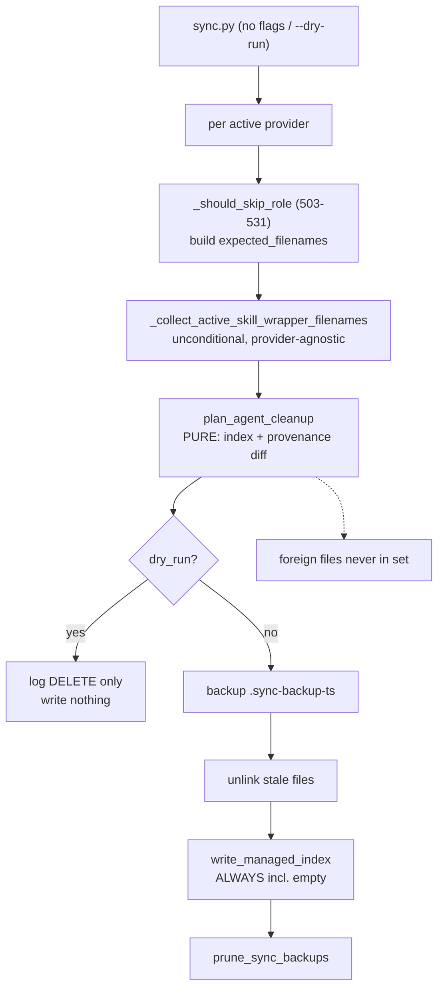
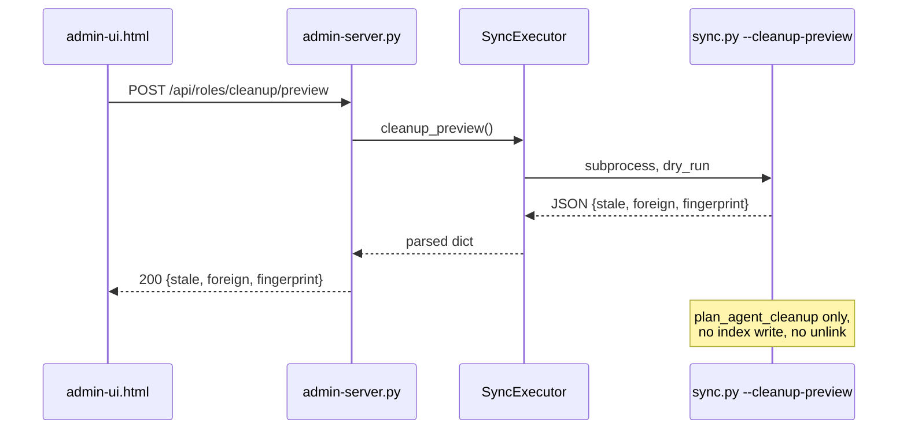
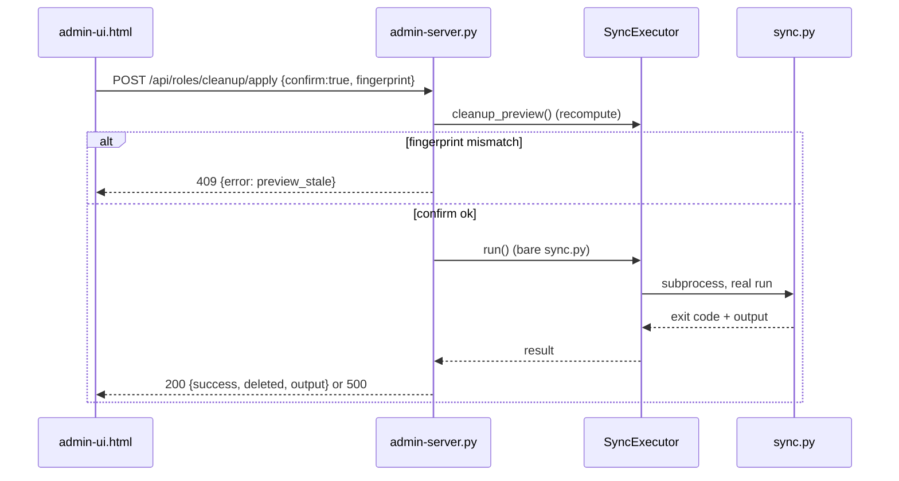

# Stale Role Cleanup — System Design

> Trace anchor: `spec-id: SPEC-STALE-ROLE-CLEANUP-2026-09-13`.
> This document is the **spec input** for the downstream `concept-specifier` stage; the
> trace anchor is carried over unchanged into the spec and the plan.
> This document is a **system design only** — it contains component boundaries, interface
> contracts and trade-offs, not implementation. Function bodies are intentionally absent.
> `status: Entwurf` is set here; the approval marker `Status: APPROVED` is set by
> `concept-reviewer`, not by this document.
>
> **Provider-agnostic (MANDATORY).** No decision below branches on a provider name literal.
> Provider differences are expressed exclusively through config keys / capability flags
> (`provider_has_capability`, `ai-providers.yaml` capabilities), per the
> `provider-agnostic` rule.

## 0. Revision

| Rev | Date | Change | Author |
|---|---|---|---|
| 0.1 | 2026-09-13 | Initial design (B1 cleanup hardening, B2 Admin-UI path, B3 shrink proof) | concept-architect |

---

## 1. Problem Statement

Problem B is **three distinct sub-symptoms** that the user experience ("I removed a role but
the file is still there, and I can't get rid of it") conflates. They must be designed
separately because they live in different subsystems and have different failure modes.

### 1.1 Sub-symptom B-I — stale role files after sync

`scripts/lib/agent_sync.py::_cleanup_stale_agents` (767–815) is the only remover for
provider agent directories. Its safety model is:

- Candidates: a flat glob of `*.md` plus `*{agent_ext}` when `agent_ext != '.md'`
  (796–802).
- An unexpected candidate is deleted only under the guard at **:806**:
  `if not managed_index.exists() or existing_file.name in previously_managed`.
- `previously_managed` is read from `<agents_dir>/.agent-meta-managed`
  (newline-delimited filenames, 783–788).
- The index is written back **only** `if not dry_run and expected_filenames`
  (**:812–815**).

Consequences, verified:

1. **Clause "`not managed_index.exists()`" is a fail-open delete.** With no index, *every*
   unexpected `*.md` is deleted (documented as intended by
   `tests/test_agent_sync_helpers.py::test_no_managed_index_prunes_everything_unexpected`,
   300–315). Any hand-authored role file in a legacy project is destroyed on the first
   sync.
2. **Empty `expected_filenames` never rewrites the index** (:812) — so after the last role
   is removed, the index keeps listing files that no longer exist, and the next run still
   sees a non-empty `previously_managed`.
3. **External-skill wrapper tracking mismatch.** `skills.py` writes
   `<role>.md` wrappers into **every** provider's `agents_dir`
   (`scripts/lib/skills.py:375–378` resolve dir, `:424`, `:490`, `:526–527` write, `:427–435`
   remove-on-inactive). But `agent_sync.py` adds those wrapper filenames to
   `expected_filenames` **only** for providers that declare the `external-skill-agent-files`
   capability (**:896–897**, collector `:751–765`) — today effectively only Claude. For
   every other provider the wrapper is written but not tracked in that provider's agents
   index: it survives only incidentally (the index-present branch at :806 protects
   names *not* in `previously_managed`), and it is never swept when the skill is
   deactivated/removed from the registry.
4. **`*.sync-backup-*` artifacts are permanent.** `generated_file_drift.py:109–114`
   defines the pattern and `:221–269` writes the siblings, but nothing prunes them and
   they are explicitly skipped by the drift/managed iterators (`:148`, `:162`, `:171`).

### 1.2 Sub-symptom B-II — no Admin-UI removal path

- The UI/CLI sync are the same operation: `admin-server.py:1139–1141`
  `SyncExecutor.run()` → `_run([])` (`:1076–1106`) shells out to
  `python scripts/sync.py` with **no flags**. Dry run = `--validate` (`:1133–1137`).
- There is **no role remove/delete endpoint**. The `_DELETE_PREFIX_ROUTES` table
  (`:3408–3413`) covers only pipelines, reflection-pairs, backups and environments.
- Role removal is only possible indirectly: edit `project.yaml → roles` via the existing
  `PUT` path (UI control `admin-ui.html:2148–2155`, `6792`) and then run sync. The user
  has no preview of what will actually be deleted, no explicit confirmation, and no way to
  distinguish "will be removed" from "luckily survived".

### 1.3 Sub-symptom B-III — managed-block shrink (§ user hypothesis correction)

**The user's hypothesis is wrong as stated.** The managed block *does* shrink in the normal
path: `context.py::_update_managed_html_block` (347–442) re-renders the **entire** block
from the template and replaces the old block wholesale via
`managed_pattern.sub(lambda _m: new_managed, existing, count=1)` (**:436**, regex
DOTALL non-greedy). If a role hint disappears from the template variables, the new block no
longer contains it, and the old text is gone. `_regenerate_static_context` (186–276) does
preserve the *existing* managed block verbatim (`new_content = new_header +
existing_managed + target_footer`, **:272**) — but that is the *static* regeneration path;
the managed block is subsequently refreshed by `_update_managed_html_block`.

Stale managed-block content can therefore remain **only** in the following paths:

| # | Stale path | Reference | Why content can persist |
|---|---|---|---|
| S1 | `context_file.auto_generate: false` | `sync_pipeline.py:250–265`, `:355–358`; `_sync_stage_claude_base` `:300–304` | Whole context stage (including managed-block update) is skipped; agents/rules still generate. |
| S2 | Provider deactivated | `sync_pipeline.py:339–341`, `:601–602` | Per-provider context sync skipped. |
| S3 | `--only-variables` | `context.py:1578–1607`; `cli_commands.py:618–630` | Only placeholder substitution over the whole file; managed block is not re-rendered, so a removed hint stays. |
| S4 | `dry_run` | cleanup/context writers are gated on `not dry_run` | No write — expected, but surfaces as "it didn't shrink". |
| S5 | Duplicated/second marker block | regex at `:372–376` is non-greedy with `count=1` | Only the first `managed-begin … managed-end` pair is replaced; a second pair keeps stale content forever. |
| S6 | Injected trailing/foreign content | `_insert_managed_block_above_foreign_content` (445–458), footer preservation (`:242–249`) | Intentionally preserved; not a bug, but can be mistaken for stale managed content. |

So B-III is **not** "the block does not shrink". It is: *the truth of the shrink is
unproven by tests, and six bypass paths keep stale content alive*. The design closes the
proof gap (regression test + duplicate-marker detection) and makes the bypass paths
**visible** rather than silently writing (S1 is a deliberate user opt-out and must not be
overridden).

Note (HYPOTHESIS): the module-level `_MANAGED_BLOCK_RE` constant at `context.py:30–33`,
its copies at `:372–376`, `:577–580`, `:659–662`, and the CLAUDE.md/AGENTS.md-specific
ranges (`:461–524`, `:831–835`, `:531–634`, replacement `:599`) were reported by prior
exploration; the copies at `:372–376` were re-verified for this design, the remaining
ranges were spot-checked at the call sites but not line-by-line.

### 1.4 Scope and non-goals

**In scope:** B1 (cleanup hardening: provenance-based safety, always-write index, wrapper
tracking fix, backup pruner), B3 (managed-block shrink proof + stale-path visibility),
B2 (Admin-UI preview → confirm → real sync plus UI control).

**Non-goals:** rewriting the context templating engine; changing what the managed block
*contains*; adding LLM-based recovery of deleted roles; automatic escalation to the
`requirements`/SE pipeline. No implementation in this document.

---

## 2. Component Map

Four components, one shared seam. Each has exactly one responsibility.

```
                       +--------------------------------------+
                       |  C1  Managed-Index Helper            |
                       |  scripts/lib/managed_index.py        |
                       |  (generalized rule_index pattern)    |
                       |  read / bootstrap / diff / write     |
                       +--------------------------------------+
                          ^          ^          ^          ^
                          |          |          |          |
        +-----------------+   +------+---+  +---+------+  +--------+
        | C2 Agent Cleanup|   | rules.py |  |commands  |  |hooks.py|
        | agent_sync.py   |   |          |  | .py      |  |        |
        | + provenance    |   +----------+  +----------+  +--------+
        | + backup prune  |
        +--------+--------+
                 |
        +--------v---------+         +--------------------------+
        | C3 Cleanup       |         | C4 Admin Server          |
        | Preview/Apply    |<--------+ /api/roles/cleanup/*     |
        | (CLI --cleanup-  |  http   | + admin-ui.html control  |
        |  preview)        |         +--------------------------+
        +------------------+
```

### C1 — Managed-Index Helper (shared seam)

`scripts/lib/rule_index.py` already implements the exact read/diff/cleanup/write pattern
with the safety-critical property *"write the index even when the managed set is empty"*
(89–101). It is used by `mcp.py` and `external_tools.py`. **Decision: generalize this
module rather than fork it in `agent_sync.py`.**

Why a shared helper and not a private `agent_sync` implementation:

- The no-index fallback (`bootstrap_previously_managed`, 32–68) and the
  empty-index-write semantics (89–101) are the two places where safety bugs are most
  expensive; they must have exactly one implementation.
- `rules.py:498–522`, `commands.py:199–208`, `hooks.py:533–549` already duplicate the same
  loop with *divergent* index-write conditions (hooks writes even when empty, rules/commands
  do not). Centralizing lets that inconsistency be fixed once.

Why not extend the helper into a new `managed_index.py` module in one step: to keep blast
radius low, the existing `rule_index.py` is retained as the module name and gains the
generic predicate hook; callers migrate incrementally. (New-module extraction is an open
question, §9 OQ-5.)

**Boundary:** C1 performs no logging policy, no reason strings, and no backup creation —
it returns sets/lists; the caller supplies `reason`, `log`, `dry_run`. This keeps it
usable from `agent_sync`, `rules`, `commands`, `hooks`, `mcp` without behavior coupling.

### C2 — Agent Cleanup + Provenance + Backup Retention (`agent_sync.py`)

Extends `_cleanup_stale_agents` (767–815). New responsibilities:

- Compute `previously_managed` via **index-first, provenance-fallback** (C1).
- Compute `now_managed` = `expected_filenames`, **including skill wrappers for every
  provider** (no capability gate).
- Before each unlink, write a `<name>.sync-backup-<ts>` sibling (reuse the naming/format
  convention of `generated_file_drift.py:221–269`).
- Always call `write_managed_index` (even for an empty set).
- Run the backup pruner for the agents directory (and, via a shared function, any directory
  that accumulates `.sync-backup-*`).

### C3 — Cleanup Preview / Apply (CLI + pure planner)

A **pure planner** is the single source of truth for "what would be deleted":

- `plan_agent_cleanup(...)` returns a list of stale entries without writing.
- `_cleanup_stale_agents` **consumes the planner output** for logging + unlinking.
- The preview CLI mode **also consumes the planner output** and serializes it as JSON.

This guarantees preview == apply by construction (no second implementation that can drift).

### C4 — Admin Server endpoint + UI control

- Two POST routes on `admin-server.py` (placed in the exact-route dict, near
  `/api/backups/create` at `:3404`), delegating to `SyncExecutor`.
- `SyncExecutor` gains `cleanup_preview()` (runs `sync.py --cleanup-preview`) and reuses
  `run()` for apply.
- The UI control reuses the existing sync status rendering and the existing role-checkbox
  PUT flow; no new persistence layer.

**Boundary rationale (why the endpoint does not edit `project.yaml` itself):** role
membership is already owned by the `PUT` config path. Duplicating config mutation in the
cleanup endpoint would create a second writer for `project.yaml → roles` and a two-source
conflict. The cleanup endpoint only *observes* the config as-is, previews consequences, and
applies the cleanup through a normal sync.

---

## 3. Interface Contracts (design level)

Signatures below are contracts, not implementations.

### 3.1 C1 — `scripts/lib/rule_index.py` (generalized)

```python
from typing import Callable, Optional
from pathlib import Path
from .log import SyncLog

ContentPredicate = Callable[[Path, str], bool]
# (path, file_text) -> True iff the file carries agent-meta provenance.

def read_managed_index(index_path: Path) -> set[str]:
    """Newline-delimited filenames. Empty set if missing. (existing, 21–29)"""

def bootstrap_previously_managed(
    target_dir: Path,
    index_path: Path,
    glob_pattern: str,
    content_marker: Optional[str] = None,
    content_predicate: Optional[ContentPredicate] = None,   # NEW
) -> set[str]:
    """Index-first; if absent, adopt glob matches that pass the provenance
    predicate (or contain content_marker). Never adopts a file that carries no
    provenance. (extends existing 32–68)"""
    # Precedence: index exists -> read_managed_index (even if empty).
    # index unreadable (OSError/UnicodeDecodeError) -> treat as absent + caller warns.
    # index absent -> predicate/marker filter over the glob matches.

def cleanup_stale_managed_files(
    target_dir: Path,
    project_root: Path,
    previously_managed: set[str],
    now_managed: set[str],
    log: SyncLog,
    dry_run: bool,
    reason: str,
    backup: bool = False,            # NEW: write .sync-backup-<ts> before unlink
) -> list[str]:
    """Delete previously_managed - now_managed. Returns backup rel-paths.
    (extends existing 71–86)"""

def write_managed_index(index_path: Path, now_managed: set[str], dry_run: bool) -> None:
    """Writes even when now_managed is empty; no-op only for dry_run.
    (existing 89–101, reused unchanged — this is the B1 fix for :812–815)"""
```

Error paths: `read_managed_index` on a corrupt/unreadable file must not raise (catch
`OSError`/`UnicodeDecodeError` at the caller and route to predicate bootstrap + `log.warning`).
`cleanup_stale_managed_files` is fail-soft on an individual unlink/backup error (log.warn,
continue) so one bad file cannot abort the sync.

### 3.2 C2 — `scripts/lib/agent_sync.py`

```python
def _agent_has_provenance(path: Path, text: str) -> bool:
    """True iff the file was generated by agent-meta. Recognises, in order:
      - frontmatter `generated-from:` (frontmatter.py:217, 234–235)
      - `<!-- agent-meta-provenance: ... -->` (provider_transform.py:545–561)
      - `# generated-from:` TOML comment (agent_toml.py:75)
      - frontmatter `based-on:` (secondary; 2-platform overrides, HYPOTHESIS §1.3)
    Never True for a user-authored file. Pure, no writes."""

def _collect_active_skill_wrapper_filenames(
    agent_meta_root: Path, config: dict,
) -> set[str]:
    """Filenames of wrappers skills.py will write this run, derived from the
    SAME source of truth (_skill_is_active + skills-registry role names).
    Provider-independent -> no capability gate. Replaces the capability-gated
    _collect_claude_external_skill_filenames (751–765)."""

@dataclass(frozen=True)
class StaleAgentEntry:
    provider: str
    path: str        # project-relative posix path
    reason: str      # "role removed from config" | "skill deactivated"
    tracked: bool    # True = index entry, False = provenance-adopted

def plan_agent_cleanup(
    target_dir: Path,
    expected_filenames: set[str],
    pc: dict,
    project_root: Path,
) -> list[StaleAgentEntry]:
    """PURE. Returns files that would be deleted. Reads index + files only.
    Single source of truth for the preview and for _cleanup_stale_agents."""

def _cleanup_stale_agents(
    target_dir: Path,
    expected_filenames: set[str],
    pc: dict,
    project_root: Path,
    dry_run: bool,
    log: SyncLog,
) -> None:
    """Now uses plan_agent_cleanup + cleanup_stale_managed_files(backup=True)
    + write_managed_index (called unconditionally, incl. empty)."""
```

Call-site integration (unchanged seam): `sync_agents_for_provider` (851–902) builds
`expected_filenames`, now **unconditionally** adds
`_collect_active_skill_wrapper_filenames(...)` (replacing the `:896–897` capability gate),
then calls `_cleanup_stale_agents` (**:900**). The pipeline call site is unchanged
(`sync_pipeline.py:667–670`).

Provider-agnostic requirement satisfied: the wrapper set is derived from skill activation
and registry role names, never from `if provider == ...`.

### 3.3 C2 — Backup retention (`scripts/lib/generated_file_drift.py` or shared helper)

```python
def prune_sync_backups(
    target_dir: Path,
    project_root: Path,
    log: SyncLog,
    dry_run: bool,
    max_age_days: int,
    max_per_source: int,
) -> list[str]:
    """Delete `*.sync-backup-*` siblings in target_dir per retention policy.
    NEVER matches non-backup names; NEVER runs in dry_run; never deletes the
    most recent backup of a source. Returns pruned rel-paths."""
```

Placement decision: the pattern/format already lives in `generated_file_drift.py`
(`_SYNC_BACKUP_PATTERN` 109–114). Add the pruner next to it and call it from the sync
pipeline after the drift stage, per managed directory. (Alternatively a tiny dedicated
module; OQ-5.)

### 3.4 C3 — CLI preview contract

```
python scripts/sync.py --cleanup-preview
```

- New flag registered in `scripts/sync.py` next to `--only-variables` (`:117`), dispatched
  via the same lambda table pattern (`:327`).
- Runs the sync pipeline with `dry_run=True` using a `CleanupPreviewLog(SyncLog)` collector;
  the planner (`plan_agent_cleanup`) is the only producer of stale entries.
- Emits **one JSON object on stdout** and writes nothing (dry_run + no index write):

```json
{
  "version": 1,
  "generated_at": "2026-09-13T12:00:00Z",
  "providers": [
    {
      "provider": "claude",
      "stale":   [{"path": ".claude/agents/foo.md", "reason": "role removed from config", "tracked": true}],
      "foreign": [{"path": ".claude/agents/my-own.md"}],
      "backups_to_prune": [".claude/agents/bar.md.sync-backup-20260801-101010"]
    }
  ],
  "fingerprint": "sha256:…"
}
```

- Exit code 0 (a non-empty stale list is not an error). Exit 1 only on internal failure.
- `foreign` is informational: files the predicate classified as user-authored and that will
  **never** be touched.

### 3.5 C4 — HTTP route contract

Both routes are **POST**, added to the exact-route dict (`admin-server.py:3340–3406`,
alongside `/api/backups/create` at `:3404`). Admin authentication is the existing
server-wide token guard; no per-route role model is introduced.

**`POST /api/roles/cleanup/preview`**

Request: empty body or `{}`.
Response `200`:
```json
{ "success": true, "stale": [ { "provider": "claude", "path": ".claude/agents/foo.md",
    "reason": "role removed from config", "tracked": true } ],
  "foreign": [ { "provider": "claude", "path": ".claude/agents/my-own.md" } ],
  "fingerprint": "sha256:…" }
```
Errors: `500` with `{"success": false, "error": "sync_preview_failed"}` if the preview
subprocess fails. Read-only — never mutates the repo.

**`POST /api/roles/cleanup/apply`**

Request:
```json
{ "confirm": true, "fingerprint": "sha256:…" }
```
Response `200`:
```json
{ "success": true, "returncode": 0, "output": "<sync stdout>", "deleted": [ ".claude/agents/foo.md" ] }
```
Status codes:

| Code | Body | Condition |
|---|---|---|
| 200 | success payload | Sync completed (returncode 0). |
| 400 | `{"error":"confirmation_required"}` | `confirm` is not exactly `true`. |
| 409 | `{"error":"preview_stale","stale":[…]}` | Supplied `fingerprint` differs from a freshly recomputed preview (TOCTOU guard). |
| 500 | `{"error":"sync_failed","output":"…"}` | `sync.py` exit != 0 / timeout. |

The apply handler **recomputes the preview** server-side and compares the fingerprint
before invoking `SyncExecutor.run()`. `SyncExecutor` gains
`cleanup_preview() -> dict` (parses the `--cleanup-preview` JSON); `run()` is reused
unchanged (**:1139–1141**).

### 3.6 Manifest / index data model + ownership

| Property | Value |
|---|---|
| Format | UTF-8, newline-delimited **filenames** (no paths), sorted, trailing newline when non-empty. |
| Empty state | File exists and is **0 bytes**. A written empty index is the signal "agent-meta manages nothing here". |
| Location | `<managed_dir>/.agent-meta-managed`; sidecars `.agent-meta-managed-mcp` / `-tools` for the separate mcp/tool writers. |
| Semantics | The index is the **authoritative** record of files agent-meta created in that directory in the last run. Absence of the file ≠ "delete everything". |

Ownership (single writer per directory — no concurrent writer to a given file):

| Index | Owner | Notes |
|---|---|---|
| `<agents_dir>/.agent-meta-managed` | `agent_sync.py` | Now must also list skill-wrapper filenames (`skills.py` writes the wrapper into agents_dir but does **not** write this index). |
| `<rules_dir>/.agent-meta-managed` | `rules.py` | skill-channel rules use the *separate* shared skills index. |
| `<commands_dir>/.agent-meta-managed` | `commands.py` | index key configurable (`commands_managed_index`, `commands.py:151`). |
| `<hooks_dir>/.agent-meta-managed` | `hooks.py` | already writes even when empty (533–549). |
| `<skills_dir>/.agent-meta-managed` | merge-mode multi-writer: `rules.py`, `mcp.py`, `external_tools.py`, `skills.py` | Genuine shared index; consistency handled by `skill_channel` merge logic (`sync_pipeline.py:534–568`). **Out of scope** for B1 except as a reference pattern. |

**Consistency rule (B1-adjacent):** every writer of its own `.agent-meta-managed` must
(a) write the index **unconditionally** after cleanup (including empty) and (b) route
read/diff/write through C1. Today `rules.py:521–522` and `commands.py:207–208` only write
`if now_managed`, which strands stale index entries. Aligning them is recommended; the
exact breadth is OQ-4.

---

## 4. Data Flow

### 4.1 (a) CLI sync cleanup



### 4.2 (b) UI read-only preview



### 4.3 (c) UI confirmed cleanup



The apply path relies on B1: a bare `sync.py` is only safe to trigger from the UI once the
no-index fail-open delete (agent_sync.py:806) is removed. **Ordering constraint:
B1 must ship before B2.**

---

## 5. Safety Model

### 5.1 The predicate

For a candidate file `f` in a managed agent directory, with `E = expected_filenames`:

```
is_candidate(f)  := f matches "*.md" or ("*" + agent_ext)        # 796–802
previously_managed :=
      read_managed_index(dir/.agent-meta-managed)                if index readable
      { p.name : p in globs, has_provenance(p) }                  if index absent OR unreadable
has_provenance(p)  := _agent_has_provenance(p)                   # §3.2

removable(f) := is_candidate(f)
              AND f.name ∉ E
              AND f.name in previously_managed

foreign(f)   := is_candidate(f) AND f.name ∉ E AND f.name ∉ previously_managed
```

`foreign(f)` is **never** deleted, never backed up, never rewritten — enumerated in the
preview response for transparency.

### 5.2 Index state matrix

| Index state | `previously_managed` source | Delete behavior |
|---|---|---|
| Present, readable, non-empty | index contents | Delete `previously_managed - E` only. |
| Present, readable, **empty** | empty set | Delete nothing. (Empty = "manages nothing"; stale entries were already removed by a prior empty-write.) |
| Present, unreadable/corrupt | predicate bootstrap + `log.warning` | Delete only files carrying provenance; corrupt index is never interpreted as "delete all". |
| Absent (legacy project, first run after upgrade) | predicate bootstrap | Adopt only provenance-carrying files; **all other unexpected files survive**. This is the fix for :806. |

### 5.3 Guarantee: user-authored files survive

A user-authored file in a managed directory is deleted only if it is both (a) absent from
`expected_filenames` and (b) listed in a readable `.agent-meta-managed` index. The only
way a user file enters that index is if the user manually adds its name — an explicit
opt-in. Without an index, adoption requires a provenance marker that agent-meta writes and
users do not. Therefore: **no code path deletes a file that has neither an index entry nor
an agent-meta provenance marker.** This invariant is directly testable and is acceptance
criterion AC-B1-1 in the downstream spec.

### 5.4 Skill-wrapper correctness

Because `skills.py:427–435` already unlinks an inactive skill wrapper before the agents
cleanup runs, the new expected-set inclusion is consistent: `now_managed` reflects what
will exist after `skills.py` ran, and the agents index records exactly that. A wrapper for a
skill deactivated *after* its last sync is removed either by `skills.py` (:427–435) or,
if that path did not run for this provider, by the agents cleanup as a tracked stale entry.

---

## 6. Rollback Strategy

### 6.1 Backups on cleanup delete (new)

`cleanup_stale_managed_files(backup=True)` writes `<name>.sync-backup-<YYYYmmdd-HHMMSS>`
before unlinking, using the same timestamp/format as `generated_file_drift.py:240–268`.
Consequence: every B1/B2 deletion is recoverable by renaming the backup back. This makes
the *fail-open* legacy risk less catastrophic even before the predicate change lands, and
is mandatory once the UI can trigger a real run.

### 6.2 Provider backups (existing, coarser)

`admin-server.py` already exposes `/api/backups/create` and `/api/backups/restore`
(:3404–3405). These are a whole-workspace safety net and remain the recommended
"undo everything" path. The cleanup endpoint does not interact with them; the UI should
offer "create backup before apply" as an optional pre-step.

### 6.3 Re-sync recovery

Because generated agent files are deterministic, re-adding the role to `project.yaml → roles`
and re-running sync restores it exactly. This is the primary recovery path for a wrongly
removed role; `.sync-backup-*` is the path for a wrongly removed *hand-edited* file.

### 6.4 Backup pruning safety

Decision: prune, but conservatively.

- Only `*.sync-backup-*` names are ever matched (`_SYNC_BACKUP_PATTERN`, 109–114).
- Never prune in `dry_run`.
- Never prune the most recent backup of a given source file.
- Default policy (recommended, OQ-2): `max_per_source = 3`, `max_age_days = 30`; delete
  only when **both** thresholds are exceeded (age > 30d AND more than 3 newer backups
  exist for that source). This bounds growth without ever removing the only recoverable
  copy.
- Fallback if the user prefers zero risk: `enabled: false` (never prune) — the design
  supports both, the default is the question.

---

## 7. Trade-off / Decision Table

Each decision follows the mandatory format.

**D1 — Shared manifest helper vs private agent_sync cleanup**
```
DECISION
context: Where should the index read/bootstrap/diff/write logic live?
choice: Generalize scripts/lib/rule_index.py into the shared manifest seam (C1);
        agent_sync becomes a caller.
alternatives:
  - Private implementation inside agent_sync: rejected — forks the two
    safety-sensitive semantics (no-index bootstrap, empty-index write) and
    guarantees future divergence.
  - Brand-new managed_index.py module with full caller migration: rejected for
    now — larger blast radius; incremental extension of rule_index is safer and
    reversible (see OQ-5).
consequences:
  easier: one fix point for safety semantics; rules/commands/hooks can align later.
  harder: rule_index.py now serves callers with different index-write policies;
    the policy must stay in the caller, not the helper.
```

**D2 — Provenance-based bootstrap instead of the no-index delete-all clause**
```
DECISION
context: agent_sync.py:806 deletes any unexpected *.md when no index exists.
choice: When the index is absent/unreadable, adopt only files carrying an
        agent-meta provenance marker; never delete unmarked files.
alternatives:
  - Keep fail-open delete-all: rejected — destroys user/foreign files in legacy projects
    (proven by test_no_managed_index_prunes_everything_unexpected).
  - Refuse to clean at all without an index: rejected — legacy orphans would linger
    forever, the original bug.
consequences:
  easier: new safety invariant is simple and testable.
  harder: a genuinely orphaned pre-marker file (generated before provenance existed) is
    not auto-swept; it must be reported as `foreign` in the preview and handled manually.
```

**D3 — Always write the index, including empty**
```
DECISION
context: agent_sync.py:812 writes the index only when expected_filenames is non-empty.
choice: Route through rule_index.write_managed_index (writes empty too).
alternatives:
  - Leave as-is: rejected — index keeps phantom entries after the last role is removed.
consequences: easier: index is a truthful post-run snapshot; harder: an empty index now
  means "manages nothing" and must be distinguished from "missing" in all readers
  (handled in §5.2).
```

**D4 — Skills wrapper expected-set from activation, not a capability gate**
```
DECISION
context: skills.py writes wrappers into every provider agents_dir, but agent_sync only
         expects them for providers with capability external-skill-agent-files (:896-897).
choice: Compute the wrapper filename set from skill activation (same source of truth as
        skills.py) and include it for every provider, with no capability gate.
alternatives:
  - Add external-skill-agent-files to every provider config: rejected — duplicates the
    truth of "skills.py writes here" in N config files; drifts silently.
  - Have skills.py write the agents index: rejected — agents_dir index has a single owner
    (agent_sync); two writers would race on the same file.
consequences: easier: wrappers become first-class tracked files, swept on deactivation;
  harder: the expected-set computation must mirror skills.py's activation exactly, so a
  shared helper (not a copy) is required.
```

**D5 — Preview uses a pure planner; apply reuses a bare sync**
```
DECISION
context: The UI needs a trustworthy preview and a one-click apply.
choice: A pure plan_agent_cleanup() drives both preview JSON and the real cleanup;
        apply triggers a normal sync.py run via SyncExecutor.run().
alternatives:
  - Preview parses --dry-run log text: rejected — fragile, and the log format is
    presentation, not a contract.
  - Preview via --validate: rejected — --validate is not the cleanup path and would not
    enumerate stale files.
consequences: easier: preview == apply by construction; harder: the planner must be
  callable in a read-only context that has all pipeline variables available.
```

**D6 — Admin endpoint does not mutate project.yaml**
```
DECISION
context: Removing a role requires editing project.yaml roles before sync.
choice: The cleanup endpoint observes the config as-is; the existing PUT path remains the
        only config writer. Preview -> confirm -> sync.
alternatives:
  - Endpoint removes the role from roles AND syncs: rejected — second writer for the same
    config key, conflict/race with the PUT path, and hard-to-review implicit config edits.
consequences: easier: single ownership of config; UI flow is explicit (uncheck role ->
  preview -> confirm); harder: two UI steps instead of one for a role removal.
```

**D7 — Backups on cleanup delete + conservative prune**
```
DECISION
context: Cleanup deletes are irreversible today; .sync-backup-* accumulates forever.
choice: Write a backup before every cleanup delete; prune with dual threshold
        (age > 30d AND > 3 newer per source).
alternatives:
  - No backup on cleanup: rejected once the UI can trigger deletes.
  - Never prune: rejected — unbounded growth in every managed directory.
  - Aggressive prune (keep newest only): rejected — a single bad run could leave no
    fallback if the newest backup is also bad.
consequences: easier: recoverable deletes with bounded disk cost; harder: more small files
  in working trees, so gitignore coverage for *.sync-backup-* must be verified.
```

---

## 8. Assumptions

- **A1** `skills.py` resolves `agents_dir` per provider and writes wrappers there for every
  active provider (verified at `skills.py:375–378`, `:424`, `:490`, `:526–527`).
- **A2** `--dry-run` performs no filesystem mutation (index write is gated on `not dry_run`
  at both `agent_sync.py:812` and `rule_index.write_managed_index:97`).
- **A3** Generated agent files for all providers contain at least one provenance marker:
  `generated-from:` in YAML frontmatter, `# generated-from:` in TOML
  (`agent_toml.py:75`), or `<!-- agent-meta-provenance: -->`
  (`provider_transform.py:545–561`). Files generated without any marker are treated as
  `foreign` (safe, but not swept) — a residual gap captured in OQ-3.
- **A4** `based-on:` appears in generated content only for providers that do not strip it;
  its use as a provenance signal is secondary. (HYPOTHESIS — flagged in §1.3.)
- **A5** The admin server's existing token/auth guard is sufficient for the new routes; no
  new authorization model is required.
- **A6** `plan_agent_cleanup` can be invoked with the same inputs as the real run, so
  preview and apply cannot diverge.

---

## 9. Open Questions (require user decision)

**OQ-1 — Apply semantics: automatic cleanup on every sync, or preview + confirm only in
the UI?**
Recommended default: CLI sync keeps cleaning automatically (current behavior, now safe);
the Admin-UI always requires preview → confirm. Rationale: the safety model (B1) makes
automatic cleanup safe, and forcing confirmation on every CLI run would break automation.

**OQ-2 — Backup prune policy.**
Recommended default: enabled, `max_per_source = 3`, `max_age_days = 30`, both required.
Alternative: never prune. Decision needed because it determines whether `.sync-backup-*`
growth is bounded.

**OQ-3 — Files generated before provenance markers existed.**
Recommended default: classify as `foreign` (never delete) and surface them in the preview
with a distinct `legacy_unmarked` flag, letting the user delete manually. Alternative:
a one-time migration that adopts unmarked files matching known role names. The migration
carries a data-loss risk and is not recommended by default.

**OQ-4 — Scope of index-write alignment in rules.py / commands.py.**
Recommended default: fix `agent_sync` in this change (required), and align
`rules.py:521–522` / `commands.py:207–208` to always-write as a closely-coupled follow-up
in the same spec, because they share the exact same class of stale-index bug. Alternative:
defer them to a separate spec to keep this change's blast radius minimal.

**OQ-5 — Module shape of the shared helper.**
Recommended default: extend `rule_index.py` in place (minimal, reversible). Alternative:
extract a dedicated `managed_index.py` and make `rule_index` a thin re-export shim
(cleaner naming, larger diff). Dependency: OQ-4's breadth influences this choice.

**OQ-6 — Duplicate managed-block marker handling.**
Recommended default: `log.warning` and keep replacing only the first block (no file
corruption), plus a consistency check that flags the file. Alternative: fail the context
update and require manual repair. Preview/consistency visibility is non-negotiable; the
write-vs-refuse choice is the open part.

**OQ-7 — Stale-path visibility (S1–S4).**
Recommended default: emit consistency warnings only; never override
`context_file.auto_generate: false` (S1) or provider deactivation (S2), because those are
deliberate user opt-outs. Alternative: a `--force-context` escape hatch for a one-off
refresh. Scope of this visibility work (whole bypass list vs S1/S5 only) is the decision.

**OQ-8 — Backup before apply in the UI.**
Recommended default: offer but do not force a provider backup before a confirmed cleanup.
Alternative: require it. Affects UI friction vs safety.

---

## 10. Trace Anchor & References

Trace anchor (carried unchanged into the spec and plan):
`spec-id: SPEC-STALE-ROLE-CLEANUP-2026-09-13`

Primary source references:

- `scripts/lib/agent_sync.py` — `_cleanup_stale_agents` 767–815 (guard :806, index :783–788,
  write condition :812–815), call site :900, wrapper gate :896–897, collector :751–765,
  `_should_skip_role` 503–531.
- `scripts/lib/sync_pipeline.py` — call site 667–670; auto_generate 250–265, 300–304,
  355–358; provider deactivation 339–341; skill-channel universe 534–568.
- `scripts/lib/skills.py` — dir resolution 375–378, wrapper write 424/490/526–527, inactive
  removal 427–435.
- `scripts/lib/rule_index.py` — read 21–29, bootstrap 32–68, cleanup 71–86, empty-write
  89–101.
- `scripts/lib/rules.py:498–522`; `scripts/lib/commands.py:199–208`;
  `scripts/lib/hooks.py:533–549` — analogous cleanup semantics.
- `scripts/lib/context.py` — `_update_managed_html_block` 347–442 (replace :436),
  `_regenerate_static_context` 186–276 (existing_managed :272), `only_variables` 1578–1607.
- `scripts/lib/generated_file_drift.py` — backup pattern 109–114, backup writer 221–269.
- `scripts/lib/provider_transform.py:545–561`; `scripts/lib/frontmatter.py:217, 234–235`;
  `scripts/lib/agent_toml.py:75` — provenance markers.
- `scripts/admin-server.py` — `SyncExecutor` 1064–1141, `--validate` 1133–1137, route tables
  3340–3413.
- `tests/test_agent_sync_helpers.py:237–338` — cleanup tests, incl. the fail-open no-index
  test 300–315.
