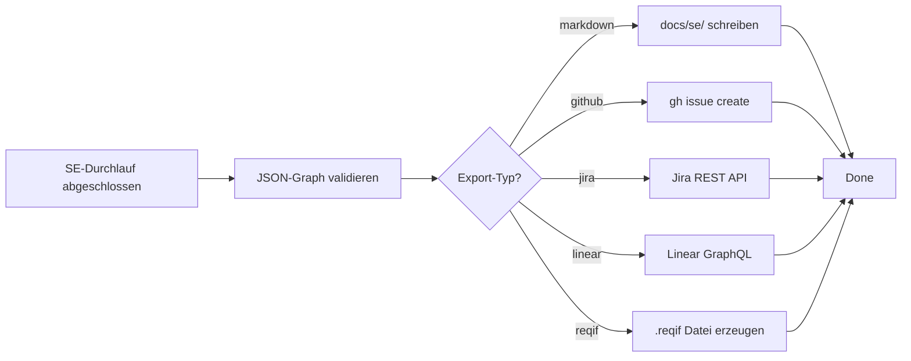

# MCP-Adapter für die SE-Kaskade

Dieses Dokument beschreibt das MCP-Adapter-Konzept für Phase 3 der SE-Kaskade.
Es ermöglicht den Export von Requirements, Architektur und Traceability in externe Ticket-Systeme.

---

## Konzept

Der SE-Workflow operiert ausschließlich auf dem internen Datenmodell (JSON-Graph).
Erst wenn der gesamte Baum ausentwickelt ist, triggert ein **Export-Service** die Adapter.

```
JSON-Graph (intern)
    │
    ├── MD-Adapter (default)      → docs/se/ (Markdown + Mermaid)
    ├── GitHub-Issues-Adapter     → gh issue create
    ├── Jira-Adapter (MCP)        → Jira REST API
    ├── Linear-Adapter (MCP)      → Linear GraphQL API
    └── ReqIF-Adapter             → .reqif Datei
```

---

## Phasen-Roadmap

| Phase | Adapter | Status |
|-------|---------|--------|
| 1 | Markdown (Default) | MVP — immer verfügbar |
| 2 | GitHub Issues | Geplant |
| 3 | Jira, Linear, ReqIF | Zukunft |

---

## MCP-Adapter-Architektur

### Grundprinzip
- Ein MCP-Server stellt Tools bereit: `create_requirement`, `link_requirements`, `update_status`
- Der Adapter mappt den JSON-Graphen auf die jeweilige API
- Konfiguration in `.meta-config/project.yaml`

### Adapter-Schnittstelle

Jeder Adapter implementiert:

```python
class SEAdapter:
    def create_requirement(self, req_id: str, title: str, description: str, parent_id: str | None) -> str:
        """Erzeugt eine Anforderung im Zielsystem. Gibt externe ID zurück."""
        ...

    def link_requirements(self, source_id: str, target_id: str, link_type: str) -> None:
        """Verknüpft zwei Anforderungen (z.B. 'refines', 'verifies')."""
        ...

    def update_status(self, req_id: str, status: str) -> None:
        """Aktualisiert den Status (draft, approved, implemented, verified)."""
        ...

    def export_interface(self, interface: dict) -> str:
        """Exportiert einen Interface-Vertrag."""
        ...
```

---

## Konfiguration in `.meta-config/project.yaml`

### Markdown-Only (Phase 1, Default)

```yaml
se-export:
  type: markdown
  output_dir: docs/se
```

### GitHub Issues (Phase 2)

```yaml
se-export:
  type: github_issues
  repo: "my-org/my-project"
  milestone: "v1.0"
  labels:
    l1: "se:l1"
    l2: "se:l2"
    l3: "se:l3"
    leaf: "se:leaf"
  mapping:
    epic: l1
    story: l2
    sub_task: l3
```

### Jira (Phase 3)

```yaml
se-export:
  type: jira
  url: "https://my-org.atlassian.net"
  project_key: "PROJ"
  issue_types:
    l1: "Epic"
    l2: "Story"
    l3: "Sub-task"
  custom_fields:
    domain: "customfield_10001"      # software | hardware | mechanics
    req_id: "customfield_10002"      # REQ-xxx
    parent_req: "customfield_10003"  # Parent REQ-xxx
```

### Linear (Phase 3)

```yaml
se-export:
  type: linear
  team_key: "ENG"
  project_name: "Systems Engineering"
  states:
    draft: "Backlog"
    approved: "In Progress"
    implemented: "Done"
```

### ReqIF (Phase 3)

```yaml
se-export:
  type: reqif
  output_file: "docs/se/export.reqif"
  tool_mapping:
    polarion: true
    doors: true
```

---

## Mapping: SE-Artefakte → Zielsystem

### GitHub Issues

| SE-Artefakt | GitHub-Konstrukt | Labels |
|-------------|-----------------|--------|
| L1 System REQ | Epic | `se:l1`, `se:system` |
| L2 Sub-System REQ | Story | `se:l2`, `se:subsystem` |
| L3 Component REQ | Sub-Task | `se:l3`, `se:component` |
| Leaf Node | Issue (Implementation) | `se:leaf`, `se:implementable` |
| Interface Contract | Issue (verlinkt) | `se:interface` |

### Jira

| SE-Artefakt | Jira-Issue-Typ | Verknüpfung |
|-------------|---------------|-------------|
| L1 System REQ | Epic | — |
| L2 Sub-System REQ | Story | "is refined by" → Epic |
| L3 Component REQ | Sub-task | "is refined by" → Story |
| Leaf Node | Task | "is verified by" → Sub-task |
| Interface | Technische Aufgabe | "relates to" → beide Komponenten |

---

## MCP-Server-Konfiguration

### Beispiel: Jira MCP-Server

```json
{
  "mcpServers": {
    "jira-se": {
      "command": "npx",
      "args": ["-y", "@modelcontextprotocol/server-jira"],
      "env": {
        "JIRA_BASE_URL": "https://my-org.atlassian.net",
        "JIRA_API_TOKEN": "${JIRA_API_TOKEN}"
      }
    }
  }
}
```

### Beispiel: GitHub MCP-Server

```json
{
  "mcpServers": {
    "github-se": {
      "command": "npx",
      "args": ["-y", "@modelcontextprotocol/server-github"],
      "env": {
        "GITHUB_PERSONAL_ACCESS_TOKEN": "${GITHUB_TOKEN}"
      }
    }
  }
}
```

---

## Export-Workflow



---

## Sicherheit und Secrets

Adapter-Credentials werden **niemals** in `project.yaml` hartkodiert.

```yaml
# Richtig
se-export:
  type: jira
  url: "https://my-org.atlassian.net"
  api_token: "${JIRA_API_TOKEN}"   # Umgebungsvariable

# Falsch
se-export:
  api_token: "abc123"            # Niemals committen!
```

Empfohlene `.meta-config/` Struktur:
```
.meta-config/
  project.yaml          ← committed
  secrets.local.yaml    ← gitignored, lokal angelegt
```

---

## Zusammenfassung

- Der SE-Workflow ist tool-agnostisch: Default ist Markdown
- MCP-Adapter ermöglichen Export in Enterprise-Systeme
- Konfiguration zentral in `.meta-config/project.yaml`
- Credentials über Umgebungsvariablen oder `secrets.local.yaml`
- Phase 1: Markdown | Phase 2: GitHub Issues | Phase 3: Jira, Linear, ReqIF
