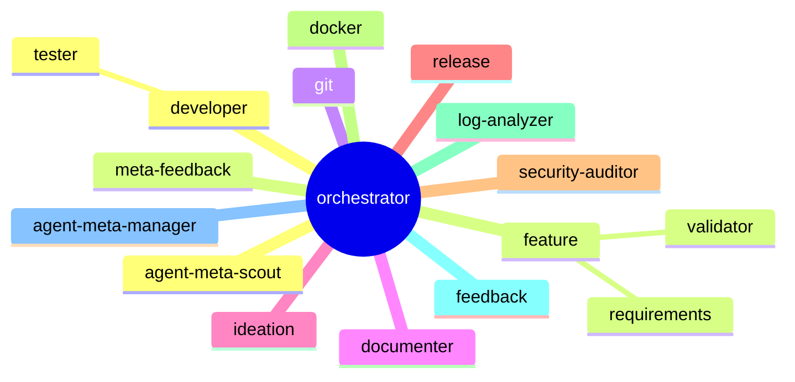

# Konzept: Agent-Visualisierung Dashboard v2

> Status: **Feature-Spezifikation** | Branch: `feat/agent-visualization-dashboard`
> Letzte Iteration: 2026-05-10

---

## Implementierungsstatus (verifiziert 2026-06-14)

**Umgesetzt:**
- Feature 1 komplett: `scripts/lib/viz.py`, `docs/agent-mindmap.md`, `docs/agent-graph.html`
- `scripts/viz-logger.py`, `scripts/viz-server.py`, `scripts/viz-report.py`, `docs/live-dashboard.html`
- Dashboard ↔ Server verbunden: `viz-report.py` serviert `/api/state` + `/api/events`, `live-dashboard.html` fetcht sie
- Cross-Process-File-Locking: `viz-logger.py::write_event_safe` (atomares `O_EXCL`-Lockfile + Retry + Cleanup)
- Event-Prompt-Injection: `inject_viz_prompt_block` (`viz.py`), aufgerufen in `scripts/lib/agents.py`

**Offen:**
- Default-Aktivierung: `viz.enabled: false` (Dynamic Mode opt-in)

---

## Executive Summary

Nach Challenge durch den `ideation`-Agenten wurde das Konzept fundamental überarbeitet. Statt eines undurchführbaren Echtzeit-Dashboards wird das Feature in **zwei unabhängige, lösbarere Features** zerlegt:

| Feature | Name | Status | Komplexität |
|---------|------|--------|-------------|
| 1 | **Statische Agenten-Mindmap** | Sofort umsetzbar | Niedrig |
| 2 | **Dynamischer Visualisierungsmodus** | Opt-in, ohne IDE-Integration | Mittel |

---

## Feature 1: Statische Visualisierung

### Ziel

Aus den Agenten-Quell-Dateien (`agents/1-generic/`, `agents/2-platform/`, `.claude/agents/`) wird automatisch eine **interaktive, statische Mindmap** generiert. Kein Server, keine Echtzeit, keine IDE-Abhängigkeit.

### Warum Mermaid?

**Ja, Mermaid ist die perfekte Wahl.**

| Kriterium | Mermaid | D3.js | Graphviz |
|---|---|---|---|
| Keine Dependencies | Ja (Renderer im Browser) | Nein (JS-Lib) | Nein (Binary) |
| GitHub-nativ | Ja (gerendert in READMEs) | Nein | Nein |
| Einfach zu generieren | Ja (Text) | Nein (DOM) | Nein (DOT) |
| Interaktiv | Ja (Klick, Zoom) | Ja | Nein |
| Dark Mode | Ja | Manuell | Manuell |
| Export | SVG/PNG | SVG | SVG/PNG |

**Mermaid-Nachteile und Lösungen:**
- Limitierte Layout-Kontrolle → Akzeptabel für Mindmap/Mindgraph
- Keine echten Force-Direction → `graph TD` (Top-Down) oder `mindmap` reicht
- Keine komplexen Node-Styling → CSS-Overrides oder akzeptabel

### Generierungs-Ziel

`scripts/generate-agent-graph.py` erzeugt:
1. **`docs/agent-mindmap.md`** — Mermaid-Quelltext für GitHub/Doku
2. **`viz/static/agent-graph.html`** — Interaktive HTML-Seite mit eingebettetem Mermaid

### Mermaid-Diagramm-Typen

#### A) `mindmap` (Mermaid 10+, am besten geeignet)



**Vorteil:** Nativ für Hierarchien, automatisches Layout, Root zentriert.

#### B) `graph TD` (Falls `mindmap` nicht verfügbar)

```mermaid
graph TD
    orchestrator --> developer
    orchestrator --> feature
    orchestrator --> git
    developer --> tester
    feature --> requirements
    feature --> validator
    orchestrator --> documenter
    orchestrator --> ideation
    orchestrator --> release
    orchestrator --> security-auditor
    orchestrator --> docker
    orchestrator --> log-analyzer
    orchestrator --> feedback
    orchestrator --> agent-meta-manager
    orchestrator --> agent-meta-scout
    orchestrator --> meta-feedback
    
    classDef required fill:#ff6b6b,stroke:#c92a2a,stroke-width:2px,color:#fff
    classDef recommended fill:#4dabf7,stroke:#1971c2,stroke-width:2px,color:#fff
    classDef optional fill:#868e96,stroke:#495057,stroke-width:1px,color:#fff
    classDef running fill:#ffd43b,stroke:#f08c00,stroke-width:3px
    classDef done fill:#69db7c,stroke:#2f9e44,stroke-width:2px
    
    class orchestrator,developer,git,log-analyzer,feedback required
    class feature,tester,validator,documenter recommended
    class ideation,release,security-auditor,agent-meta-scout,agent-meta-manager,meta-feedback,docker optional
```



### Node-Styling nach `workflow_tier`

| Tier | Mermaid-Class | Farbe | Bedeutung |
|------|--------------|-------|-----------|
| `required` | `required` | Rot | Kern-Workflow, immer verfügbar |
| `recommended` | `recommended` | Blau | Standard-Qualität |
| `optional` | `optional` | Grau | Bei Bedarf |

### Integration in `sync.py`

Neues Flag und automatische Generierung:

```yaml
# .meta-config/project.yaml
viz:
  enabled: true
  format: "mermaid"  # mermaid | d3 | both
  output_dir: "docs"
  include_platform: true
  include_external: true
```

Oder als CLI-Flag:
```bash
python scripts/sync.py --config .meta-config/project.yaml --viz
python scripts/sync.py --viz-only  # Nur Visualisierung generieren, kein Sync
```

### Code-Integration in `sync.py`

```python
# scripts/sync.py (Erweiterung)
from lib.viz import generate_viz

# ... im main():
if config.get("viz", {}).get("enabled", False) or args.viz:
    generate_viz(
        agent_meta_root=agent_meta_root,
        project_root=project_root,
        config=config,
        log=log,
        dry_run=args.dry_run,
    )
```

### `scripts/lib/viz.py` — Der Generator

```python
"""Agent-Visualisierung: Statische Mindmap-Generierung."""

from pathlib import Path
from .agents import collect_sources, build_role_map
from .io import write_checked


def generate_viz(agent_meta_root: Path, project_root: Path, config: dict, log, dry_run: bool):
    """Generiert statische Visualisierungs-Artefakte."""
    
    # 1. Sammle alle Agenten (1-generic, 2-platform, 3-project, 0-external)
    sources = collect_sources(agent_meta_root, project_root, config)
    
    # 2. Baue Hierarchie (orchestrator als Root)
    agents = build_agent_hierarchy(sources)
    
    # 3. Generiere Mermaid
    mermaid_md = render_mermaid_mindmap(agents, config)
    
    # 4. Generiere interaktives HTML
    html = render_interactive_html(agents, config)
    
    # 5. Schreibe Dateien
    output_dir = project_root / config.get("viz", {}).get("output_dir", "docs")
    
    write_checked(output_dir / "agent-mindmap.md", mermaid_md, log=log, dry_run=dry_run)
    write_checked(output_dir / "agent-graph.html", html, log=log, dry_run=dry_run)


def build_agent_hierarchy(sources):
    """Baut Hierarchie aus Agenten-Quellen.
    
    orchestrator ist immer Root.
    Alle anderen Agenten sind direkte Kinder (oder verschachtelt nach Delegations-Hinweisen).
    """
    agents = {}
    for src in sources:
        role = src["role"]
        agents[role] = {
            "name": role,
            "description": src.get("description", ""),
            "tier": src.get("tier", "optional"),
            "provider": src.get("provider", "generic"),
            "model": src.get("model", ""),
            "children": infer_children_from_description(role, src.get("description", "")),
        }
    return agents


def infer_children_from_description(role: str, description: str) -> list:
    """Inferiert Kinder-Beziehungen aus Beschreibungen.
    
    orchestrator koordiniert ALLE -> alle anderen sind Kinder.
    developer delegiert an tester -> tester ist Kind von developer.
    feature koordiniert requirements, validator -> Kinder.
    """
    # Statische Mapping-Tabelle (erweiterbar)
    DELEGATION_MAP = {
        "orchestrator": ["developer", "feature", "git", "documenter", "ideation", 
                        "release", "security-auditor", "docker", "log-analyzer",
                        "feedback", "agent-meta-manager", "agent-meta-scout", "meta-feedback"],
        "developer": ["tester"],
        "feature": ["requirements", "validator", "developer", "tester", "git"],
        "release": ["git", "documenter"],
    }
    return DELEGATION_MAP.get(role, [])


def render_mermaid_mindmap(agents: dict, config: dict) -> str:
    """Rendert Mermaid mindmap-Diagramm als Markdown."""
    lines = [
        "# Agenten-Übersicht",
        "",
        "> Automatisch generiert von agent-meta. Nicht manuell bearbeiten.",
        "",
        "```mermaid",
        "mindmap",
    ]
    
    # Root
    root = agents.get("orchestrator")
    if root:
        lines.append(f'  root((orchestrator))')
        for child_role in root.get("children", []):
            child = agents.get(child_role)
            if child:
                tier = child.get("tier", "optional")
                icon = {"required": "🔴", "recommended": "🔵", "optional": "⚪"}.get(tier, "⚪")
                lines.append(f'    {icon} {child_role}')
                
                # Enkel
                for grandchild_role in child.get("children", []):
                    grandchild = agents.get(grandchild_role)
                    if grandchild:
                        lines.append(f'      {grandchild_role}')
    
    lines.extend([
        "```",
        "",
        "## Legende",
        "",
        "| Symbol | Bedeutung |",
        "|--------|-----------|",
        "| 🔴 | required — Kern-Workflow |",
        "| 🔵 | recommended — Standard-Qualität |",
        "| ⚪ | optional — Bei Bedarf |",
        "",
        "## Agenten-Details",
        "",
    ])
    
    for role, agent in sorted(agents.items()):
        lines.append(f"### {role}")
        lines.append(f"- **Tier:** {agent.get('tier', '-')}")
        lines.append(f"- **Beschreibung:** {agent.get('description', '-')}")
        lines.append(f"- **Model:** {agent.get('model', 'inherited')}")
        if agent.get("children"):
            lines.append(f"- **Delegiert an:** {', '.join(agent['children'])}")
        lines.append("")
    
    return "\n".join(lines)


def render_interactive_html(agents: dict, config: dict) -> str:
    """Rendert interaktives HTML mit eingebettetem Mermaid."""
    return f"""<!DOCTYPE html>
<html>
<head>
    <meta charset="utf-8">
    <title>Agent-Visualisierung</title>
    <script src="https://cdn.jsdelivr.net/npm/mermaid@10/dist/mermaid.min.js"></script>
    <style>
        body {{ background: #1a1a2e; color: #eee; font-family: sans-serif; margin: 0; padding: 20px; }}
        .container {{ max-width: 1200px; margin: 0 auto; }}
        h1 {{ text-align: center; }}
        .mermaid {{ background: #16213e; border-radius: 8px; padding: 20px; }}
        .legend {{ margin-top: 20px; padding: 15px; background: #0f3460; border-radius: 8px; }}
        .agent-details {{ margin-top: 20px; }}
        .agent-card {{ background: #16213e; padding: 15px; margin: 10px 0; border-radius: 8px;
                       border-left: 4px solid #e94560; }}
        .agent-card.tier-recommended {{ border-left-color: #4dabf7; }}
        .agent-card.tier-optional {{ border-left-color: #868e96; }}
    </style>
</head>
<body>
    <div class="container">
        <h1>🤖 agent-meta — Agenten-Visualisierung</h1>
        <div class="mermaid">
{render_mermaid_graph_td(agents)}
        </div>
        <div class="legend">
            <h3>Legende</h3>
            <p>🔴 required | 🔵 recommended | ⚪ optional</p>
            <p>Klick auf einen Agenten für Details (wenn interaktiv).</p>
        </div>
        <div class="agent-details">
            <h2>Agenten-Details</h2>
{render_agent_cards(agents)}
        </div>
    </div>
    <script>
        mermaid.initialize({{ startOnLoad: true, theme: 'dark' }});
    </script>
</body>
</html>
"""
```

### Feature 1: Dateistruktur

```
agent-meta/
├── scripts/
│   ├── sync.py
│   └── lib/
│       └── viz.py              <- NEU: Statischer Generator
├── docs/
│   └── agent-mindmap.md        <- GENERIERT (Mermaid)
│   └── agent-graph.html        <- GENERIERT (Interaktiv)
└── viz/
    └── static/                 <- Optional: Zusätzliche Assets
```

---

## Feature 2: Dynamischer Visualisierungsmodus

### Ziel

Ein **opt-in Visualisierungsmodus**, der — wenn aktiviert — automatisch Events sammelt. Keine IDE-Integration, kein Wrapper. Die Agenten selbst schreiben via standardisiertem Tool-Aufruf in ein Event-Log.

### Warum das funktioniert (und Feature 1 nicht)

Das Problem des ursprünglichen Konzepts war: **Wir haben versucht, die IDEs von außen zu beobachten.** Das ist unmöglich.

Die Lösung: **Die Agenten berichten freiwillig von innen.** Wie? Indem wir in jeden generierten Agenten ein standardisiertes Tool/MCP einbauen, das er *explizit* aufrufen kann. Kein automatisches Logging — sondern ein **dokumentiertes, standardisiertes Protokoll** das Agenten nutzen *sollten*.

### Der Trick: Standardisierte Event-Aufrufe im Agent-Prompt

Jeder generierte Agent bekommt im Prompt einen Abschnitt:

```markdown
## Visualization Reporting (Optional)
Wenn der Visualisierungsmodus aktiviert ist, berichte deinen Status:

- **Beim Start:** `write_file(".meta-viz/events.jsonl", append)` mit:
  ```json
  {"ts":"2026-05-10T19:12:34Z","event":"agent_start","agent":"orchestrator","task":"Fix bug #42"}
  ```
- **Bei Delegation:** `write_file(".meta-viz/events.jsonl", append)` mit:
  ```json
  {"ts":"2026-05-10T19:12:35Z","event":"delegate","from":"orchestrator","to":"developer","prompt":"Fix bug #42 in auth.py"}
  ```
- **Beim Ende:** `write_file(".meta-viz/events.jsonl", append)` mit:
  ```json
  {"ts":"2026-05-10T19:13:11Z","event":"agent_end","agent":"orchestrator","status":"success"}
  ```
```

**Das ist nicht perfekt** (der LLM muss mitspielen), aber es ist:
- Kein Hack
- Keine IDE-Abhängigkeit
- Opt-in (nur wenn `--viz-mode` aktiviert)
- Standardisiert (alle Agenten nutzen gleiches Format)
- Post-hoc auswertbar

### Aktivierung

```yaml
# .meta-config/project.yaml
viz:
  enabled: true           # Feature 1: Statische Mindmap
  mode: "dynamic"         # Feature 2: "static" | "dynamic" | "off"
  event_log: ".meta-viz/events.jsonl"
```

Oder CLI:
```bash
python scripts/sync.py --viz-mode dynamic
```

### Event-Log-Format (`events.jsonl`)

```json
{"ts":"2026-05-10T19:00:00Z","event":"session_start","agent":"user","payload":{"task":"Fix login bug"}}
{"ts":"2026-05-10T19:00:01Z","event":"agent_start","agent":"orchestrator","provider":"Claude"}
{"ts":"2026-05-10T19:00:02Z","event":"delegate","from":"orchestrator","to":"developer","payload":{"prompt":"Analyze auth.py"}}
{"ts":"2026-05-10T19:00:03Z","event":"agent_start","agent":"developer","provider":"Claude"}
{"ts":"2026-05-10T19:00:15Z","event":"tool_call","agent":"developer","tool":"read_file","payload":{"path":"auth.py"}}
{"ts":"2026-05-10T19:00:45Z","event":"delegate","from":"developer","to":"tester","payload":{"prompt":"Write regression test"}}
{"ts":"2026-05-10T19:01:00Z","event":"agent_end","agent":"tester","status":"success"}
{"ts":"2026-05-10T19:01:05Z","event":"tool_call","agent":"developer","tool":"edit_file","payload":{"path":"auth.py"}}
{"ts":"2026-05-10T19:01:30Z","event":"agent_end","agent":"developer","status":"success"}
{"ts":"2026-05-10T19:01:31Z","event":"delegate","from":"orchestrator","to":"git","payload":{"prompt":"Create branch and commit"}}
{"ts":"2026-05-10T19:01:45Z","event":"agent_end","agent":"git","status":"success"}
{"ts":"2026-05-10T19:01:46Z","event":"agent_end","agent":"orchestrator","status":"success"}
{"ts":"2026-05-10T19:01:46Z","event":"session_end","agent":"user","payload":{"duration_sec":106}}
```

### Event-Typen-Spezifikation

| Event | Pflichtfelder | Optionale Felder | Beschreibung |
|-------|--------------|------------------|--------------|
| `session_start` | `ts`, `event`, `agent` | `payload.task` | Nutzer startet eine Session |
| `session_end` | `ts`, `event`, `agent` | `payload.duration_sec` | Session beendet |
| `agent_start` | `ts`, `event`, `agent` | `provider`, `payload.task` | Agent beginnt Arbeit |
| `agent_end` | `ts`, `event`, `agent`, `status` | `payload.*` | Agent fertig (`success`/`error`/`cancelled`) |
| `delegate` | `ts`, `event`, `from`, `to` | `payload.prompt` | Delegation von Agent A an B |
| `tool_call` | `ts`, `event`, `agent`, `tool` | `payload.*` | Agent führt Tool aus |
| `log` | `ts`, `event`, `agent` | `payload.message`, `payload.level` | Freitext-Log |

### Visualisierungs-Tools

#### Terminal / Einmal-Reports: `viz-report.py`

```bash
# Live-Monitoring im Terminal (letzte 50 Events, refresht alle 5 Sekunden)
python scripts/viz-report.py --watch

# Einmaliger Report als HTML
python scripts/viz-report.py --format html --output session-report.html

# Einmaliger Report als Terminal-Output
python scripts/viz-report.py --format terminal

# Filter auf bestimmten Agenten
python scripts/viz-report.py --agent developer --watch
```

#### Echtzeit-Dashboard: `viz-server.py`

```bash
# Server starten/stoppen (Toggle)
python scripts/viz-server.py toggle

# Status prüfen
python scripts/viz-server.py status

# Dashboard im Browser öffnen
python scripts/viz-server.py open
```

Features des Live-Dashboards (`docs/live-dashboard.html`):
- **Cytoscape.js Graph** — Agenten als Nodes, Delegationen als animierte Kanten
- **Echtzeit-Updates** — Pollt `/api/state` alle 2 Sekunden, kein Page-Reload
- **Auto-Shutdown** — Server beendet sich nach 5 Minuten Inaktivität
- **Keine Dependencies** — Nutzt Python's eingebauten `wsgiref` Server
- **API-Endpunkte:** `/api/state`, `/api/events`, `/api/sessions`

### Terminal-Output (Beispiel)

```
┌─────────────────────────────────────────────────────────────┐
│  🤖 AGENT SESSION REPORT — 2026-05-10 19:00-19:02          │
├─────────────────────────────────────────────────────────────┤
│  orchestrator    [████████░░]  running  0:01:46            │
│  ├─ developer    [██████████]  done     0:01:27            │
│  │  └─ tester    [██████████]  done     0:00:44            │
│  ├─ git          [██████████]  done     0:00:14            │
│  └─ (idle)       [░░░░░░░░░░]          —                   │
├─────────────────────────────────────────────────────────────┤
│  Timeline:                                                   │
│  19:00:00  ▶ session_start  "Fix login bug"                │
│  19:00:02  ▶ delegate       orchestrator → developer       │
│  19:00:45  ▶ delegate       developer → tester             │
│  19:01:00  ✓ agent_end      tester   (success)             │
│  19:01:30  ✓ agent_end      developer (success)            │
│  19:01:45  ✓ agent_end      git      (success)             │
│  19:01:46  ✓ agent_end      orchestrator (success)         │
└─────────────────────────────────────────────────────────────┘
```

### Integration in Agenten-Templates

Wenn `viz.mode: dynamic` aktiv, injiziert `sync.py` in **jeden generierten Agenten** folgenden Block:

```markdown
## Event Logging (Visualization Mode)
Wenn du eine Aktion beginnst oder beendest, schreibe ein Event in `.meta-viz/events.jsonl`.

### Format
```json
{"ts":"ISO8601","event":"TYPE","agent":"DEIN_NAME",...}
```

### Pflicht-Events
1. **Beim Start deiner Aufgabe:**
   ```json
   {"ts":"{{ISO8601}}","event":"agent_start","agent":"{{AGENT_NAME}}","provider":"{{PROVIDER}}"}
   ```

2. **Wenn du an einen anderen Agenten delegierst:**
   ```json
   {"ts":"{{ISO8601}}","event":"delegate","from":"{{AGENT_NAME}}","to":"ZIEL_AGENT"}
   ```

3. **Wenn du fertig bist:**
   ```json
   {"ts":"{{ISO8601}}","event":"agent_end","agent":"{{AGENT_NAME}}","status":"success"}
   ```
   Oder bei Fehler: `"status":"error"` mit `payload.error: "..."`

### Wichtig
- Füge die Events am Dateiende an (append).
- Nutze `write_file` oder `edit_file` mit append-Modus.
- Jede Zeile ist ein gültiges JSON-Objekt (JSONL-Format).
```

**Wichtig:** Dieser Block wird nur injiziert wenn `viz.mode: dynamic`. Standardmäßig ist er ausgeschaltet.

### Feature 2: Dateistruktur

```
<project-root>/
├── .agent-meta/
│   └── viz/
│       ├── events.jsonl          <- Runtime-Events (gitignored)
│       ├── .server-pid           <- PID des laufenden viz-server
│       └── server.log            <- Server-Log
│
├── agent-meta/                   <- Submodule
│   ├── scripts/
│   │   ├── sync.py
│   │   ├── viz-report.py         <- CLI-Report-Tool
│   │   ├── viz-server.py         <- Live-Dashboard Server
│   │   └── lib/
│   │       └── viz.py            <- Generator + Parser + Event-Log
│   └── docs/
│       ├── agent-mindmap.md      <- GENERIERT (Mermaid)
│       ├── agent-graph.html      <- GENERIERT (Interaktiv, statisch)
│       └── live-dashboard.html   <- GENERIERT (Echtzeit, Cytoscape.js)
│
└── .meta-config/
    └── project.yaml              <- viz: mode: dynamic
```

---

## Gemeinsame Konfiguration

```yaml
# .meta-config/project.yaml
viz:
  # Feature 1: Statische Visualisierung
  enabled: true
  format: "mermaid"          # mermaid | html | both
  output_dir: "docs"         # wohin docs/agent-mindmap.md geschrieben wird
  
  # Feature 2: Dynamischer Modus
  mode: "dynamic"            # "off" | "static" | "dynamic"
  event_log: ".meta-viz/events.jsonl"
  
  # Optional: Welche Events geloggt werden
  events:
    - agent_start
    - agent_end
    - delegate
    - tool_call
    - log
  
  # Optional: Report-Einstellungen
  report:
    auto_generate: true      # Nach jeder Session einen Report generieren?
    format: "html"           # html | markdown | terminal
    retention_days: 7        # Wie lange Events/Reports aufbewahren
```

---

## Warum das funktioniert

| Problem (ursprünglich) | Lösung (neu) |
|------------------------|--------------|
| IDE-Integration unmöglich | Keine IDE-Integration nötig |
| Events von außen beobachten | Agenten berichten von innen (freiwillig) |
| LLM muss mitspielen | Opt-in: Nutzer aktiviert es bewusst |
| Flask-Server overhead | Eingebauter `wsgiref` Server — keine Dependencies (`viz-server.py`) |
| Echtzeit-Tracking | Live-Dashboard polltt API alle 2s (`docs/live-dashboard.html`) |
| Wrapper-Script invasiv | Kein Wrapper — Prompt-Erweiterung + optionaler Server |

---

## Entscheidungen (erledigt)

1. **Webserver für Live-Dashboard?**
   - ✅ Ja: `viz-server.py` als separater Wrapper. Nutzt Python's eingebauten `wsgiref` — keine externen Dependencies. Auto-Shutdown nach Inaktivität.

2. **Wie bekommen wir den LLM dazu, wirklich zu loggen?**
   - A) Prompt-Erinnerung (wie beschrieben)
   - B) Beispiele in Agenten-Templates ( konkrete Beispiele für `write_file`)
   - C) System-Prompt-Level (in CLAUDE.md / .opencode/prompts)

3. **Concurrency bei `events.jsonl`?**
   - A) File-Lock (flock auf Unix, lockfile auf Windows)
   - B) One-file-per-session (`events-20260510-190000.jsonl`)
   - C) Akzeptieren dass parallele Agenten selten sind

4. **Soll der Report automatisch nach Session-Ende generiert werden?**
   - Wenn ja: Wie erkennen wir Session-Ende? (Kein wirkliches "Session-Ende" in IDEs)

5. **Wie detailliert sollen `tool_call`-Events sein?**
   - Nur Name des Tools?
   - Auch Parameter?
   - Auch Ergebnis?

---

## Implementierungs-Reihenfolge

1. **Phase 1: Statische Mindmap**
   - `scripts/lib/viz.py` erstellen
   - Mermaid-Generator implementieren
   - `sync.py` um `--viz` erweitern
   - Dokumentation in howto/

2. **Phase 2: Dynamischer Modus (Grundlage)**
   - Event-Format spezifizieren
   - `viz-report.py` CLI-Tool erstellen
   - Prompt-Block für Templates definieren
   - `sync.py` um `--viz-mode dynamic` erweitern

3. **Phase 3: Dynamischer Modus (Integration)**
   - Prompt-Block in generierte Agenten injizieren
   - File-Locking implementieren
   - Session-Erkennung (heuristisch)
   - Report-Generierung

4. **Phase 4: Optionaler Mini-Server**
   - Falls gewünscht: `viz-report.py --serve`
   - Flask/FastAPI als Dev-Dependency
   - SSE für Live-Updates

---

*Konzept erstellt am 2026-05-10 im Branch `feat/agent-visualization-dashboard`*
*Iteration 2: Nach Ideation-Challenge und Nutzer-Feedback*