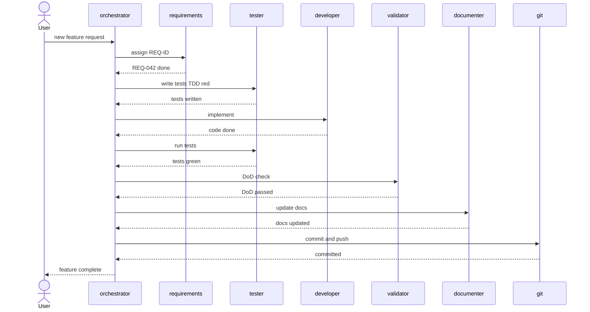

# Development Workflow

> [Back to Architecture Overview](../../../ARCHITECTURE.md)

## Workflow A: Neues Feature (via orchestrator)

## Workflow B: Neues Feature (via feature-lifecycle Pipeline)

Die `feature-lifecycle`-Pipeline ist ein **Shortcut** — sie deckt denselben Lifecycle wie Workflow A ab,
aber als deklarative Pipeline-Definition (`config/role-defaults.yaml`, engine: `scripts/lib/pipelines.py`)
mit festem Stage-Ablauf inkl. Branch + PR, statt über eigenständige Agent-Tool-Delegation.

Stages: `branch → requirement (conditional: req-traceability) → tests (conditional: tests-required) → implement (plan-driven) → verify (conditional: tests-required) → validate-and-document (parallel: validator + documenter) → commit`.

> **Historie:** Vor der August-Refactoring-Roadmap gab es einen eigenständigen `feature`-Agent
> mit hartem 8-Schritt-Prozess (Branch → REQ → Tests → Implement → Verify → DoD → Docs → Commit/PR).
> Dieser wurde durch die deklarative `feature-lifecycle`-Pipeline abgelöst — gleicher Lifecycle,
> aber als Config statt eigener Agent-Rolle.

## Wann feature-lifecycle, wann orchestrator?

| Situation | Agent |
|-----------|-------|
| Neues Feature von Null, mit Branch + PR | `feature-lifecycle` Pipeline |
| Bugfix, Refactoring, Ad-hoc-Aufgaben | `orchestrator` |
| Mehrere unabhängige Tasks in einer Session | `orchestrator` |
| Strukturierter TDD-Lifecycle erzwungen | `feature-lifecycle` Pipeline |
