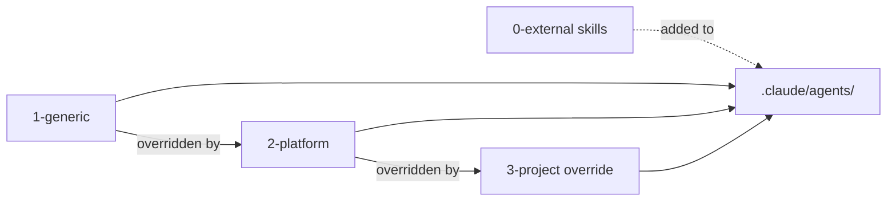
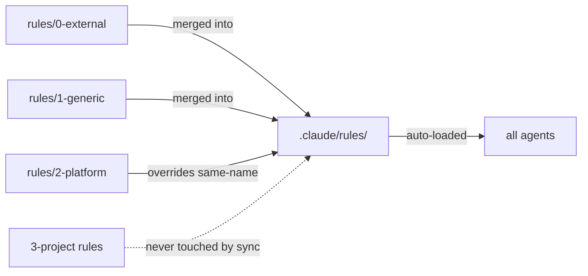
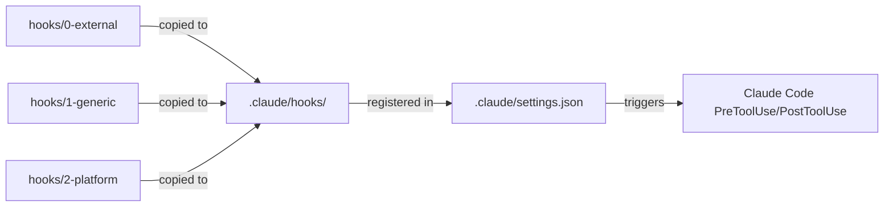
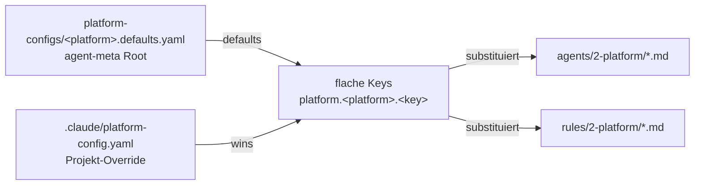

# Layer Model

> [Back to Architecture Overview](../../../ARCHITECTURE.md)

## Agents — Override-Priorität



## Rules — Auto-loaded in alle Agenten



Rules werden von Claude Code automatisch in jeden Agenten-Kontext geladen — kein Read-Tool nötig.
Ideal für Cross-Cutting-Policies (Security, Coding-Konventionen, Issue-Lifecycle).

## Hooks — Opt-in Shell Scripts



Hooks werden **immer kopiert**, aber nur ausgeführt wenn `enabled: true` in `project.yaml`:
```json
"hooks": {
  "dod-push-check": { "enabled": true }
}
```

## Platform-Config — `{{platform.*}}`-Substitution

Die Layer 2 (2-platform)-Quelldateien für Agents **und** Rules können
`{{platform.<platform>.<key>}}`-Platzhalter enthalten. Die Werte kommen aus zwei
Quellen, die zu einem flachen Dictionary gemerged werden (Defaults zuerst,
Projekt-Override gewinnt):



- **Defaults-Pfad:** `platform-configs/<platform>.defaults.yaml` im agent-meta-Root
  (nicht `config/platforms/`). Fehlt die Datei für eine aktive Plattform → still
  übersprungen (nicht jede Plattform braucht Defaults).
- **Override-Pfad:** `.claude/platform-config.yaml` im Projekt (Ebene 3 im
  [Config-Layout](../topics/config-layout.md)); geladen einmal für alle aktiven Plattformen.
- **Flatten:** Verschachtelte YAML-Dicts unter `platform.<platform>:` werden zu
  Dot-Notation-Keys flatten (z.B. `platform.hacs.custom_components_path`).
- **Required-Empty-Konvention:** `""` = Pflichtfeld ohne funktionierenden Default →
  `[WARN]` in `sync.log` bis das Projekt den Wert in `.claude/platform-config.yaml`
  setzt. Non-empty = Working-Default.
- **Substitutions-Semantik:** Ein definierter (auch leerer) Key wird substituiert —
  leerer Pflichtfeld-Key → Leerstring + WARN. Ein in Defaults und Override
  **undefinierter** Key bleibt als literaler `{{platform.*}}`-Platzhalter stehen (mit Warnung).

Beispiel: `platforms: [hacs]` aktiviert den HACS-Preset
(`platform-configs/hacs.defaults.yaml`).

### Conditional Hooks: viz-log

Der `viz-log` Hook ist ein Sonderfall — er wird **nicht** manuell in `project.yaml` aktiviert, sondern automatisch basierend auf `viz.mode`:

| `viz.mode` | `viz-log.sh` kopiert? | In `settings.json` registriert? |
|------------|----------------------|--------------------------------|
| `off` | Nein | Nein (stale → gelöscht) |
| `static` | Nein | Nein (stale → gelöscht) |
| `dynamic` | Ja | Ja (auto-enabled) |
| `full` | Ja | Ja (auto-enabled) |

**Implementierung in `scripts/lib/hooks.py`:**
- Zeile ~230-247: `viz_active = viz_mode in ("dynamic", "full")`
- Wenn `viz-log` und `not viz_active` → Hook wird übersprungen, nicht in `now_managed` aufgenommen
- Stale-Tracking: Wenn Hook vorher managed war, aber jetzt nicht mehr → DELETE + aus settings.json entfernt
- Clean-up erfolgt vollautomatisch beim nächsten `sync.py`-Lauf