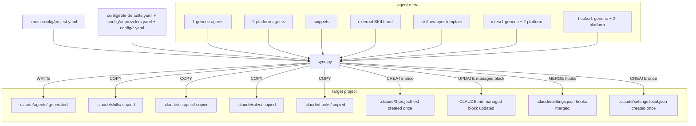

# Sync Flow

> [Back to Architecture Overview](../../../ARCHITECTURE.md)



## Aktueller Sync-Flow

`scripts/sync.py` ist reiner Entrypoint (Argparse + Dispatch), die eigentliche Logik
liegt in `scripts/lib/`. Ablauf (grob):

1. **Config laden:** `.meta-config/project.yaml` (Standardpfad; legacy `agent-meta.config.yaml`/`.json`
   im Projekt-Root werden nur noch als Fallback erkannt) + Framework-Config aus `config/*.yaml`
   (`ai-providers.yaml`, `role-defaults.yaml`, `dod-presets.yaml`, `rules-presets.yaml`,
   `skills-registry.yaml` u.a.) über `lib/config.py::load_config`.
2. **Kontext bauen:** `_build_context()` in `sync.py` erzeugt eine `_SyncContext` (aufgelöste
   Provider, Variablen, Platforms, DoD/Rules-Presets) — gemeinsamer State für alle CLI-Modi.
3. **Dispatch:** `_dispatch(ctx)` routet auf den passenden `_handle_*`-Handler
   (`_handle_sync`, `_handle_validate`, `_handle_create_ext`, …) je nach CLI-Flag.
4. **Provider-Iteration:** `_handle_sync` löst die aktiven Provider aus `ai-providers.yaml`
   + Projekt-Config auf (`resolve_providers`) und rendert für jeden Provider die Agenten.
5. **Template-Rendering:** `lib/agent_sync.py` liest `agents/1-generic/<rolle>.md`, wendet
   `2-platform`-Overrides (`extends`+`patches` oder Full-Replacement) und
   `.claude/3-project/<rolle>-ext.md`-Extensions an, substituiert `{{PLATZHALTER}}` und
   schreibt das Ergebnis nach `.claude/agents/` (bzw. providerspezifisches Zielverzeichnis).
6. **Nebenläufig:** Rules (`rules/1-generic`+`rules/2-platform` → `.claude/rules/`), Hooks
   (`hooks/1-generic`+`hooks/2-platform` → `.claude/hooks/` + Merge in `.claude/settings.json`),
   Snippets, Skills und der `CLAUDE.md`-Managed-Block werden im selben Lauf synchronisiert.

`permissionMode` je Rolle stammt aus `config/role-defaults.yaml` (`permission_mode`-Feld)
plus projektseitigen `permission-mode-overrides` in `.meta-config/project.yaml`, Validation
läuft über `config/project-config.schema.json`.

> **Historie (vor der August-Refactoring-Roadmap):** `sync.py`'s `main()` war eine lange
> `if/elif`-Kette. Diese wurde durch die `_dispatch()`-Tabelle über `_SyncContext`/`_handle_*`-Handler
> ersetzt (10-Wave-Roadmap, #563–#615 et al.) — siehe `singleton-orchestrator-architecture.md`
> für den analogen Umbau bei providerspezifischer Logik.

## CLAUDE.md managed block

Bei jedem normalen sync aktualisiert `sync.py` automatisch den managed block in `CLAUDE.md`
(nur wenn `ai-provider: Claude` in config):

```
<!-- agent-meta:managed-begin -->
<!-- This block is automatically updated by sync.py on every sync. -->

Generiert von agent-meta vX.Y.Z — YYYY-MM-DD

| Agent | Zuständigkeit |
|-------|--------------|
| orchestrator | ... |
| developer    | ... |
...
<!-- agent-meta:managed-end -->
```

- **Außerhalb des Blocks** — handgeschrieben, nie überschrieben
- **Innerhalb des Blocks** — vollständig generiert, manuelle Änderungen gehen verloren
- **Block fehlt** → `[WARN]` im sync.log mit Hinweis zum manuellen Einfügen
