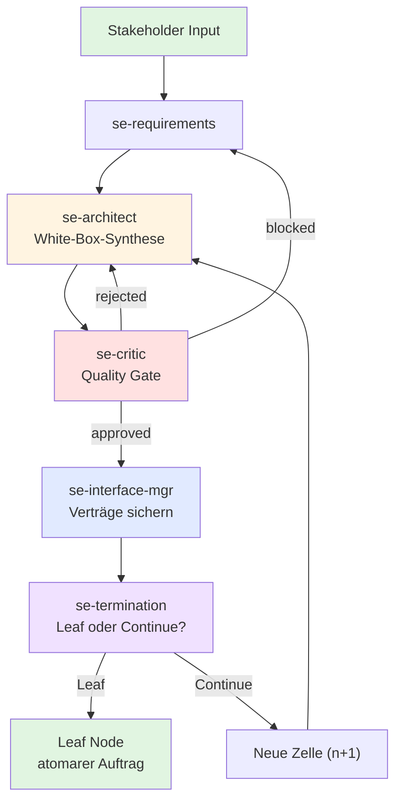

# agent-meta — Architecture Overview

> Version: **0.57.1** — last updated: 2026-06-07

---

## Diagrams

| # | Diagram | Description |
|---|---|---------|-------------|
| 1 | [Layer Model](architecture-layer-model.md) | Override-Priorität der 4 Schichten (0-external → 3-project) + Rules/Hooks |
| 2 | [Sync Flow](architecture-sync-flow.md) | Wie `sync.py` aus agent-meta-Sources das Zielprojekt befüllt |
| 3 | [Agent Roles](architecture-agent-roles.md) | Alle Agenten-Rollen und Zuständigkeiten |
| 4 | [Development Workflow](architecture-dev-workflow.md) | Standard Feature-Workflow als Sequence Diagram |
| 5 | [External Skills](architecture-external-skills.md) | Submodule → Config → Wrapper → Zielprojekt |
| 6 | [Versioning Strategy](architecture-versioning.md) | Repo-, Agent- und Snippet-Versionen |
| 7 | [SE-Agenten-Kaskade](architecture-se-cascade.md) | Rekursive 6-stufige Black-Box → White-Box-Zerlegung |
| 8 | [Viz-Logging MCP](viz-logging-mcp.md) | MCP-basiertes Event-Logging mit CLI-Fallback |
| 9 | [Provider Abstraction Layer](#provider-abstraction-layer-pal--architektur) | PAL architecture: syntax registry, capability matrix, bootstrap |
| 10 | [A2A Handoff Protocol](#a2a-handoff-protocol--architecture) | Structured JSON envelopes for Agent-to-Agent data contracts |

---

## Repository Structure

```
agent-meta/
├── agents/
│   ├── 0-external/          ← Wrapper-Template für externe Skills
│   │   └── _skill-wrapper.md
│   ├── 1-generic/           ← Universelle Agent-Templates
│   │   ├── orchestrator.md
│   │   ├── ideation.md
│   │   ├── requirements.md
│   │   ├── developer.md
│   │   ├── tester.md
│   │   ├── validator.md
│   │   ├── documenter.md
│   │   ├── git.md
│   │   ├── release.md
│   │   ├── docker.md
│   │   ├── meta-feedback.md
│   │   ├── feature.md
│   │   ├── agent-meta-manager.md
│   │   ├── agent-meta-scout.md
│   │   ├── security-auditor.md
│   │   ├── se-orchestrator.md       ← SE: Koordiniert rekursive Kaskade (deprecated)
│   │   ├── se-requirements.md       ← SE: Stakeholder-Anforderungen
│   │   ├── se-architect.md          ← SE: Black-Box → White-Box
│   │   ├── se-critic.md             ← SE: Quality Gate Auditor
│   │   ├── se-interface-mgr.md      ← SE: Interface-Verträge
│   │   ├── se-termination.md        ← SE: Leaf/Continue-Entscheidung
│   │   └── provider-expert.md        ← Basis-Template für Provider-Experten
│   └── 2-platform/          ← Plattform-Overrides
│       ├── sharkord-release.md
│       └── sharkord-docker.md
├── hooks/                   ← Versionierte Hook-Scripts (3-Schichten-Modell)
│   ├── 0-external/          ← Hooks aus externen Skill-Repos
│   ├── 1-generic/           ← Universelle Hooks
│   │   └── dod-push-check.sh
│   └── 2-platform/          ← Plattform-spezifische Hooks
├── rules/                   ← Projekt-globale Regeln (auto-loaded in alle Agenten)
│   ├── 0-external/          ← Rules aus externen Skill-Repos
│   ├── 1-generic/           ← Universelle Regeln
│   │   └── issue-lifecycle.md
│   └── 2-platform/          ← Plattform-spezifische Regeln
├── snippets/                ← Versionierte Code-Snippets (per Agent + Sprache)
│   ├── tester/
│   │   ├── bun-typescript.md
│   │   └── pytest-python.md
│   └── developer/
│       ├── bun-typescript.md
│       └── pytest-python.md
├── external/                ← Git Submodule (externe Skill-Repos)
├── docs/
│   ├── architecture/        ← Architektur-Diagramme (Mermaid, 01–07)
│   ├── CODEBASE_OVERVIEW.md ← Codegenaue Bestandsaufnahme aller src/ Dateien
│   ├── concepts/             ← Feature-Konzepte & Design-Entscheidungen
│   │   └── viz-logging-mcp.md ← MCP-basierte Viz-Logging-Architektur
│   └── conclusions/         ← Tägliche Session-Erkenntnisse
├── schemas/
│   ├── a2a-handoff.schema.json       ← A2A Envelope Schema (Draft-07)
│   ├── se-decomposition.schema.json  ← JSON Schema für SE-Kaskaden-Outputs
│   └── handoffs/
│       ├── task-spec.schema.json     ← Universelles Kern-Payload (kurze Feldnamen)
│       ├── ideation-output.schema.json ← existierend, in Envelope eingebettet
│       └── ext/
│           ├── ideation-extension.schema.json
│           ├── design-extension.schema.json
│           ├── api-extension.schema.json
│           └── review-extension.schema.json
├── templates/
│   ├── SE-STRATEGY.template.md       ← Durable Anchor für SE-Projekte
│   └── bootstrap/                   ← PAL: Bootstrap-Instruktions-Templates
│       └── gemini-session-bootstrap.md ← PAL: Gemini define_subagent Workflow
├── agent-meta.schema.json   ← JSON Schema für agent-meta.config.yaml (Draft-07)
├── external-skills.config.yaml  ← Skill-Konfiguration (approved: true/false)
├── roles.config.yaml        ← Zentrale Rollen-Konfiguration (model, permissionMode)
├── config/                   ← PAL: Provider-Konfiguration
│   ├── delegation-syntax.yaml    ← PAL: Syntax-Mapping {{PAL_*}} → nativer Syntax
│   ├── provider-capabilities.yaml  ← PAL: Capability-Matrix pro Provider
│   └── provider-bootstrap.yaml  ← PAL: Bootstrap-Mechanismen (file/api/config)
├── scripts/
│   ├── sync.py              ← Agent-Generator
│   ├── viz-logger.py         ← MCP-Server & CLI-Fallback für Event-Logging
│   ├── viz-logger-mcp.mjs    ← HTTP/SSE MCP-Transport für OpenCode (Windows)
│   ├── viz-report.py         ← Session-Report-Generator (Terminal/HTML/JSON)
│   └── lib/
│       ├── delegation_syntax.py  ← PAL: DelegationSyntaxEngine
│       └── bootstrap.py          ← PAL: BootstrapEngine
└── howto/
    ├── first-steps.md
    ├── instantiate-project.md
    ├── upgrade-guide.md
    ├── agent-composition.md
    ├── external-skills.md
    ├── hooks.md
    ├── agent-isolation.md
    ├── rules.md
    ├── agent-memory.md
    ├── sync-concept.md
    ├── agent-meta.config.example.json
    ├── se-workflow.md              ← SE: Vollständiger rekursiver Workflow
    ├── se-blackbox-to-whitebox.md  ← SE: BB→WB-Übergang mit Beispiel
    ├── se-interface-management.md  ← SE: Interface-Propagation im Detail
    └── se-mcp-adapters.md          ← SE: Export-Adapter für Ticket-Systeme
```

---

## SE-Agenten-Kaskade — Architektur

Die SE-Agenten-Kaskade ist ein **fraktales, rekursives System** das Stakeholder-Anforderungen durch eine 6-stufige Black-Box → White-Box-Zerlegung in implementierbare Komponenten überführt.

### Prinzip: Die rekursive System-Zelle

Jede Ebene (L1 → L2 → L3) ist eine **Zelle** mit identischer Struktur:



### Die 6 Stufen

| Stufe | Agenten | Input | Output |
|-------|---------|-------|--------|
| **1. Stakeholder REQ** | `se-requirements` | Unstrukturierter Bedarf | Formale L1-Blackbox-REQs mit REQ-ID |
| **2. L1 Blackbox** | `se-requirements` | Stakeholder-REQs | L1 System Blackbox (externes Verhalten) |
| **3. L1 Whitebox** | `se-architect` → `se-critic` | L1 Blackbox | Abstrakte Sub-Systeme + interne Interfaces |
| **4. L2 Blackbox** | `se-architect` → `se-critic` → `se-interface-mgr` | L1 Whitebox | Konkrete Komponenten + Propagations-Map |
| **5. L2 Whitebox** | `se-architect` → `se-critic` → `se-interface-mgr` | L2 Blackbox | Detaillierte Komponenten-Architektur |
| **6. L3 Component** | `se-architect` → `se-critic` → `se-termination` | L2 Whitebox | Atomare Arbeitsaufträge oder weitere Zerlegung |

### Interface-Propagation

Der **Interface Manager** erzeugt eine **Propagations-Map** die sicherstellt, dass jede neue Zelle (n+1) alle relevanten Schnittstellen kennt:

```
Ebene n (White-Box)
  ├── COMP-A → inherited_external: ["WLAN"], new_internal_outgoing: ["IF-001"]
  ├── COMP-B → inherited_external: [], new_internal_incoming: ["IF-001"]
  └── COMP-C → inherited_external: ["Strom", "Wasser"], new_internal_incoming: ["IF-002"]

Ebene n+1 (neue Zelle für COMP-A)
  → Erhält: Black-Box-REQ für COMP-A + Propagations-Map-Zeile für COMP-A
  → Weiß: "Ich habe WLAN nach außen und spreche per IF-001 mit COMP-B"
```

### Korrekturschleifen

```
Architect → Critic
                ├── approved → Interface Manager → Termination
                ├── rejected → Architect (max. 3 Iterationen mit correction_hints)
                └── blocked → Parent-Zelle (Architektur auf Ebene n-1 revidieren)
```

### Schutzmechanismen

| Regel | Zweck |
|-------|-------|
| `max_depth` | Hartes Limit der Rekursionstiefe (Default: 5) |
| `max_total_cells` | Begrenzung der Gesamtzellen (Default: 20) |
| `max_critic_iterations` | Max. Korrekturschleifen pro Critic (Default: 3) |
| `max_parallel_cells` | Parallele Zellen pro Ebene (Default: 4) |
| Context Window Rule | Zelle n+1 erhält nur ~800 Tokens (kein Context Drift) |
| Circular Reference Check | Zyklische Parent-Ketten →强制 Leaf |

### Datenmodell

Alle SE-Agenten produzieren JSON-Output der durch `schemas/se-decomposition.schema.json` validiert wird. Das Schema definiert:
- **L1-L3 Struktur** (feature_id, stakeholder_requirement, l1_system, l2_subsystems, l3_components)
- **CQRS-Interfaces** (commands, events, queries)
- **Agent-spezifische Felder** (sub_components, internal_interfaces, propagation_map, critic_status, termination_decisions)

### Konfiguration

SE-Rollen sind in `config/role-defaults.yaml` als `workflow_tier: optional` definiert. Sie werden nur generiert wenn in `.meta-config/project.yaml` explizit aktiviert:

```yaml
roles:
  - se-orchestrator
  - se-requirements
  - se-architect
  - se-critic
  - se-interface-mgr
  - se-termination

variables:
  SE_MAX_DEPTH: 5
  SE_MAX_CELLS: 20
  SE_MAX_CRITIC_ITERATIONS: 3
  SE_MAX_PARALLEL_CELLS: 4
```

---

## Viz-Logging MCP — Architektur

Das Agenten-Event-Logging (`agent_start`, `delegate_out`, `agent_end`) wurde in v0.55.2 auf einen MCP-basierten Mechanismus mit CLI-Fallback umgestellt.

### Problem der Vorgänger-Architektur
- Lange Inline-Python-Skripte in Agenten-Prompts (~80 Zeilen pro Agent) → Prompt-Bloat
- Provider-spezifische Bash-Bestätigungs-Popups (Copilot, Continue, Claude Code) → Prompt Fatigue
- Race-Conditions bei parallelen Subagent-Schreibzugriffen auf `events.jsonl` unter Windows
- Keine explizite Verknüpfung eingehender/ausgehender Delegationen

### Neue Architektur

```
Agent Prompt (kurze Instruktion, ~10 Zeilen)
         ↓
    MCP Tool: log_viz_event  (primär, kein Popup)
         ↓               ↘
     HTTP/SSE Transport    CLI Fallback
     (OpenCode Windows)    (python viz-logger.py --event …)
          ↓                   ↓
     viz-logger-mcp.mjs    viz-logger.py
          ↓                   ↓
     Cross-Process File Lock (.lock + Exponential Backoff)
          ↓
     Handshake-Tracking (task_id/caller/target)
          ↓
     events.jsonl
```

### Komponenten

| Komponente | Zweck |
|-----------|-------|
| `scripts/viz-logger.py` | MCP-Server + CLI-Fallback. Primär via MCP-Tool `log_viz_event`, fallback via `python viz-logger.py --event ...`. Cross-Process File-Locking mit 10-fachem Retry. |
| `scripts/viz-logger-mcp.mjs` | HTTP/SSE MCP-Transport für OpenCode auf Windows. Löst stdio-Kompatibilitätsproblem. |
| `scripts/lib/viz.py` | `inject_viz_prompt_block()`: Injiziert nur noch kompakte Instruktionen (~10 Zeilen) in Agent-Templates. Prompt-Größe um ~60% reduziert. |
| `scripts/viz-report.py` | Session-Report-Generator mit Terminal-/HTML-/JSON-Ausgabe. Inaktivitäts-Watcher für automatischen Server-Shutdown. |
| `docs/live-dashboard.html` | Interaktives Browser-Dashboard mit Cytoscape-Graph, Gantt-Timeline und Sequence-Diagram. |

### Delegations-Tracking

Das Handshake-Verfahren ordnet Delegationen via `task_id` lückenlos zu:
- **Outgoing:** Orchestrator loggt `delegate_out` mit `target=developer, task_id=uuid-1234`
- **Incoming:** Worker-Agent loggt `agent_start` mit `caller=orchestrator, task_id=uuid-1234`
- **Return:** Worker-Agent loggt `agent_end` mit `target=orchestrator, status=success`

---

## Provider Abstraction Layer (PAL) — Architektur

PAL verhindert dass provider-spezifische Delegationssyntax (z.B. `Agent()`, `task()`) in generische Templates gelangt und dort als "Syntax Leak" in falsche Provider-Targets propagiert. Gleichzeitig löst PAL das Problem dass Gemini/Antigravity keine dateibasierte Agent-Registry besitzt.

### Drei-Schichten-Modell

```
1-generic Templates ({{PAL_DELEGATE}}, {{PAL_FANOUT}}, {{PAL_PARALLEL_GROUP}}, {{PAL_FALLBACK}})
        ↓
Provider Abstraction Layer (Syntax-Registry + Capability Matrix + Bootstrap)
        ↓
Claude | Gemini | Opencode | Continue | Copilot | Mammouth
```

### Komponenten

| Komponente | Datei | Zweck |
|------------|-------|-------|
| **Syntax Registry** | `config/delegation-syntax.yaml` | Mapping `{{PAL_*}}` → provider-native Syntax |
| **Capability Matrix** | `config/provider-capabilities.yaml` | Feature-Flags pro Provider (subagent_dispatch, parallel_execution, file_based_agents, hooks, native_agent_tools) |
| **Bootstrap Registry** | `config/provider-bootstrap.yaml` | Registrierungsmechanismus pro Provider (file-based, api-based, config-based) |
| **DelegationSyntaxEngine** | `scripts/lib/delegation_syntax.py` | Lädt Syntax-Registry, substituiert `{{PAL_*}}` in `_compose_agent()` während sync |
| **BootstrapEngine** | `scripts/lib/bootstrap.py` | Führt provider-spezifische Bootstrap-Aktionen aus (Gemini: define_subagent Instruktionen, Continue: config.yaml Update) |
| **Bootstrap Template** | `templates/bootstrap/gemini-session-bootstrap.md` | Session-Start Workflow für Gemini (define_subagent) |

### Integration in sync.py

```
_compose_agent() (agents.py)
  → nach substitute() und platform-vars:
    → DelegationSyntaxEngine.apply(content, provider)
    → substituiert alle {{PAL_*}} Placeholder
  → für Orchestrator: PLATFORM_ORCHESTRATOR_PATCHES anwenden
  → nach Agent-Generierung pro Provider:
    → BootstrapEngine.run_bootstrap(provider, agents_dir, project_root)
    → Gemini: inject-bootstrap-instructions in GEMINI.md
    → Continue: update-config in .continue/config.yaml
```

### Capability Matrix (Auszug)

| Capability | Claude | Opencode | Gemini | Continue | Copilot | Mammouth |
|------------|--------|----------|--------|----------|---------|
| subagent_dispatch | ✅ | ✅ | ✅ | ❌ | ❌ |
| parallel_execution | ✅ | ✅ | ✅ | ❌ | ❌ |
| file_based_agents | ✅ | ✅ | ❌ | ❌ | ✅ |
| hooks | ✅ | ❌ | ❌ | ❌ | ❌ |
| bootstrap_required | ❌ | ❌ | ✅ | ✅ | ❌ |

### Bootstrap-Flow

```
file-based (Claude, Opencode, Copilot):
  → Keine Aktion. Agenten werden automatisch aus Verzeichnis geladen.

api-based (Gemini):
  → sync.py generiert define_subagent Instruktionen
  → Instruktionen werden in GEMINI.md injiziert (managed block)
  → Bei Session-Start: Hauptchat liest .gemini/agents/*.md
  → Registriert jeden Agent via define_subagent API-Call

config-based (Continue):
  → sync.py trägt Agenten in .continue/config.yaml ein
  → Managed block zwischen # agent-meta:managed-agents-begin/end
  → Eintrag: name + prompt-Pfad pro Agent
```

---

## A2A Handoff Protocol — Architecture

The A2A Handoff Protocol standardizes Agent-to-Agent communication via structured JSON envelopes. It replaces natural-language prompts with machine-validatable data contracts.

### Zwei-Ebenen-Modell

| Ebene | System | ID | Default |
|-------|--------|-----|---------|
| **Operational Layer** | viz-Handshake | `viz_task_id` | Aktiv (basic Events) |
| **Data Contract Layer** | A2A-Envelope | `handoff_id` | Immer aktiv |
| **Debug-Ebene** | A2A viz-Events | `viz_task_id` | **AUS** (`viz.debug: false`) |

Lose Kopplung via `trace_context.viz_task_id` im Envelope. A2A funktioniert ohne viz, und viz funktioniert ohne A2A.

### Datenfluss

```
source_agent                         target_agent
     │                                     ▲
     │  1. Envelope erstellen               │
     │  (handoff_id, payload,               │
     │   schema_ref, trace_parent)          │
     │                                     │
     ▼  2. Schema-Validierung               │
  [validate gegen schema_ref]              │
     │                                     │
     │  3. Provider-Adaption               │
     │  (json → yaml für Continue/Copilot) │
     │                                     │
     │  4. PAL_Dispatch                    │
     └─────────────────────────────────────┘
```

### Envelope-Struktur (gekürzt)

```json
{
  "protocol_version": "1.0.0",
  "handoff_id": "HOFF-YYYYMMDD-NNN",
  "source_agent": "orchestrator",
  "target_agent": "developer",
  "schema_ref": "schemas/handoffs/task-spec.schema.json",
  "payload": { "t": "Task-Beschreibung", "pri": "high" },
  "trace_parent": "HOFF-YYYYMMDD-NNN",
  "trace_context": { "trace_id": "...", "span_id": "...", "viz_task_id": "..." },
  "supersession": {
    "supersedes": "HOFF-...",
    "history": ["HOFF-...", "HOFF-..."],
    "reason": "critic rejection: missing traceability"
  }
}
```

### Schema-Strategie: 1 Core + 4 Extensions + 1 SE

```
schemas/handoffs/
├── task-spec.schema.json              ← Core: 60-80% Abdeckung (kurze Feldnamen)
├── ext/
│   ├── ideation-extension.schema.json  ← ideation → requirements
│   ├── design-extension.schema.json    ← ui-ux-designer → developer
│   ├── api-extension.schema.json       ← api-specialist → developer
│   └── review-extension.schema.json    ← code-reviewer → developer
└── (se-decomposition.schema.json)      ← SE-Kaskade (7 Routen, lange Feldnamen)
```

84% Routen-Abdeckung mit Core + Extensions. SE-Schemas laufen mit `compact_mode: false`.

### Provider Transport

| Provider | structured_handoff | Format | Batch | Supersession |
|----------|-------------------|--------|-------|-------------|
| Claude | `true` | JSON | `batch: true` | `history[]` |
| Opencode | `true` | JSON | `batch: true` | `history[]` |
| Gemini | `true` | JSON | `batch: true` | `history[]` |
| Continue | `false` | YAML-Block | Sequential | `history[]` |
| Copilot | `false` | YAML-Block | Sequential | `history[]` |
| Mammouth | `false` | YAML-Block | Sequential | `history[]` |

### Orchestrator-Integration

Der Orchestrator ist die primäre Envelope-Fabrik:
- **Intent-Routing** → bestimmt `target_agent` + `schema_ref` aus Routing-Tabelle
- **FANOUT** → N parallele Envelopes mit gemeinsamem `trace_context.trace_id`
- **Batch-Mode** → N Tasks in einem Envelope (gleiches Ziel) — spart ~110 Tokens bei 3 Tasks
- **BARRIER** → aggregiert Response-Envelopes, liefert Aggregations-Envelope
- **PIPELINE** → verkettet Envelopes via `trace_parent`
- **REPEAT_UNTIL** → managed Supersession-Ketten via `history[]`

### Handoff-Contracts

16 Rollen deklarieren Contracts in `config/role-defaults.yaml` (`input_contracts`, `output_contract`, `target_roles`, `input_schema`, `output_schema`). Jeder Contract referenziert das Payload-Schema das für die Route gilt.

→ Full spec: `docs/concepts/a2a-handoff-protocol.md`
→ Envelope schema: `schemas/a2a-handoff.schema.json`
→ MCP tools: `config/mcp-registry.yaml` (a2a-handoff server: validate_handoff, resolve_handoff_schema, resolve_handoff)

---

## Keyless Discovery & Pricing Overlay — Architektur

Mit der Implementierung von dynamischer Modellerfassung und Tier-Presets (REQ-MOD-01) wird ein Keyless Discovery Ansatz sowie ein transparentes Pricing Overlay für die Modell-Auswahl eingeführt.

### Keyless Discovery via OpenRouter

`scripts/lib/model_discovery.py` verwendet die öffentliche OpenRouter API (`https://openrouter.ai/api/v1/models`) als globalen Proxy. Dies ermöglicht:
- Abrufen von Echtzeit-Modelldaten (Anthropic, Gemini, Open-Source) **ohne** lokale API-Keys.
- Echtzeit-Abfrage der Preise für Input/Output Tokens (`pricing.prompt`, `pricing.completion`).
- Die Liste der verfügbaren Modelle sowie deren Kontextfenster und Pricing wird in `config/generated/model-registry.json` gecached.

### Provider Mapping: OpenCode Zen

OpenCode-Modelle werden vom keyless Zen-Endpoint (`https://opencode.ai/zen/v1/models`) bezogen und im Registry als `opencode-zen` klassifiziert. IDs werden als `opencode/<raw_id>` namespaced, um Kollisionen mit OpenRouter-IDs zu vermeiden.

### Pricing Overlay

Das `config/pricing-overlay.yaml` fungiert als manueller Überschreib-Mechanismus für die automatisierten API-Preise:
- API-Preise werden standardmäßig bevorzugt.
- Ist im Overlay ein eigener Preis definiert (z.B. `0.00$` für Zen-Subscriptions), überschreibt dieser den API-Preis.
- Die Admin-UI (Web-Dashboard) ermöglicht das direkte Editieren dieser Custom-Preise.

### UI Transparenz

Im Dashboard wird die Datenherkunft und Berechnungsmethodik für den User transparent visualisiert:
- **`[API]`**: Echtzeit-Daten vom Provider / OpenRouter.
- **`[Overlay]`**: Vom User / Administrator manuell im Overlay überschriebene Preise.
- **`[Calc]`**: Intern berechnete Score-Faktoren (Cost Factor).
- Weiterhin werden Reference-Links direkt zu den Providern in der UI eingebunden, um die Herkunft verifizierbar zu machen.

---

## Update Instructions

Bei jedem **Major Release** aktualisieren:
- Version + Datum in der Überschrift
- `Repository Structure` (neue Dateien/Verzeichnisse)
- Diagramme in `docs/architecture/` (neue Rollen, Skills, Schichten)