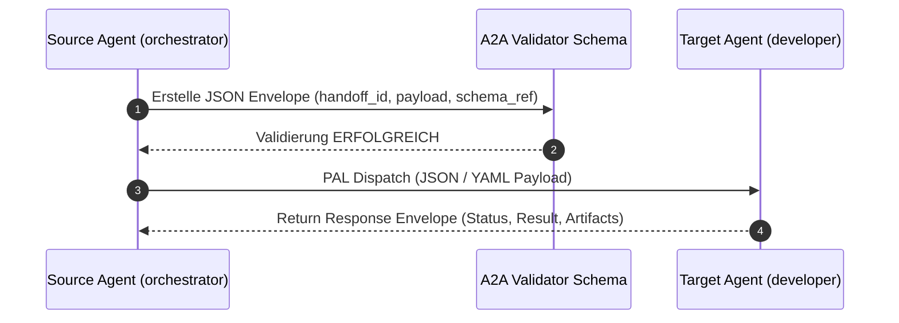

# Kernprinzip 8: A2A Handoff Protocol & Structured Envelopes

> **Typ:** Concept  
> **Status:** Active  
> **Relevante Komponenten:** `schemas/a2a-handoff.schema.json`, `schemas/handoffs/task-spec.schema.json`, `config/role-defaults.yaml`

---

## 1. Übersicht & Motivation

In komplexen Multi-Agenten-Systemen führt die reine Fließtext-Kommunikation zwischen Agenten zu Missverständnissen, fehlenden Parametern und unvollständigen Task-Übergaben.

Das **A2A Handoff Protocol** ersetzt Freitext-Prompts durch maschinell validierbare **JSON-Envelopes** (bzw. YAML-Block Fallbacks bei Runtimes ohne strukturierte Tool-Outputs). Es definiert klare Datenverträge für jede Schnittstelle im System.



---

## 2. Struktur des A2A Envelopes

Jeder Handoff zwischen zwei Agenten wird in folgende standardisierte Datenstruktur gekapselt (`schemas/a2a-handoff.schema.json`):

```json
{
  "protocol_version": "1.0.0",
  "handoff_id": "HOFF-20260727-001",
  "source_agent": "orchestrator",
  "target_agent": "developer",
  "schema_ref": "schemas/handoffs/task-spec.schema.json",
  "payload": {
    "t": "Implementiere JWT Auth Service",
    "pri": "high",
    "f": ["src/auth.py", "tests/test_auth.py"]
  },
  "trace_parent": "HOFF-20260727-000",
  "trace_context": {
    "trace_id": "tr-abc123xyz",
    "span_id": "sp-001",
    "viz_task_id": "vtask-9988"
  },
  "supersession": {
    "supersedes": "HOFF-20260727-000",
    "reason": "critic rejection: missing error handling"
  }
}
```

---

## 3. Schema-Architektur: Core + 4 Extensions

Um Token-Budget zu sparen und trotzdem maximale Typ-Sicherheit zu bieten, verwendet agent-meta eine modulare Schema-Hierarchie:

```
schemas/handoffs/
├── task-spec.schema.json              ← Core: Abdeckungsgrad 60-80% (kurze Feldnamen: t, pri, f)
└── ext/
    ├── ideation-extension.schema.json  ← ideation → requirements
    ├── design-extension.schema.json    ← ui-ux-designer → developer
    ├── api-extension.schema.json       ← api-specialist → developer
    └── review-extension.schema.json    ← code-reviewer → developer
```

* **Core Payload (`task-spec`):** Kompakte Feldnamen (z.B. `t` für Task, `pri` für Priorität, `f` für Files) reduzieren den Token-Overhead um bis zu 40%.
* **Extensions:** Erweitern das Core-Payload selektiv für spezialisierte Phasen (Design, API-Verträge, Review-Hinweise).

---

## 4. Der Orchestrator als Envelope-Fabrik

Der `orchestrator` steuert die Erstellung, Verkettung und Entwertung von Envelopes über verschiedene Kontrollfluss-Muster:

| Muster | Beschreibung & Envelope-Verhalten |
|---|---|
| **Intent Routing** | Bestimmt aus der Routing-Tabelle Zielagent und Schema-Referenz. |
| **FANOUT / BARRIER** | Erzeugt N parallele Envelopes mit identischer `trace_id`. Aggregiert Antworten in einem Aggregations-Envelope. |
| **Batch-Mode** | Bündelt mehrere Teilaufgaben für denselben Zielagenten in einen einzigen Envelope (spart ~110 Tokens pro Aufruf). |
| **PIPELINE** | Verkettet Folgeschritte über `trace_parent`. |
| **Supersession & Retry** | Bei Nachbesserungen (Retry) entwertet ein neuer Envelope den vorherigen über das `supersession`-Feld unter Erhalt der `history[]`. |

---

## 5. Transport-Formate nach Provider

| Provider Runtime | `structured_handoff` | Transport-Format | Unterstützte Features |
|---|:---:|:---:|---|
| **Claude Code** | ✅ | Nativer JSON-Payload | Batch-Mode, Direct Validation |
| **Gemini / Antigravity** | ✅ | Nativer JSON-Payload | Batch-Mode, API Handoff |
| **Opencode CLI** | ✅ | Nativer JSON-Payload | Batch-Mode, Tool Handoff |
| **Continue / Copilot** | ❌ | Formatierter YAML-Block | Sequenzieller Fallback |

---

## 6. Querverweise & Verwandte Konzepte

* [[core-principle-orchestrator-first]] — Single Entry Point & Singleton Pattern
* [[core-principle-context-compaction]] — Compact Mode Feldnamen & Token-Budget
* [[core-principles-overview]] — Gesamtübersicht der agent-meta Prinzipien