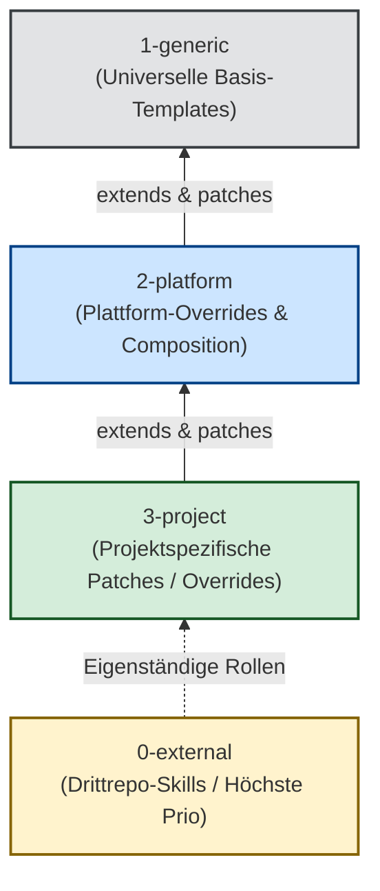

# Kernprinzip 5: 4-Schichten Composition System & Declarative Patching

> **Typ:** Concept  
> **Status:** Active  
> **Relevante Komponenten:** `agents/0-external/`, `agents/1-generic/`, `agents/2-platform/`, `agents/3-project/`, `scripts/lib/agents.py`

---

## 1. Übersicht & Motivation

In großen Multi-Projekt-Umgebungen führt die vollständige Duplizierung von Agenten-Prompts (Copy & Paste) zu extremem Wartungsaufwand. Ändert sich eine Kernregel im Framework, müssten alle Kopien manuell nachgeführt werden.

**agent-meta** löst dieses Problem durch ein **deklaratives 4-Schichten Composition System**: Generische Agenten-Templates vererben ihre Eigenschaften, während spezifische Schichten (Plattform oder Projekt) selektive Änderungen via **Patches** durchführen.



---

## 2. Die 4 Schichten im Detail

| Schicht | Ordner | Beschreibung & Zweck | Priorität / Auflösung |
|---|---|---|---|
| **0-external** | `agents/0-external/` | Externe Skill-Agenten aus Drittrepos (via Git Submodule). Eingebunden über `config/skills-registry.yaml`. Benötigen ein Quality Gate (`approved: true`). | Höchste Priorität für spezialisierte Sub-Rollen |
| **3-project** | `agents/3-project/` | Projektspezifische Verfeinerung.<br/>• `<rolle>.md` → Vollständiger Override<br/>• `<rolle>-ext.md` → Additive Patches | Überschreibt 2-platform und 1-generic |
| **2-platform** | `agents/2-platform/` | Plattformspezifische Anpassungen (z.B. Claude vs. Gemini Besonderheiten). Kann `extends:` nutzen. | Überschreibt 1-generic |
| **1-generic** | `agents/1-generic/` | Universelle Basis-Templates. Provider-agnostisch und absolut essenziell für alle Projekte. | Basis-Schicht |

**Override-Reihenfolge:**  
`1-generic` → `2-platform` → `3-project/<rolle>.md` → `0-external`

---

## 3. Deklarative Patch-Operators

Das Composition System nutzt YAML-Frontmatter in Plattform- oder Projekt-Dateien, um gezielte Text-Transformationen auf das Parent-Template anzuwenden:

```yaml
extends: "1-generic/developer.md"
patches:
  - op: replace
    anchor: "## Core Capabilities"
    content: |
      ## Core Capabilities
      Spezialisierte Capabilities für das Zielprojekt...
  - op: append-after
    anchor: "## Rules"
    content: |
      ### Zusätzliche Projektregel
      - Nutze stets Bun statt Node.js.
  - op: delete
    anchor: "## Legacy Section"
  - op: append
    content: |
      ## Projektspezifischer Anhang
      Weitere Notizen am Ende des Dokuments.
```

### Die 4 Patch-Operationen:
1. `replace`: Ersetzt eine bestehende Section ab dem Anker-Header vollständig.
2. `append-after`: Fügt neuen Inhalt direkt nach dem angegebenen Anker-Header ein.
3. `delete`: Entfernt die Ziel-Section komplett aus dem generierten Agenten.
4. `append`: Hängt den angegebenen Text an das Ende des Gesamtdokuments an.

---

## 4. Instruction Bleed Prevention

Bei der Verwendung von `extends + patches` besteht das wissenschaftlich belegte Risiko des **Instruction Bleeds** (Cross-Module Interference bei Text-Level Composition, vgl. arXiv:2606.26356). Dabei können sich widersprüchliche Instruktionen aus Parent- und Child-Layer durch unbedachtes Zusammenfügen überlagern.

### Prüfpunkte vor einem Patch-Commit:
* **Semantik-Check:** Überschreibt ein `append-after` eine Regel, die in der übergeordneten Schicht anders definiert wurde?
* **Widerspruchs-Prüfung:** Entstehen durch additive Patches doppelte oder gegensätzliche Regelaussagen?
* **Replace vs. Append-After:** Bei fundamentalen Regeländerungen ist `replace` stets dem additiven `append-after` vorzuziehen, um Instruction Bleed zu verhindern.

---

## 5. Querverweise & Verwandte Konzepte

* [[core-principle-provider-agnosticism]] — Provider-Agnostik in Schicht 1-generic
* [[core-principle-pal-variables]] — Substitution von Platzhaltern in vererbten Templates
* [[core-principles-overview]] — Gesamtübersicht der agent-meta Prinzipien