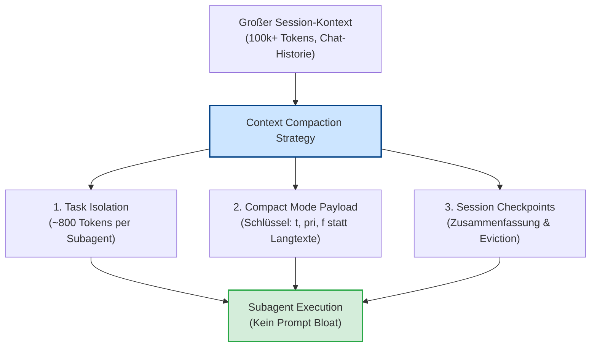

# Kernprinzip 10: Context Compaction & Token Budget Management

> **Typ:** Concept  
> **Status:** Active  
> **Relevante Komponenten:** `schemas/handoffs/task-spec.schema.json`, `agents/1-generic/orchestrator.md`, Context Isolation Protocols

---

## 1. Übersicht & Motivation

Mit zunehmender Komplexität von Multi-Agenten-Workflows wächst der verbrauchte Kontext im LLM (Context Window) exponentiell. Dies führt nicht nur zu massiv steigenden API-Kosten, sondern verschlechtert auch die Aufmerksamkeitsleistung (Attention Drift) des Modells.

**agent-meta** implementiert ein vielschichtiges **Context Compaction & Token Budget Management**, um Sessions auch über stundenlange Entwicklungszyklen hinweg hochpräzise und kosteneffizient zu halten.



---

## 2. Drei Säulen der Kontext-Optimierung

### 2.1 Task Isolation (Subagent Boundaries)
Wenn der Main Chat oder Orchestrator einen Subagenten (`developer`, `tester`, `validator`) aufruft, wird **nicht** die gesamte Historie der Haupt-Session übergeben.
* **Isolierter Prompt:** Der Subagent erhält ausschließlich den System-Prompt seiner Rolle und das minimale Handoff-Payload.
* **Token-Budget:** Der Input-Kontext pro Subagent-Call sinkt von typischerweise 50.000+ Tokens auf schlanke **800–1.200 Tokens**.

### 2.2 Compact Mode Payload (`task-spec.schema.json`)
Im A2A Handoff Protocol verwendet agent-meta verkürzte JSON-Feldbezeichner (`compact_mode: true`), was das Übertragungsvolumen im Prompt um bis zu 40% reduziert:

```json
// Standard / Uncompacted
{
  "task_description": "Implementiere User Service Tests",
  "priority_level": "high",
  "affected_files": ["tests/test_user.py"]
}

// Compact Mode (agent-meta Standard)
{
  "t": "Implementiere User Service Tests",
  "pri": "high",
  "f": ["tests/test_user.py"]
}
```

### 2.3 Session Checkpoints & Eviction
In langanhaltenden Interaktionen veranlasst der `orchestrator` regelmäßige Zusammenfassungen (Session Summaries). Alte Gesprächsabschnitte werden komprimiert und in den Knowledge-Engine-Bereich `knowledge/wiki/sources/` überführt, wodurch der Arbeitsspeicher (Context Window) entlastet wird.

---

## 3. Token-Einsparung im Vergleich

| Technik | Ohne Optimierung | Mit Compaction | Token-Ersparnis |
|---|:---:|:---:|:---:|
| **Subagent Handshake** | ~45.000 Tokens (Full Chat) | ~800 Tokens (Isolated) | **~98%** |
| **A2A Envelope Transfer** | ~450 Tokens (Lange Keys) | ~260 Tokens (Compact Keys) | **~42%** |
| **Multi-Task Delegation** | 3 Aufrufe (3x ~450 Tokens) | Batch-Mode Envelope (1x ~500 Tokens) | **~63%** |

---

## 4. Anti-Prompt-Fatigue Directives

Ausgelöst durch zu lange Inline-Skripte in Prompts neigen LLMs zu Instruktions-Vergessenheit. agent-meta minimiert die Instruktionslänge in Prompts auf unter **100 Zeilen** pro Agent, indem Ausführungslogik in externe Python-Skripte (`viz-logger.py`, `sync.py`) und MCP-Tools ausgelagert wird.

---

## 5. Querverweise & Verwandte Konzepte

* [[core-principle-a2a-handoff]] — Agent-to-Agent Protokoll & Envelopes
* [[core-principle-orchestrator-first]] — Singleton Orchestrator & Isolation
* [[core-principles-overview]] — Gesamtübersicht aller Kernprinzipien