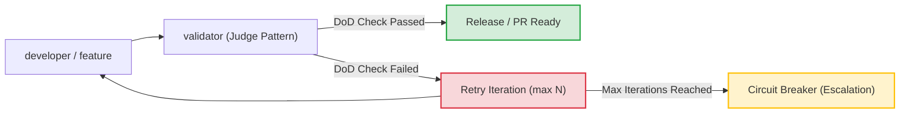
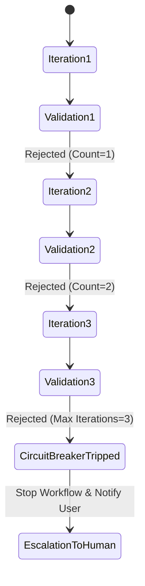

# Kernprinzip 6: Definition of Done (DoD) Presets & Quality Gates

> **Typ:** Concept  
> **Status:** Active  
> **Relevante Komponenten:** `.meta-config/project.yaml`, `agents/1-generic/validator.md`, `agents/1-generic/code-reviewer.md`, Circuit-Breaker Logik

---

## 1. Übersicht & Motivation

Nicht jedes Softwareprojekt benötigt von Tag 1 an ein kompromissloses Enterprise-Security-Audit und 100% Testabdeckung. Gleichzeitig dürfen produktionskritische Systeme keine ungeprüften Schnellschüsse enthalten.

**agent-meta** löst diesen Zielkonflikt durch **konfigurierbare Definition of Done (DoD) Presets** in Kombination mit dem **Judge/Validator Pattern** und automatischen **Circuit-Breakern**.



---

## 2. Die 4 DoD-Presets im Vergleich

Das gewählte DoD-Preset wird in `.meta-config/project.yaml` deklariert und von `sync.py` in alle Agenten-Prompts injiziert:

```yaml
variables:
  DOD_PRESET: "standard" # rapid-prototyping | standard | strict | enterprise
```

| Criterion / Rule | `rapid-prototyping` | `standard` | `strict` | `enterprise` |
|---|:---:|:---:|:---:|:---:|
| **Fokus** | Speed & PoC | Balanced Dev | High Quality | Compliance & Safety |
| **Unit Tests** | Optional | Pflicht für Logik | 80%+ Coverage | 95%+ Coverage |
| **REQ-ID Traceability** | Deaktiviert | Empfohlen | Pflicht | Pflicht & Audit Trail |
| **Code Review Gate** | Self-Check | `code-reviewer` | `code-reviewer` + Audit | 4-Augen Signoff |
| **Security Audit** | Aus | Basis | Statische Analyse | DevSecOps & SBOM |
| **Doku-Pflicht** | Minimal | Inline & README | Architecture & API | Vollständig (OKF) |

---

## 3. DoD-as-Gate / Judge Pattern

Das **Judge/Validator Pattern** trennt die Implementierung strikt von der Abnahme:

1. **Unabhängige Rollentrennung:** Der `developer` darf seine eigene Arbeit nicht final freigeben. Der `validator` fungiert als unabhängiger Richter (Judge).
2. **Kriterien-Checkliste:** Der `validator` prüft das Arbeitsergebnis anhand des aktiven DoD-Presets und der Akzeptanzkriterien aus der Anforderung.
3. **Ergebnis-Typisierung:**
   * `APPROVED`: Das Resultat erfüllt alle Qualitätsanforderungen.
   * `REJECTED`: Es wurden konkrete Mängel identifiziert, die mit Hinweisen zur Nachbesserung an den Entwickler zurückgegeben werden.

---

## 4. Circuit-Breaker Gates

Um zu verhindern, dass Korrekturschleifen zwischen Entwickler und Validator bei unlösbaren Problemen in endlose Token-fressende Schleifen geraten, greift der **Circuit-Breaker**:



* **Max Iterations (Default: 3):** Nach maximal 3 erfolglosen Nachbesserungs-Versuchen bricht das System die automatische Schleife ab.
* **Escalation & State Preservation:** Der Zustand wird im Task-Protokoll gespeichert und das Problem wird an den Benutzer (HITL - Human-in-the-Loop) oder den `principal-developer` eskaliert.

---

## 5. Querverweise & Verwandte Konzepte

* [[core-principle-orchestrator-first]] — A2A Gates und Execution Control
* [[core-principle-a2a-handoff]] — Datenaustausch bei Validation & Supersession
* [[core-principles-overview]] — Gesamtschau aller 10 Kernprinzipien