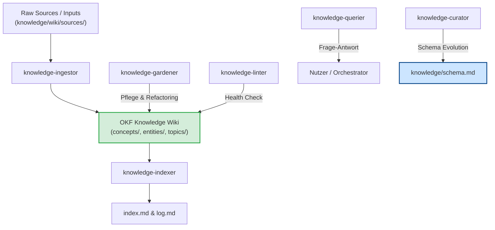

# Kernprinzip 9: Knowledge Engine (Karpathy LLM-Wiki & OKF Architecture)

> **Typ:** Concept  
> **Status:** Active  
> **Relevante Komponenten:** `knowledge/schema.md`, `knowledge/wiki/index.md`, `knowledge/wiki/log.md`, `knowledge/wiki/{concepts,entities,topics,sources}/`

---

## 1. Übersicht & Motivation

Wissen in Softwareprojekten veraltet schnell, wenn es in unstrukturierten Ordnern verstreut liegt. Die **Knowledge Engine** in agent-meta basiert auf einer Fusion des **Karpathy LLM-Wiki Paradigmas** (LLM-optimierte, vernetzte Markdown-Dokumentation) und den Strukturstandards der **Open Knowledge Foundation (OKF)**.

Das Wissensnetzwerk ermöglicht es Agenten und Entwicklern, Projektentscheidungen, Architekturmuster und historische Entwicklungen deterministisch abzufragen und konsistent zu halten.



---

## 2. Ordnerstruktur & Schema-Typen (`schema.md`)

Die Knowledge Base liegt unter `knowledge/wiki/` und wird durch `knowledge/schema.md` typisiert. Jede Wiki-Seite besitzt ein obligatorisches YAML-Frontmatter:

```yaml
---
type: "Concept" # Concept | Architecture | API Reference | Guide | Session Conclusion
title: "Titel der Dokumentation"
description: "Kurze Zusammenfassung für Indexer und LLM Context Search"
tags: [tag1, tag2]
timestamp: "2026-07-27"
---
```

### Verzeichnisübersicht
| Verzeichnis | Typ (`type:`) | Inhalt & Verwendungszweck |
|---|---|---|
| `knowledge/wiki/concepts/` | `Concept` / `Architecture` | Übergreifende Konzepte, Architekturen, Entwurfsmuster und Kernprinzipien |
| `knowledge/wiki/entities/` | `API Reference` | Konkrete Schnittstellen, CLI-Tools, Daten-Schemas, Skript-Referenzen |
| `knowledge/wiki/topics/` | `Guide` | Anleitungen, How-tos, Vertiefungsanalysen, Topic-Guides |
| `knowledge/wiki/sources/` | `Session Conclusion` | Rohe Session-Erkenntnisse, historische Protokolle, Quell-Dokumente |

---

## 3. Die 7 Spezialisierten Knowledge-Rollen

Um Qualitätsverfall zu verhindern, unterteilt agent-meta die Knowledge-Engine in 7 klar abgegrenzte Agenten-Rollen:

| Agenten-Rolle | Primäre Verantwortung |
|---|---|
| `knowledge-curator` | **Strategischer Chief Architect der Knowledge Base.** Verwaltet `schema.md`, entscheidet über Schema-Evolutionen und strukturelle Umbauten. |
| `knowledge-ingestor` | **Information Extractor.** Liest neue Quell-Dokumente ein, extrahiert Kerninformationen und baut OKF-konforme Wiki-Seiten. |
| `knowledge-gardener` | **Gärtner & Pfleger.** Korrigiert Links, harmonisiert Frontmatter-Tags, bereinigt Formatierungen und entfernt Duplikate. |
| `knowledge-indexer` | **Katalog-Manager.** Hält `knowledge/wiki/index.md` (Content-Katalog) und `knowledge/wiki/log.md` (Append-only Event-Log) synchron. |
| `knowledge-querier` | **Spezialisierter Query-Agent.** Durchsucht das Wiki und beantwortet komplexe Fragen für den Orchestrator oder Nutzer. |
| `knowledge-linter` | **Quality Auditor.** Prüft auf verwaiste Seiten (Orphans), kaputte Verweise und widersprüchliche Aussagen. |
| `knowledge-migrator` | **Legacy Ingestor.** Konvertiert alte Projekt-Dokumente aus `docs/` in OKF-konforme Wiki-Dateien. |

---

## 4. Katalog (`index.md`) & Log (`log.md`)

* **`index.md`:** Fungiert als zentraler Einstiegspunkt für Mensch und Maschine. Listet alle existierenden Seiten sortiert nach Kategorien inkl. Kurzbeschreibung und Tags.
* **`log.md`:** Ein zeilenbasiertes Append-only Ereignis-Protokoll im Format `YYYY-MM-DD HH:MM — <operation> — <summary>`, das jede Änderung nachvollziehbar macht.

---

## 5. Querverweise & Verwandte Konzepte

* [[core-principle-context-compaction]] — Kontext-Einsparung bei Knowledge Queries
* [[core-principle-managed-blocks]] — Managed Blocks im Wiki Index
* [[core-principles-overview]] — Gesamtübersicht der agent-meta Prinzipien