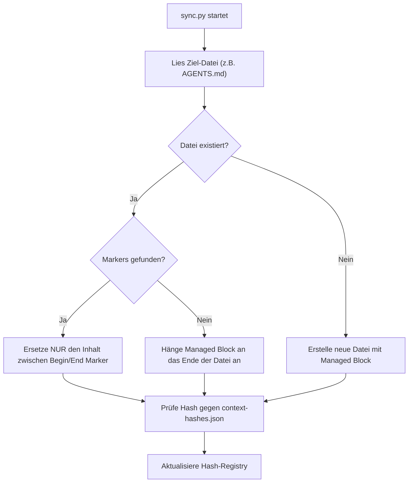

# Kernprinzip 4: Managed Blocks & Deterministischer Sync

> **Typ:** Concept  
> **Status:** Active  
> **Relevante Komponenten:** `scripts/sync.py`, `scripts/lib/context.py`, `CLAUDE.md`, `AGENTS.md`, `GEMINI.md`

---

## 1. Übersicht & Motivation

Wenn ein Meta-Framework Steuerungsdaten, Agenten-Verzeichnisse oder Routing-Tabellen in bestehende Entwickler-Dokumente (`CLAUDE.md`, `AGENTS.md`, `GEMINI.md`) injizieren muss, besteht das Risiko, dass projektspezifische Notizen oder benutzerdefinierter Code überschrieben werden.

**agent-meta** löst dieses Problem durch **Managed Blocks**: Präzise abgegrenzte Zonen innerhalb von Markdown-Dateien, die von `sync.py` deterministisch aktualisiert werden, während der Rest der Datei unberührt bleibt.

```markdown
# Mein Projekt-Titel (Benutzerdefiniert)

Dies ist ein manuell geschriebener Textbereich des Entwicklers.

<!-- agent-meta:managed-begin -->
> **ROUTING:** Gemini->AGENTS.md
> **ENTRY:** `orchestrator`-Agent (für alle Dev-Tasks).
... (von sync.py verwalteter Inhalt) ...
<!-- agent-meta:managed-end -->

## Eigene Projektregeln (Benutzerdefiniert)
- Weitere Notizen...
```

---

## 2. Typen von Managed Blocks

agent-meta verwendet standardisierte HTML-Kommentar-Paare zur Abgrenzung:

### 2.1 Standard Managed Block (`managed-begin` / `managed-end`)
Wird in `CLAUDE.md`, `AGENTS.md` und `GEMINI.md` eingesetzt. Enthält:
* Aktuelle agent-meta Version und konfigurierter DoD-Preset.
* Routing-Hinweise & Entry Point (`orchestrator`).
* Die vollständige Agenten-Tabelle (Agent Directory) mit Kurz-Beschreibungen.
* Anti-Re-Delegation Gates & Core-Regeln.

### 2.2 Bootstrap Block (`bootstrap-begin` / `bootstrap-end`)
Speziell für Runtimes wie Gemini/Antigravity erforderlich. Injiziert die Befehle zur Session-Start Agenten-Registrierung (`define_subagent`), damit die Runtime beim Start alle aktiven Subagenten kennt.

---

## 3. Deterministischer Sync-Algorithmus

Der Synchronisations-Ablauf in `scripts/lib/context.py` folgt einem strikten Parsing-Muster:



1. **Präservierung:** Sämtlicher Text oberhalb des `begin`-Markers und unterhalb des `end`-Markers bleibt auf Byte-Ebene unberührt.
2. **Determinismus:** Bei identischer `.meta-config/project.yaml` erzeugt `sync.py` exakt denselben Block-Inhalt.
3. **Idempotenz:** Mehrfache Aufrufe von `sync.py` hintereinander führen zu null zusätzlichen Änderungen.

---

## 4. Sicherheitsmechanismen & Recovery

* **Marker-Integrität:** Sollte ein Entwickler versehentlich nur den `begin`-Marker löschen, erkennt `sync.py` die Beschädigung, gibt eine Warnung aus und legt ein Backup an, anstatt Daten zu zerstören.
* **Backup bei Drift:** Weicht der Dateiinhalt außerhalb des Managed Blocks oder der Hash von der Registry ab, schützt die Drift-Erkennung den Arbeitsstand (`.sync-backup-<timestamp>`).

---

## 5. Querverweise & Verwandte Konzepte

* [[core-principle-submodule-protection]] — Submodul-Schutz & Drift-Erkennung
* [[core-principle-provider-agnosticism]] — Provider Abstraction Layer
* [[core-principles-overview]] — Gesamtübersicht aller Kernprinzipien